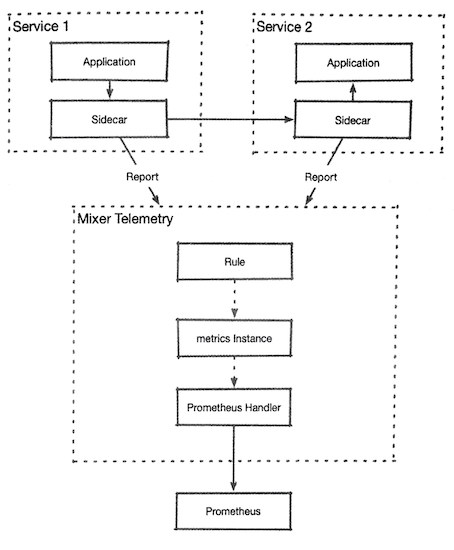
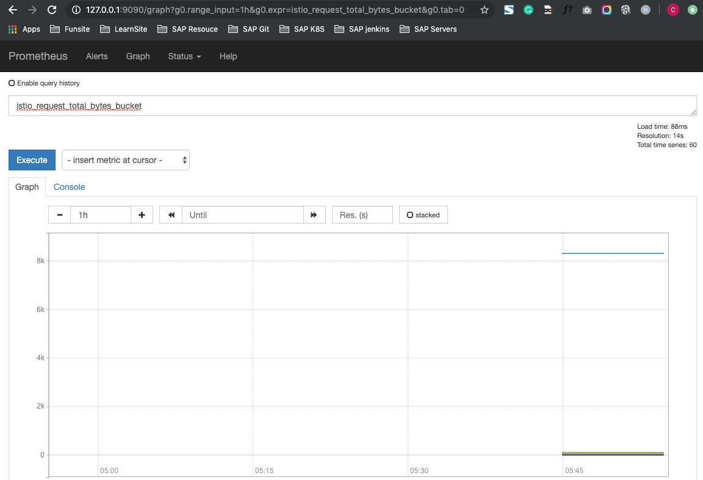

# 15. Mixer 适配器的应用 - 为Prometheus定义监控指标 

`Mixe`：提供了内置的`Prometheus`适配器，该适配器会开放服务端点，使用来自`metrics`模板实例的数据供`Prometheus`进行指标抓取，工作流程大致如图



1. 服务间通过`Sidecar`隧道进行相互调用时。 
2. 客户端和服务端都会向`Mixer Telemetry`服务报告流量信息，`Mixer Telemetry`会根据流量信息在注册的`Rule`对象中查找符合其`match`字段的内容，如
3. 果有符合要求的结果，则会使用在`Rule`对象中指定的`metrics`模板实例处理流量信息，对于处理后的输出内容，
4. 由`Rule`对象中指定的`Prometheus Handler`进行输出 


## 15.1 默认监控指标 

在`Istio`的安装文件中，我们可以看到`Prometheus Chart`里`templates/configmap.yaml` 提供的`Prometheus`配置模板，其中除了提供了`Kubernetes`的任务，还提供了几个不同的抓取任务，如下所述 

* `istio-mesh`：从`Mixer`的`telemtry`服务中抓取`Mixer`生成的网格指标。 
* `envoy-stats`：从网格的`Pod`中抓取`Envoy`的统计数据。 
* `istio-policy`:从`Mixer`的`policy`服务中抓取`Poicy`组件的监控指标。 
* `istio-telemetry`：从`Mixer`的`telemtry`服务中抓取`Mixer`服务的指标。 
* `pilot`: `Pilot`的自身指标。 
* `galley`: `Galley`组件的自身监控指标。 

本节要讲的自定义指标，就会被输出到`istio-telernetry`任务中。 

在安装完毕`Istio`之后，在`Istio`所在的命名空间中加人一些初始指标： 

```
$ kubectl get metrics -n istio-system
NAME                   AGE
requestcount           16d
requestduration        16d
requestsize            16d
responsesize           16d
tcpbytereceived        16d
tcpbytesent            16d
tcpconnectionsclosed   16d
tcpconnectionsopened   16d
```

例如`requestsize`

```
$ kubectl get metrics -n istio-system r
equestsize -oyaml
apiVersion: config.istio.io/v1alpha2
kind: metric
metadata:
  annotations:
    kubectl.kubernetes.io/last-applied-configuration: |
    ...
     creationTimestamp: "2019-10-18T09:23:04Z"
  generation: 1
  labels:
    app: mixer
    chart: mixer
    heritage: Tiller
    release: istio
  name: requestsize
  namespace: istio-system
  resourceVersion: "39282"
  selfLink: /apis/config.istio.io/v1alpha2/namespaces/istio-system/metrics/requestsize
  uid: d090508b-a9d2-4dad-a4e1-16a3494b3de9
spec:
  dimensions:
    connection_security_policy: conditional((context.reporter.kind | "inbound") ==
      "outbound", "unknown", conditional(connection.mtls | false, "mutual_tls", "none"))
    destination_app: destination.labels["app"] | "unknown"
    destination_principal: destination.principal | "unknown"
    destination_service: destination.service.host | "unknown"
    destination_service_name: destination.service.name | "unknown"
    destination_service_namespace: destination.service.namespace | "unknown"
    destination_version: destination.labels["version"] | "unknown"
    destination_workload: destination.workload.name | "unknown"
    destination_workload_namespace: destination.workload.namespace | "unknown"
    permissive_response_code: rbac.permissive.response_code | "none"
    permissive_response_policyid: rbac.permissive.effective_policy_id | "none"
    reporter: conditional((context.reporter.kind | "inbound") == "outbound", "source",
      "destination")
    request_protocol: api.protocol | context.protocol | "unknown"
    response_code: response.code | 200
    response_flags: context.proxy_error_code | "-"
    source_app: source.labels["app"] | "unknown"
    source_principal: source.principal | "unknown"
    source_version: source.labels["version"] | "unknown"
    source_workload: source.workload.name | "unknown"
    source_workload_namespace: source.workload.namespace | "unknown"
  monitored_resource_type: '"UNSPECIFIED"'
  value: request.size | 0
```


这是个`metric`模板的实例，在`dimensions` 字段使用`Istio`的属性表达式为指标加人各种标签，并几用`request.size`作为指标的数值 

接下来自然要看看对应的适配器配置

```
$ kubectl get handler prometheus -n istio-system -oyaml
apiVersion: config.istio.io/v1alpha2
kind: handler
metadata:
  annotations:
  ...
  generation: 1
  labels:
    app: mixer
    chart: mixer
    heritage: Tiller
    release: istio
  name: prometheus
  namespace: istio-system
  ...
  params:
    metrics:
    - instance_name: requestcount.metric.istio-system
      kind: COUNTER
      label_names:
      - reporter
      - source_app
      - source_principal
      - source_workload
      - source_workload_namespace
      - source_version
      ...
```

可以吞到在这个对象为`Prometheus`定义了系列的监控指标规则 

三要素中的适配器和模板都齐全了，就可以看看`rule`对象了在`Istio-system` 命名空间， **默认包含两个与 `Prometheus` 相关的`Rule`对象分别是`promhttp`和`promtcp` 它们们把两类不同的`metric`实例和`Prometheus Handler`连接起来** 

```
$ kubectl get rules -n istio-system
NAME                      AGE
kubeattrgenrulerule       16d
promhttp                  16d
promtcp                   16d
...
```

这样一来，`Istio`就通过`Mixer` 提供的功能，再结合`Prometheus`形成完整的数据据采集和监控功能，也为用户自定义监控指标提供了基础。 

## 15.2 自定义监控指标  

还可以使用`Mixer`：适配器的配置来生成新的监控指标，所以我们可以尝试生成一个新的监控指标。

**在现有的`requestsize`指标中是不包含`Header`大小的**

为此，我们生成一个新的监控指标。 首先定义一个：`metric`对象，在`value`字段使用`request.total_size`来获取`request`的大小并加以监控： 

```
$ kubectl get metrics -n istio-system requestsize -oyaml > request.totalsize.yaml
```
编辑新生成的`request.totalsize.yaml`

```
apiVersion: config.istio.io/v1alpha2
kind: metric
metadata:
  annotations:
  ...
  name: requesttotalsize
  namespace: istio-system
  ...
spec:
  dimensions:
  ...
  value: request.total_size | 0
```

```
$ kubectl apply -f request.totalsize.yaml 
metric.config.istio.io/requesttotalsize created
```
接下来修改`Prometheu Handler`的定义， 让`Handler`对象处理新建的指标

```
$ kubectl get  handler prometheus -n istio-system -oyaml > prometheus_handler.yaml
...
- buckets:
        exponentialBuckets:
          growthFactor: 10
          numFiniteBuckets: 8
          scale: 1
      instance_name: requesttotalsize.metric.istio-system
      kind: DISTRIBUTION
      label_names:
      - reporter
      - source_app
      - source_principal
      - source_workload
      - source_workload_namespace
      - source_version
      - destination_app
      - destination_principal
      - destination_workload
      - destination_workload_namespace
      - destination_version
      - destination_service
      - destination_service_name
      - destination_service_namespace
      - request_protocol
      - response_code
      - response_flags
      - permissive_response_code
      - permissive_response_policyid
      - connection_security_policy
      name: request__total_bytes
```

```
$ kubectl apply -f prometheus_handler.yaml
handler.config.istio.io/prometheus configured
```

在编辑结束之后，再使用`kubectl edit`命令修改系统原有的`Rule`对象（`promhttp`), 


```
$ kubectl edit rule promhttp -n istio-s
ystem
rule.config.istio.io/promhttp edited
```

```
apiVersion: config.istio.io/v1alpha2
kind: rule
metadata:
  annotations:
...
	name: promhttp
  namespace: istio-system
  resourceVersion: "39293"
spec:
  actions:
  - handler: prometheus
    instances:
    - requestcount.metric
    - requestduration.metric
    - requestsize.metric
    - responsesize.metric
    - requesttotalsize.metric
    ...
```

接下来就可以使用`sleep Pod`中的输出流量：`wrk`工具发起对`httpbin`服务的访问，以便输出流量

```
$ kubectl exec sleep-v1-548d87cc5c-92lqk -it bash -c sleep
bash-4.4# wrk http://httpbin:8000/ip
Running 10s test @ http://httpbin:8000/ip
  2 threads and 10 connections
  Thread Stats   Avg      Stdev     Max   +/- Stdev
    Latency    12.44ms    7.56ms  58.04ms   78.43%
    Req/Sec   416.38     95.33   696.00     65.66%
  8310 requests in 10.04s, 2.04MB read
Requests/sec:    827.42
Transfer/sec:    207.95KB
```

这样就生成了流量。 

接着访问`Prometheus`的查询界面，输人我们新建的指标，就能看到指标数据了（指标名称会自动加人“istio_”前缀）

事实上，目前这方面能够定制的内容还很有限，主要的定制能力取决于`Envoy`和各种`Mixer`适配器的输出内容。 

```
kubectl -n istio-system port-forward prometheus-d44645598-xh8wn 9090:9090
Forwarding from 127.0.0.1:9090 -> 9090
Forwarding from [::1]:9090 -> 9090
```

**`istio_request_total_bytes_bucket`**

