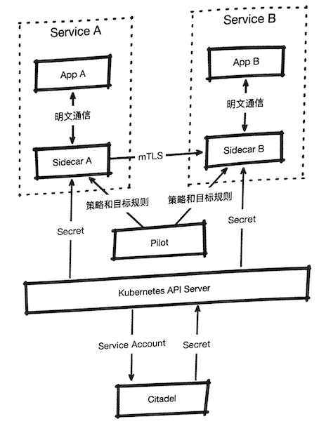

# 18. Istio的安全加固 

`Istio`为运行在不可信环境内的服务网格提供无须代码侵入的安全加固能力。  

在完成微服务改适之后，在流量、监控等基本业务目标之外，安全问题会逐渐凸显

**原本在单体应用内通过进程内访问控制控制框架完成的任务，被分散到各个微服务中**
 
**在容器集群中还可能出现不同命名空间及不同业务域的访问问题**

在`Istio`中也提供了无侵入的安全解决方案，能够提供网格内部、网格和边缘之间的安全通信和访问控制能力。 


## 18.1 `Istio`安全加固概述 

安全加固能力是`Istio`各个组件协作完成的，如下所述： 

* **`Citadel`提供证书和认证管理功能** 
* `Sidecar`建立加密通道，为其代理的应用进行协议升级，为客户端和服务端之间提供基于`mTLS`的加密通信； 
* **`Pilot`负责传播加密身份和认证策略。** 

总体的协作关系大致如图

 


其中： 

* `Citadel`会监控`KuberneteS API Server`，为现存和新建的`Service Account`签发 证书，并将其保存在`Secret`中，在`Pod`启动加载时会加载这些`Secret`; 
* `Pilot`会将认证相关的策略发送给`Sidecar`，并且用目标规则来保障实施过程； 
* 业务容器和`Sidecar`：之间的明文通信会被升级为`Sidecar`之间的`mTLS`通信。 

本章同样会选择两个典型场景来展示`Istio`的安全加固能力。 

## 18.2 启用`mTLS` 

首先启用全局`mTLS`来查看效果。 **创建两个命名空间，分别将其命名为`mesh`和`plain`，并且为`mesh`命名空间开启** 

`IStio sidecar`自动注入功能： 

```
$ kubectl create ns mesh
namespace/mesh created

$ kubectl create ns plain
namespace/plain created

$ kubectl label namespace mesh istio-injection=enabled
namespace/mesh labeled
```

接下来分别在两个命名空间中部署我们的`Sleep`和`httpbin`应用 

```
$ kubectl apply -f sleep.istio.yaml -n mesh
service/sleep created
deployment.extensions/sleep-v1 created
deployment.extensions/sleep-v2 created

$ kubectl apply -f sleep.istio.yaml -n plain
service/sleep created
deployment.extensions/sleep-v1 created
deployment.extensions/sleep-v2 created
```
```
$ cd Istio/istio-1.1.16/samples/httpbin

$ kubectl apply -f httpbin.yaml -n mesh
service/httpbin created
deployment.extensions/httpbin created

$ kubectl apply -f httpbin.yaml -n plain
service/httpbin created
deployment.extensions/httpbin created
```

在部署完成之后，**有两组应用在同时运行这两组应用分别处于网格的内部和外部**, 我们尝试让二者互访 

* **PLAIN_SLEEP**

```
$ kubectl get pods -n plain | grep sleep-v1
sleep-v1-548d87cc5c-gjqf4   1/1     Running   0          5m39s
```
* **MESH_SLEEP**

```
$ kubectl get pods -n mesh | grep sleep-v1
sleep-v1-548d87cc5c-6vxmn   2/2     Running   0          6m23s
```

```
$ kubectl exec -n plain -it sleep-v1-548d87cc5c-gjqf4 -c sleep bash
bash-4.4# http http://httpbin.mesh:8000/get
HTTP/1.1 200 OK
access-control-allow-credentials: true
access-control-allow-origin: *
content-length: 387
content-type: application/json
date: Tue, 05 Nov 2019 03:02:54 GMT
server: istio-envoy
x-envoy-decorator-operation: httpbin.mesh.svc.cluster.local:8000/*
x-envoy-upstream-service-time: 3

...
    },
    "origin": "127.0.0.1",
    "url": "http://httpbin.mesh:8000/get"
}
```

可以看到 , **此时由网格外部的服务访问网格内部的服务, 以及由网格内部的服务访问网格外部的服务, 都是没有问题的**

接下来创建一个`MeshPolicy`, 强制网格内部的所有服务都默认开启`mTLS`

```
apiVersion: "authentication.istio.io/v1alpha1"
kind: "MeshPolicy"
metadata:
  name: "default"
spec:
  peers:
  - mtls: {}
```

```
$ kubectl apply -f meshpolicy.yaml 
meshpolicy.authentication.istio.io/default configured
```

在默认策略创建之后, 重新尝试刚才的互访 

```
$ kubectl exec -n plain -it sleep-v1-548d87cc5c-gjqf4 -c sleep bash
bash-4.4# http http://httpbin.mesh:8000/get

http: error: ConnectionError: ('Connection aborted.', ConnectionResetError(104, 'Connection reset by peer')) while doing GET request to URL: http://httpbin.mesh:8000/get
 

$ kubectl exec -n mesh -it sleep-v1-548d87cc5c-6vxmn  -c sleep bash
bash-4.4# http http://httpbin.plain:8000/get
HTTP/1.1 200 OK
access-control-allow-credentials: true
access-control-allow-origin: *
content-length: 855
content-type: application/json
date: Tue, 05 Nov 2019 03:12:50 GMT
server: envoy
x-envoy-upstream-service-time: 3
...
} 
```


这次发现，

* **由网格外部的服务访问网格内部的服务发生失败**

* **而由网格内部的服务访问网格外部的服务可以正常完成**

**同一网格内部的服务访问， 结果会是怎样呢？**

```
$ kubectl exec -n mesh -it sleep-v1-548d87cc5c-6vxmn  -c sleep bash
bash-4.4# http http://httpbin.mesh:8000/get
HTTP/1.1 503 Service Unavailable
content-length: 95
content-type: text/plain
date: Tue, 05 Nov 2019 03:12:34 GMT
server: envoy

upstream connect error or disconnect/reset before headers. reset reason: connection termination
```

可以发现， 即便是同一网格内部的服务访问， 也还是出了了问题。

**这是因为所有的服务端`Sidecar`都只接受`mTLS`客户端的接入，客户端却没有随之变化， 要应对这种的情况， 就可以使用 `DestinationRule`对象来显示声明这个要求**

**`destinationrule.mtls.yaml`**

```
apiVersion: networking.istio.io/v1alpha3
kind: "DestinationRule"
metadata:
  name: "httpbin"
  namespace: mesh
spec:
  host: httpbin.mesh.svc.cluster.local
  trafficPolicy:
    tls:
      mode: ISTIO_MUTUAL
```

> 注意`DestinationRule`的`namespace`


```
$ kubectl apply -f destinationrule.mtls.yaml 
destinationrule.networking.istio.io/httpbin created
```


```
$ kubectl exec -n plain -it sleep-v1-548d87cc5c-gjqf4 -c sleep bash
bash-4.4# http http://httpbin.mesh:8000/get

http: error: ConnectionError: ('Connection aborted.', ConnectionResetError(104, 'Connection reset by peer')) while doing GET request to URL: http://httpbin.mesh:8000/get


$ kubectl exec -n mesh -it sleep-v1-548d87cc5c-6vxmn  -c sleep bash
bash-4.4# http http://httpbin:8000/get
HTTP/1.1 200 OK
access-control-allow-credentials: true
access-control-allow-origin: *
content-length: 632
content-type: application/json
date: Tue, 05 Nov 2019 05:43:20 GMT
server: envoy
x-envoy-upstream-service-time: 17
...
    "origin": "127.0.0.1",
    "url": "http://httpbin:8000/get"
}

```

**可以看到，来自`pain`命名空间的访问依然是无法完成的，但是在开启了`DestinationRule之`后网格内部的服务访问就恢复正常了**。 


**如此一来，通过简单的`Policy`和`DestinationRule`对象定义，我们在应用程序不改动, 无感知的情况下将网格内部的服务间的通信协议从明文传输升级为`mTLS`加密 , 并限制了外部的明文访问**。

 
那么，**如果只想启用`mTLS`作为`RBAC`的前提，但是对外部服务时不希望访问受到限制则该如何完成呢？**


只需修改一下我们的`Mesh Policy` 

```
apiVersion: "authentication.istio.io/v1alpha1"
kind: "MeshPolicy"
metadata:
  name: "default"
spec:
  peers:
  # - mtls: {}
  - mtls:
      mode: PERMISSIVE
```

**为`mtls`字段加人`mode:PERMISSIVE`重新提交** 


```
$ kubectl apply -f meshpolicy.yaml -n mesh
meshpolicy.authentication.istio.io/default configured
```


再次从`plain`命名空间发起访问 

```
$ kubectl exec -n plain -it sleep-v1-548d87cc5c-gjqf4 -c sleep bash
bash-4.4# http http://httpbin.mesh:8000/get

HTTP/1.1 200 OK
access-control-allow-credentials: true
access-control-allow-origin: *
content-length: 387
content-type: application/json
date: Tue, 05 Nov 2019 05:52:33 GMT
server: istio-envoy
x-envoy-decorator-operation: httpbin.mesh.svc.cluster.local:8000/*
x-envoy-upstream-service-time: 1
...
}
```

```
$ kubectl exec -n mesh -it sleep-v1-548d87cc5c-6vxmn  -c sleep bash
bash-4.4# http http://httpbin.plain:8000/get
HTTP/1.1 200 OK
access-control-allow-credentials: true
...
```

可以看到，多个方向的互访也都没有问题，这种宽容模式对于试点和迁移过程中的混合部署是非常有帮助的。 


