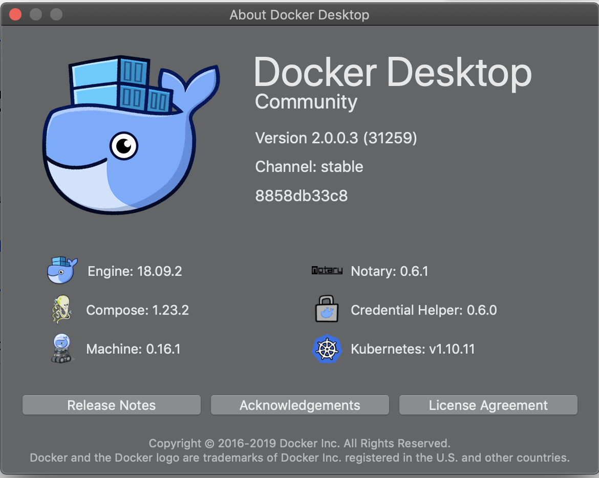
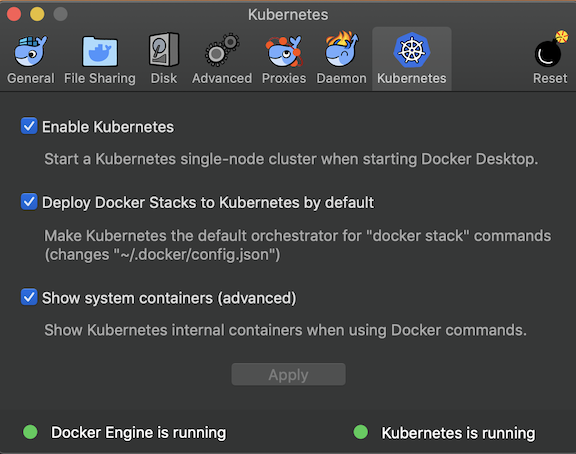
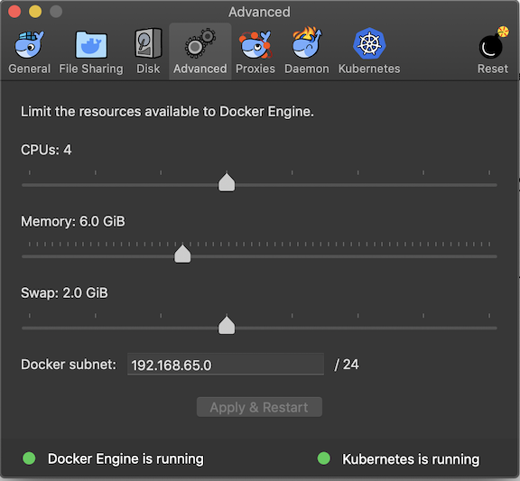
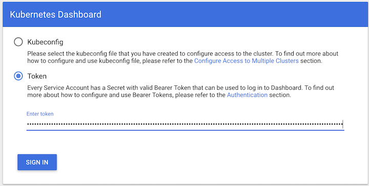
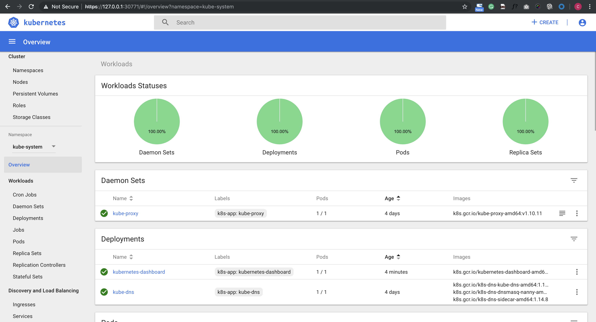
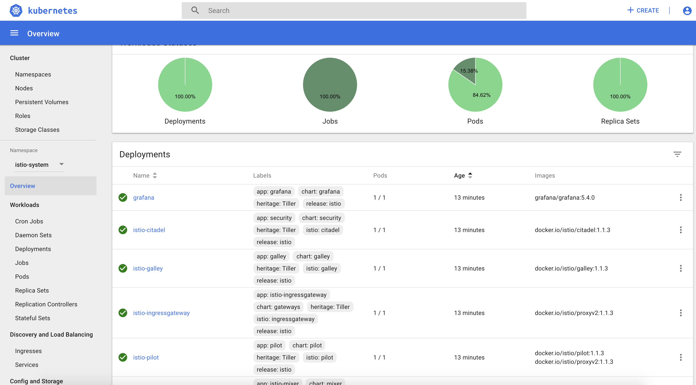
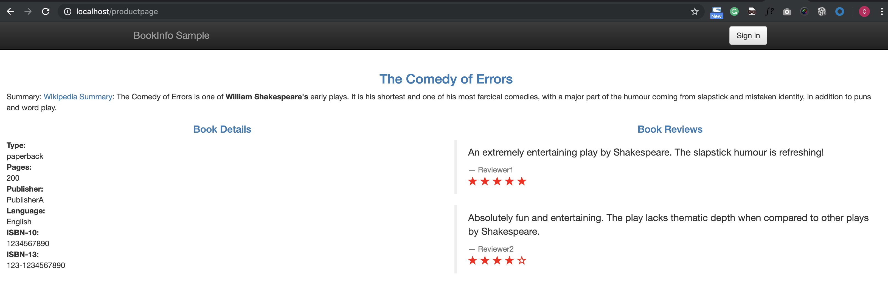

# 1. Docker for Mac安装istio

从今天起，我们将推出一起学 istio 的系列课程，和大家一起学习热门的 Servie Mesh 技术：istio，今天第一篇内容：在 Docker for Mac 上面安装 istio。

## 安装 docker 和 k8s



我这里安装的是 Stable 版本，最新的稳定版本之中也自带了 Kubernetes，之前的版本中需要 Edge 版本才行。

`docker for mac` 安装完成后，直接通过下面的界面启用 Kubernetes 即可安装上 Kubernetes:

Kubernetes -> preference -> Kubernetes



由于安装过程中需要拉取一系列镜像，所以可能需要花费几分钟时间，当右下角出现标识 kubernetes is running 时则证明安装成功了。

当前版本安装的 Kubernetes 版本是 v1.10.3，涉及到的一些镜像如下：

```
$ docker images |grep k8s
k8s.gcr.io/kubernetes-dashboard-amd64      v1.10.0             0dab2435c100        3 weeks ago         122MB
k8s.gcr.io/kube-proxy-amd64                v1.10.3             4261d315109d        4 months ago        97.1MB
k8s.gcr.io/kube-apiserver-amd64            v1.10.3             e03746fe22c3        4 months ago        225MB
k8s.gcr.io/kube-controller-manager-amd64   v1.10.3             40c8d10b2d11        4 months ago        148MB
k8s.gcr.io/kube-scheduler-amd64            v1.10.3             353b8f1d102e        4 months ago        50.4MB
k8s.gcr.io/etcd-amd64                      3.1.12              52920ad46f5b        6 months ago        193MB
k8s.gcr.io/k8s-dns-dnsmasq-nanny-amd64     1.14.8              c2ce1ffb51ed        8 months ago        41MB
k8s.gcr.io/k8s-dns-sidecar-amd64           1.14.8              6f7f2dc7fab5        8 months ago        42.2MB
k8s.gcr.io/k8s-dns-kube-dns-amd64          1.14.8              80cc5ea4b547        8 months ago        50.5MB
k8s.gcr.io/pause-amd64                     3.1                 da86e6ba6ca1        9 months ago        742kB
```
另外，由于安装 istio 需要用到的资源较多，建议增大 CPU 和内存的使用限制：



## 安装 kubectl

Kubernetes 集群启用成功了，现在要去操作该集群的话就得安装一个 kubectl 工具，可以直接下载 kubectl 的二进制文件到本地直接使用，我们这里使用 Mac 上安装软件的常用工具 Homebrew：

```
$ kubectl version

Client Version: version.Info{Major:"1", Minor:"13", GitVersion:"v1.13.2", GitCommit:"cff46ab41ff0bb44d8584413b598ad8360ec1def", GitTreeState:"clean", BuildDate:"2019-01-13T23:15:13Z", GoVersion:"go1.11.4", Compiler:"gc", Platform:"darwin/amd64"}
Server Version: version.Info{Major:"1", Minor:"10", GitVersion:"v1.10.11", GitCommit:"637c7e288581ee40ab4ca210618a89a555b6e7e9", GitTreeState:"clean", BuildDate:"2018-11-26T14:25:46Z", GoVersion:"go1.9.3", Compiler:"gc", Platform:"linux/amd64"}
```

注意 docker for mac 的 k8s 的 context 是 `docker-for-desktop`，**如果目前已有其他集群环境，需要使用如下命令进行切换**：

```
$  kubectl config get-contexts
CURRENT   NAME                 CLUSTER                      AUTHINFO             NAMESPACE
*         docker-for-desktop   docker-for-desktop-cluster   docker-for-desktop
```

If not  `docker-for-desktop`

```
$ kubectl config use-context docker-for-desktop
```

kubectl 工具安装配置完成后，执行命令验证下是否可以正常操作集群：

```
$ kubectl get ns
NAME          STATUS   AGE
default       Active   4d
docker        Active   4d
kube-public   Active   4d
kube-system   Active   4d

$ kubectl get nodes
NAME                 STATUS   ROLES    AGE   VERSION
docker-for-desktop   Ready    master   4d    v1.10.11

$ kubectl get pods -n kube-system
NAME                                         READY   STATUS    RESTARTS   AGE
etcd-docker-for-desktop                      1/1     Running   0          4d
kube-apiserver-docker-for-desktop            1/1     Running   0          4d
kube-controller-manager-docker-for-desktop   1/1     Running   0          4d
kube-dns-86f4d74b45-57fmt                    3/3     Running   0          4d
kube-proxy-zlc2n                             1/1     Running   0          4d
kube-scheduler-docker-for-desktop            1/1     Running   0          4d
```


能够正常看到上面的信息证明 Kubernetes 集群一切正常，也可以使用 kubectl 工具操作集群，这一步非常重要。

## 安装 kubernetes dashboard

`https://kubernetes.io/docs/tasks/access-application-cluster/web-ui-dashboard/`

直接下载官方推荐的 `dashboard yaml` 文件：

```
$ wget https://raw.githubusercontent.com/kubernetes/dashboard/master/aio/deploy/recommended/kubernetes-dashboard.yaml
--2019-04-19 10:00:01--  https://raw.githubusercontent.com/kubernetes/dashboard/master/aio/deploy/recommended/kubernetes-dashboard.yaml
Resolving raw.githubusercontent.com... 151.101.248.133
Connecting to raw.githubusercontent.com|151.101.248.133|:443... connected.
HTTP request sent, awaiting response... 200 OK
Length: 1454 (1.4K) [text/plain]
Saving to: 'kubernetes-dashboard.yaml'

kubernetes-dashboard.yaml          100%[===============================================================>]   1.42K  --.-KB/s    in 0s

2019-04-19 10:00:02 (53.3 MB/s) - 'kubernetes-dashboard.yaml' saved [4784]
```

为了方便测试，我们将 `kubernetes-dashboard.yaml` 文件中 的 `Service` 改成 `NodePort` 类型的服务：

```
apiVersion: v1
kind: Secret
metadata:
  labels:
    k8s-app: kubernetes-dashboard
  name: kubernetes-dashboard-certs
  namespace: kube-system
type: Opaque

---
...
# ------------------- Dashboard Service ------------------- #

kind: Service
apiVersion: v1
metadata:
  labels:
    k8s-app: kubernetes-dashboard
  name: kubernetes-dashboard
  namespace: kube-system
spec:
  ports:
    - port: 443
      targetPort: 8443
  type: NodePort
  selector:
    k8s-app: kubernetes-dashboard
```

```
$ kubectl create -f kubernetes-dashboard.yaml

$ kubectl get pods -n kube-system
NAME                                         READY   STATUS    RESTARTS   AGE
...
kubernetes-dashboard-669f9bbd46-6vlng        1/1     Running   0          59s
```

```
$ kubectl get svc -n kube-system
NAME                   TYPE        CLUSTER-IP       EXTERNAL-IP   PORT(S)         AGE
kube-dns               ClusterIP   10.96.0.10       <none>        53/UDP,53/TCP   4d
kubernetes-dashboard   NodePort    10.100.124.180   <none>        443:30771/TCP   20s
```

现在直接在浏览器中访问 `https://localhost:30771` 即可，**记住一定要加上 https**，在登录页面直接跳过权限验证即可：



**How to get token from dashboard**

```
$ kubectl get secret,sa,role,rolebinding,services,deployments -n kube-system | grep dashboard
secret/kubernetes-dashboard-certs                       Opaque                                0      7m
secret/kubernetes-dashboard-csrf                        Opaque                                1      7m
secret/kubernetes-dashboard-key-holder                  Opaque                                2      6m
secret/kubernetes-dashboard-token-sl5kb                 kubernetes.io/service-account-token   3      7m

serviceaccount/kubernetes-dashboard                 1         7m

role.rbac.authorization.k8s.io/kubernetes-dashboard-minimal                     7m2s

rolebinding.rbac.authorization.k8s.io/kubernetes-dashboard-minimal                     7m2s


service/kubernetes-dashboard   NodePort    10.100.124.180   <none>        443:30771/TCP   7m
deployment.extensions/kubernetes-dashboard   1   
```

```
$ kubectl describe secret  kubernetes-dashboard-token-sl5kb -n kube-system
Name:         kubernetes-dashboard-token-sl5kb
Namespace:    kube-system
Labels:       <none>
Annotations:  kubernetes.io/service-account.name: kubernetes-dashboard
              kubernetes.io/service-account.uid: dc0660b1-6248-11e9-a3d8-025000000001

Type:  kubernetes.io/service-account-token

Data
====
namespace:  11 bytes
token:      eyJhbGciOiJSUzI1NiIsImtpZCI6IiJ9.eyJpc3MiOiJrdWJlcm5ldGVzL3NlcnZpY2VhY2NvdW50Iiwia3ViZXJuZXRlcy5pby9zZXJ2aWNlYWNjb3VudC9uYW1lc3BhY2UiOiJrdWJlLXN5c3RlbSIsImt1YmVybmV0ZXMuaW8vc2VydmljZWFjY291bnQvc2VjcmV0Lm5hbWUiOiJrdWJlcm5ldGVzLWRhc2hib2FyZC10b2tlbi1zbDVrYiIsImt1YmVybmV0ZXMuaW8vc2VydmljZWFjY291bnQvc2VydmljZS1hY2NvdW50Lm5hbWUiOiJrdWJlcm5ldGVzLWRhc2hib2FyZCIsImt1YmVybmV0ZXMuaW8vc2VydmljZWFjY291bnQvc2VydmljZS1hY2NvdW50LnVpZCI6ImRjMDY2MGIxLTYyNDgtMTFlOS1hM2Q4LTAyNTAwMDAwMDAwMSIsInN1YiI6InN5c3RlbTpzZXJ2aWNlYWNjb3VudDprdWJlLXN5c3RlbTprdWJlcm5ldGVzLWRhc2hib2FyZCJ9.fttRDpKfmLY7oozOuwgYIGnm-WLre-RbpY5rM0qHTsihl7gNsOwUtlGwPHGfK7SQADlvTMElAVScdEUGg665HCrglQubl-DfVKEBGZiYcmjdi1E2fhp7cdsbL3hJpZi6iW126ykoH9q7q_EzNrLiUfnCGIaXlGGIHch1Y8xdnNjo5HpSwH7wknX9sWyi0dEI5LR5MYMQ1IiqqKqW5whC9Kr4RvD8h-h7SkuvymGydSEEQefIhTgjZhpP2wmmY__QKzz4JdykHu5a94lqu5CZWpDvoSHtCPooOKau71K8bUqAatG487ov31dmQxcP9TaWHFOnSyynJMGfv4Rlwbag1A
ca.crt:     1025 bytes
```

**Put the token into the dashboard**



## 安装 Helm

`https://istio.io/docs/setup/kubernetes/install/helm/`

istio 官方给出了几种安装的方式，手动通过 yaml 文件去安装也比较方便，但是还是需要忍受镜像翻墙的问题，我们这里使用官方更加推荐的 `Helm` 方式来进行安装，而且该方式涉及到的镜像都在 `docker hub` 上面，不需要翻墙就可以拉取。

### 首先安装 Helm 包管工具，

通过 `Homebrew` 安装 `Helm` 的客户端：

```
$ brew install kubernetes-helm
...
$ helm version
Client: &version.Version{SemVer:"v2.13.1", GitCommit:"618447cbf203d147601b4b9bd7f8c37a5d39fbb4", GitTreeState:"clean"}
Error: could not find tiller
```

安装完成后，需要初始化 `Helm` 对应的服务端程序 `Tiller Server`：

```
$ helm init
Creating /Users/jxi/.helm
Creating /Users/jxi/.helm/repository
Creating /Users/jxi/.helm/repository/cache
Creating /Users/jxi/.helm/repository/local
Creating /Users/jxi/.helm/plugins
Creating /Users/jxi/.helm/starters
Creating /Users/jxi/.helm/cache/archive
Creating /Users/jxi/.helm/repository/repositories.yaml
Adding stable repo with URL: https://kubernetes-charts.storage.googleapis.com
Adding local repo with URL: http://127.0.0.1:8879/charts
$HELM_HOME has been configured at /Users/jxi/.helm.

Tiller (the Helm server-side component) has been installed into your Kubernetes Cluster.

Please note: by default, Tiller is deployed with an insecure 'allow unauthenticated users' policy.
To prevent this, run `helm init` with the --tiller-tls-verify flag.
For more information on securing your installation see: https://docs.helm.sh/using_helm/#securing-your-helm-installation
Happy Helming!
```

另外我们还需要为 `Tiller` 创建一个 `ServiceAccount`，让他有权限去操作集群中的一些资源：

```
$ kubectl get pods -n kube-system
NAME                                         READY   STATUS    RESTARTS   AGE
tiller-deploy-78c6868dd6-bcpb5               1/1     Running   0          1m
```

**`tiller-rbac.yaml`**

```
apiVersion: v1
kind: ServiceAccount
metadata:
  name: tiller
  namespace: kube-system
---
apiVersion: rbac.authorization.k8s.io/v1beta1
kind: ClusterRoleBinding
metadata:
  name: tiller
roleRef:
  apiGroup: rbac.authorization.k8s.io
  kind: ClusterRole
  name: cluster-admin
subjects:
  - kind: ServiceAccount
    name: tiller
    namespace: kube-system
```

保存为 `tiller-rbac.yaml` 然后创建：

```
$ kubectl apply -f tiller-rbac.yaml
serviceaccount/tiller created
clusterrolebinding.rbac.authorization.k8s.io/tiller created
```

```
$ kubectl get sa,secret,role,rolebinding -n kube-system | grep tiller
NAME                                 SECRETS   AGE
serviceaccount/tiller                               1         1m

secret/tiller-token-9krvm                               kubernetes.io/service-account-token   3      1m
```

创建了 `tiller` 的 `ServceAccount` 后还没完，因为我们的 `Tiller` 之前已经就部署成功了，而且是没有指定 `ServiceAccount` 的，**所以我们需要给 `Tiller` 打上一个 `ServiceAccount` 的补丁**：

```
$ kubectl patch deploy --namespace kube-system tiller-deploy -p '{"spec":{"template":{"spec":{"serviceAccount":"tiller"}}}}'
deployment.extensions/tiller-deploy patched
```

至此, Helm 客户端和服务端都配置完成了：

```
$ helm version
Client: &version.Version{SemVer:"v2.13.1", GitCommit:"618447cbf203d147601b4b9bd7f8c37a5d39fbb4", GitTreeState:"clean"}
Server: &version.Version{SemVer:"v2.13.1", GitCommit:"618447cbf203d147601b4b9bd7f8c37a5d39fbb4", GitTreeState:"clean"}
```


## 安装 istio

下载最新版本的 [istio：https://github.com/istio/istio/releases/](istio：https://github.com/istio/istio/releases/)，我们这里使用`istio-1.1.3-osx.tar.gz`，然后解压，将 `bin/` 中的 `istioctl` 可执行文件拷贝到 `$PATH` 包含的目录中。

```
$ echo  $PATH
/usr/local/bin:/usr/bin:/bin:/usr/sbin:/sbin
...
$ cd 
$ ls -la | grep istio
-rwxr-xr-x@   1 jxi   660531311  62307200 Apr 13 06:36 istioctl
```

验证是否生效：

```
$ istioctl version
version.BuildInfo{Version:"1.1.3", GitRevision:"d19179769183541c5db473ae8d062ca899abb3be", User:"root", Host:"fbd493e1-5d72-11e9-b00d-0a580a2c0205", GolangVersion:"go1.10.4", DockerHub:"docker.io/istio", BuildStatus:"Clean", GitTag:"1.1.2-56-gd191797"}
```

### 然后使用 helm 命令直接安装：

```
cd /Users/jxi/Devops/bookinfo/istio-1.1.3
```

`https://istio.io/docs/setup/kubernetes/install/helm/`

**Option 2:**

Install the istio-init chart to bootstrap all the Istio’s CRDs

```
$  helm install install/kubernetes/helm/istio-init --name istio-init --namespace istio-system
NAME:   istio-init
LAST DEPLOYED: Fri Apr 19 11:19:08 2019
NAMESPACE: istio-system
STATUS: DEPLOYED

RESOURCES:
==> v1/ClusterRole
NAME                     AGE
istio-init-istio-system  0s

==> v1/ClusterRoleBinding
NAME                                        AGE
istio-init-admin-role-binding-istio-system  0s

==> v1/ConfigMap
NAME          DATA  AGE
istio-crd-10  1     0s
istio-crd-11  1     0s

==> v1/Job
NAME               COMPLETIONS  DURATION  AGE
istio-init-crd-10  0/1          0s        0s
istio-init-crd-11  0/1          0s        0s

==> v1/Pod(related)
NAME                     READY  STATUS             RESTARTS  AGE
istio-init-crd-10-p84cq  0/1    ContainerCreating  0         0s
istio-init-crd-11-g9vfx  0/1    ContainerCreating  0         0s

==> v1/ServiceAccount
NAME                        SECRETS  AGE
istio-init-service-account  1        0s

$ kubectl get pods -n istio-system
NAME                      READY   STATUS      RESTARTS   AGE
istio-init-crd-10-p84cq   0/1     Completed   0          6s
istio-init-crd-11-g9vfx   0/1     Completed   0          6s

$ kubectl get crds | grep 'istio.io\|certmanager.k8s.io' | wc -l
53
```

然后使用 helm 命令直接安装：

```
$ helm install install/kubernetes/helm/istio --name istio --namespace istio-system --set tracing.enabled=true --set kiali.enabled=true --set grafana.enabled=true
NAME:   istio
LAST DEPLOYED: Fri Apr 19 11:21:24 2019
NAMESPACE: istio-system
STATUS: DEPLOYED

RESOURCES:
==> v1/ClusterRole
NAME                                     AGE
istio-citadel-istio-system               22s
istio-galley-istio-system                23s
istio-grafana-post-install-istio-system  23s
istio-ingressgateway-istio-system        23s
istio-mixer-istio-system                 23s
istio-pilot-istio-system                 23s
istio-reader                             22s
istio-sidecar-injector-istio-system      22s
kiali                                    23s
prometheus-istio-system                  22s

==> v1/ClusterRoleBinding
NAME                                                    AGE
istio-citadel-istio-system                              22s
istio-galley-admin-role-binding-istio-system            22s
istio-grafana-post-install-role-binding-istio-system    22s
istio-ingressgateway-istio-system                       22s
istio-kiali-admin-role-binding-istio-system             22s
istio-mixer-admin-role-binding-istio-system             22s
istio-multi                                             22s
istio-pilot-istio-system                                22s
istio-sidecar-injector-admin-role-binding-istio-system  22s
prometheus-istio-system                                 22s

==> v1/ConfigMap
NAME                                                                DATA  AGE
istio                                                               2     23s
istio-galley-configuration                                          1     23s
istio-grafana                                                       2     23s
istio-grafana-configuration-dashboards-galley-dashboard             1     23s
istio-grafana-configuration-dashboards-istio-mesh-dashboard         1     23s
istio-grafana-configuration-dashboards-istio-performance-dashboard  1     23s
istio-grafana-configuration-dashboards-istio-service-dashboard      1     23s
istio-grafana-configuration-dashboards-istio-workload-dashboard     1     23s
istio-grafana-configuration-dashboards-mixer-dashboard              1     23s
istio-grafana-configuration-dashboards-pilot-dashboard              1     23s
istio-grafana-custom-resources                                      2     23s
istio-security-custom-resources                                     2     23s
istio-sidecar-injector                                              1     23s
kiali                                                               1     23s
prometheus                                                          1     23s

==> v1/Pod(related)
NAME                                     READY  STATUS             RESTARTS  AGE
grafana-7f8d4cdd9-btb24                  0/1    ContainerCreating  0         22s
istio-citadel-f55646d75-cq7fn            0/1    ContainerCreating  0         22s
istio-galley-76c4fcb6d5-f546l            0/1    ContainerCreating  0         22s
istio-ingressgateway-5c94457876-txblr    0/1    ContainerCreating  0         22s
istio-pilot-77f7d5b9f-lrx5r              0/2    ContainerCreating  0         22s
istio-policy-56d88f4f86-464zx            0/2    ContainerCreating  0         22s
istio-sidecar-injector-5cb4cfdbc8-cr4nd  0/1    ContainerCreating  0         22s
istio-telemetry-78967c7b9b-kdkn4         0/2    ContainerCreating  0         22s
istio-tracing-79c7955c98-6jtsg           0/1    ContainerCreating  0         21s
kiali-7677969794-kvsxs                   1/1    Running            0         22s
prometheus-5b59764bb9-qvqgj              0/1    Init:0/1           0         22s

==> v1/Role
NAME                      AGE
istio-ingressgateway-sds  22s

==> v1/RoleBinding
NAME                      AGE
istio-ingressgateway-sds  22s

==> v1/Service
NAME                    TYPE          CLUSTER-IP      EXTERNAL-IP  PORT(S)                                                                                                                                     AGE
grafana                 ClusterIP     10.111.237.238  <none>       3000/TCP                                                                                                                                    22s
istio-citadel           ClusterIP     10.96.74.209    <none>       8060/TCP,15014/TCP                                                                                                                          22s
istio-galley            ClusterIP     10.105.161.220  <none>       443/TCP,15014/TCP,9901/TCP                                                                                                                  22s
istio-ingressgateway    LoadBalancer  10.99.227.74    localhost    15020:32340/TCP,80:31380/TCP,443:31390/TCP,31400:31400/TCP,15029:30713/TCP,15030:32699/TCP,15031:30774/TCP,15032:31966/TCP,15443:32409/TCP  22s
istio-pilot             ClusterIP     10.98.254.224   <none>       15010/TCP,15011/TCP,8080/TCP,15014/TCP                                                                                                      22s
istio-policy            ClusterIP     10.110.112.240  <none>       9091/TCP,15004/TCP,15014/TCP                                                                                                                22s
istio-sidecar-injector  ClusterIP     10.100.107.179  <none>       443/TCP                                                                                                                                     22s
istio-telemetry         ClusterIP     10.102.207.93   <none>       9091/TCP,15004/TCP,15014/TCP,42422/TCP                                                                                                      22s
jaeger-agent            ClusterIP     None            <none>       5775/UDP,6831/UDP,6832/UDP                                                                                                                  22s
jaeger-collector        ClusterIP     10.98.27.207    <none>       14267/TCP,14268/TCP                                                                                                                         22s
jaeger-query            ClusterIP     10.96.49.6      <none>       16686/TCP                                                                                                                                   22s
kiali                   ClusterIP     10.96.89.238    <none>       20001/TCP                                                                                                                                   22s
prometheus              ClusterIP     10.110.170.226  <none>       9090/TCP                                                                                                                                    22s
tracing                 ClusterIP     10.106.179.73   <none>       80/TCP                                                                                                                                      22s
zipkin                  ClusterIP     10.108.211.139  <none>       9411/TCP                                                                                                                                    22s

==> v1/ServiceAccount
NAME                                    SECRETS  AGE
istio-citadel-service-account           1        23s
istio-galley-service-account            1        23s
istio-grafana-post-install-account      1        23s
istio-ingressgateway-service-account    1        23s
istio-mixer-service-account             1        23s
istio-multi                             1        23s
istio-pilot-service-account             1        23s
istio-security-post-install-account     1        23s
istio-sidecar-injector-service-account  1        23s
kiali-service-account                   1        23s
prometheus                              1        23s

==> v1alpha2/attributemanifest
NAME        AGE
istioproxy  22s
kubernetes  22s

==> v1alpha2/handler
NAME           AGE
kubernetesenv  22s
prometheus     22s

==> v1alpha2/kubernetes
NAME        AGE
attributes  22s

==> v1alpha2/metric
NAME                  AGE
requestcount          22s
requestduration       22s
requestsize           22s
responsesize          22s
tcpbytereceived       22s
tcpbytesent           22s
tcpconnectionsclosed  22s
tcpconnectionsopened  22s

==> v1alpha2/rule
NAME                     AGE
kubeattrgenrulerule      22s
promhttp                 22s
promtcp                  22s
promtcpconnectionclosed  22s
promtcpconnectionopen    22s
tcpkubeattrgenrulerule   22s

==> v1alpha3/DestinationRule
NAME             AGE
istio-policy     22s
istio-telemetry  22s

==> v1beta1/ClusterRole
NAME                                      AGE
istio-security-post-install-istio-system  22s

==> v1beta1/ClusterRoleBinding
NAME                                                   AGE
istio-security-post-install-role-binding-istio-system  22s

==> v1beta1/Deployment
NAME                    READY  UP-TO-DATE  AVAILABLE  AGE
grafana                 0/1    1           0          22s
istio-citadel           0/1    1           0          22s
istio-galley            0/1    1           0          22s
istio-ingressgateway    0/1    1           0          22s
istio-pilot             0/1    1           0          22s
istio-policy            0/1    1           0          22s
istio-sidecar-injector  0/1    1           0          22s
istio-telemetry         0/1    1           0          22s
istio-tracing           0/1    1           0          22s
kiali                   1/1    1           1          22s
prometheus              0/1    1           0          22s

==> v1beta1/MutatingWebhookConfiguration
NAME                    AGE
istio-sidecar-injector  22s

==> v1beta1/PodDisruptionBudget
NAME                  MIN AVAILABLE  MAX UNAVAILABLE  ALLOWED DISRUPTIONS  AGE
istio-galley          1              N/A              0                    23s
istio-ingressgateway  1              N/A              0                    23s
istio-pilot           1              N/A              0                    23s
istio-policy          1              N/A              0                    23s
istio-telemetry       1              N/A              0                    23s

==> v2beta1/HorizontalPodAutoscaler
NAME                  REFERENCE                        TARGETS        MINPODS  MAXPODS  REPLICAS  AGE
istio-ingressgateway  Deployment/istio-ingressgateway  <unknown>/80%  1        5        0         22s
istio-pilot           Deployment/istio-pilot           <unknown>/80%  1        5        0         22s
istio-policy          Deployment/istio-policy          <unknown>/80%  1        5        0         22s
istio-telemetry       Deployment/istio-telemetry       <unknown>/80%  1        5        0         22s


NOTES:
Thank you for installing istio.

Your release is named istio.

To get started running application with Istio, execute the following steps:
1. Label namespace that application object will be deployed to by the following command (take default namespace as an example)

$ kubectl label namespace default istio-injection=enabled
$ kubectl get namespace -L istio-injection

2. Deploy your applications

$ kubectl apply -f <your-application>.yaml

For more information on running Istio, visit:
https://istio.io/
```

默认 **tracing** 、**kiali** 、**grafana** 并不会开启，这里需要在安装时手动 –set xxx.enabled=true 进行开启。配置说明可查看文档：`install/kubernetes/helm/istio/README.md`

由于安装过程中涉及到的镜像比较多，然后隔一会儿再查看 Kubernets 中的 istio-system 命名空间下面的资源对象：:

```
$ kubectl get pods -n istio-system
NAME                                      READY   STATUS      RESTARTS   AGE
grafana-7f8d4cdd9-btb24                   1/1     Running     0          4m
istio-citadel-f55646d75-cq7fn             1/1     Running     0          4m
istio-galley-76c4fcb6d5-f546l             1/1     Running     0          4m
istio-ingressgateway-5c94457876-txblr     1/1     Running     0          4m
istio-init-crd-10-p84cq                   0/1     Completed   0          6m
istio-init-crd-11-g9vfx                   0/1     Completed   0          6m
istio-pilot-77f7d5b9f-lrx5r               2/2     Running     0          4m
istio-policy-56d88f4f86-464zx             2/2     Running     3          4m
istio-sidecar-injector-5cb4cfdbc8-cr4nd   1/1     Running     0          4m
istio-telemetry-78967c7b9b-kdkn4          2/2     Running     4          4m
istio-tracing-79c7955c98-6jtsg            1/1     Running     0          4m
kiali-7677969794-kvsxs                    1/1     Running     0          4m
prometheus-5b59764bb9-qvqgj               1/1     Running     0          4m


$ kubectl get svc -n istio-system
NAME                     TYPE           CLUSTER-IP       EXTERNAL-IP   PORT(S)                                                                                                                                      AGE
grafana                  ClusterIP      10.111.237.238   <none>        3000/TCP                                                                                                                                     5m
istio-citadel            ClusterIP      10.96.74.209     <none>        8060/TCP,15014/TCP                                                                                                                           5m
istio-galley             ClusterIP      10.105.161.220   <none>        443/TCP,15014/TCP,9901/TCP                                                                                                                   5m
istio-ingressgateway     LoadBalancer   10.99.227.74     localhost     15020:32340/TCP,80:31380/TCP,443:31390/TCP,31400:31400/TCP,15029:30713/TCP,15030:32699/TCP,15031:30774/TCP,15032:31966/TCP,15443:32409/TCP   5m
istio-pilot              ClusterIP      10.98.254.224    <none>        15010/TCP,15011/TCP,8080/TCP,15014/TCP                                                                                                       5m
istio-policy             ClusterIP      10.110.112.240   <none>        9091/TCP,15004/TCP,15014/TCP                                                                                                                 5m
istio-sidecar-injector   ClusterIP      10.100.107.179   <none>        443/TCP                                                                                                                                      5m
istio-telemetry          ClusterIP      10.102.207.93    <none>        9091/TCP,15004/TCP,15014/TCP,42422/TCP                                                                                                       5m
jaeger-agent             ClusterIP      None             <none>        5775/UDP,6831/UDP,6832/UDP                                                                                                                   5m
jaeger-collector         ClusterIP      10.98.27.207     <none>        14267/TCP,14268/TCP                                                                                                                          5m
jaeger-query             ClusterIP      10.96.49.6       <none>        16686/TCP                                                                                                                                    5m
kiali                    ClusterIP      10.96.89.238     <none>        20001/TCP                                                                                                                                    5m
prometheus               ClusterIP      10.110.170.226   <none>        9090/TCP                                                                                                                                     5m
tracing                  ClusterIP      10.106.179.73    <none>        80/TCP                                                                                                                                       5m
zipkin                   ClusterIP      10.108.211.139   <none>        9411/TCP
```

到这里 istio 就算部署成功了。




## 安装示例

目前大部分 `istio` 的使用示例都是使用的官方的 `Bookinfo` 应用示例:


这个示例是一个多语言开发的微服务应用。首先有一个 python 实现的 `ProductPage` 入口应用展示书籍的详细信息和评价，它会调用 `Ruby` 实现的 `Detail` 应用获取书籍详情，同时调用 `Java` 实现的评价应用获取书籍的评价。

上图展示了使用 `istio` 后，整个应用实际的结构。所有的微服务都和一个 `Envoy sidecar` 封装到一起，`sidecar` 拦截所有到达和离开服务的请求。

首先进入解压的`istio`目录，执行如下命令：

```
$ kubectl apply -f <(istioctl kube-inject -f samples/bookinfo/platform/kube/bookinfo.yaml)
service/details created
deployment.extensions/details-v1 created
service/ratings created
deployment.extensions/ratings-v1 created
service/reviews created
deployment.extensions/reviews-v1 created
deployment.extensions/reviews-v2 created
deployment.extensions/reviews-v3 created
service/productpage created
deployment.extensions/productpage-v1 created
```

* 其中 `bookinfo.yaml` 就是普通的 k8s 的 `Deployment` 和 `Service` 的 yaml 文件，
* 而 `istioctl kube-inject` 会在这个文件的基础上向其中的 `Deployment` 追加内容，通常会追加一个 `initContainer(image:docker.io/istio/proxy_init)` 作为 `sidecar` 的形式与应用的容器运行在同一个 pod 中。

过一会儿就可以看到如下 `service` 和 `pod` 启动:

```
$ kubectl get po
NAME                              READY   STATUS    RESTARTS   AGE
details-v1-7988597495-mvh8s       2/2     Running   0          2m
productpage-v1-5447c894b9-m89r7   2/2     Running   0          2m
ratings-v1-5cfbb7d4c5-5l6fl       2/2     Running   0          2m
reviews-v1-b65dfcc76-9tgtt        2/2     Running   0          2m
reviews-v2-5dd8bf9bcc-ql2b8       2/2     Running   0          2m
reviews-v3-7bd5bb9786-tzbtz       2/2     Running   0          2m


$ kubectl get svc
NAME          TYPE        CLUSTER-IP       EXTERNAL-IP   PORT(S)    AGE
details       ClusterIP   10.105.227.220   <none>        9080/TCP   2m
kubernetes    ClusterIP   10.96.0.1        <none>        443/TCP    4d
productpage   ClusterIP   10.108.78.109    <none>        9080/TCP   2m
ratings       ClusterIP   10.109.154.91    <none>        9080/TCP   2m
reviews       ClusterIP   10.99.40.241     <none>        9080/TCP   2m
```

现在应用的服务都部署成功并启动了，现在需要在集群外部访问，需要添加一个 `istio gateway`。 

#### `gateway` 相当于 k8s 的 `ingress controller` 和 `ingress`。

#### 它为 `HTTP/TCP` 流量配置 `load balancer`，通常在服务网格边缘作为应用的 `ingress trafic`管理。

然后创建一个 gateway:

```
$  kubectl apply -f samples/bookinfo/networking/bookinfo-gateway.yaml
gateway.networking.istio.io/bookinfo-gateway created
virtualservice.networking.istio.io/bookinfo created
```

验证 gateway 是否启动成功:

```
$ istioctl get gateway
Command "get" is deprecated, Use `kubectl get` instead (see https://kubernetes.io/docs/tasks/tools/install-kubectl)
GATEWAY NAME       HOSTS     NAMESPACE   AGE
bookinfo-gateway   *         default     12s

$ kubectl get gateway
NAME               CREATED AT
bookinfo-gateway   38s
```

官方文档中后面还会去获取 ingress 的 ip 和端口，我们这里使用 `docker for mac` 实际上不需要了，在 `service` 中我们可以看到有这样的一条 `service` 信息：

```
$ kubectl get service -n istio-system
NAME                     TYPE           CLUSTER-IP       EXTERNAL-IP   PORT(S)
istio-ingressgateway     LoadBalancer   10.99.227.74     localhost     15020:32340/TCP,80:31380/TCP,443:31390/TCP,31400:31400/TCP,15029:30713/TCP,15030:32699/TCP,15031:30774/TCP,15032:31966/TCP,15443:32409/TCP   20m
```

**这里使用的是 LoadBalancer 类型的服务，实际上是用来对接云服务厂商的**，如果我们没有对接云服务厂商的话，可以将这里类型改成 `NodePort`，但是这样我们要访问我们的服务就得加上 `nodePort` 端口了，我们这里其实直接使用 `localhost` 就可以访问到 `Bookinfo`，**在浏览器中打开地址：`http://localhost/productpage` 即可**




**刷新页面可以**看到 Book Reviews 发生了改变，因为调用到了不同的 Reviews服务：


