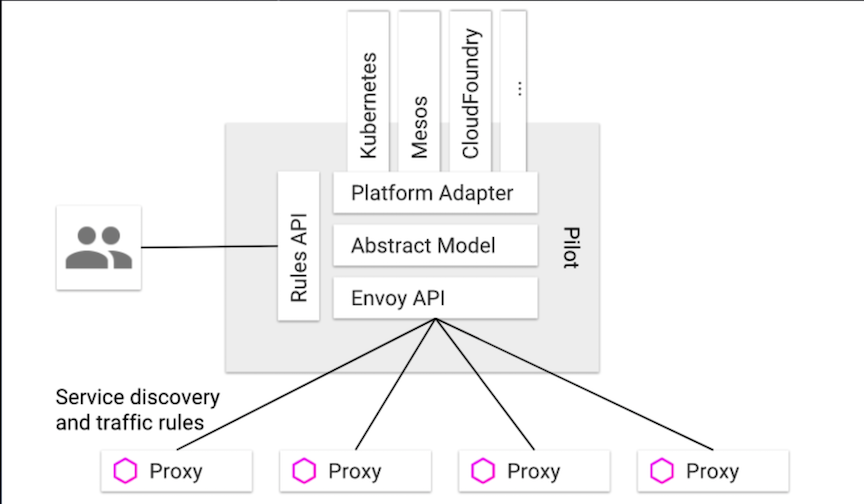

# Istio 架构与技术

### 大纲

* Service Mesh
* Istio 架构基础
* Istio 基本概念
* Istio & Kubernetes:架构结合
* 运行第一个Istio集群


## Kubernetes

Kubernetes 提供平台基础设施层强大的**容器编排与调度能力**

* **服务部署与弹性伸缩**:`Deployment`
* **服务拆分与服务发现**:`Service`

Kubernetes 提供简单的负载均衡

* **负载均衡**:基于`IPVS`或`Iptables`的简单均衡机制


## Service Mesh

* 治理能力独立(Sidecar) 
* 应用程序无感知
* 服务通信的基础设施层


## Istio问世

* 连接(Connect) 
* 安全(Secure)
* 控制(Control) 
* 观察(Observe)


### Istio关键能力

#### 功能


#### 扩展


## Istio + Kubernetes:云原生应用治理 + 云原生应用设施


### Istio架构与其关键组件


### Pilot, Service discovery and traffic rule



### Mixer, Check & Report


### Citadel


## Istio & Kubernetes:架构结合


### [Envoy](https://www.envoyproxy.io/)

* 基于C++的 L4/L7 Proxy转发器 
* CNCF第三个毕业的项目


* Listeners (LDS) 
* Routes (RDS) 
* Clusters (CDS) 
* Endpoints (EDS)


### Envoy 配置文件


## Istio 基础概念

### VirtualService

**最核心的配置接口，定义指定服务的所有路由规则**

* Hosts
* Gateways
* Http
* Tcp
* Tls

```
apiVersion: networking.istio.io/v1alpha3 
kind: VirtualService
metadata:
  name: reviews-route
  namespace: foo
spec:
  hosts:
  - reviews
  http:
  - match:
    - uri:
        prefix: "/wpcatalog"
	 - uri:
		prefix: "/consumercatalog"
    rewrite:
      uri: "/newcatalog"
    route:
    - destination:
        host: reviews
        subset: v2
  - route:
    - destination:
        host: reviews
subset: v1
```

### DestinationRule

**其定义的策略，决定了路由处理之后的流 量访问策略。负载均衡设置，断路器， TLS设置等**

* Host
* Subset
* TrafficPolicy

```
apiVersion: networking.istio.io/v1alpha3 
kind: DestinationRule
metadata:
  name: bookinfo-ratings
spec:
  host: ratings
  trafficPolicy:
    loadBalancer:
      simple: LEAST_CONN
  subsets:
  - name: v1
	 labels: 
	 	version: v1
  - name: v2
    labels:
      	version: v2
  - name: v3
	 labels: 
		version: v3
    trafficPolicy:
      loadBalancer:
        simple: ROUND_ROBIN
```

### Gateway

**提供外部服务访问接入，可发布任意内部端 口的服务，供外部访问。** 配合`VirtualService` 使用，使用标准Istio规则治理

* Servers
* Selector

```
apiVersion: networking.istio.io/v1alpha3
kind: Gateway
metadata:
  name: bookinfo-gateway 
spec:
  selector:
    istio: ingressgateway # use istio default controller
  servers:
  - port:
      number: 80 
      name: http 
      protocol: HTTP
    hosts:
    - "*" 
---
apiVersion: networking.istio.io/v1alpha3
kind: VirtualService
metadata:
name: bookinfo 
spec:
  hosts:
  - "*"
  gateways:
  - bookinfo-gateway 
  http:
  - match:
    - uri:
        exact: /productpage
  route:
    - destination:
        ...
 
```

### ServiceEntry

**将外部服务接入到服务注册表中，让Istio中自动发现的服务能够访问和路由到这些手工加入的服务。**

与`VirtualService`或`DestinationRule`配合使用

* Hosts
* Addresss
* Ports
* Location
* Resolution
* Endpoints

```
apiVersion: networking.istio.io/v1alpha3
kind: ServiceEntry
metadata:
  name: external-svc-mongocluster 
spec:
  hosts:
  - mymongodb.somedomain
  addresses:
  - 192.192.192.192/24 # VIPs
  ports:
  - number: 27018
    name: mongodb
    protocol: MONGO
  location: MESH_INTERNAL
  resolution: STATIC
  endpoints:
  - address: 2.2.2.2
  - address: 3.3.3.3
----
apiVersion: networking.istio.io/v1alpha3 
kind: DestinationRule
metadata:
  name: mtls-mongocluster
spec:
  host: mymongodb.somedomain 
  trafficPolicy:
    tls:
      mode: MUTUAL
      clientCertificate: /etc/certs/myclientcert.pem 
      privateKey: /etc/certs/client_private_key.pem 
      caCertificates: /etc/certs/rootcacerts.pem
```

## 基于K8s运行Istio集群

* `kubectl apply -f install/kubernetes/helm/istio/templates/crds.yaml`
* `helm template install/kubernetes/helm/istio --name istio --namespace istio-system > $HOME/istio.yaml`
* `kubectl create namespace istio-system`
* `kubectl apply -f $HOME/istio.yaml`


### Istioctl

* `proxy-status`:状态同步情况
* `proxy-config:envoy` 中具体规则查询
  * listener
  * route
  * cluster
  * endpoint
* kube-inject
* ......

## Demo


```
$ kubectl apply -f install/kubernetes/helm/istio/templates/crds.yaml
$ helm template install/kubernetes/helm/istio --name istio --namespace istio-system > $HOME/istio.yaml
$ kubectl create namespace istio-system
$ kubectl apply -f $HOME/istio.yaml
```

### Every pod inside default namespace will inject istio sidecar

```
$ kubectl label namespace default istio-injection=enabled
```

### check ingress gateway svc

```
$ kubectl get svc istio-ingressgateway -n istio-system
```
```
$ kubectl get svc istio-ingressgateway -n istio-system -o yaml
```


### The bookinfo experiments please check I did before

1. [基于Bookinfo的流量管理配置1](https://github.com/Chao-Xi/JacobTechBlog/blob/master/Istio/2BookInfo_1.md)
2. [基于Bookinfo的流量管理配置2](https://github.com/Chao-Xi/JacobTechBlog/blob/master/Istio/3BookInfo_2.md)