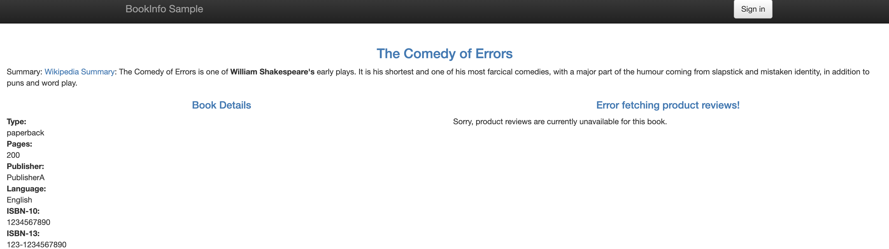
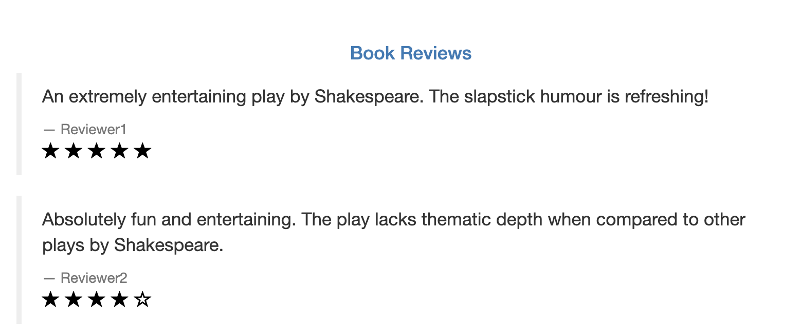
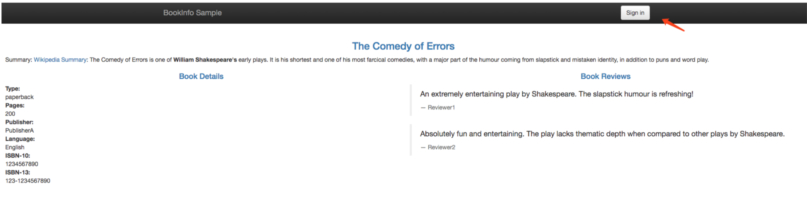
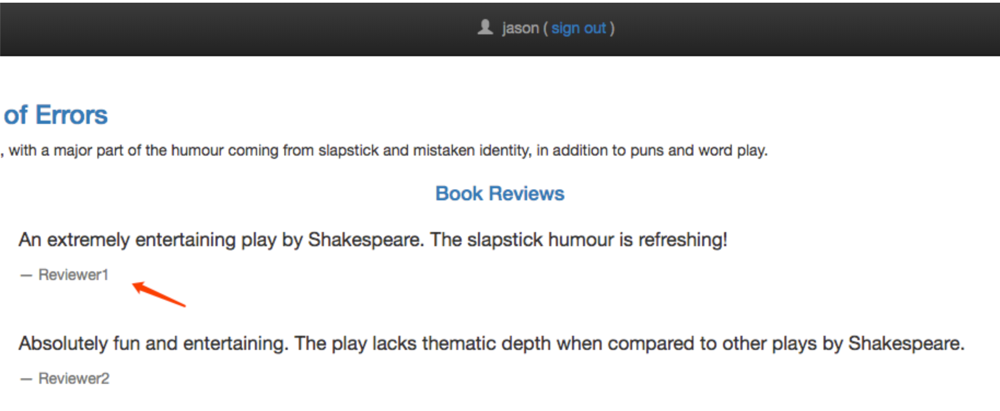
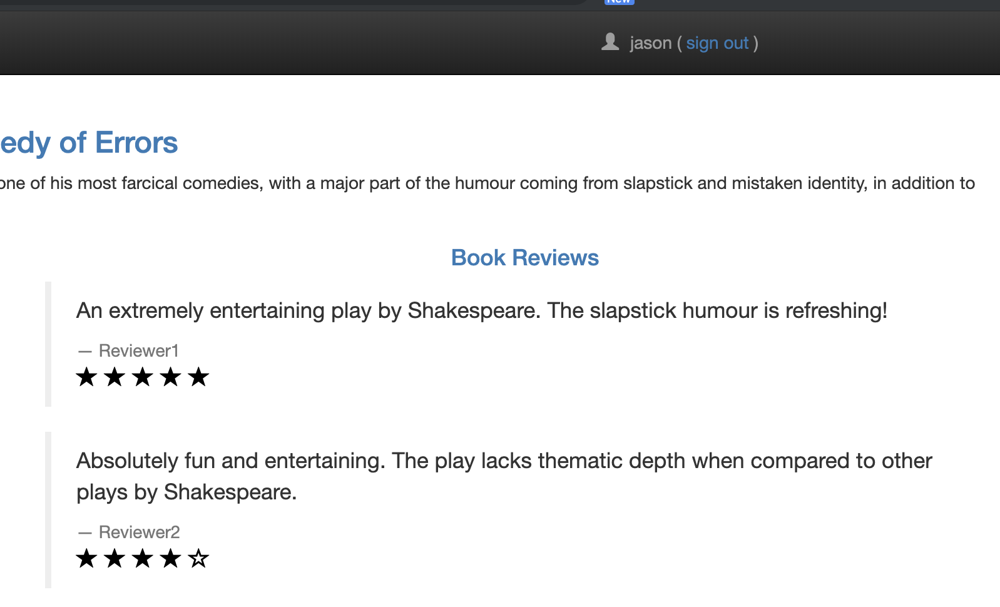
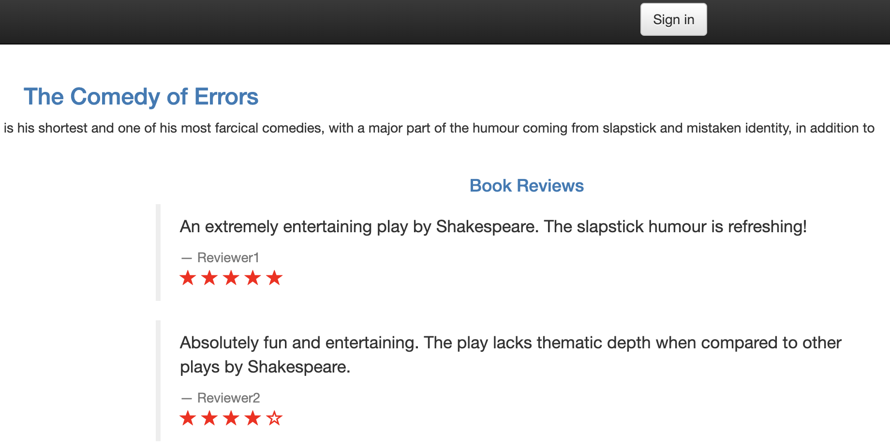

# 2. 基于Bookinfo的流量管理配置1

在前面我们成功搭建并部署了`istio`及其其 `Bookinfo` 示例应用：


目前搭建 `Bookinfo` 应用我们只用到了下面两个资源文件：

```
samples/bookinfo/platform/kube/bookinfo.yaml
samples/bookinfo/networking/bookinfo-gateway.yaml
```

* 前者就是通常的`k8s`定义的 `Deployment` 和 `Service` 的 `yaml` 文件，只是在部署时使用`istioctl kube-inject`对这个文件定义的 `pod` 注入了 `sidecar` 代理.


* **后者定义了这个应用的外部访问入口** `gateway`，以及应用内部 `productpage` 服务的`VirtualService`规则，而其他内部服务的访问规则还没有被定义。

```
$ istioctl --help
Istio configuration command line utility for service operators to
debug and diagnose their Istio mesh.

Usage:
  istioctl [command]

Available Commands:
  authn          Interact with Istio authentication policies
  deregister     De-registers a service instance
  experimental   Experimental commands that may be modified or deprecated
  help           Help about any command
  kube-inject    Inject Envoy sidecar into Kubernetes pod resources
  proxy-config   Retrieve information about proxy configuration from Envoy [kube only]
  proxy-status   Retrieves the synchronization status of each Envoy in the mesh [kube only]
  register       Registers a service instance (e.g. VM) joining the mesh
  validate       Validate Istio policy and rules
  version        Prints out build version information
```

可以看到当前集群中的 `gateway` :

```
$ kubectl get gateway --all-namespaces
NAMESPACE   NAME               CREATED AT
default     bookinfo-gateway   4h

$ istioctl get gateway
Command "get" is deprecated, Use `kubectl get` instead (see https://kubernetes.io/docs/tasks/tools/install-kubectl)
GATEWAY NAME       HOSTS     NAMESPACE   AGE
bookinfo-gateway   *         default     4h
```

```
$ kubectl get virtualservices
NAME       CREATED AT
bookinfo   4h
```

现在访问应用界面并刷新，会看到 `Reviews` 有时不会显示评分，有时候会显示不同样式的评分，因为后面有`3`个不同的`Reviews` 服务版本，**而没有配置该服务的路由规则`route rule`的情况下，该服务的几个实例会被随机访问到**，有的版本服务会进一步调用 `Ratings` 服务，有的不会。

## 不同服务版本访问规则的基本使用

```
$ cd /Users/jxi/Devops/bookinfo/istio-1.1.3
```

现在我们来对 Reviews 服务添加一条路由规则，启用`samples/bookinfo/networking/virtual-service-reviews-v3.yaml` 定义的`VirtualService`规则，内容如下：

```
apiVersion: networking.istio.io/v1alpha3
kind: VirtualService
metadata:
  name: reviews
spec:
  hosts:
    - reviews
  http:
  - route:
    - destination:
        host: reviews
        subset: v3
```

这样，所有访问 reviews 服务的流量就会被引导到 `reviews` 服务对应的 `subset` 为 `v3` 的 `Pod` 中。启用这条规则：

```
$ istioctl create -f samples/bookinfo/networking/virtual-service-reviews-v3.yaml
Command "create" is deprecated, Use `kubectl create` instead (see https://kubernetes.io/docs/tasks/tools/install-kubectl)
Created config virtual-service/default/reviews at revision 23414
```

然后查看所有的路由规则：

```
$ kubectl get virtualservices
NAME       CREATED AT
bookinfo   4h
reviews    48s
```

我们可以看到 `reviews` 的`VirtualService`已经创建成功了，但是此时刷新应用页面，**发现访问 Reviews 失败了**：




**这是因为我们还没有创建 `DestinationRule`**

#### `DestinationRule`将 `VirtualService` 中指定的`subset` 与 `pod` 的`{labels:{version: v3}}`关联起来。

在 `samples/bookinfo/networking/destination-rule-all.yaml` 文件中有定义所有该应用中要用到的所有`DestinationRule`，其中有一段就是对 `Reviews` 相关的 `DestinationRule` 的定义:

```
---
apiVersion: networking.istio.io/v1alpha3
kind: DestinationRule
metadata:
  name: reviews
spec:
  host: reviews
  subsets:
  - name: v1
    labels:
      version: v1
  - name: v2
    labels:
      version: v2
  - name: v3
    labels:
      version: v3
```

**我们可以看到 `DestinationRule` 中定义了 `subsets` 集合，其中 `labels` 就和我们之前 `service` 的 `labelselector` 一样是去匹配 `Pod` 的 `labels` 标签的，比如我们这里 `subsets` 中就包含一个名为 `v3` 的 `subset`，而这个 `subset` 匹配的就是具有 `version=v3` 这个 `label` 标签的 `Pod` 集合.**


再回到之前的 `samples/bookinfo/platform/kube/bookinfo.yaml `文件中，我们可以发现 `reviews` 的 `Deployment `确实有声明不同的 `labels->version`:

```
---
apiVersion: extensions/v1beta1
kind: Deployment
metadata:
  name: reviews-v3
spec:
  replicas: 1
  template:
    metadata:
      labels:
        app: reviews
        version: v3
    spec:
      containers:
      - name: reviews
        image: istio/examples-bookinfo-reviews-v3:1.8.0
        imagePullPolicy: IfNotPresent
        ports:
        - containerPort: 9080
```

这样我们就通过 `DestinationRule` 将` VirtualService` 与 `service` 不同的版本关联起来了。

现在我们直接创建 `DestinationRule` 资源：

```
$ istioctl create -f samples/bookinfo/networking/destination-rule-all.yaml
Command "create" is deprecated, Use `kubectl create` instead (see https://kubernetes.io/docs/tasks/tools/install-kubectl)
Created config destination-rule/default/productpage at revision 24074
Created config destination-rule/default/reviews at revision 24075
Created config destination-rule/default/ratings at revision 24076
Created config destination-rule/default/details at revision 24077
```

创建完成后，我们就可以查看目前我们网格中的 `DestinationRules`:

```
$ istioctl get destinationrule
Command "get" is deprecated, Use `kubectl get` instead (see https://kubernetes.io/docs/tasks/tools/install-kubectl)
DESTINATION-RULE NAME   HOST          SUBSETS                      NAMESPACE   AGE
details                 details       v1,v2                        default     13s
productpage             productpage   v1                           default     13s
ratings                 ratings       v1,v2,v2-mysql,v2-mysql-vm   default     13s
reviews                 reviews       v1,v2,v3                     default     13s
```

此时再访问应用就成功了，**多次刷新页面发现 `Reviews` 都展示的是 `v3` 版本带红色星的 `Ratings`**，说明我们`VirtualService` 的配置成功了。

## 基于权重的服务访问规则使用

刚刚我们演示的基于不同服务版本的服务网格的控制，现在我们来演示下基于权重的服务访问规则的使用。

首先移除刚刚创建的 `VirtualService` 对象:

```
$ istioctl delete virtualservice reviews
Command "delete" is deprecated, Use `kubectl delete` instead (see https://kubernetes.io/docs/tasks/tools/install-kubectl)
Deleted config: virtualservice reviews

$ istioctl get virtualservices
Command "get" is deprecated, Use `kubectl get` instead (see https://kubernetes.io/docs/tasks/tools/install-kubectl)
VIRTUAL-SERVICE NAME   GATEWAYS           HOSTS     #HTTP     #TCP      NAMESPACE   AGE
bookinfo               bookinfo-gateway   *             1        0      default     4h
```

现在我们再去访问 `Bookinfo` 应用又回到最初随机访问 `Reviews` 的情况了。现在我们查看文件 `samples/bookinfo/networking/virtual-service-reviews-80-20.yaml` 的定义：

```
apiVersion: networking.istio.io/v1alpha3
kind: VirtualService
metadata:
  name: reviews
spec:
  hosts:
    - reviews
  http:
  - route:
    - destination:
        host: reviews
        subset: v1
      weight: 80
    - destination:
        host: reviews
        subset: v2
      weight: 20
```

这个规则定义了:

* `80%` 的对 `Reviews` 的流量会落入 `v1` 这个 `subset`，就是没有 `Ratings` 的这个服务，
* `20%` 会落入 `v2` 带黑色 `Ratings` 的这个服务，然后我们创建这个资源对象：


```
$ kubectl create -f samples/bookinfo/networking/virtual-service-reviews-80-20.yaml
virtualservice.networking.istio.io/reviews created

$ istioctl get virtualservices
Command "get" is deprecated, Use `kubectl get` instead (see https://kubernetes.io/docs/tasks/tools/install-kubectl)
VIRTUAL-SERVICE NAME   GATEWAYS           HOSTS     #HTTP     #TCP      NAMESPACE   AGE
bookinfo               bookinfo-gateway   *             1        0      default     4h
reviews                                   reviews       1        0      default     11s
```

我们查看当前网格中的 `virtualservices` 对象，可以看到已经有 `reviews` 了，证明已经创建成功了，由于上面我们已经将应用中所有的 `DestinationRules` 都已经创建过了，所以现在我们直接访问应用就可以了，

我们多次刷新，可以发现没有出现 `Ratings` 的次数与出现黑色星 `Ratings` 的比例大概在`4:1`左右，并且没有红色星的 `Ratings` 的情况出现，说明我们配置的 `VirtualService` 规则生效了。


  



这就是基于权重的服务访问规则的使用方法。


## 基于请求内容的服务访问规则使用

除了上面基于服务版本和服务权重的方式控制服务访问之外，我们还可以基于请求内容来进行访问控制。

同样，将上面创建的 `VirtualService` 对象删除：

```
$ istioctl delete virtualservice reviews
Command "delete" is deprecated, Use `kubectl delete` instead (see https://kubernetes.io/docs/tasks/tools/install-kubectl)
Deleted config: virtualservice reviews

$ istioctl get virtualservices
Command "get" is deprecated, Use `kubectl get` instead (see https://kubernetes.io/docs/tasks/tools/install-kubectl)
VIRTUAL-SERVICE NAME   GATEWAYS           HOSTS     #HTTP     #TCP      NAMESPACE   AGE
bookinfo               bookinfo-gateway   *             1        0      default     4h
```

查看文件 `samples/bookinfo/networking/virtual-service-reviews-jason-v2-v3.yaml` 的定义：

```
apiVersion: networking.istio.io/v1alpha3
kind: VirtualService
metadata:
  name: reviews
spec:
  hosts:
  - reviews
  http:
  - match:
    - headers:
        end-user:
          exact: jason
    route:
    - destination:
        host: reviews
        subset: v2
  - route:
    - destination:
        host: reviews
        subset: v3
```

这个 `VirtualService` 对象定义了对 `reviews` 服务访问的 `match` 规则。

意思是如果当前请求的 `header` 中包含 `jason` 这个用户信息，则只会访问到 `v2` 的 `reviews` 这个服务版本，即都带星的样式，如果不包含该用户信息，则都直接将流量转发给 `v3` 这个 `reviews` 的服务。

我们先不启用这个 `VirtualService`，现在我们去访问下 `Bookinfo` 这个应用：


右上角有登录按钮，在没有登录的情况下刷新页面，`reviews` 服务是被随机访问的，可以看到有带星不带星的样式，点击登录，**在弹窗中 `User Name` 输入 `jason`，`Password`为空**，登录：






再刷新页面，可以看到跟未登录前的访问规则一样，也是随机的。

现在我们来创建上面的 VirtualService 这个对象:

```

$ kubectl create -f samples/bookinfo/networking/virtual-service-reviews-jason-v2-v3.yaml
virtualservice.networking.istio.io/reviews created

$ istioctl get virtualservice
Command "get" is deprecated, Use `kubectl get` instead (see https://kubernetes.io/docs/tasks/tools/install-kubectl)
VIRTUAL-SERVICE NAME   GATEWAYS           HOSTS     #HTTP     #TCP      NAMESPACE   AGE
bookinfo               bookinfo-gateway   *             1        0      default     4h
reviews  
```

此时再回去刷新页面，发现一直都是黑星的 Reviews 版本`(v2)`被访问到了。 注销退出后再访问，此时又一直是红色星的版本`(v3)`被访问了。





说明我们基于 `headers->end-user->exact:jason `的控制规则生效了。在 `productpage` 服务调用 `reviews` 服务时，登录的情况下会在 `header` 中带上用户信息，通过 `exact` 规则匹配到相关信息后，流量被引向了上面配置的v2版本中。

这里要说明一下match的匹配规则：


> All conditions inside a single match block have AND semantics, while the list of match blocks have OR semantics. The rule is matched if any one of the match blocks succeed.


意思是一个 match 块里的条件是需要同时满足才算匹配成功的，如:

```
- match:
    - uri:
        prefix: "/wpcatalog"
      port: 443
```

多个 match 块之间是只要有一个 match 匹配成功了，就会走向它指定的服务版本去，而忽略其他的。

我们的示例中在登录的条件下，满足第一个 `match`，所以服务一直会访问到 `v2` 版本。退出登录后，没有 `match` 规则满足匹配，会走向最后一个 `route` 规则，即 `v3` 版本。

到这里，我们就和大家一起学习了基于不同服务版本、权重以及请求内容来控制服务流量的配置，后面我们将进一步学习流量管理的其他用法。