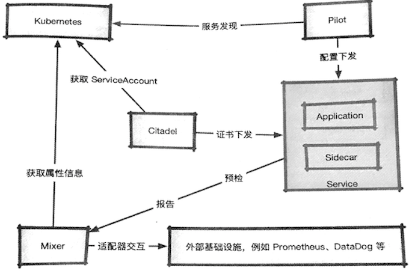
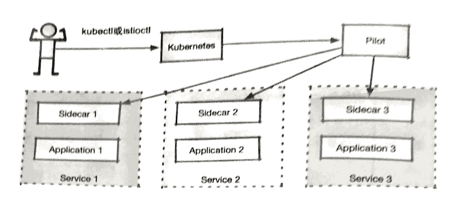
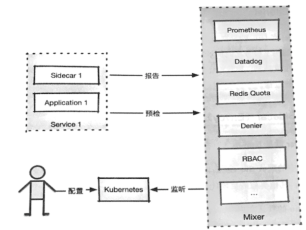
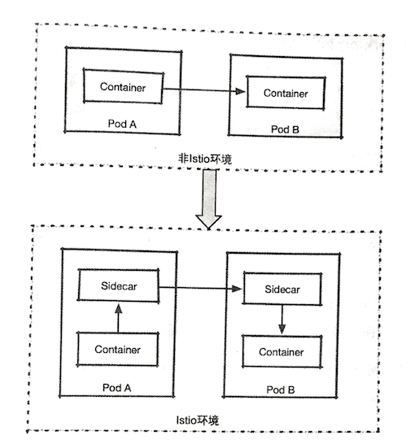
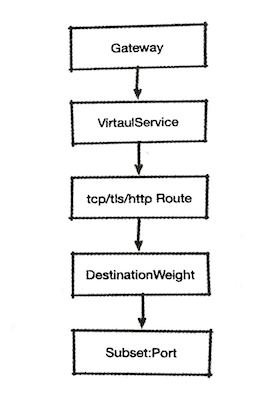
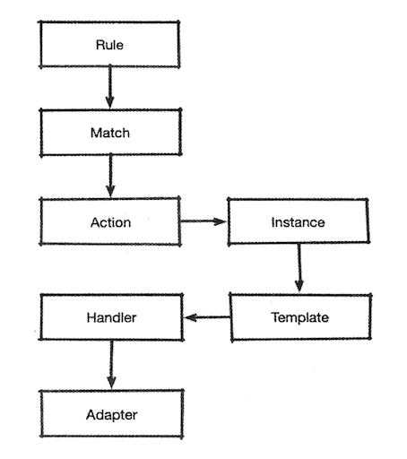

# 2.Istio 基本介绍

前面提到，Istio出自名门，由Google. IBM和Lyft在2017年5月合作推出，它的初始设计目标是在Kubernetes的基础上，以非侵入的方式为运行在集群中的微服务提供**流量管理、安全加固、服务监控和策略管理**等功能。 除了前面提到的服务网格基本功能，Istio还提供了对物理机和Consul的注册服务的支持，并提供了接口，用适配器与外界的第三方IT系统进行对接。

`Kubernetes` 是其主要支持的平台，对其他平台的支持还很初级．如果没有自研功能，则不建议 尝试，本书也不会提及这一部分内容。 

## 1 Istio的核心组件及其功能 

Istio总体来说分为两部分：`控制面`和`数据面`，如下所述。 

* 数据面被称为“Sidecar"，可将其理解为旧式三轮摩托车的挂斗。Sidecar, 通过注人的方式和业务容器共存于一个`Pod`中，**会劫持业务应用容器的流量**，**并接受控制面组件的控制，同时会向控制面输出日志、跟踪及监控数据**。 
* 控制面是`Istio`的核心，管理`Istio`的所有功能。 

`Istio`的主要组件及其相互关系大致如图所示，下面对这些关键组件进行讲解。 

### 1.1 Pilot 

**`Pilot`是`Istio`的主要控制点，`Istio`的流量就是由`Pilot`管理的（具体执行是由 `Sidecar` 完成的）**。 

在整个系统中，`Pilot`完成以下任务：
 
* **从`Kubernetes`或者其他平台的注册中心获取服务信息，完成服务发现过程；** 
* **读取`Istio`的各项控制配置，在进行转换之后，将其发给数据面进行实施。** 

**`Pilot`的配置内容会被转换为**数据面**能够理解的格式，下发给数据面的`Sidecar`, `Sidecar` 根据 `Pilot` 指令，将路由、服务、监听、集群等定义信息转换为本地配置，完成控制行为的落地。**

1. 用户通过 `kubectl` 或者 `istioctl` （当然也可以通过API）在Kubernetes 上创建 `CRD`资源， 对 `Istio`控制平面发出指令
2. `Pilot` 监听 CRD 中的 `config`, `rbac`, `networking`， 在检测到资源对象的变更之后,针对其中涉及的服务， 发出指令给对应的`Sidecar`
3. `Sidecar` 根据这些指令更新自身的配置，根据配置修正通信的行为

### 1.2 Mixer

`Mixer`的职责主要有两个， **预检**和**回报**, 简单的示意图

Mixer的简单工作流程如下。 

1. 用户将`Mixer`：配置发送到`Kubernetes`中。 
2. `Mixer`：通过对`Kubernetes`资源的监听，获知配置的变化。 
3. 网格中的服务在每次调用之前，都向 `Mixer` 发出预检请求，查看调用是否允许执行。在每次调用之后，都发出报告信息，向`Mixer`汇报在调用过程中产生的监控跟踪数据。

在`Mixer`中包含多个被称为`Adapter`的组件，这些组件用来处理 在`Mixer`中接收的预检和报告数据，从而完成`Mixer`的各种功能。 

### 1.3 Citadel 
`Citadel`在Istio的早期版本中被称为`Istio-CA`，不难看出，它是用于证书管理的。 在集群中启用了服务之间的加密之后，`Citadel`负责为集群中的各个服务在统一`CA `的条件下生成证书，并下发给各个服务中的`Sidecar`，服务之间的`TLS`就依赖这些证书完成校验过程。

 
### 1.4 Sidecar(Envoy) 

**`Sidecar`就是`Istio`中的数据面，负责控制面对网格控制的实际执行。**

`Istio`中的默认`Sidecar`是由`Envoy`派生出来的，在理论上，只要支持`Envoy`的 `xDS`协议，其他类似的反向代理软件就都可以代替`Envoy`来担当这一角色。 

在`Istio`的默认实现中，`Istio`利用`istio-init`初始化容器中的`iptables`指令，对一所在`Pod`的流量进行劫持，从而接管`Pod`中应用的通信过程，如此一来，就获得了通信的控制权，控制面的控制目的最终得以实现。 

注人`Sidecar`前后的通信模式变化如图所示。 熟悉`Kubernetes`的应该都知道，在同一个`Pod`内的多个容器之间，网络栈是共享的，这正是`Sidecar`模式的实现基础(Pause Pod)。从图中可以看到，`Sidecar`在加人之后，原有的源容器一目的容器的直接通信方式，变成了`源容器一>Sidecar->Sidecar一>目的容器`的模式。而`Sidecar`是用来接受控制面组件的操作的，这样一来，就让通信过程中的控制和观察成为可能。 

## 2 核心配置对象 

`Istio`在安装过程中会进行`CRD`的初始化，在`Kubernetes`集群中注册一系列的 `CRD`. `CRD`在注册成功之后，会建立一些基础对象，完成`Istio`的初始设置。
 
在前面介绍组件时曾多次提到，用户利用`Istio`控制微服务通信，是通过向 `Kubernetes`提交`CRD`资源的方式完成的。`Istio`中的资源分为三组进行管理，分别是 `networking.istio.io`. `config.istio.io`及`authentication.istio.io`，下面将分别进行介绍。 

### 2.1 `networking.istio` 

`networking.istio` 系列对象在`Istio` 中可能是使用频率最高的 `Istio`的流量管理功能就是用这一组对象完成的这里选择其巾最常用的对象进行简单介绍.

在`networking.istio,io`的下属资源中`Virtual Service`是一个控制中心它的功能 
简单说来就是；**定义一组条件，将符合该条件的流量按照在对象中配置的对应策略 
进行处理，最后将路由转到匹配的日标中。下面列出几个典型的应用场景。** 

* (1）来自服务`A`版本`1`的服务，如果要访问服务`B`，则要将路由指向服务`B`的版本`2` 
* (2）在服务`x`发往服务`Y`的`HTTP`请求中，如果`Header`包含`canary=true` 则把服务目标指向服务`Y`的版本`3`.否则发给服务`Y`的版本`2` 
* (3）为从服务`M`到服务`N`的所有访问都加人延迟，以测试在网络状况不佳时的表现。 

可以看出，这方面的功能是比较复杂的 因此其中包含的行为定义也一定不简单。 `Istio` 对路由管理做了很好的抽象。图展示了流量访问流程中的几个关键对象 

**1. Gateway**

   在访问服务时，不论是网格内部的服务互访，还是通过`ingress`进人网格的外部流量，首先要经过的设施都是`Gateway`. 
 
`Gateway`对象描述了边缘接人设备的概念， 其中包含对开放端口、主机名及可能存在的`TLS`证书的定义。

* 网络边缘的`ingress` 流量，会通过对应的`Istio Ingress Gateway Controller`进入；
* 网格内部的服务互访， 则通过虚拟的`mesh`网关进行（`mesh`网关代表网格内部的所有`Sidecar`)

* `Pilot`会根据`Gateway` 和**主机名**进行检索，如果存在对应的`VirtualService`，则交 由`VirtualService`处理；
* 如果是`Mesh Gateway`且不存在对应这一主机名的 `VirtualService`，则尝试调用`Kubernetes Service`(SVC)；如果不存在，则发生`404`错误。 

**2 .VirtualService**

`Virtual Service`对象主要由以下部分组成。 

* (1) `Host`：该对象所负责的主机名称，如果在`Kubernetes`集群中，则这个主机名可以是服务名。 
* (2) `Gateway`：流量的来源网关，在后面会介绍网关的概念。如果这一字段被省 略，则代表使用的网关名为`“mesh"`，也就是默认的网格内部服务互联所用的网关。 
* (3）**路由对象**：网格中的流量，如果符合前面的`Host`和`Gateway`的条件，就需要根据实际协议对流量的处理方式进行甄别。其原因是：`HTTP`是一种透明协议，可以经过对报文的解析，完成更细致的控制；而对于原始的TCP流量来说，就无法 完成过于复杂的任务了。 

**3 .TCP/TLS/HTTP Route**
 
路由对象目前可以是`HTTP`、`TCP`或者`TLS`中的一个，分别针对不同的协议进行工作。每种路由对象都至少包含两部分：**匹配条件和目的路由。** 例如，在`HTTPRoute`。 

对象中就包含用于匹配的`HTTPMatchRequest`对象数组，以及用于描述目标服务的 `DestinationWeight`对象，并且`HTTPMatchRequest`的匹配条件较为丰富，例如前面提到的`http header`或者`uri`等除此之外，`HTTP`路由对象受益于`HTTP`的透明性，包含很多专属的额外特性，例如**超时控制、重试、错误注入**等。

相对来说，`TCPRoute`。 简单很多，它的匹配借助资源`L4MatchAttributes`对象完成，其中除`Istio`固有的标签和`Gateway`外，仅包含地址和端口。 

在匹配完成后，自然就是选择合适的目标了。 

**4.DestinationWeight**

各协议路由的目标定义是一致的，都`由Destination Weight`对象数组来完成 `Destination Weight`指到某个目标（`Destination`对象）的流量权重，这就意味着，多个目标可以同时为该`Virtual Service`提供服务，并按照权重进行流量分配。
 
**5 .Destination** 

目标对象（`Destination`）由`Subset`和`Port`两个元素组成。`Subset`顾名思义，就是指服务的一个子集，它在`Kubernetes`中代表使用标签选择器区分的不同`Pod`（例如两个`Deployment`)。 `Port`代表的则是服务的端口。 

**6．小结**
 
至此，流量经过多个对象的逐级处理，成功到达了`Pod`， 

### 2.2 `config.istio.io`

`config.istio.io`中的对象用于为`Mixer`组件提供配置。`Mixer` 供了**预检**和**报告**这两个功能，这两个功能看似简单，但是因为大量适配器的存在。变得相当复杂， 图展示了`Mixer`对数据处理过程

**1.Rule**
 
* `Rule`对象是`Mixer`的人口，其中包含一个`match`成员和一个逻辑表达式，只有符合表达式判断的数据才会被交给`Action`处理。
* 逻辑表达式中的变量被称为`attribute` （属性），其中的内容来自`Envoy`提交的数据。 

**2.Action**
 
`Action`负责解决的问题就是：将符合人口标准的数据，在用什么方式加工之后，交给哪个适配器进行处理。`Action`包含两个成员对象：

* 一个是`Instance`，使用`Template`对接收到的数据进行处理；
* 一个是`Handler`，代表一个适配器的实例，用于接收处理后的数据。 

**3.Instance**
 
`Instance`主要用于为进入的数据选择一个模板，并在数据中抽取某些字段作为模板的参数，传输给模板进行处理。 

**4.Adapter** 

**`Adapter`在`Istio`只被定义为一个行为规范**，而一些必要的实例化数据是需要再次进行初始化的，例如`RedisQuota`适配器中的`Redis`地址，或者`Iistchecker`中的黑白名单等，只有这些数据得到正式的初始化，`Adapter`才能被投人使用

经过`Handler`实例化之后的·Adapter·，就具备了工作功能。

* 有些`Adapter`是`Istio`的自身实现，例如前面提到的`listcheck`或者`memquota`；
* 有些`Adapter`是第三方服务，例如`Prometheus`或者`Datadog`等。

`Envoy`传出的数据将会通过这些具体运行的`Adapter`的处理，得到预检结果，或者输出各种监控、日志及跟踪数据。
 
**5.Template**

**顾名思义，`Template`是一个模板，用于对接收到的数据进行再加工.** 

进人`Mixer`中的数据都来自`Sidecar`，但是各种适配器应对的需求各有千秋，甚至同样一个适配器，也可能接收各种不同形式的数据（例如`Prometheus`可能会在同样一批数据中获取不同的指标）,`Envoy`提供的原始数据和适配器所需要的输人数据存在格式上的差别，因此需要对原始数据进行再加工。 

`Template`就是这样一种工具，在用户编制模板对象之后，经过模板处理的原始数据会被转换为符合适配器输人要求的数据格式，这样就可以在`Instance`字段中引用

**6.Handler**

`Handler`对象用于对`Adapter`进行实例化。

这组对象的命名非常令人费解，但是从其功能列表中可以看出，`Mixer`管理了所有第三方资源的接入，大大扩展了`Istio`的作用范围，其应用难度自然水涨船高， 应该说还是可以理解的。 

### 2.3 `authentication.istio.io` 

这一组`API`用于定义认证策略。它在网格级别、命名空间级别及服务级别都提 供了认证策略的要求，要求在内容中包含服务间的通信认证，以及基于`JWT`的终端认证。这里简单介绍其中涉及的对象。 

**1.Policy**

`Policy`用于指定服务一级的认证策略，如果将其命名为`“default"`，那么该对象所在的命名空间会默认采用这一认证策略。`Policy`对象由两个部分组成：**策略日标**和**认证方法**。 

* 策略目标包含服务名称（或主机名称)及服务端口号。 
* 认证方法由两个可选部分组成，分别是用于设置服务间认证的`peers`子对象，以及用于设置终端认证的origins子对象。 

**2.Mesh Policy**
 
`MeshPolicy`只能被命名为`“default"`，它代表的是所有网格内部应用的默认认证策略，其余部分内容和·Policy·一致。 

### 2.4 `rbac.istio.io` 

在`Istio`中实现了一个和`Kubernetes`颇为相似的`RBAC`（基于角色的）访问控制系统，其主要对象为`ServiceRole`和`ServiceRoleBinding`.

**1. Service Role**
 
`ServiceRole`由一系列规则（rules）组成，每条规则都对应一条权限，其中描述了权限所对应的服务、服务路径及方法，还包含一组可以进行自定义的约束。 

**2 .Service Role Binding** 

和	Kubernetes RBAC	类似，该对象用于将用户主体（可能是用户或者服务）和`ServiceRole`进行绑定

