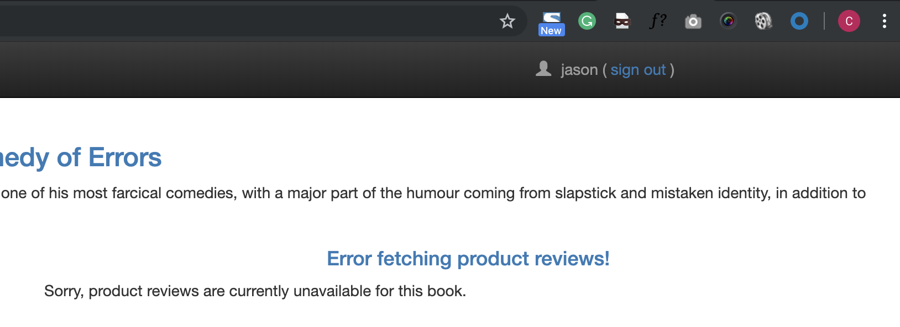
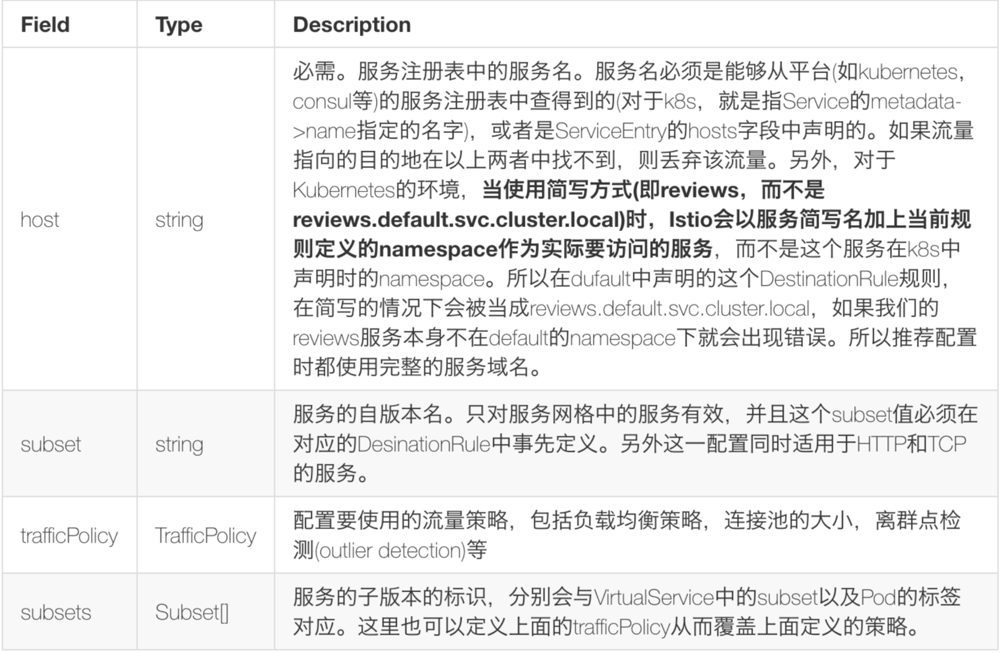

# 3. 基于Bookinfo的流量管理配置2

## 延迟访问故障注入

接上节课的内容，第一步还是需要移除之前创建的 `VirtualService`:

```
$ istioctl get virtualservice
Command "get" is deprecated, Use `kubectl get` instead (see https://kubernetes.io/docs/tasks/tools/install-kubectl)
VIRTUAL-SERVICE NAME   GATEWAYS           HOSTS     #HTTP     #TCP      NAMESPACE   AGE
bookinfo               bookinfo-gateway   *             1        0      default     23h
reviews  

$ istioctl delete virtualservice reviews
Command "delete" is deprecated, Use `kubectl delete` instead (see https://kubernetes.io/docs/tasks/tools/install-kubectl)
Deleted config: virtualservice reviews


$ istioctl get virtualservice
Command "get" is deprecated, Use `kubectl get` instead (see https://kubernetes.io/docs/tasks/tools/install-kubectl)
VIRTUAL-SERVICE NAME   GATEWAYS           HOSTS     #HTTP     #TCP      NAMESPACE   AGE
bookinfo               bookinfo-gateway   *             1        0      default     23h
```


```
cd /Users/jxi/Devops/bookinfo/istio-1.1.3
```

然后我们查看 istio 样例文件夹下面的文件：`samples/bookinfo/networking/virtual-service-ratings-test-delay.yaml` 的内容

```
apiVersion: networking.istio.io/v1alpha3
kind: VirtualService
metadata:
  name: ratings
spec:
  hosts:
  - ratings
  http:
  - match:
    - headers:
        end-user:
          exact: jason
    fault:
      delay:
        percent: 100
        fixedDelay: 7s
    route:
    - destination:
        host: ratings
        subset: v1
  - route:
    - destination:
        host: ratings
        subset: v1
```

这个 `VirtualService` 定义了一个在 `jason` 登录的情况下，访问 `ratings` 服务的 `100%` 的 `7s` 访问延迟。

前面我们知道，`Bookinfo` 这个示例 `productpage` 服务调用 `reviews`，`reviews` 的不同版本会对 `ratings` 进行不同的调用，

* 其中 `reviews-v1` 不调用 `ratings`，
* `reviews-v2` 和 `reviews-v3` 会调用 `ratings`，并做不同样式的渲染。
* **并且在 `productpage` 访问 `reviews` 时，代码中有硬编码 `6s` 中的访问超时限制，**
* 而 `reviews` 访问 `ratings` 编码了 `10s` 的访问超时限制。

了解这一点后，我们现在来创建这个 VirtualService 资源对象：

```
$ kubectl create -f  samples/bookinfo/networking/virtual-service-ratings-test-delay.yaml
virtualservice.networking.istio.io/ratings created

$ istioctl get virtualservice
Command "get" is deprecated, Use `kubectl get` instead (see https://kubernetes.io/docs/tasks/tools/install-kubectl)
VIRTUAL-SERVICE NAME   GATEWAYS           HOSTS     #HTTP     #TCP      NAMESPACE   AGE
bookinfo               bookinfo-gateway   *             1        0      default     23h
ratings    
```

创建完成后，前往 `Bookinfo` 应用，登录 `jason`，打开浏览器的`Network`，刷新页面，发现请求加载很慢，大约 `6s` 后，出现如下界面




**看到 `productpage` 的请求大约耗时 `6s`，`Reviews`显示 `unavailable` 的错误。**

因为此时 `reviews` 请求 `ratings` 的访问超过了 `6s` 还没有响应，使得 `productpage` 中的硬编码的超时设置生效了。


通过这种**超时故障注入**，可以帮助我们方便地发现服务间相互访问中存在的潜在问题。

## 中断访问故障注入

同样移除刚才的 `VirutualService` 资源对象：

```
$ istioctl delete virtualservice ratings
Command "delete" is deprecated, Use `kubectl delete` instead (see https://kubernetes.io/docs/tasks/tools/install-kubectl)
Deleted config: virtualservice ratings

$  istioctl get virtualservice
Command "get" is deprecated, Use `kubectl get` instead (see https://kubernetes.io/docs/tasks/tools/install-kubectl)
VIRTUAL-SERVICE NAME   GATEWAYS           HOSTS     #HTTP     #TCP      NAMESPACE   AGE
bookinfo               bookinfo-gateway   *             1        0      default     23h
```

然后我们查看 istio 样例文件夹下面的文件：`samples/bookinfo/networking/virtual-service-ratings-test-abort.yaml` 的内容

```
apiVersion: networking.istio.io/v1alpha3
kind: VirtualService
metadata:
  name: ratings
spec:
  hosts:
  - ratings
  http:
  - match:
    - headers:
        end-user:
          exact: jason
    fault:
      abort:
        percent: 100
        httpStatus: 500
    route:
    - destination:
        host: ratings
        subset: v1
  - route:
    - destination:
        host: ratings
        subset: v1
```

通过上面的这个 `yaml` 文件我们可以看出这个 `VirtualService` **资源对象配置了在 `jason` 登录时，`reviews` 对 `ratings` 访问时 `100%` 的返回一个`500`错误响应。**

然后同样创建这个资源对象：(用 `kubectl` 或者 `istioctl` 工具都是可以的)

```
$ istioctl create -f samples/bookinfo/networking/virtual-service-ratings-test-abort.yaml
Created config virtual-service/default/ratings at revision 32143909
$ istioctl get virtualservice
VIRTUAL-SERVICE NAME   GATEWAYS           HOSTS     #HTTP     #TCP      NAMESPACE   AGE
bookinfo               bookinfo-gateway   *             1        0      default     6d
ratings                                   ratings       2        0      default     4s
```

现在我们回到 `BookInfo` 应用，登录 `jason`，刷新页面，可以看到下面的现象： 


我们可以看到 `reviews` 对 `ratings` 的访问失败了，服务上面我们 VirtualService 资源对象的配置。


## 不同环境服务访问

使用 istio 的路由规则管理，还可以配置对不同环境(`prod, staging, dev`等)的同一服务的访问规则。由于我的实验环境没有搭建多环境的集群，**这里指使用官方的demo来做描述**。

```
apiVersion: networking.istio.io/v1alpha3
kind: VirtualService
metadata:
  name: my-productpage-rule
  namespace: istio-system
spec:
  hosts:
  - productpage.prod.svc.cluster.local # ignores rule namespace
  http:
  - timeout: 5s
    route:
    - destination:
        host: productpage.prod.svc.cluster.local
```

通常在一个集群中如果搭建多环境的情况可以使用`namespace`来进行划分，而使用上面的方式就可以实现对其他 `namepaces` 的服务的访问。

**上面的 `VirtualService` 对象定义了对 `namespace` 为 `prod` 中的 `productpage` 服务的访问，会在 `5s` 的 `timeout` 后才会调用该服务。**


**这个访问规则没有定义 `subset`，istio 会获取`productpage.prod.svc.cluster.local` 服务对应的所有实例并向其他服务实例注入这些实例的信息到他们的 `load balancing pool` 中去。**


同时注意这个 `VirtualService` 是定义在 `istio-system` 的`namespace`中的，此时要使用完整的服务域名：

`productpage.prod.svc.cluster.local`，这样这条规则所属的 namespace 才会解析到其他 namespace 的服务。


## 服务网格外的流量管理

为了控制服务网格外的服务的流量访问，**外部的服务必须首先使用一个`ServiceEntry`对象加入到 `istio` 的内部 `service registry` 中，服务网格才会知道如何导向这些外部服务的流量。**

为了测试这个功能，我们使用 `istio` 样例中的 `sleep` 应用来验证改功能，查看 `samples/sleep/sleep.yaml` 文件内容：

```
apiVersion: v1
kind: Service
metadata:
  name: sleep
  labels:
    app: sleep
spec:
  ports:
  - port: 80
    name: http
  selector:
    app: sleep
---
apiVersion: extensions/v1beta1
kind: Deployment
metadata:
  name: sleep
spec:
  replicas: 1
  template:
    metadata:
      labels:
        app: sleep
    spec:
      containers:
      - name: sleep
        image: tutum/curl
        command: ["/bin/sleep","infinity"]
        imagePullPolicy: IfNotPresent
---
```

这其实就是一个简单的应用，通过 Deployment 进行控制，通过 Service 暴露服务，现在我们来部署该应用：

```
$ kubectl apply -f <(istioctl kube-inject -f samples/sleep/sleep.yaml)
service "sleep" created
deployment.extensions "sleep" created
```

待应用部署完成后，我们进入该应用容器内部执行一些测试操作：

```
$ export SLEEP_POD=$(kubectl get pod -l app=sleep -o jsonpath={.items..metadata.name})
$ kubectl exec -it $SLEEP_POD -c sleep -- curl -sL -o /dev/null -D - http://edition.cnn.com/politics
HTTP/1.1 404 Not Found
date: Sat, 20 Apr 2019 03:08:34 GMT
server: envoy
content-length: 0
```

**可以看到会返回上面的`404`的信息，因为该域名不在当前的服务网格中，默认情况下 `istio` 不允许访问服务网格外部的 URL，即服务网格中对未知的服务请求会被丢弃。**

这就需要我们来创建一个 `ServiceEntry` 对象，将外部的访问服务引入到服务网格中来。

例如下面的规则定义了一个访问 `edition.cnn.com` 的服务的 `ServiceEntry`:（`cnn-service-entry.yaml`）

```
apiVersion: networking.istio.io/v1alpha3
kind: ServiceEntry
metadata:
  name: cnn
spec:
  hosts:
  - edition.cnn.com
  ports:
  - number: 80
    name: http-port
    protocol: HTTP
  - number: 443
    name: https
    protocol: HTTPS
  resolution: DNS
```

现在我们来部署上面的 ServiceEntry 资源：

```
 $ istioctl create -f cnn-service-entry.yaml
Command "create" is deprecated, Use `kubectl create` instead (see https://kubernetes.io/docs/tasks/tools/install-kubectl)
Created config service-entry/default/cnn at revision 37978

$ istioctl get serviceentry
Command "get" is deprecated, Use `kubectl get` instead (see https://kubernetes.io/docs/tasks/tools/install-kubectl)
SERVICE-ENTRY NAME   HOSTS             PORTS               NAMESPACE   AGE
cnn                  edition.cnn.com   HTTP/80,HTTPS/443   default     13s
```

现在我们再去上面的 `sleep` 容器中执行上面的测试请求：

```
$ kubectl exec -it $SLEEP_POD -c sleep -- curl -sL -o /dev/null -D - http://edition.cnn.com/politics
HTTP/1.1 301 Moved Permanently
server: envoy
retry-after: 0
content-length: 0
cache-control: public, max-age=600
location: https://edition.cnn.com/politics
accept-ranges: bytes
date: Sat, 20 Apr 2019 03:10:47 GMT
via: 1.1 varnish
set-cookie: countryCode=JP; Domain=.cnn.com; Path=/
set-cookie: geoData=minato|13|105-0001|JP|AS|900|broadband; Domain=.cnn.com; Path=/
x-served-by: cache-hnd18731-HND
x-cache: HIT
x-cache-hits: 0
x-envoy-upstream-service-time: 608

HTTP/2 200
content-type: text/html; charset=utf-8
x-servedbyhost: ::ffff:127.0.0.1
access-control-allow-origin: *
cache-control: max-age=60
content-security-policy: default-src 'self' blob: https://*.cnn.com:* http://*.cnn.com:* *.cnn.io:* *.cnn.net:* *.turner.com:* *.turner.io:* *.ugdturner.com:* courageousstudio.com *.vgtf.net:*; script-src 'unsafe-eval' 'unsafe-inline' 'self' *; style-src 'unsafe-inline' 'self' blob: *; child-src 'self' blob: *; frame-src 'self' *; object-src 'self' *; img-src 'self' data: blob: *; media-src 'self' data: blob: *; font-src 'self' data: *; connect-src 'self' *; frame-ancestors 'self' https://*.cnn.com:* http://*.cnn.com https://*.cnn.io:* http://*.cnn.io:* *.turner.com:* courageousstudio.com;
x-content-type-options: nosniff
x-xss-protection: 1; mode=block
via: 1.1 varnish
accept-ranges: bytes
date: Sat, 20 Apr 2019 03:10:48 GMT
via: 1.1 varnish
age: 156
set-cookie: countryCode=JP; Domain=.cnn.com; Path=/
set-cookie: geoData=minato|13|105-0001|JP|AS|900|broadband; Domain=.cnn.com; Path=/
set-cookie: tryThing00=0110; Domain=.cnn.com; Path=/; Expires=Mon Jul 01 2019 00:00:00 GMT
set-cookie: tryThing01=7956; Domain=.cnn.com; Path=/; Expires=Sun Mar 01 2020 00:00:00 GMT
set-cookie: tryThing02=3144; Domain=.cnn.com; Path=/; Expires=Wed Jan 01 2020 00:00:00 GMT
x-served-by: cache-iad2121-IAD, cache-hnd18726-HND
x-cache: HIT, MISS
x-cache-hits: 3, 0
x-timer: S1555729848.352917,VS0,VE542
vary: Accept-Encoding
content-length: 1247678
```

现在我们发现可以正常返回内容了，返回200，证明请求成功了。


> 说明：`-L`让 `curl` 跟随连接进行重定向。
> **这里服务器直接返回的 `30`1 重定向响应**，要求客户端再使用HTTPS的方式对 `https://edition.cnn.com/` `politics` 地址进行访问，第二次访问才返回了`200`的成功码。


**除此之外，我们还可以进一步配置`egress gateway`，使这些对外部的流量访问经由`egress`去到外部。**

现在我们在 `istio` 中定义一个`egress gateway`对象来注册允许从服务网格出去的服务，创建一个用于`edition.cnn.com` 的 `egress gateway` 对象:(`cnn-egress-gateway.yaml`)

```
apiVersion: networking.istio.io/v1alpha3
kind: Gateway
metadata:
  name: istio-egressgateway
spec:
  selector:
    istio: egressgateway
  servers:
  - port:
      number: 80
      name: http
      protocol: HTTP
    hosts:
    - edition.cnn.com
```

除了上面的 `engress gateway` 对象之外，我们还需要创建 `VirtualService` 和 `DestinationRule` 这两个资源对象:（`cnn-virtual-rule.yaml`）

```
apiVersion: networking.istio.io/v1alpha3
kind: VirtualService
metadata:
  name: direct-cnn-through-egress-gateway
spec:
  hosts:
  - edition.cnn.com
  gateways:
  - istio-egressgateway
  - mesh
  http:
  - match:
    - gateways:
      - mesh
      port: 80
    route:
    - destination:
        host: istio-egressgateway.istio-system.svc.cluster.local
        subset: cnn
        port:
          number: 80
      weight: 100
  - match:
    - gateways:
      - istio-egressgateway
      port: 80
    route:
    - destination:
        host: edition.cnn.com
        port:
          number: 80
      weight: 100

---
apiVersion: networking.istio.io/v1alpha3
kind: DestinationRule
metadata:
  name: egressgateway-for-cnn
spec:
  host: istio-egressgateway.istio-system.svc.cluster.local
  subsets:
  - name: cnn
```

然后创建上面3个资源对象：

```
$ istioctl create -f cnn-virtual-rule.yaml
Command "create" is deprecated, Use `kubectl create` instead (see https://kubernetes.io/docs/tasks/tools/install-kubectl)
Created config virtual-service/default/direct-cnn-through-egress-gateway at revision 38205
Created config destination-rule/default/egressgateway-for-cnn at revision 38206

$ istioctl create -f cnn-egress-gateway.yaml
Command "create" is deprecated, Use `kubectl create` instead (see https://kubernetes.io/docs/tasks/tools/install-kubectl)
Created config gateway/default/istio-egressgateway at revision 38218
```

创建完成后，现在我们再去 `sleep` 容器执行下上面的请求：

```
$ kubectl exec -it $SLEEP_POD -c sleep -- curl -sL -o /dev/null -D - http://edition.cnn.com/politics
HTTP/1.1 301 Moved Permanently
server: envoy
retry-after: 0
content-length: 0
cache-control: public, max-age=600
location: https://edition.cnn.com/politics
accept-ranges: bytes
date: Mon, 15 Oct 2018 17:33:57 GMT
via: 1.1 varnish
set-cookie: countryCode=CN; Domain=.cnn.com; Path=/
set-cookie: geoData=beijing|BJ|100000|CN|AS; Domain=.cnn.com; Path=/
x-served-by: cache-nrt6151-NRT
x-cache: HIT
x-cache-hits: 0
x-envoy-upstream-service-time: 439

HTTP/1.1 200 OK
Content-Type: text/html; charset=utf-8
x-servedByHost: ::ffff:172.17.25.25
access-control-allow-origin: *
cache-control: max-age=60
content-security-policy: default-src 'self' blob: https://*.cnn.com:* http://*.cnn.com:* *.cnn.io:* *.cnn.net:* *.turner.com:* *.turner.io:* *.ugdturner.com:* courageousstudio.com *.vgtf.net:*; script-src 'unsafe-eval' 'unsafe-inline' 'self' *; style-src 'unsafe-inline' 'self' blob: *; child-src 'self' blob: *; frame-src 'self' *; object-src 'self' *; img-src 'self' data: blob: *; media-src 'self' data: blob: *; font-src 'self' data: *; connect-src 'self' *; frame-ancestors 'self' https://*.cnn.com:* http://*.cnn.com https://*.cnn.io:* http://*.cnn.io:* *.turner.com:* courageousstudio.com;
x-content-type-options: nosniff
x-xss-protection: 1; mode=block
Via: 1.1 varnish
Content-Length: 1704385
Accept-Ranges: bytes
Date: Mon, 15 Oct 2018 09:34:01 GMT
Via: 1.1 varnish
Age: 127
Connection: keep-alive
Set-Cookie: countryCode=CN; Domain=.cnn.com; Path=/
Set-Cookie: geoData=beijing|BJ|100000|CN|AS; Domain=.cnn.com; Path=/
Set-Cookie: tryThing00=6048; Domain=.cnn.com; Path=/; Expires=Mon Jul 01 2019 00:00:00 GMT
Set-Cookie: tryThing01=0013; Domain=.cnn.com; Path=/; Expires=Fri Mar 01 2019 00:00:00 GMT
Set-Cookie: tryThing02=9990; Domain=.cnn.com; Path=/; Expires=Wed Jan 01 2020 00:00:00 GMT
X-Served-By: cache-iad2127-IAD, cache-tyo19949-TYO
X-Cache: HIT, MISS
X-Cache-Hits: 1, 0
X-Timer: S1539596041.954017,VS0,VE471
Vary: Accept-Encoding
```

现在我们发现可以正常返回内容，这时我们去查看`egressgateway`的 `Pod` 中的容器日志：

```
$ kubectl logs $(kubectl get pod -l istio=egressgateway -n istio-system -o jsonpath='{.items[0].metadata.name}') -n istio-system | tail
......
[2019-04-20T17:33:57.261Z] "GET /politics HTTP/2" 301 - 0 0 437 429 "10.244.4.206" "curl/7.35.0" "6d4f2ac3-0957-97a5-961a-241c7fd72536" "edition.cnn.com" "151.101.129.67:80"
......
```


可以看到有一条上面的 `GET /politics `的日志信息，说明访问经过了 `egress gateway` 出去了。

## `VirtualService` & `DestinationRule` 规则说明

最后简单总结下 `VirtualService` 和 `DestinationRule` 的一些配置规则。

### `VirtualService` 的配置规则说明:


### `DestinationRule` 的配置规则说明： 



到这里我们就把基于 BookInfo 示例的流量控制管理的配置和大家讲解完了。

## 收个尾

```
$ kubectl delete namespace istio-system
namespace "istio-system" deleted

$ kubectl delete --all pods --namespace=default
$  kubectl delete --all deployments --namespace=default
$ kubectl delete --all services --namespace=default
```
