# Gateway 设计与实现

## 目录

* Gateway简介
* Gateway vs Kubernetes Ingress 
* Gateway原理及实现
* Gateway demo演示

## Gateway简介

**在Istio中，Gateway控制着网格边缘的服务暴露。**

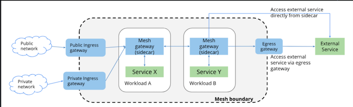

**Ingress Gateway**  +  **Ingress Gateway**

Gateway也可以看作**网格的负载均衡器**， 提供以下功能:

* 1) **L4-L6的负载均衡**
* 2) **对外的`mTLS`**

**`Istio`服务网格中，`Gateway`可以部署任意多个，可以共用一个， 也可以每个租户、`namespace`单独隔离。**

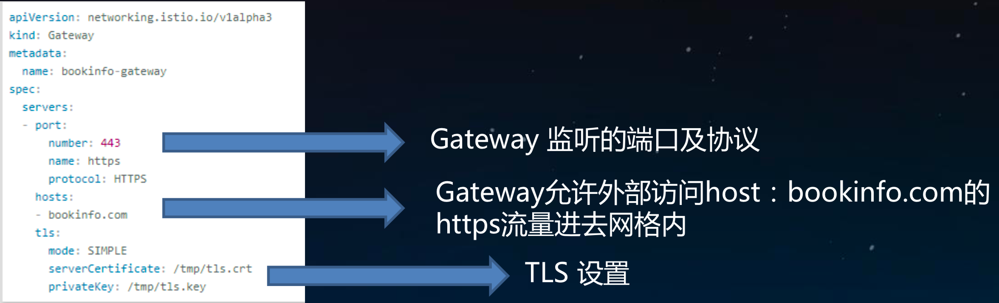

* **Port: number: 443**  => Gateway 监听的端口及协议
* **hosts: bookinfo.com** => `Gateway`允许外部访问`host:bookinfo.com`的 `https`流量进去网格内
* **tls**  => TLS 设置

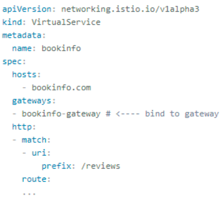

**`VirtualService`定义`Gateway L7`路由， 为访问 `bookinfo.com`的`https`流量，提供路由匹配转发策略**


#### Gateway根据流入流出方向分为`ingress gateway`和`egress gateway`

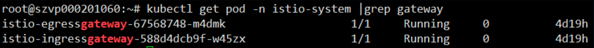

**Ingress gateway:**

控制外部服务访问网格内服务，配合`VirtualService`

**Egress gateway:**

控制网格内服务访问外部服务, 配合`DestinationRule` `ServiceEntry`使用


## Gateway vs Kubernetes Ingress

**`Kubernetes Ingress`集群边缘负载均衡， 提供集群内部服务的访问入口，仅支持L7负载均衡，功能单一**

#### `Istio 1.0`以前，

利用`Kubernetes Ingress`实现网格内服务暴露。 但是`Ingress`无法实现很多功能:

* `L4-L6`负载均衡 
* 对外`mTLS`
* `SNI`的支持
* 其他`istio`中已经实现的内部网络功能: `Fault Injection`， `Traffic Shifting`，`Circuit Breaking`， `Mirroring`

#### 为了解决这些这些问题，Istio在1.0版本设计了新的`v1alpha3 API`。

* `Gateway`允许管理员指定`L4-L6`的设置:**端口及TLS设置**。
* 对于`ingress` 的`L7`设置，`Istio`允许将`VirtualService`与`Gateway`绑定起来。
* 分离的好处:用户可以像使用传统的负载均衡设备一样管理进入网格内部的流量，绑定虚拟`IP`到虚拟服务器上 。便于传统技术用户无缝迁移到微服务。


## Gateway原理及实现

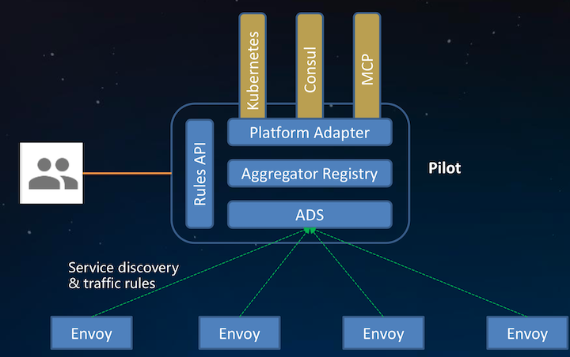

 

**`Gateway` 与 普通`sidecar`均是使用`Envoy`作为`proxy`实行流量控制。**

* `Pilot`为不同类型的`proxy`生成相应的配置
* `Gateway`的类型为`router`
* `sidecar`的类型为`sidecar`

### Ingress Gateway 启动参数:

```
$ kubectl -n istio-system exec -ti istio-ingrssgateway-*** sh
```

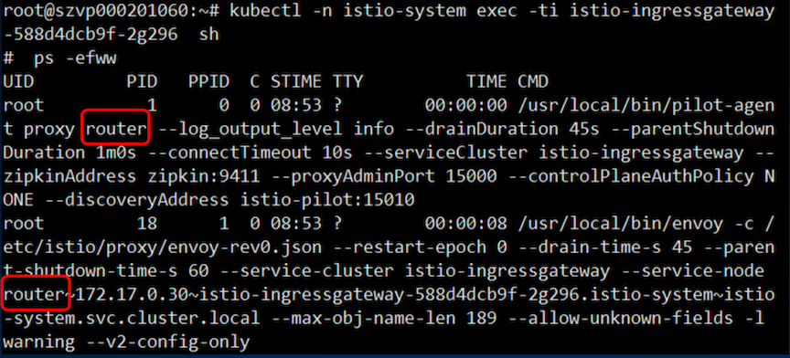


### Sidecar启动参数:

```
$ kubectl -n istio-system exec -ti istio-proxy-*** sh
```

```
$ ps -efww
```

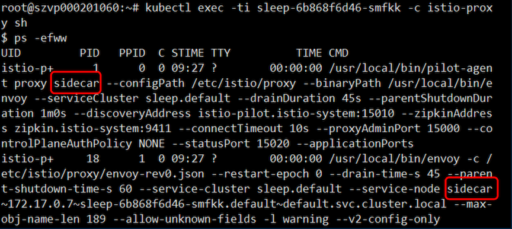


### Pilot如何得知proxy类型?

`Envoy`发现服务使用的是`xDS`协议，`Envoy`向`server`端`pilot`发起请求 `DiscoveryRequest` 时会携带自身信息`node`，`node`有一个`ID`标识， `pilot`会解析`node`标识获取`proxy`类型。

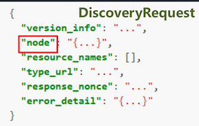 `ANd`  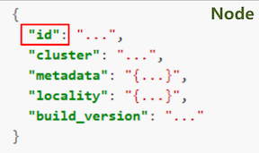

**`Envoy`的节点标识可以通过静态配置文件指定，也可以通过启动参数 `--service-node`指定**

`Gateway`对象在`Istio`中是用`CRD(CustomResourceDefinition)`声明的，可通过

```
$ kubectl get crd gateways.networking.istio.io 验证
```
```
$ kubectl get crd gateways.networking.istio.io -oyaml
```

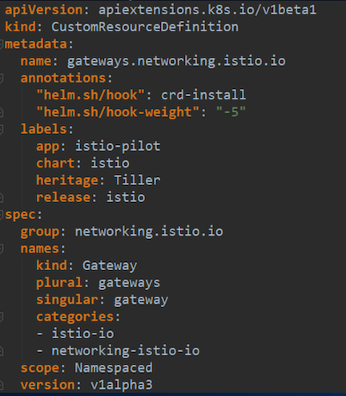

`Istio networking`所有配置`API`定义:

[https://github.com/istio/api/tree/master/networking/v1alpha3](https://github.com/istio/api/tree/master/networking/v1alpha3)

```
type Gateway struct {
	// REQUIRED: A list of server specifications.
	Servers []*Server `protobuf:"bytes,1,rep,name=servers" json:"servers,omitempty"` // REQUIRED: One or more labels that indicate a specific set of pods/VMs
	// on which this gateway configuration should be applied.
	// The scope of label search is platform dependent.
	// On Kubernetes, for example, the scope includes pods running in
	// all reachable namespaces.
	Selector map[string]string `protobuf:"bytes,2,rep,name=selector"
json:"selector,omitempty" protobuf_key:"bytes,1,opt,name=key,proto3"
protobuf_val:"bytes,2,opt,name=value,proto3"`
}
```

* `Servers []...`: 定义虚拟服务器端口协议，`TLS`设置等
* `Selector map[string]`: 标签匹配,`k8s`中所有 `namespace`的`pod`都会进行匹配

```
type Server struct {
	// REQUIRED: The Port on which the proxy should listen for incoming
	// connections
	Port *Port `protobuf:"bytes,1,opt,name=port" json:"port,omitempty"`
	// REQUIRED. A list of hosts exposed by this gateway. At least one
	// host is required. While typically applicable to
	// HTTP services, it can also be used for TCP services using TLS with
	// SNI. May contain a wildcard prefix for the bottom-level component of
	// a domain name. For example `*.foo.com` matches `bar.foo.com`
	// and `*.com` matches `bar.foo.com`, `example.com`, and so on.
	//
	// **Note**: A `VirtualService` that is bound to a gateway must have one
	// or more hosts that match the hosts specified in a server. The match
	// could be an exact match or a suffix match with the server's hosts. For
	// example, if the server's hosts specifies "*.example.com",
	// VirtualServices with hosts dev.example.com, prod.example.com will
	// match. However, VirtualServices with hosts example.com or
	// newexample.com will not match.
	Hosts []string `protobuf:"bytes,2,rep,name=hosts" json:"hosts,omitempty"`
	// Set of TLS related options that govern the server's behavior. Use
	// these options to control if all http requests should be redirected to
	// https, and the TLS modes to use.
	Tls *Server_TLSOptions `protobuf:"bytes,3,opt,name=tls" json:"tls,omitempty"`
}
```
```
type VirtualService struct {
   Hosts []string `protobuf:"bytes,1,rep,name=hosts" json:"hosts,omitempty"`
	Gateways []string `protobuf:"bytes,2,rep,name=gateways" json:"gateways,omitempty"` 	// An ordered list of route rules for HTTP traffic. HTTP routes will be
	// applied to platform service ports named 'http-*'/'http2-*'/'grpc-*', gateway // ports with protocol HTTP/HTTP2/GRPC/ TLS-terminated-HTTPS and service
	// entry ports using HTTP/HTTP2/GRPC protocols. The first rule matching
	// an incoming request is used.
	Http []*HTTPRoute `protobuf:"bytes,3,rep,name=http" json:"http,omitempty"`
	Tls []*TLSRoute `protobuf:"bytes,5,rep,name=tls"json:"tls,omitempty"`
	Tcp []*TCPRoute `protobuf:"bytes,4,rep,name=tcp" json:"tcp,omitempty"` 
   ConfigScope ConfigScope
}
```
* `Hosts []`: 域名，根据平台的不通可以不是`FQDN`
* `Gateways`: Gateway选择
* `Http []`: HTTP路由
* `Tcp []`: TCP路由
* `ConfigScope`: 规则作用域， `namespaced/meshscoped`

```
// Describes match conditions and actions for routing HTTP/1.1, HTTP2, and 
// gRPC traffic. See VirtualService for usage examples.
type HTTPRoute struct {
	Match []*HTTPMatchRequest `protobuf:"bytes,1,rep,name=match" json:"match,omitempty"` 
	Route []*HTTPRouteDestination `protobuf:"bytes,2,rep,name=route" json:"route,omitempty"` Redirect *HTTPRedirect `protobuf:"bytes,3,opt,name=redirect" json:"redirect,omitempty"` Rewrite *HTTPRewrite `protobuf:"bytes,4,opt,name=rewrite" json:"rewrite,omitempty"`
	   // Timeout for HTTP requests.
	Timeout *google_protobuf.Duration `protobuf:"bytes,6,opt,name=timeout" json:"timeout,omitempty"` // Retry policy for HTTP requests.
	Retries *HTTPRetry `protobuf:"bytes,7,opt,name=retries" json:"retries,omitempty"`
	   Fault *HTTPFaultInjection `protobuf:"bytes,8,opt,name=fault" json:"fault,omitempty"`
	Mirror *Destination `protobuf:"bytes,9,opt,name=mirror" json:"mirror,omitempty"`
	...
}
```

**`Redirect`: 路由规则**

### Gateway配置下发:

遵循 `make-before-break` 原则，杜绝规则更新过程中出现`503`


**`router`类型与`sidecar`类型的`proxy`最本质的区别是没有 `inbound cluster`，`endpoint`， `listener`**

#### 这也从侧面证明`Gateway`不是流量的终点只是充当一个代理转发。

### Gateway demo演示

* 控制`Ingress HTTP`流量
* 利用`HTTPS`保护后端服务 
* `mTLS`
* 控制`egress`流量

### 理解外部请求如何到达应用

* `Client`发起请求到特定端口
* `Load Balancer` 监听在这个端口，并转发到后端
* 在`Istio`中，LB将请求转发到`IngressGateway` 服务
* `Service`将请求转发到`IngressGateway pod`
* `Pod` 获取`Gateway` 和 `VirtualService`配置，**获取端口、协议、证书，创建监听器**
* `Gateway pod` 根据路由将请求转发到应用`pod`(**不是 `service`**)

### 控制`Ingress HTTP`流量

#### 创建应用

```
$ kubectl apply -f samples/httpbin/httpbin.yaml
```

#### 创建规则

```
$ kubectl apply -f samples/httpbin/httpbin-gateway.yaml
```

访问 `http://139.159.236.125:31380/headers`


#### Cleanup:

```
$ kubectl delete gateway httpbin-gateway
$ kubectl delete virtualservice httpbin
$ kubectl delete -f samples/httpbin/httpbin.yaml
```

### HTTPS termination

#### 生成证书

```
https://istio.io/docs/tasks/traffic-management/secure-ingress/#generate-client-and-
server-certificates-and-keys
```

#### 创建secret:名称一定是`istio-ingressgateway-certs`，否则`mount`不上

```
$ kubectl create -n istio-system secret tls istio-ingressgateway-certs --key httpbin.example.com/3_application/private/httpbin.example.com.key.pem --cert httpbin.example.com/3_application/certs/httpbin.example.com.cert.pem
```

#### 创建应用

```
$ kubectl apply -f samples/httpbin/httpbin.yaml
```

#### 创建路由规则

```
$ kubectl apply -f samples/httpbin/httpbin-gateway-https.yaml
```

#### 通过HTTPS访问

```
$ curl -v -HHost:httpbin.example.com --resolve httpbin.example.com:31390:100.109.176.196 -- cacert httpbin.example.com/2_intermediate/certs/ca-chain.cert.pem https://httpbin.example.com:31390/status/418
```


### mTLS

#### 创建包含`CA`证书的`secret`

```
kubectl create -n istio-system secret generic istio-ingressgateway-ca-certs --from-
file=httpbin.example.com/2_intermediate/certs/ca-chain.cert.pem
```

#### 更新`Gateway TLS setting`

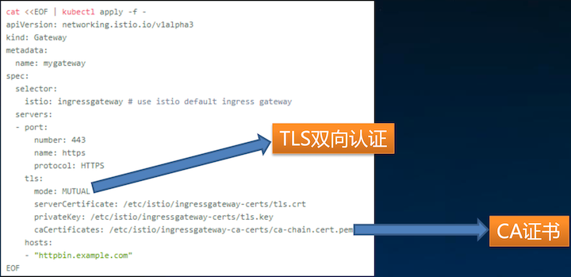


#### 通过HTTPS访问

```
$ curl -v -HHost:httpbin.example.com --resolve httpbin.example.com:31390:139.159.236.125 -- cacert httpbin.example.com/2_intermediate/certs/ca-chain.cert.pem https://httpbin.example.com:31390/status/418
```
```
curl: (35) error:14094410:SSL routines:SSL3_READ_BYTES:sslv3 alert handshake failure
```
```
$ curl -v -HHost:httpbin.example.com --resolve httpbin.example.com:31390:139.159.236.125 --cacert httpbin.example.com/2_intermediate/certs/ca-chain.cert.pem --cert httpbin.example.com/4_client/certs/httpbin.example.com.cert.pem --key httpbin.example.com/4_client/private/httpbin.example.com.key.pem https://httpbin.example.com:31390/status/418
```


**Gateway要验证客户端的证书，所以必须携带证书才能访问**


### Istio访问外部服务

Istio网格内默认不能访问外部服务，如果需要访问外部服务有三种方式:

#### Istio安装时设置:

```
--set global.proxy.includeIPRanges="10.0.0.1/24"
```

#### 创建应用时指定pod annotation

```
traffic.sidecar.istio.io/includeOutboundIPRanges: "127.0.0.1/24,10.96.0.1/24“
```

#### 创建`ServiceEntry`

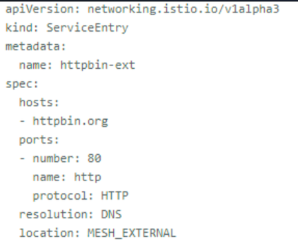

允许集群内访问外部服务 `http://httpbin.org:80`

### 通过`egress gateway`控制访问外部服务

访问: `https://edition.cnn.com/politics`


* 1) 创建`ServiceEntry`，允许访问`edtion.cnn.com` 
* 2) 创建 `Gateway`，指定`egress gateway`监听端口
* 3) 创建`VirtualService`，指定**路由规则**，
   *  网格内普通应用访问`edtion.cnn.com:443`，全部 转发到`egress-gateway`， `egress-gateway`透明转发
* 4) 创建`DestinationRule`，指定`subset`

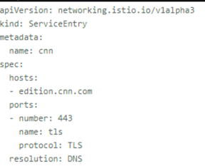  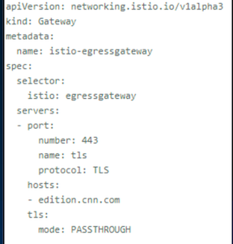

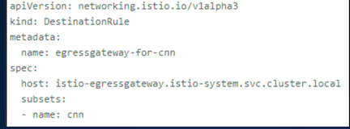
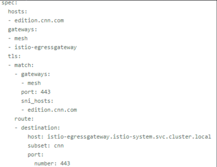
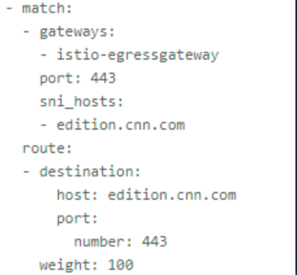


