# Istio 灰度发布与技术实现

## 大纲

* 典型发布类型对比
* Istio流量治理技术解析
* 智能灰度发布介绍
* 灰度发布功能展示Demo

## 发布类型

* 蓝绿发布
* 灰度发布(金丝雀发布) 
* A/B Test

### 蓝绿发布

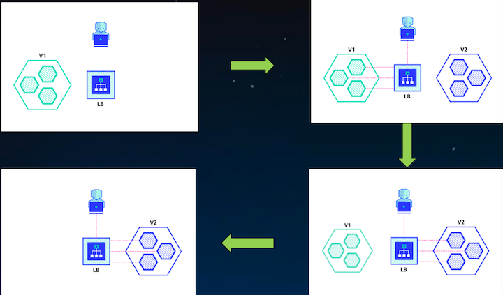

1. **Green * 3 => ELB**
2. **Blue * 3 CREATED**
3. **Blue * 3 => ELB**
4. **Green * 3 Deleted**

### 金丝雀发布

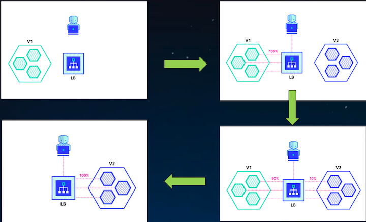

1. **Green * 3 * 100% => ELB**
2. **Blue * 3 CREATED**
3. **Green * 3 * 90% +  Blue * 3 * 10% => ELB**
4. **Blue * 3 * 100% => ELB**


### A/B Test

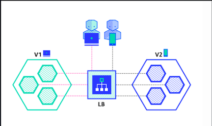

1. **V1 * 3 + V2 * 3 => ELB**

* **配置策略**
* **监控指标**
* **分析数据**
* **作出决策**
* **执行决策**

**`A/B Test`主要对特定用户采样后，对收集到的反馈数据做相关对比，然后根据比对结果作出决策。**

用来测试应用功能表现的方法，侧重应用的**可用性，受欢迎程度**等。


## Istio 流量管理

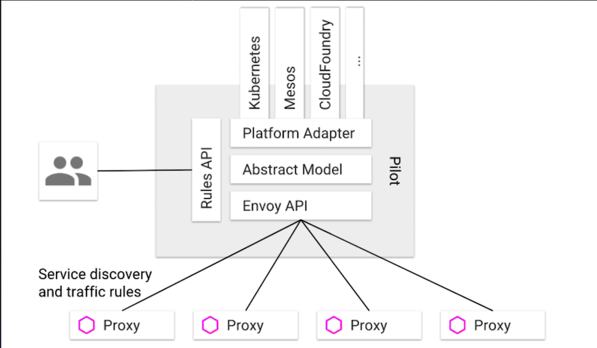

### 配置规则 👍

* `VirtualService` 在 Istio 服务网格中**定义路由规则**，**控制路由如何路由到服务上**。
* `DestinationRule` 是 `VirtualService` **路由生效后，配置应用与请求的策略集**。
* `ServiceEntry` 是通常用于在 Istio **服务网格之外启用对服务的请求**。
*  `Gateway` 为 `HTTP/TCP` **流量配置负载均衡器**，最常见的是在**网格的边缘的操作**，以**启用应用程序的入口流量**。

### DestinationRule

```
apiVersion: networking.istio.io/v1alpha3 
kind: DestinationRule
metadata:
 name: bookinfo-ratings 
spec:
 host: ratings.prod.svc.cluster.local 
 trafficPolicy:
  loadBalancer: 
   simple: RANDOM
 subsets:
 - name: v3
 labels: 
  version: v3
 trafficPolicy: 
  loadBalancer:
   simple: ROUND_ROBIN
```

DestinationRule 所定义的策略，**决定了经过路由处理之后的流量的访问策略**。

* host —— **目标服务的名称**
* trafficPolicy —— **流量策略(负载均衡配置、连接池配置和熔断配置)**。 
* subsets —— **一个或多个服务版本**
 
### Virtualservice

```
apiVersion: networking.istio.io/v1alpha3 
kind: VirtualService
metadata:
 name: myapp-route 
 spec:
  gateways: 
  - mesh 
  hosts:
  - myapp 
  http:
  - match:
   - port: 3711 
   route:
   - destination:
      host: myapp 
      port:
       number: 8080 
      subset: v1
tcp:
- match:
 - port: 3721 
 route:
 - destination:
    host: myapp 
    port:
     number: 8009
```

`VirtualService` 定义了一系列针对**指定服务的流量路由规则**。

* `hosts` —— **流量的目标主机**
* `gateways` —— **Gateway名称列表**
* `http` —— `HTTP` 流量规则(`HTTPRoute`)的列表
* `tcp` —— `tcp`流量规则(`TCPRoute`)的列表
* `tls` —— `tls`和`https`(TLSRoute)流量规则的列表


```
HTTPRoute 
HttpMatchRequest(uri,headers,port,method......) 
DestinationWeight(destination，weight) 
Redirect
Rewrite
Timeout
Retries
......
```
```
TCPRoute 
L4MatchAttributes(destinationSubnets,port......) 
DestinationWeight(destination，weight)
```

### 基于权重的路由

```
apiVersion: ...
kind: VirtualService 
metadata:
 name: vs-svcb 
spec:
 hosts: 
 - svcb 
 http:
  route:
  - destination:
     name: v1 
    weight: 20
  - destination: 
     name: v2 
    weight: 80
```

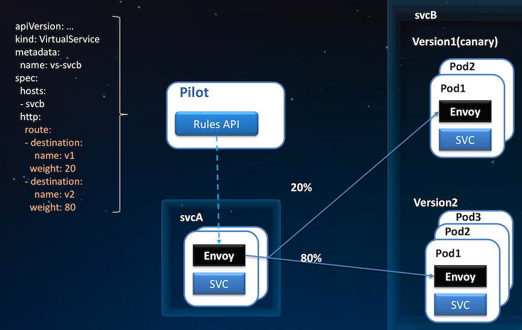

### 基于请求内容的路由

```
apiVersion: ...
kind: VirtualService 
metadata:
 name: ratings-route 
spec:
 hosts:
 - svcb 
 http:
 - match:
  - headers: cookie:
     exact: “group=dev” 
  route:
  - destination: 
     name: v1
 - route:
  - destination:
     name: v2
```

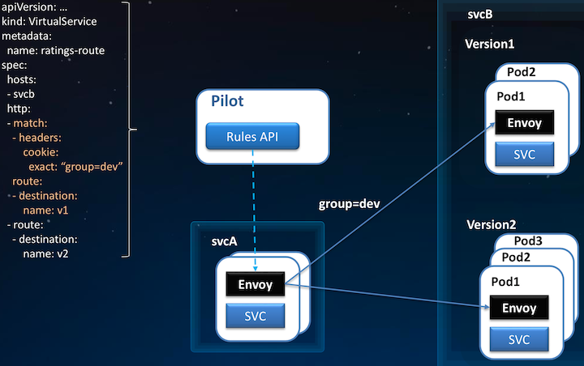


### 复杂灰度场景下的VirtualService

```
apiVersion: networking.istio.io/v1alpha3 
kind: VirtualService
metadata:
 name: helloworld 
spec:
 hosts:
  - helloworld
 http:
  - match:
  - headers: 
     cookie:
      regex: "^(.*?;)?(email=[^;]*@some-company-name.com)(;.*)?$"
  route:
   - destination:
      host: helloworld
      subset: v1 
     weight: 50
   - destination: 
      host: helloworld 
       subset: v2
     weight: 50
  - route:
   - destination:
      host: helloworld 
      subset: v1
```

### 灰度版本存在形式

```
kind: Deployment 
metadata:
 name: rating-v1 
spec:
 replicas: 2 
 template:
  metadata: 
   labels:
    app: rating
    version: v1
   spec:
    containers:
    - image: rating-v1
    ...
```

```
kind: Deployment 
metadata:
 name: rating-v2 
spec:
 replicas: 3 
template:
 metadata: 
  labels:
   app: rating
   version: v2
 spec:
  containers:
  - image: rating-v2
...
```

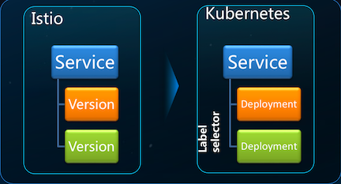

### 灰度发布流程

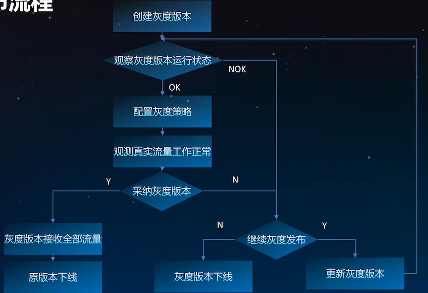

## 智能灰度发布

**目标:细粒度控制的自动化的持续交付**

### 特点:

* 用户细分
* 流量管理
* 关键指标可观测
* 发布流程自动化

### 智能灰度发布

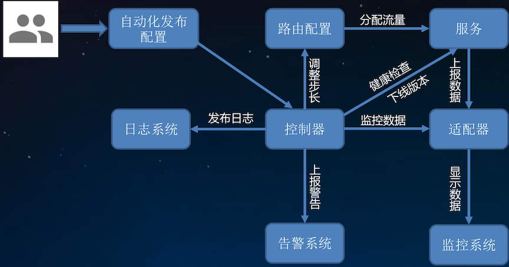

### 自适应灰度发布参数

* 负载健康状态
* 请求成功率
* 平均请求时延
* 流量权重步长
* 回滚门限值

### 监控指标

#### RED

* (Request) **Rate** - the number of requests, per second, your services are serving.
* (Request) **Errors** - the number of failed requests per second.
* (Request) **Duration** - The amount of time each request takes expressed as a time interval

#### USE(utilization，saturation，errors)

* **CPUs**: sockets, cores, hardware threads (virtual CPUs)
* **Memory**: capacity
* **Network interfaces**
* **Storage devices**: I/O, capacity
* **Controllers**: storage, network cards
* **Interconnects**: CPUs, memory, I/O

### flagger

Flagger is a Kubernetes operator that automates the promotion of canary deployments using Istio routing for traffic shifting and Prometheus metrics for canary analysis.

[Details about flagger](https://github.com/Chao-Xi/JacobTechBlog/blob/master/k8s_tutorial/k8s_adv54_release.md#flagger)

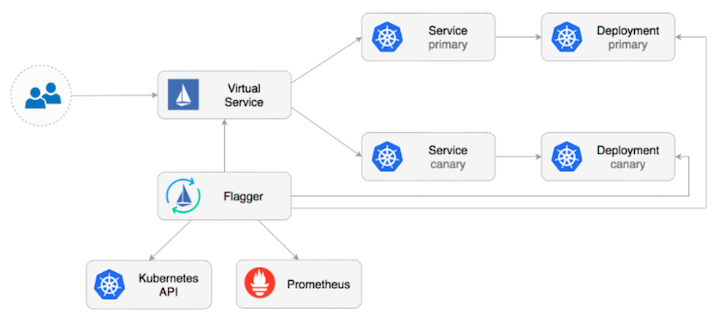

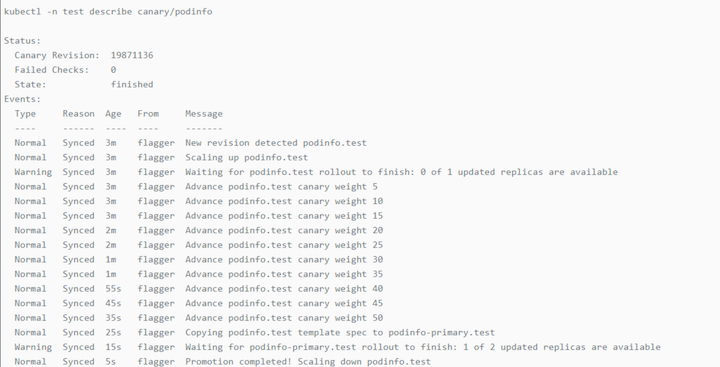

### 相关链接

* [https://github.com/stefanprodan/flagger](https://github.com/stefanprodan/flagger)
* [https://github.com/magneticio/vamp2setup/blob/master/BASIC_TUTORIAL.md](https://github.com/stefanprodan/flagger) 
* [https://github.com/intuit/wasabi](https://github.com/intuit/wasabi)


