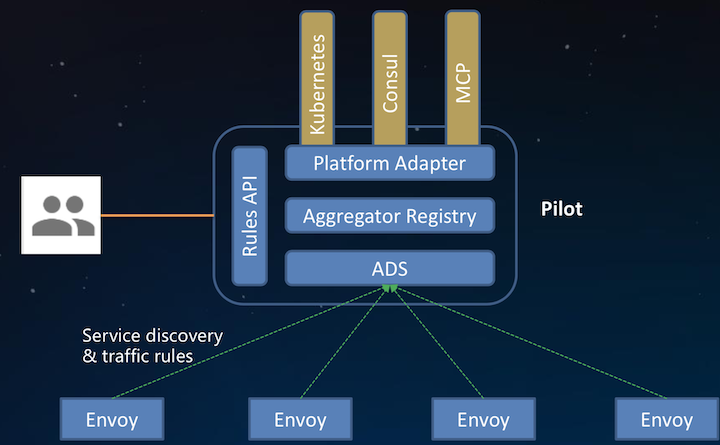
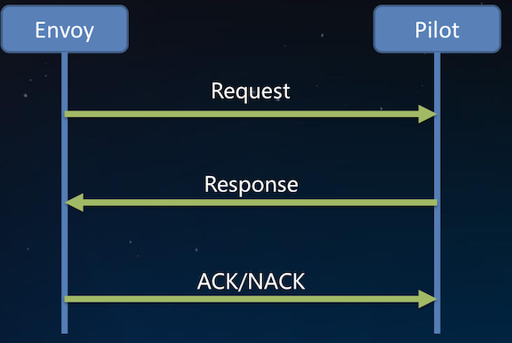
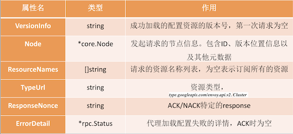
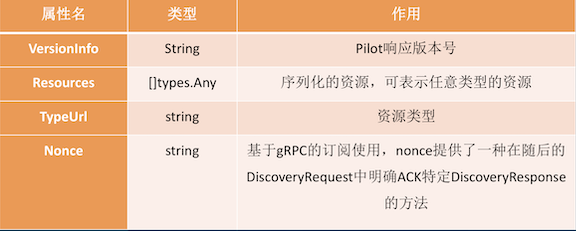
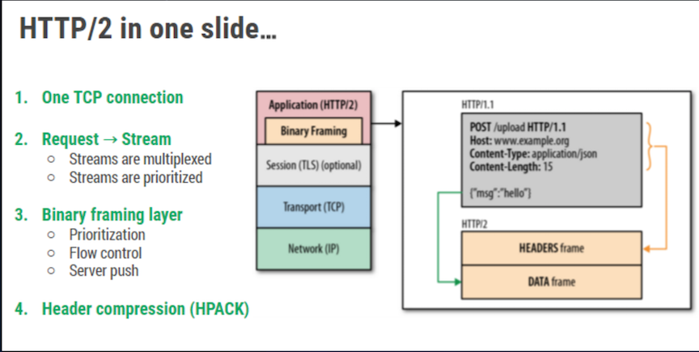
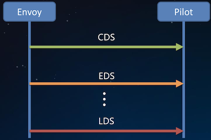
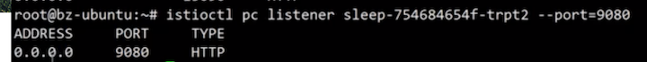
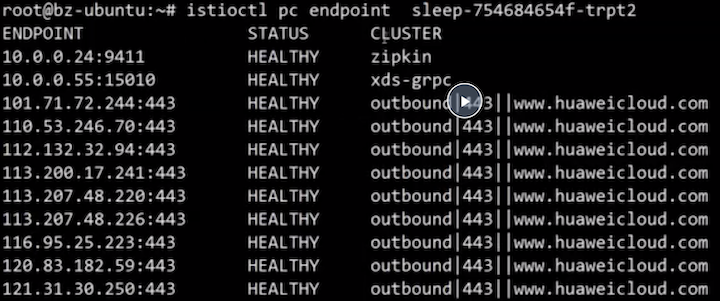

# xDS协议解析

### 目录

* xDS基本概念 
* xDS协议分析 
* ADS理解
* xDS的未来

### Istio 发现模型



## xDS是什么

`xDS`是一类发现服务的总称，包含`LDS`，`RDS`，`CDS`，`EDS`以及 `SDS`。

`Envoy`通过`xDS API`可以动态获取`Listener(监听器)`， `Route(路由)`，`Cluster(集群)`，`Endpoint(集群成员)`以及`Secret(证书)`配置。

### LDS (listener)

`Listener` 发现服务。**`Listener`监听器控制`Envoy`启动端口监听 (目前只支持TCP协议)，并配置`L3/L4`层过滤器，当网络连接达到后，配置好的网络过滤器堆栈开始处理后续事件**。

这种通用的监听器体系结构用于执行大多数不同的代理任务(限流，客户端认证，HTTP连接管理，TCP代理等)。

### RDS (Route)

**`Route`发现服务，用于`HTTP`连接管理过滤器动态获取路由配置。**

路由配置包含`HTTP`头部修改(增加、删除HTTP头部键值)， `virtual host`s (虚拟主机)，以及`virtual hosts` 定义的各个路由条目。

### CDS (cluster)

**`Cluster`发现服务，用于动态获取`Cluster`信息。**

`Envoy cluster` 管理器管理着所有的上游`cluster`。鉴于上游`cluster`或者主机可用于任何代理转发任务，所以上游`cluster`一般从`Listener`或`Route`中抽象出来。

### EDS (Endpoint)

`Endpoint`发现服务。在`Envoy`术语中，`Cluster`成员就叫 `Endpoint`，对于每个`Cluster`，`Envoy`通过`EDS API`动态获取 `Endpoint`。

`EDS`作为首选的服务发现的原因有两点:

* 与通过`DNS`解析的负载均衡器进行路由相比，`Envoy`能明确的知道每个上游主机的信息，因而可以做出更加智能的负载 均衡决策。
* `Endpoint`配置包含负载均衡权重、可用域等附加主机属性， 这些属性可用域服务网格负载均衡，统计收集等过程中

### SDS (Secret)

**`Secret`发现服务，用于运行时动态获取`TLS`证书。**

**若没有`SDS`特性，在`k8s`环境中，必须创建包含证书的`Secret`，代理启动前 `Secret`必须挂载到`sidecar`容器中，如果证书过期，则需要重新部署。**

**使用`SDS`，集中式的`SDS` 服务器将证书分发给所有的 `Envoy`实例，如果证书过期，服务器会将新的证书分发，`Envoy `接收到新的证书后重新加载儿不用重新部署。**


### 标准xDS流程



## xDS协议

`xDS`协议是`Envoy`**获取配置信息的传输协议**，**也是`Istio`与`Envoy` 连接的桥梁。**

`Envoy`动态的发现服务以及相关资源的`API`就是指`xDS`。

`xDS`可以通过两种方式承载:`gRPC`(new)、`REST`，**这两种方式都是通过 `xDS-API`发送`DiscoveryRequest`请求，然后资源通过 `DiscoveryResponse`下发**。

### DiscoveryRequest



### DiscoveryResponse




## What is ADS

`ADS`是一种`xDS`的实现, 它基于`gRPC`长连接。`gRPC`的实现是承载在`HTTP/2`之上。



### Why ADS

Istio 0.8以前，Pilot提供的的单一资源的DS



* **每种资源需要一条单独的连接**
* **Istio高可用环境下，可能部署多个`Pilot`**

#### 带来的挑战:

* 没办法保证配置资源更新的顺序
* 多`Pilot`配置资源的一致性没法保证

综合以上两个问题，很容易出现配置更新过程中网络流量丢失带来网络错误(虚假的）

#### ADS允许通过一条连接(`gRPC`的同一stream)，发送多种资源的请求和响应。

* 能够保证请求一定落在同一`Pilot`上，解决多个管理服务器配置不一致的问题
* 通过顺序的配置分发，轻松解决资源更新顺序的问题

### ADS最终一致性的考量

`xDS` 是一种最终一致的协议，所以在配置更新过程中流量会丢失。

例如,`EDS`还没有来，如果通过`CDS/EDS`获得`Cluster X`， 一条指向`Cluster X`的`RouteConfiguration` 刚好调整为指向 `Cluster Y`， 但是在`CDS/`及下发`Cluster Y`的配置的条件下，到 `Y`的流量会全部被丢弃，并且返回给客户端状态码`503`。

在某些场景下，流量丢弃是不可接受的。**`Istio`通过遵循`make before break`模型，调整配置更新顺序可以完全避免流量丢失。**


## xDS未来发展

### Istio目前是全量的向sidecar分发配置，由此带来几个问题

* 配置更新频率高，大集群的服务，实例数目多，其中有一个更新后便会触发全量的配置推送到所有的`sidecar`。**带宽占用大，Pilot端cpu利用率高**
* **`Sidecar`占用内存多，随着集群规模增大，配置资源呈指数级增长，极大的限制了服务网格的规模**
* 频繁的配置加载影响`sidecar`性能稳定性

### xDS未来发展

1. **`sidecar`按需请求资源，懒加载的方式，当真正的需要流量转发的时候， 再去获取路由等配置**
2. 定义`workload`的服务依赖，例如工作负载A可以访问`ns1/serviceB`
3. 定义配置规则、`Service`的`NetworkScope`，例如服务A只能被同一 `Namesapce`的`workload`访问。

### 增量xDS

`Incremental xDS`是一个独立的`xDS endpoint`，是一种 `runtime`的动态配置获取方案，用于增量的更新xDS客户端订阅的资源，适用于`ADS`，`CDS`和`RDS`:

* 保证`Envoy`按需/懒请求所需要的资源。例如当流量路由到未知的`cluster`时，Envoy就会请求获取未知的cluster信息。
* 支持大规模可扩展的目标。例如在一个有`100K`个服务实例 集群中，如果一个服务实例有更新，管理服务器只需要下发一个`Cluster`的信息。

## Demo

```
$ kubectl get svc
```

```
$ istioctl pc listener ***
```


```
$ istioctl pc listener *** --port=9080
```


```
$ istioctl pc endpoint ***
```
