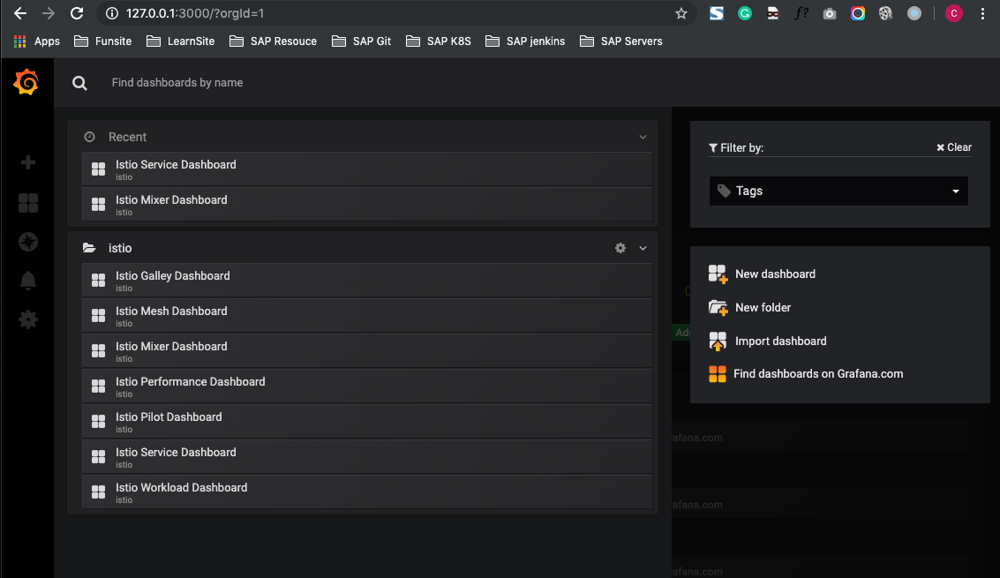
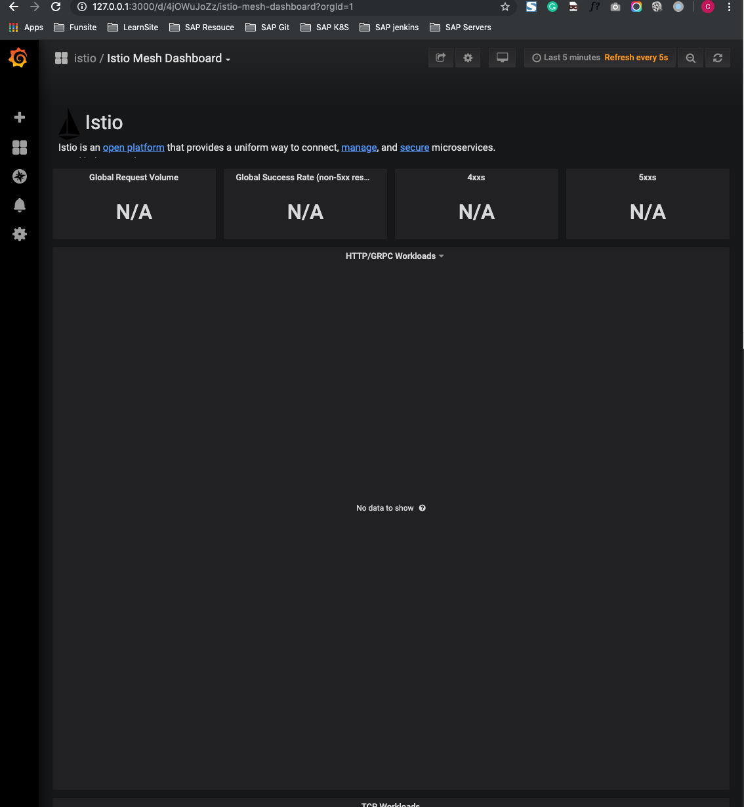
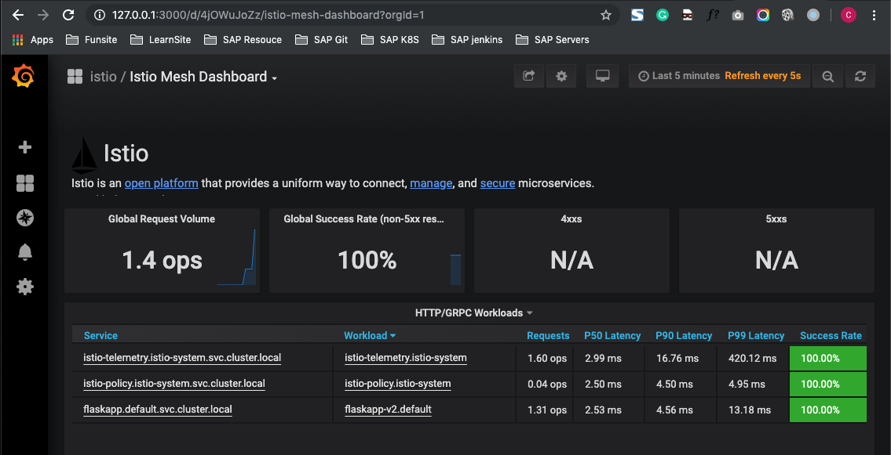
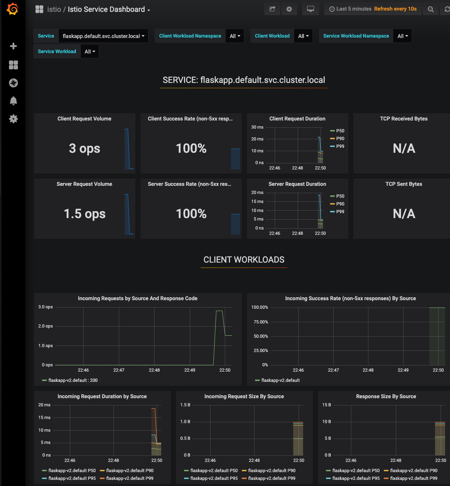
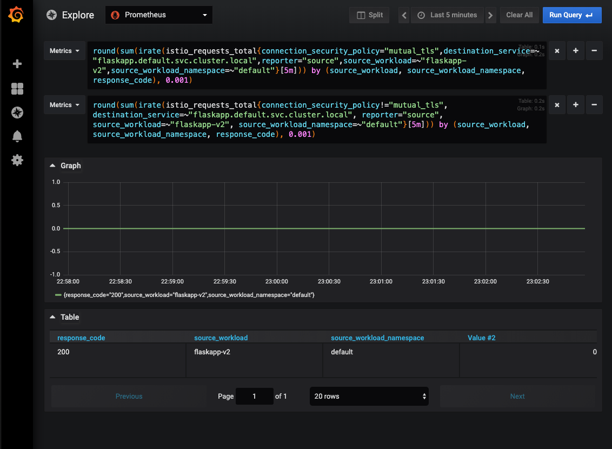
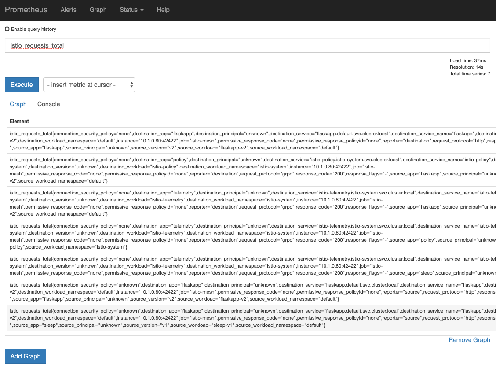
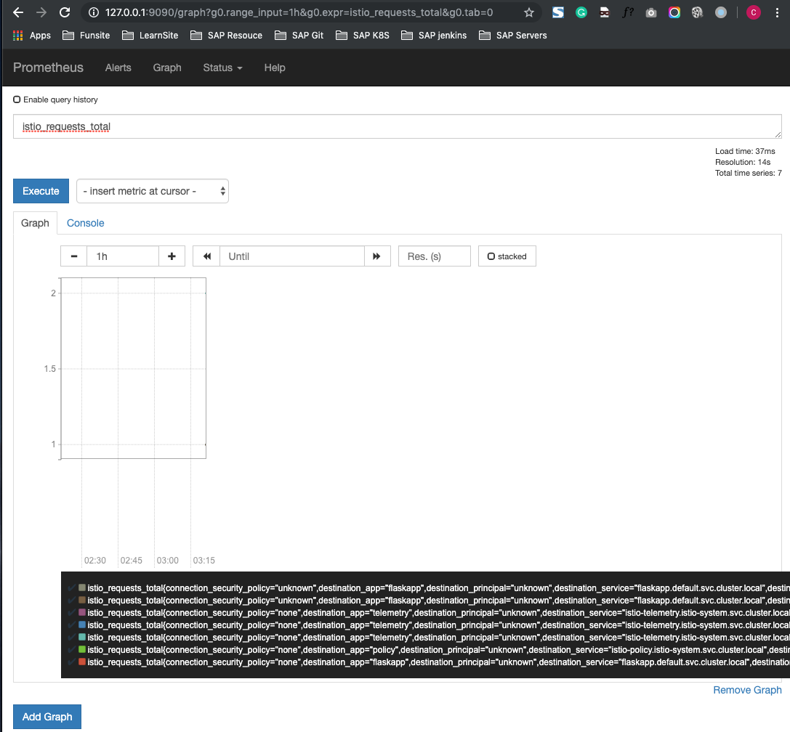

# 6. 使用 Istio Dashboard Grafana / Prometheus

## 1.使用`Istio Dashboard`

`Istio`为服务网格提供了丰富的观察能力

`Istio Dashboard`是一个包含`Istio`定制模板的`Grafana(https://grafanacom/)。` 

`Grafana`是一个通用的`Dashboard`源软件，支持`Elasticsearch`,`Zabbix`、 `Prometheus`, `InfluxDB`等多种数据源，并提供了条形图、饼图、表格、折线图等丰富的可视化组件，对其中的数据源和可视化组件都可以进行二次开发，用户可以将数据源和可视化组件结合起来定制自己的`Dashboard` 

### 1.1启用`Grafana` 

`Istio`在默认清况下是没有启用`Grafana`的，

```
$ helm template istio \
 --name istio --set grafana.enabled=true \ 
 --namespace istio-system > default-grafana.yaml 
 
$ kubectl apply -f default-grafana.yaml 
...
configmap/istio-grafana-custom-resources created 
configmap/istio-grafana-configuration-dashboards 
created configmap/istio-grafana created 
configmap/istio-statsd-prom-bridge unchanged
...
```

### 1.2 访问Grafana 

在创建成功之后，可以使用`kubectl port-forward`指令对`Grafana pod`进行端口转发， 这样就可以在不对外网开放服务的情况下使用`Grafana `

```
$ kubectl -n istio-system get pod -l app=grafana -o jsonpath='{.items[0].metadata.name}'

$ kubectl -n istio-system port-forward grafana-86f89dbd84-v7rrn 3000:3000
Forwarding from 127.0.0.1:3000 -> 3000
Forwarding from [::1]:3000 -> 3000 
```

接下来可以使用浏览器打开`http://localhost:3000/`，单击左上角的`Home`链接，在出现的页面中单击`Istio`文件夹，会列出`Istio`的内置`Dashboard`，



单击`Istio Mesh Dashboard`



因为没有产生任何流量，所以这里所有的数据都是空的，我们进入 `sleep` pod 去产生一些流量

```
$ kubectl get pod -l app=sleep,version=v1 -o custom-columns='
Name:metadata.name'
Name
sleep-v1-548d87cc5c-fg9ng
```

```
$ kubectl exec -it -c sleep sleep-v1-548d87cc5c-fg9ng bash
```

```
bash-4.4# for i in 'seq 100';do http --body http://flaskapp/fetch?url=http://flaskapp/env/version >> /dev/null;done
```



###  1.3 开放`Grafana`服务 
`kubectl`的端口转发方式是很不稳定的长期使用的话，可以考虑对`Grafana`服 
务进行定制，例如在`values.yaml`中的`grafana`一节有如下定义 

```
Grafana: 
	enabled: false 
	replicaCount: 1 
	image: 
		repository: grafana/grafana 
		tag: 5.2.3 
	persist: false 
	storageClassName: ""
	security: 
		enabled: false 
		adminUser: admin 
		adminpassword: admin 
	service: 
		annotations: {} 
		name: http 
		type: ClusterIP 
		externalport: 3000 
		internalPort: 3000 
```
我们可以将服务类型修改为`LoadBalancer`,或者为其创建`Ingress`对象，并设置用户名和密码

### 1.4 学习和定制

`Istio`提供为数众多的`Darsboord`模板数据来自`Prometheus`服务。了解这些`Dashboard` 的源码时可以发现很多有用的查询语句, 方便日后建立自己的监控体系, 例如我们可能更加关注的`Istio Server Dashboard`就包含了业务应用的相关信息  




如果我们关心`Incoming Requests by Source And Reponse Code`这个折线图的空现就可以单击这个区域标题右侧的三角符号， 在弹出的菜单中选择`Edit`,会显示一组件的定制内容。




显示的内容表明数据来自名为`Prometheus`的数据源, 两个指标列的公式之也都清楚地展示出来我们可以根据达些内容， 学习各种`Istio`监控指标的用法,公式和展示方法以使定制自己的`Dashboad` 

如果在仍群巾已经安装`Grafana`, 则还可以通过右上角工具栏的第二个按钮(Share Dashboad)获取`Dashboard` 的代码源，将其倒入其他`Grafana`

## 2.使用`Prometheus`

`Prometheus` (`https//Pprometheus.io`）是CNCF中的一个标志性的监控软件目前已经是云原生阵营中监控系统的事实标准。在`Istio`。中已经集成了`Prometheus`将其用作系统的监控组件 

`Grafana`只是一个可视化的前端其数据都来自我们也需要直接到`Prometheus`中进行一些查询 
`Prometheus`来获取一此，来`Dashboard`中没有体现的信息。 

### 访问`Prometheus` 

`Prometheus`服务是默认启用的因此在通常悄况下无须额外操作直接使用端口转发即可访问：

```
$ kubectl -n istio-system get pod -l  app=prometheus -o custom-columns='Name:metadata.name'
Name
prometheus-d44645598-xh8wn

$ kubectl -n istio-system  port-forward prometheus-d44645598-xh8wn 9090:9090
```

然后用浏览器打开`http://localhost:9O9O`会得到`prometheus`的查询界而在其中输人`isito_requests_total`就能排到一系列请求的总数指标值



点击`Graph`




### 开放Prometheus服务 

和`Grafana`一样，`Prometheus`的`Service`也可以通过`values.yaml`定制对服务开放方式。 
