# Mixer基础与实现

### Agenda

* Istio架构回顾&Mixer介绍 
* Mixer的功能和设计
* Mixer的配置模型
* Mixer的典型应用
* Mixer实践1和2

## 回顾:Istio架构

**Istio Control plane API**

* **Pilot**: Config data to proxies
* **Mixer**: Policy checks, telemetry
* **Citadel**: TLS certs to proxies


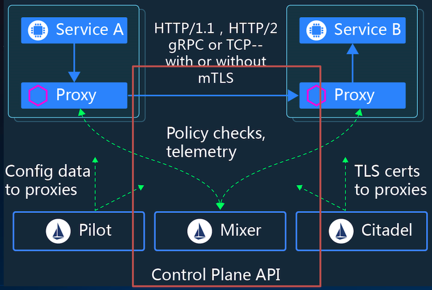


### Istio 官方四大功能中两个基于`Mixer`实现 Control & Observer

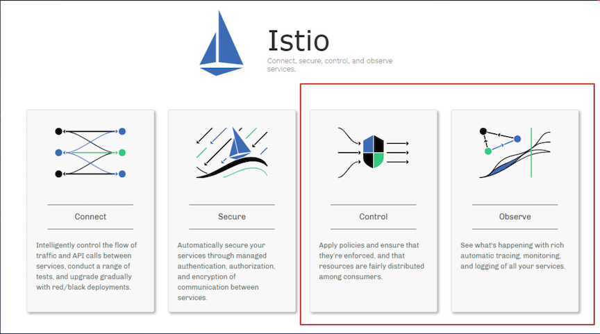

###  Mixer在Istio中角色

* **功能上**:负责策略控制和遥测收集
* **架构上**:提供插件模型，可以扩展和定制

## Mixer的功能和设计

### 没有Mixer的时候 Total Chaos


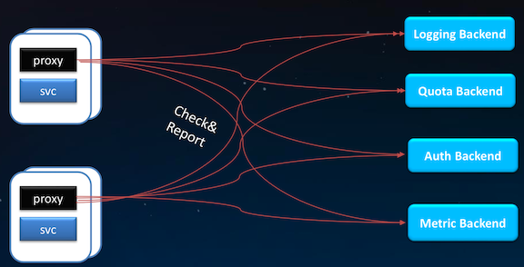

### Mixer的Adapter机制

[https://istio.io/docs/concepts/policies-and-telemetry/](https://istio.io/docs/concepts/policies-and-telemetry/)

Mixer 处理不同基础设施后端的灵活性是通过使用通用插件模型实现的，这种插件称为`Adapter`。

**Mixer 通过它们与不同的基础设施后端连接，这些后端可提供核心功能，提供日志、监控、配额、ACL 检查等**

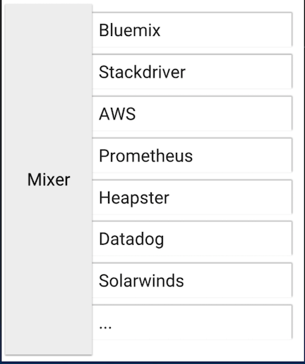

### Mixer完整视图

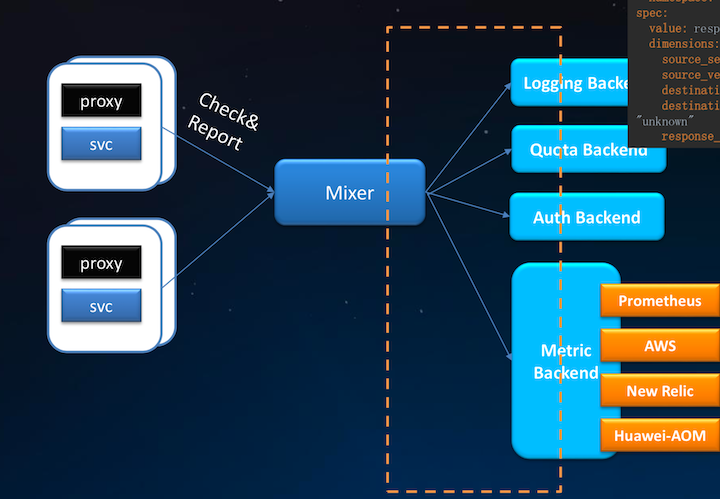

**解耦、中介、运维时配置**

**Mixer:**

* Route to **backend services**
* Route to **backend metric**

**Custom Metrics**

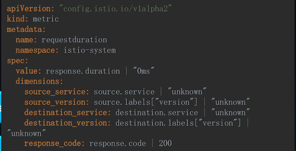


### Mixer的处理流程

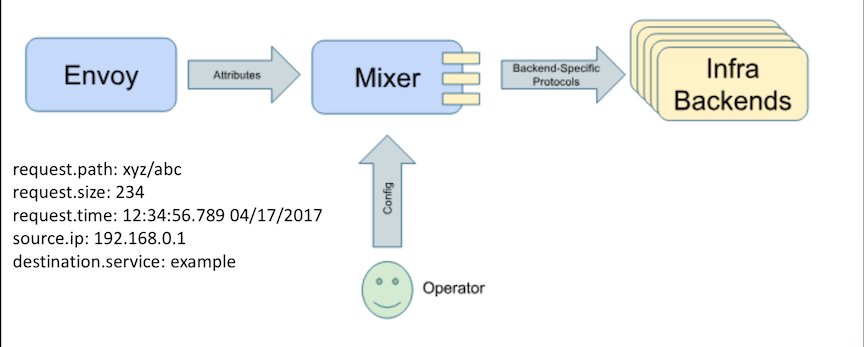

1. **`Envoy`生成属性上报`Mixer`**
2. **`Mixer` 调用对应后端处理属性**

[https://istio.io/docs/reference/config/policy-and-telemetry/attribute-vocabulary/](https://istio.io/docs/reference/config/policy-and-telemetry/attribute-vocabulary/)


### Mixer 配置模型概述

* **`Handler`**: 创建 `Handler`,即配置`Mixer`适配器。
* **`Instance`**: 从 `Istio` 属性中生成 `instance`。
* **`Rule`**: **配置一组规则，这些规则描述了何时调用特定适配器及哪些实例。**

## Mixer的配置模型

### Mixer 配置模型1: `Handler`

**实例化一个`Adapter`，包括了`Mixer`和后端交互的接口。**

```
apiVersion: "config.istio.io/v1alpha2" 
kind: stdio
metadata:
  name: handler
spec:
  outputAsJson: true
```

`Stdio Adapter` 定义参照: `mixer/adapter/stdio/config/config.proto:94`

### Mixer 配置模型2:实例(`Instance`)

```
apiVersion: "config.istio.io/v1alpha2"
kind: logentry
metadata:
name: accesslog
  namespace: {{ .Release.Namespace }}
spec:
  severity: '"Info"'
  timestamp: request.time
  variables:
	sourceIp: source.ip | ip("0.0.0.0")
	sourceApp: source.labels["app"] | ""
	sourcePrincipal: source.principal | ""
	sourceName: source.name | ""
	destinationApp: destination.labels["app"] | "" 
	destinationIp: destination.ip | ip("0.0.0.0") 
	destinationServiceHost: destination.service.host | "" 
	destinationWorkload: destination.workload.name | "" 
	destinationName: destination.name | "" 
	destinationNamespace: destination.namespace | "" 
	protocol: request.scheme | context.protocol | "http" 
	method: request.method | ""
	url: request.path | ""
	responseCode: response.code | 0
	responseSize: response.size | 0
	requestSize: request.size | 0
	requestId: request.headers["x-request-id"] | "" userAgent: request.useragent | "" responseTimestamp: response.time
	...
```
**实例将请求中的属性映射成为适配器的输入，每次请求适配器消费的数据。**

###  Mixer 配置模型3:规则(Rule)

```
apiVersion: "config.istio.io/v1alpha2" 
kind: rule
metadata:
	name: stdio
	namespace: {{ .Release.Namespace }} 
spec:
	match: context.protocol == "http" || context.protocol == "grpc" 
	actions:
	- handler: handler.stdio
	instances:
	- accesslog.logentry
```

**告诉 `Mixer` 哪个 `instance` 在什么时候发送给哪个 `handler`来处理**


### `Request`的属性处理流程

* 接收属性
* 补充属性，
* 处理属性

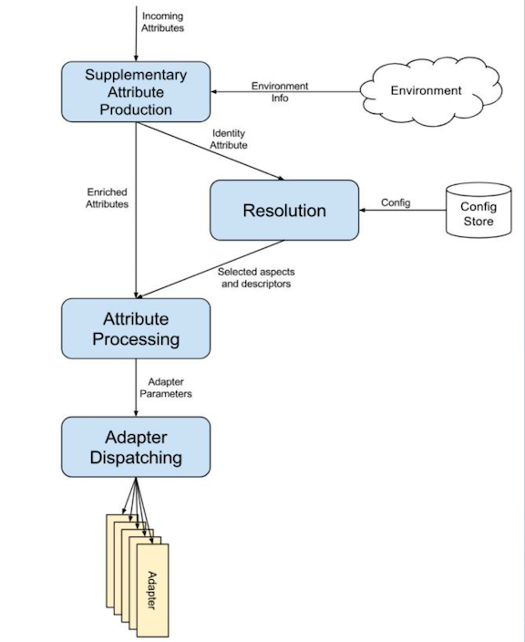


### Mixer Adapters

[https://istio.io/docs/reference/config/policy-and-telemetry/adapters/](https://istio.io/docs/reference/config/policy-and-telemetry/adapters/)

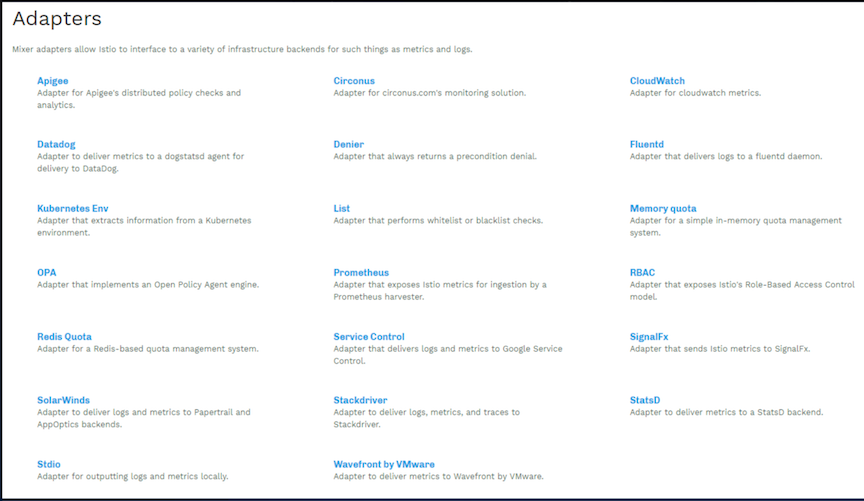

### Mixer 的 Check Adapter

`mixer/adapter/list/list.go`

**Adapter实现**

```
func (h *handler) HandleListEntry(_ context.Context, entry *listentry.Instance) (adapter.CheckResult, error) {
	h.lock.Lock()
	l := h.list
	err := h.lastFetchError
	h.lock.Unlock()

	if l == nil {
		// no valid list
		return adapter.CheckResult{}, err
	}

	var value string
	...
	return getCheckResult(h.config, code, msg), nil
}

```
`https://github.com/istio/istio/blob/master/mixer/adapter/list/config/config.proto`

**Adapter配置定义**

```
// Configuration format for the `list` adapter.
message Params {
    // Where to find the list to check against. This may be omitted for a completely local list.
    string provider_url = 1;
    ...

    // Determines the type of list that the adapter is consulting.
    enum ListEntryType {
        // List entries are treated as plain strings.
        STRINGS = 0;

        // List entries are treated as case-insensitive strings.
        CASE_INSENSITIVE_STRINGS = 1;

        // List entries are treated as IP addresses and ranges.
        IP_ADDRESSES = 2;

        // List entries are treated as re2 regexp. See [here](https://github.com/google/re2/wiki/Syntax) for the supported syntax.
        REGEX = 3;
    }

    // Determines the kind of list entry and overrides.
    ListEntryType entry_type = 7;

    // Whether the list operates as a blacklist or a whitelist.
    bool blacklist = 8;
}
```

### Mixer 的 `Report Adapter`

`https://github.com/istio/istio/tree/master/mixer/adapter/stdio`

**Adapter实现**

```
func (h *handler) HandleLogEntry(_ context.Context, instances []*logentry.Instance) error {
	var errors *multierror.Error

	fields := make([]zapcore.Field, 0, 6)
	for _, instance := range instances {
		entry := zapcore.Entry{
			LoggerName: instance.Name,
			Level:      h.mapSeverityLevel(instance.Severity),
			Time:       instance.Timestamp,
		}

		var logEntryTypes map[string]istio_policy_v1beta1.ValueType
		if typeInfo, found := h.logEntryTypes[instance.Name]; found {
			logEntryTypes = typeInfo.Variables
		}
		for _, varName := range h.logEntryVars[instance.Name] {
			if value, ok := instance.Variables[varName]; ok {
				fields = append(fields, zap.Any(varName, convertValueTypes(value, varName, logEntryTypes)))
			}
		}

		if err := h.write(entry, fields); err != nil {
			errors = multierror.Append(errors, err)
		}
		fields = fields[:0]
	}

	return errors.ErrorOrNil()
}


```

**Adapter配置定义**

`https://github.com/istio/istio/blob/master/mixer/adapter/stdio/config/config.proto`

```
// Configuration format for the `stdio` adapter
message Params {
    // Stream is used to select between different log output sinks.
    enum Stream {
        // Output to the Mixer process' standard output stream. This is the default value.
        STDOUT = 0;

     ...

    // The maximum number of days to retain old rotated log files based on the
    // timestamp encoded in their filename. Note that a day is defined as 24
    // hours and may not exactly correspond to calendar days due to daylight
    // savings, leap seconds, etc. The default is to remove log files
    // older than 30 days. 0 indicates no limit.
    int32 max_days_before_rotation = 8;

    // The maximum number of old rotated log files to retain.  The default
    // is to retain at most 1000 logs. 0 indicates no limit.
    int32 max_rotated_files = 9;
}
```

### Mixer的高可用设计

* 无状态
* 高可以用
* 缓存和缓冲

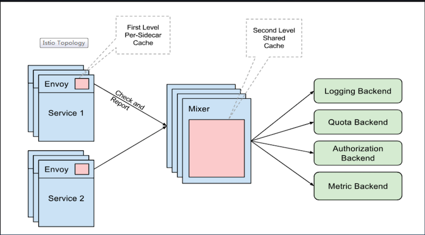

#### Envoy

* First Level: **Per-sidecar cache**

#### Mixer

* Second Level: **Shared Cache**


###  Mixer 的 Batch Report


## Mixer的典型应用

###  Mixer典型应用1: 华为云应用服务网格

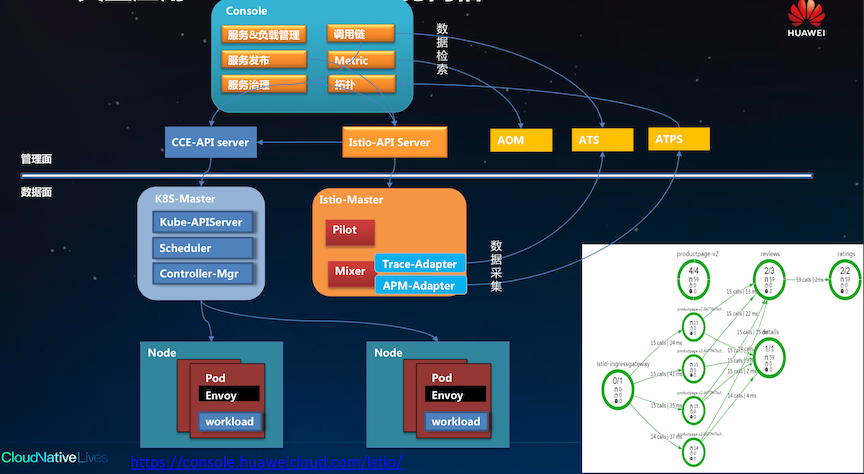

###  Mixer典型应用2: Google Apigee

[https://docs.apigee.com/api-platform/istio-adapter/concepts](https://docs.apigee.com/api-platform/istio-adapter/concepts)

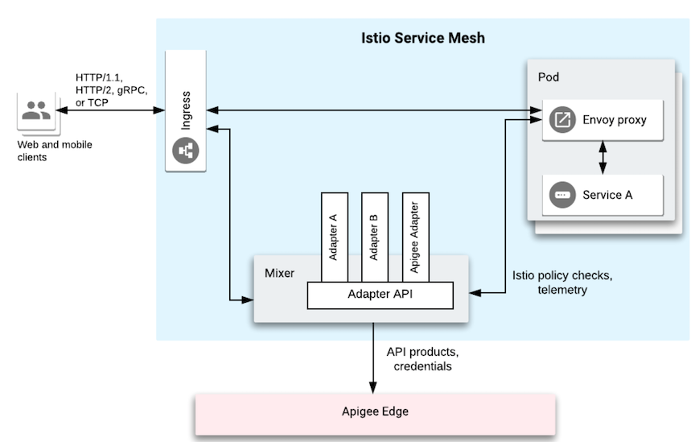

## Mixer实践1和2

## 实践1 从0开发并运行一个`Mixer Adapter`:原理

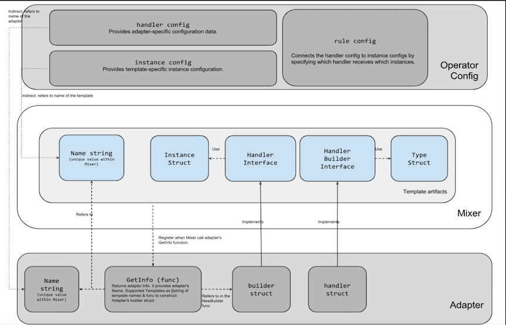

### 两个角色

```
配置模板使用一个 Adapter           =>                    开发代码定义模板开发一个Adapter
```

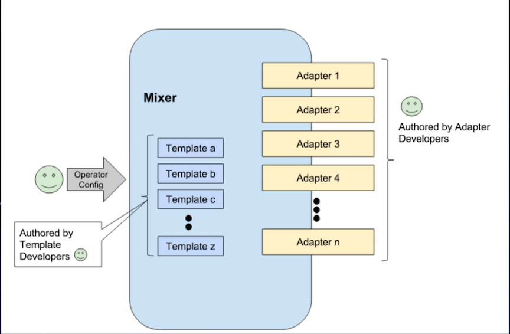


### 实践1 从0开发并运行一个Mixer Adapter:步骤

1.创建独立的Adapter目录，并开发Adapter的代码开发Adapter代码

```
cd $MIXER_REPO/adapter && mkdir mysampleadapter && cd mysampleadapter 
#创建mysampleadapter .go文件定义处理逻辑
```

2.配置`config.proto`，描述配置的定义。

```
#创建config.proto文件，描述adapter的配置参数 
$ mkdir config
```

3.根据`proto`生成go的配置，并在adapter代码中使用 

```
go generate ./...
go build ./...
```

4.在`Mixer`中注册这个新的`Adapter`。

```
# 在inventory.yaml 中注册adapter， mysampleadapter: "istio.io/istio/mixer/adapter/mysampleadapter"
go generate $MIXER_REPO/adapter/doc.go
```

5.配置并使用新创建的`adapter`。 

```
#在testdata目录下创建使用该adapter的配置，即handler，instance，rule。 
$mkdir $MIXER_REPO/adapter/mysampleadapter/testdata 
#确认两个文件attributes.yaml和mysampleadapter.yaml
```

6.启动`mixer` 服务端

```
pushd $ISTIO/istio && make mixs
$GOPATH/out/linux_amd64/release/mixs server --configStoreURL=fs://$(pwd)/mixer/adapter/mysampleadapter/testdata
```

7.启动一个客户端，模拟上报数据

```
pushd $ISTIO/istio && make mixc
$GOPATH/out/linux_amd64/release/mixc report -s destination.service="svc.cluster.local" -t request.time="2019-01-10T20:00:00Z"
```

8.查看结果输出

```
tail $ISTIO/istio/out.txt
```

### 效果

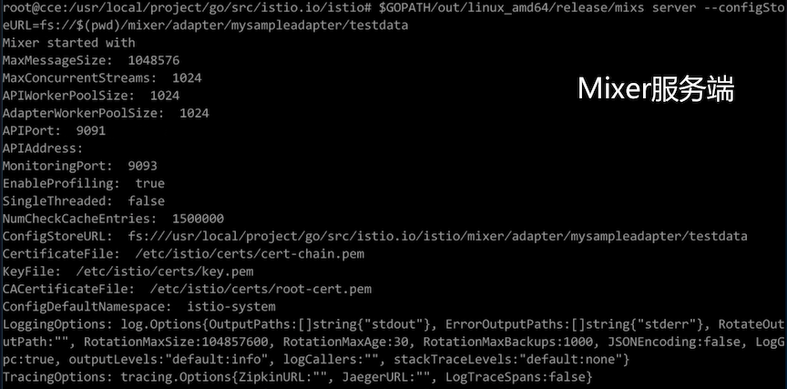

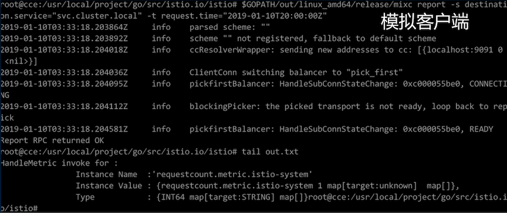


## 实践2 通过Mixer收集自定义的遥测数据:目标

* 编写自定义的`Metric`模板
* 在`Istio`中创建自定义`Metric`、`Prometheus Handler`和`Rule` 
* 认识`Prometheus Adapter`
* 实践`Prometheus `的主要能力

### 实践2 通过Mixer收集自定义的遥测数据:步骤

1.创建配置，包括prometheus的handler、metric和rule 

```
kubectl apply -f double-request.yaml
```
2.查看创建的对象

```
kubectl get metrics.config.istio.io -nistio-system 
kubectl get rules.config.istio.io -nistio-system 
kubectl get prometheus.config.istio.io -nistio-system
```

3.发起对服务的访问，生成访问`metric`数据

4.通过`Prometheus`查看`metric`数据

  * 4.1 查看`doublereques`的metric `http://49.4.84.29:9090/graph?g0.range_input=1h&g0.expr=istio_double_request_count&g0.tab=1`
  * 4.2 通过`prometheus`检索特定目标的 metric `istio_double_request_count{destination="details-v1"}`

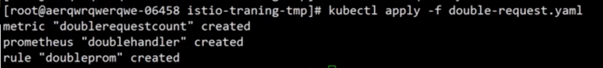

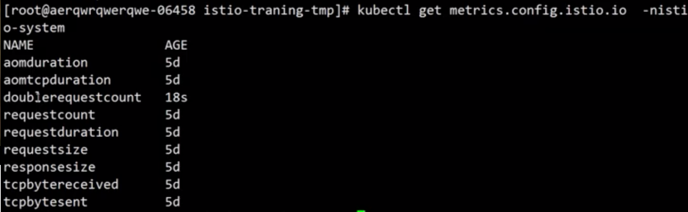

### 效果

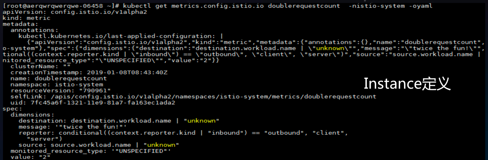


