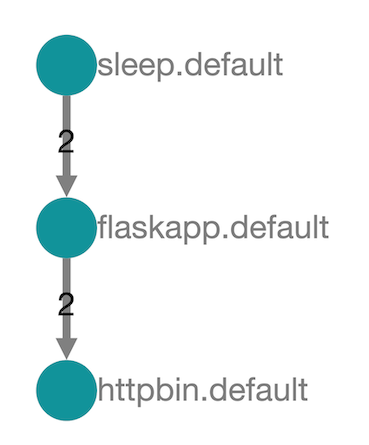

# 7. 使用 Istio Dashboard

`Jaeger` (` https://github.com/jaegertracing/jaeger`）是一个用于分布式跟踪的开源软件。 


**微服务之间的调用关系往往比较复杂，在深度和广度方面都会有较长的调用路线，因此需要有跨服务的跟踪能力。**


在`Istio`中提供了`Jaeger`作为分布式跟踪组件。

`Jaeger`也是CNCF的成员，是一 个分布式跟踪工具，提供了原生的`OpenTracing`支持，向下兼容`ZipKin`，同时支持多种存储后端。 


简单说明在`Istio`中如何查看调用链路，以及如何让网格中的应用支持分布 

需要注念的是`IstioSidecar`为网格中的应用提供调用环节的数据，要支持整条链路， 还需要根据`OpenTracing`规范对应用进行改写

## 1. 启用`Jaeger` 

**`Jager`默认兄不启用的** 

因此需要使用启用`Grafana`的类似方式，设置`tracing.enabled`为`True`


```
$ helm init
$HELM_HOME has been configured at /Users/i515190/.helm.

Tiller (the Helm server-side component) has been installed into your Kubernetes Cluster.

Please note: by default, Tiller is deployed with an insecure 'allow unauthenticated users' policy.
To prevent this, run `helm init` with the --tiller-tls-verify flag.
For more information on securing your installation see: https://docs.helm.sh/using_helm/#securing-your-helm-installation

$ helm version
Client: &version.Version{SemVer:"v2.14.2", GitCommit:"a8b13cc5ab6a7dbef0a58f5061bcc7c0c61598e7", GitTreeState:"clean"}
Server: &version.Version{SemVer:"v2.14.2", GitCommit:"a8b13cc5ab6a7dbef0a58f5061bcc7c0c61598e7", GitTreeState:"clean"}
```


```
$ cd Istio/istio-1.1.16/install/kubernetes/helm/istio

$ helm template istio --name istio --set tracing.enabled=true --namespace istio-system > default-tracing.yaml 


$ grep -C 2 "enableTracing" default-tracing.yaml 
    disablePolicyChecks: true

    # Set enableTracing to false to disable request tracing.
    enableTracing: true

    # Set accessLogFile to empty string to disable access log.

```

```
$ kubectl apply -f default-tracing.yaml 

$ kubectl get pod -n istio-system 
...
istio-tracing-555cf644d-h9hr9              1/1     Running     1          3d21
...
```
可以看到，该服务的`Pod`已经开始运行


## 2. 访问`Jaeger`

同样可以使用端口

```
kubectl -n istio-system get pod -l app=jaeger -o custom-columns='Name:metadata.name'
Name
istio-tracing-555cf644d-h9hr9 
```

```
$ kubectl -n istio-system port-forward istio-tracing-555cf644d-h9hr9  16686:16686
```
接下来既可以访问`http://127.0.0.1:16686`,来查看`jaeger`的界面， 其初始界面如图所示


可以看到`Jaeger`刚刚启动, `service`既列表中的数里是`O`。这同样是工作负载没有运行没有产生跟踪的数据导致


可以进人`sleep Pod`使用之前的方法来生成负载 

```
$ kubectl exec -it sleep-6c9c898f6c-gvqng -c sleep bash

bash-4.4# for i in 'seq 100';do http --body http://flaskapp/env/version; done
```


## 3.跟踪参数的传递 

前面是一个简单的跟踪活动包含一个服务端和一个客户端。

如果让们`flaskapp`再次获取另一个服务的内容则会发生什么呢，我们再引人一个`httpbin`服务来试试 

首先启动这个服务并等待成功运行 

```
$ cd Istio/istio-1.1.16/samples/httpbin
$ kubectl apply -f httpbin.yaml
service/httpbin created
deployment.extensions/httpbin created
```

```
$ kubectl get pods | grep httpbin
httpbin-7d9d5b55b9-kzt5k       2/2     Running   0          9m36s
```


接下来在`sleep`服务的`Pod`发起请求,要求`flaskapp`调用`httpbin`服务的`/get`
路径, 并返回`httpbin`给出响应， 同时要显示`sleep`发出的请求`Header`的内容

```
/# http --debug http://flaskapp/fetch_with_header?url=http://httpbin:8000/get 
```

此时会发现， `httpie`客户端发出的请求`Header`的原始内容为

```
requests.request(**{
    "allow_redirects": false,
    "auth": "None",
    "cert": "None",
    "data": {},
    "files": {},
    "headers": {
        "User-Agent": "HTTPie/0.9.9"
    },
    "method": "get",
    "params": {},
    "proxies": {},
    "stream": true,
    "timeout": 30,
    "url": "http://flaskapp/fetch_with_header?url=http://httpbin:8000/get",
```

`flaskapp`收到的请求要比`Header`的内容复杂的多

```
{"Content-Length": "0", 
 "Host": "flaskapp", 
 "User-Agent": "HTTPie/0.9.9", 
 "Accept-Encoding": "gzip, deflate", 
 "Accept": "*/*", 
 "X-Forwarded-Proto": "http", 
 "X-Request-Id": "999b9783-0b10-4140-8226-62ae1f5b15fd", 
 "X-Envoy-Decorator-Operation": "flaskapp.default.svc.cluster.local:80/*", 
 "X-Istio-Attributes": "...."
 "X-B3-Traceid": "efbd625ec2a1de04df63cf6195b6646f", 
 "X-B3-Spanid": "df63cf6195b6646f", 
 "X-B3-Sampled": "0"}
```

**`"X-Envoy-Decorator-Operation": "flaskapp.default.svc.cluster.local:80/*"`**


不难看出, 多出了一系列的`X-＊`的请求`Header`, 应该是`Envoy`代理对该请求进行了修改其中就包含分布式跟踪所需要的`Request ID`等请求`Header`

同时, 在经过多次访问后,如果回到`Japer`的`web`界面，就会发现sleep应用的跟踪记录非常少 


我们当然希望看到`sleep->flaskapp->httpbin`的完整跟踪信息，

**但是`OpenTracing`所依赖`Header`没有传递， 因此`jager`无法确定调用之间的关系， 只会有`sleep->flask`和`flaskapp->httbin`两端鼓励的跟踪信息**

要把孤立的跟踪信息融合起来，原则上比较简单：对于中间服务收到的请求， 在进行下一级请求时，将其中用于跟踪的`Header`传递下去就可以了。 

简单来说，如果在请求中存在如下`Header`，就需要进行转发： 

* x-request-id 
* x-b3-traceid 
* x-b3-spanid 
* x-b3-parentspanid 
* x-b3-sampled 
* x-b3-flags 
* x-ot-span-context 

因此，我们给`flaskapp`的`Python`。代码加人一点新东西，来传递这些内容： 

```
...
TRACE_HEADERS = [
    'x-request-id',
    'x-b3-traceid',
    'x-b3-spanid',
    'x-b3-parentspanid',
    'x-b3-sampled',
    'x-b3-flags',
    'x-ot-span-context'
]
...
    req = Request(url, headers = new_header)
    res = urlopen(req).read()
...
```

我们新建了一个`URL`路径`“fetch_with_trace"`，在`flaskapp`的代码中加人了、 `Header`的识别，一旦在接受的请求中包含特定的`Header`，就将其保存下来，并在下一次请求中发送出去。
 
下面就用这个新方法来测试一下，看看用新方法完成的调用是否会在`Jaeger`中展示完整的跟踪信息： 

```
for i in 'seq 100';do http --debug http://flaskapp/fetch_with_trace?url=http://httpbin:8000/ip;done
```


单击进入查看详细记录


**这样就可以清楚地看到`sleep`的调用先后引发了`flaskapp`和`httpbin`的跟踪记录链路变得完整了**




 
在`flaskapp`中还提供了一个`URL:"/fetch_with_header"`。利用这一方法，可以看到`Header`在这个过程中发生的变化 

我们可以在`sleep`容器中测试这个方法： 

```
...
"X-Request-Id": "b4706d04-b01a-4b46-a8a6-49969fd69412",
"X-Envoy-Decorator-Operation": "flaskapp.default.svc.cluster.local:80/*", "X-Istio-Attributes": "..", 
"X-B3-Traceid": "bf6812da453a130b41700b913f6cd354", 
"X-B3-Spanid": "41700b913f6cd354",
"X-B3-Sampled": "0"
...
"X-B3-Parentspanid": "c47b04e9488308e5",
"X-B3-Sampled": "0"
"X-B3-Spanid": "037db9a260a2ede6",
"X-B3-Traceid": "bf6812da453a130b41700b913f6cd354"
"origin": "127.0.0.1",
"url": "http://httpbin:8000/get"
```

在输出内容中会包含两组`HTTP Header`：

* 第1组来自`flaskapp`，表示`sleep->flaskapp`的请求内容；
* 第2组来自`httpbin`，表示`flaskapp->httpbin`的内容 


不难发现 :

* 我们指定的`Header`在两段路径中重复出现；
* `X-Request-Id`和`X-B3-Traceid`是直接下发的，两个服务收到的内容是一致的； 
* 在`httpbin`收到的跟踪信息件,`X-B3-Parentspanid`就等同于`flaskapp`发出 `X-B3-Spanid`，这表明了父子关系。 


## 4. 开放Jaeger服务 

和`Grafana`、 `Prometheus`一样，`Jaege`r同样可以通过修改服务类型等方式将服务公开到网格外部；不同的是，`Jaeger`还直接在`Chart`中提供了`Ingress`的设置方式。 

如果己经在`Kubernetes`集群中部署了`Ingress Controller`,可以在`values.yaml`中直接设置： 

```
ingress:
    enabled: false
    # Used to create an Ingress record.
    hosts:
      - jaeger.local
    annotations:
      # kubernetes.io/ingress.class: nginx
      # kubernetes.io/tls-acme: "true"
    tls:
      # Secrets must be manually created in the namespace.
      # - secretName: chart-example-tls
      #   hosts:
      #     - chart-example.local
```

`helm template`命令会为这些设置生成`Ingress`资源从而完成`Jaeger`服务的开放


