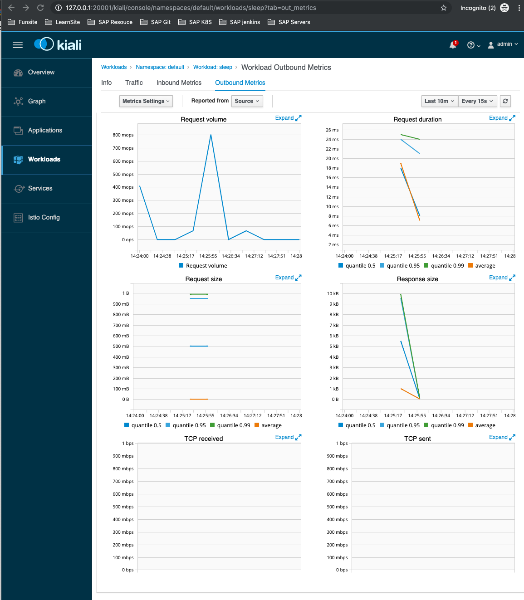
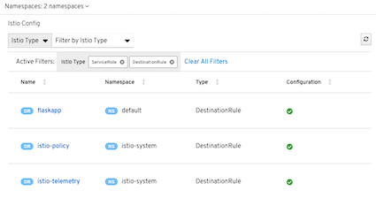

# 8. 使用Kiali 

`Kiali`以(`https://www.kiali.com`）也是一个用于`Istio`可视化的软件，同前面的`Grafana`, `Promtheus` 等通用软件不同`Kiali`目前是专用于`Istio`系统的, 可视化及跟踪等通用功能, 还专门提供了`Istio`的配置验证，健康评估的等高级功能

## 1. 启用`Kiali` 

在启用`Kiali`时同样需要对`values.yaml`进行修改在默认情况下将`Kiali`的相关变量设置如下； 

`istio/charts/kiali/values.yaml`

```
#
# addon kiali
#
enabled: false # Note that if using the demo or demo-auth yaml when installing via Helm, this default will be `true`.
replicaCount: 1
hub: docker.io/kiali
tag: v0.16
contextPath: /kiali # The root context path to access the Kiali UI.
nodeSelector: {}

podAntiAffinityLabelSelector: []
podAntiAffinityTermLabelSelector: []

ingress:
  enabled: false
  ## Used to create an Ingress record.
  hosts:
    - kiali.local
  annotations:
    # kubernetes.io/ingress.class: nginx
    # kubernetes.io/tls-acme: "true"
  tls:
    # Secrets must be manually created in the namespace.
    # - secretName: kiali-tls
    #   hosts:
    #     - kiali.local

dashboard:
  secretName: kiali # You must create a secret with this name - one is not provided out-of-box.
  grafanaURL:  # If you have Grafana installed and it is accessible to client browsers, then set this to its external URL. Kiali will redirect users to this URL when Grafana metrics are to be shown.
  jaegerURL:  # If you have Jaeger installed and it is accessible to client browsers, then set this property to its external URL. Kiali will redirect users to this URL when Jaeger tracing is to be shown.
prometheusAddr: http://prometheus:9090

# When true, a secret will be created with a default username and password. Useful for demos.
createDemoSecret: false
```

要简单启用`Kiali`, 则只设置其`enabled`为`true`即可， 但有些地方需要特别注意，如下所述。 
 
* 与`Jaeger`一样,可以为`Kiali`设置`Ingress`出口

和其他组件一样， 在设置`enabled`为true之后使用`helm template`渲染，`kubectl apply`命令进行安装 ,等待 `Pod`启动成功即可。 

> 我们在这里修改`kiali`的image到最新的版本
> image: "docker.io/kiali/kiali:v0.16" => image: "docker.io/kiali/kiali:v1.4.0"
> $ kubectl apply -f istio-demo.yaml

# 2. 访问`Kiali` 

通过端口转发的方式来访问

```
$ kubectl -n istio-system get pod -l app=kiali  -o custom-columns='Name:metadata.name'
Name
kiali-785fc9f67b-gc42t

$ kubectl -n istio-system port-forward kiali-785fc9f67b-gc42t 20001:20001
```

使用浏览器打开页面， 登录页面的默认用户名和密码为`values.yaml`的`tracing`一节修改。 
在登录成功之后进人首页，`admin:admin`，也可以在首页展示了目前的命名空间个和其中的工作负载的情况 

```
http://127.0.0.1:20001/kiali/console
```


单击其中的`default`命名空问会看到各个服务的情况，包括健康状况、是否注入


单击具体的服务，可以看到服务相关的一些指标展示，例如查看`flaskapp-v1`的出站请求


注意，这些图形是根据访问得出的，如果为空，则可能是因为在指定的时间范围内没有流量浩成的。

**尝试选择合适的时间跨度，看看是否正确显示。**

可以进人`sleep Pod`使用之前的方法来生成负载 

```
$ kubectl exec -it sleep-6c9c898f6c-gvqng -c sleep bash

bash-4.4# for i in 'seq 1000';do http --body http://flaskapp/env/version; done
```

`Workloads -> sleep -> Outbound Metrics`




在`Graph`菜单中会显示服务的拓扑关系例如我们在前而进行测试时使用的, 几个服务都会有如图所示的显示效果 


这里可以清楚地看到各个服务的调用关系和流量状况。例如，我们在前面使用 `sleep pod`的`Shell`中，使用`HTTP`客户端一工具通过`flaskapp`应用调用`httpbin`的过程， 在这张图中的表现就很明显。

另外，最重要的一个功能就是Kiali菜单左侧的`Istio Confi`g项。单击这一项， 选择`istio-system命`名空间，会看到`Istio`默认的各种自定义资源的设置情况


单击其中的各个项目, 会展示该对象的定义文本,其中还提供了一些配置校验方面的功能。如所示的是`istio-policy`的`destinationrules`。 




### 开放Kiali服务 

在`values.yaml`中也为`Kiali`提供了`Ingress`的配置项目，因此开放`Kiali`服务的 
方式和`Jaeger`一样，可以通过修改服务类型或设置`Ingress`将服务开放。 

## 小结

本章讲解了如何在网格中进行应用部署，还逐个展示了`Istio`常用可视化组件的启动和使用方法，这些组件对`Istio`服务网格的运维有很重要的意义，是服务网格可观察性的具体表现。`Grafana` , `Prometheus`及`Jaeger`这些第三方组件都相对成熟和稳定；`Kiali`目前还相对幼稚，但是也看得出来`Istio`对其功能的借重和期待。 

