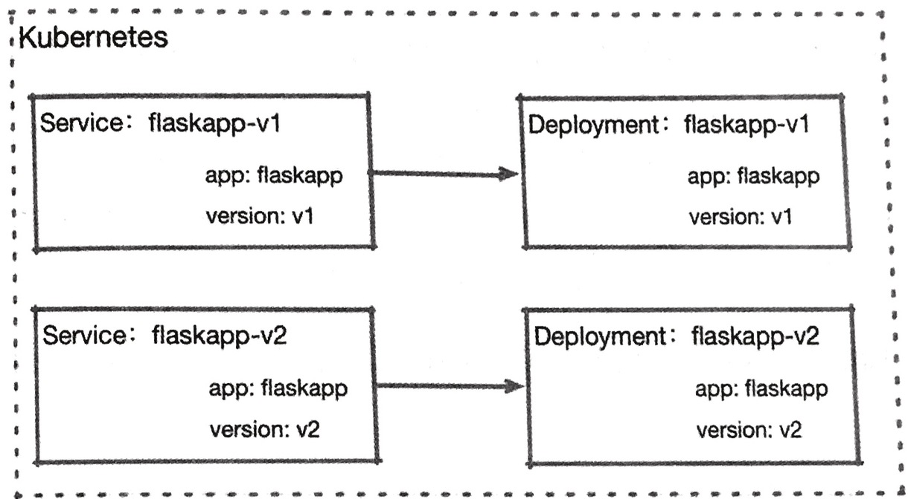
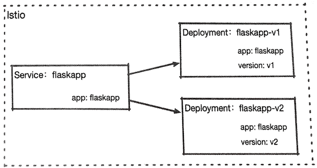
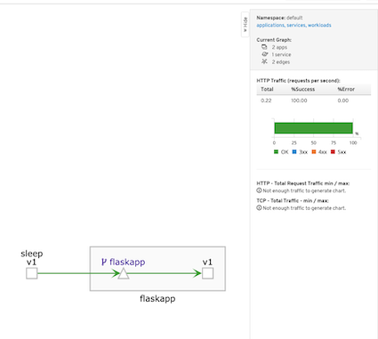
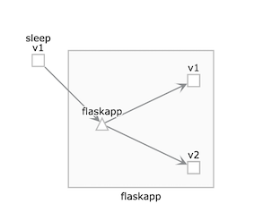
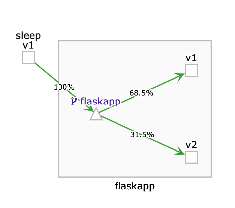
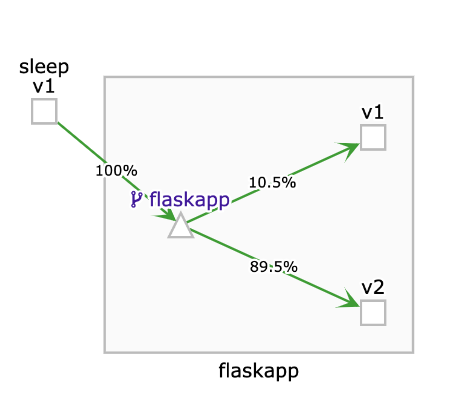
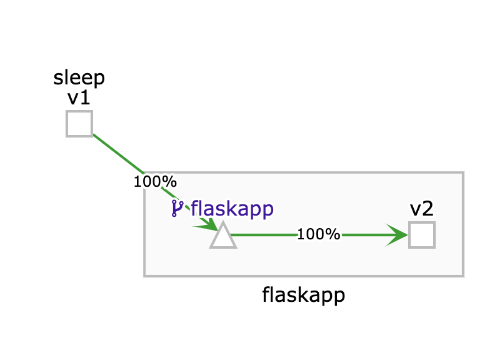
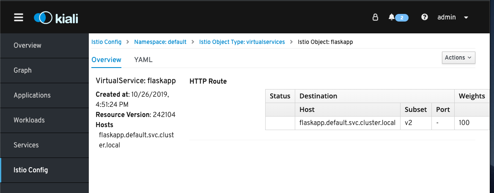

# 9. HTTPS流量管理

* 9.1 定义目标规则 
* 9.2 定义默认路由 
* 9.3 流量的拆分和迁移

在第2章中提到过，连接能力是`Istio`的核心功能之一，如下所示

* 在微服务环境中，如何将大量的微服务链接在一起， 进行有效的远程服务调用，是业务运转的基本要求
* 在不可靠的网络状况下，如何保证服务正确应对网络过账，保证服务质量，也是必须考虑的问题
* 在升级，测试和扩缩容的场景中，进行有序可靠的流量引导和转移，同样是很现实的要求
* 在微服务出现故障的时候，能够采取措施进行故障隔离，防止故障扩散影响整体应用的运行， 对业务健壮性是一个重要保障


Istio提供了强大的流量控制能力，可以在业务可以在业务应用无感知的情况下，对应用的通信进行配置和管理， 能够有效降低开发和运维成本，并提高服务的控制能力


## 9.1 定义目标规则 

在进行流量管理实践之前，首先要了解`Istio`对流量访问目标的定义通常来说，在`Kubernetes`中访问一个服务时，需要指定其协议、服务名及端口 
例如`http://httpbin:8000`。

而在`Istio`的服务网格中对服务进行了进一步抽象： 

* 可以使用`Pod`标签对具体的服务进程进行分组； 
* 可以定义服务的负载均衡策略； 
* 可以为服务指定`TLS`要求； 
* 可以为服务设置连接池大小。 


我们用到的`flaskapp.istio.yaml`通过个`Servie`对应两个不同版 `Deployment`
两个`Deployment`中的Pod使用了不同的标签进行区分


在`Kubernetes`中`Service`和`Deployment`或者其工作负载的关系通常是一对一的。




而在`Istio`中`Service`经常会对应不同的`Deployment` 



这个差异看起来似乎微不足道，但在实际生产中，两种模式的灵活性高下立判， 如下所述 

* 在`Istio`中，客户端只使用一个服务入口就可以访问多不同的服务，无须客户端干预。 但客户端如果直接使用`Kubernetes Service`，就必须使用两个不同的服务入口。 
* **`Istio`可以通过流量特征来完成对后端服务的选择**, 它的流量控制功能会根据每次访问产生的流量进行判断， 根据判断结果来选择一个后端负责本次访问的响应。

`Kubernetes`当然也可以这样做, 但是因为`Kubernetes`的`Service`不 具备选择后端的能力，所以如果它使用了`Istio`这种一对多的模式, 则后果只能是使用轮询方式随机调用两个不同的工作负载

 
而在`Istio`中，**这种同一服务不同组别的后端被称为子集(Subset)**，也经常被称为服务版本。 


**在`Istio`中建议为每个网格都设置明确的目标访问规则。**

**在通过`Istio`流量控制之后会选择明确的子集, 根据该规则或者在子集中规定的流量策略来进行访问，这种规则在`Istio`被称为`DestionationRule`**


例如我们为`flaskapp`建立一个目标规则定义 

```
apiVersion: networking.istio.io/v1alpha3 
kind: DestinationRule 
metadata: 
  name: flaskapp 
spec: 
  host: flaskapp.default.svc.cluster.local 
  trafficPolicy: 
    loadBalancer: 
      simple: LEAST_CONN 
  subsets: 
  - name: v1 
    labels: 
      version: v1 
    trafficPolicy: 
      loadBalancer: 
        simple: ROUND_ROBIN 
  - name: v2 
    labels: 
      version: v2 
```

该规则有以下需要注意的地方。 

* `host`：是一个必要字段，**代表`Kubernetes`中的一个`Service`资源，或者一个 
由`ServiceEntry` 定义的外部服务。** 为了防止`Kubernetes`不同命名空间中的服务重名, 
这里强烈建议使用完全限定名，也就是使用`FQDN`来赋值。

* **`trafficPolicy`：是流量策略**。**在`DestinationRule`和`Subsets`两级中都可以定义`trafficPolicy`，在`Subset`中设置的级别高。 
* `subsets`：在该字段中使用标签选择器来定义不同的子集。

综上所述，**我们为`flaskapp`建立了`v1`和`v2`这两个子集，并且`v1`子集使用了独立的负载均衡算法。**
 
为了后续环节的顺利进行，创建的`flaskapp`服务（`Service`和`Deployment`创建目标规则，将其分成`v1`和`v2`两个版本： 

```
apiVersion: networking.istio.io/v1alpha3 
kind: DestinationRule 
metadata: 
  name: flaskapp 
spec: 
  host: flaskapp.default.svc.cluster.local  
  subsets: 
  - name: v1 
    labels: 
      version: v1
  - name: v2 
    labels: 
      version: v2
```

将上述内容保存为`flaskapp-dr.yaml`并使用`kubectl apply`命令提交到`kubernetes`集群； 

```
$ kubectl apply -f flaskapp-dr.yaml
destinationrule.networking.istio.io/flaskapp configured


$ kubectl get dr
NAME       HOST                                 AGE
flaskapp   flaskapp.default.svc.cluster.local   6d23h
```

**这样, 我们就对具体负责执行服务的下作负载有了一个明确的定义, 并可以将其当作流量控制的基础**


## 9.2 定义默认路由 

在服务部署完成之后, 我们为其定义了目标规则节, 接下来面临一个问题: 在没有任何特定路由规则的情况下, 对`flaskpp`服务的访问会到达哪个子集（或称版本）呢？
 
```
$ kubectl get pod -l app=sleep,version=v1 -o custom
-columns='Name:metadata.name'
Name
sleep-6c9c898f6c-snzx5
sleep-v1-548d87cc5c-wfk7v
```

```
$ kubectl delete vs flaskapp-default-v2
virtualservice.networking.istio.io "flaskapp-default-v2" deleted

$ kubectl exec -it sleep-v1-548d87cc5c-wfk7v -c sleep bash

bash-4.4# for i in `seq 10`;do http --body http://flaskapp/env/version;done
v2

v2

v1

v1

v2

v2

v1

v1

v2

v2
```

在重复执行后不难发现，我们定义的目标规则并未影响通信过程，还是按照`kube-proxy`的默认随机行为进行访问的，返回结果分别来自两个不同的版本。 

`Istio`建议为每个服务都创建一个默认路由，在访问某一服务的时候，如果没有特定的路由则，则使用默认的路由规则来访问指定的子集，以此来确保服务在默认情况下的行为稳定性。 

首先创建一个默认访问`v1`版本的路由规则进行测试： 

```
apiVersion: networking.istio.io/v1alpha3
kind: VirtualService
metadata: 
  name: flaskapp 
spec: 
  hosts:
  - flaskapp.default.svc.cluster.local
  http: 
  - route: 
    - destination: 
        host: flaskapp.default.svc.cluster.local
        subset: v1
```

这是最简单的一个`VirtualService`定义。`VirtualService`是`Istio`流址控制过程中的一个枢纽负责对流量进行甄别和转发。 


下面对本节涉及的概念进行讲解。

* **`VirtualService`同样是针对主机名工作的，但注意这个字段是一个数组内容，因此它可以针对多个主机名进行工作**， `VirtualService` 可以为多种协议的流量提供服务， 除了支持本文使用的是`HTTP`还支持`TCP`和`TLS` 。
* **在`http`字段的下一级, 就是具体的路由规则了。不难看出，这里是支持多的路由的**， 我们简单定义了一个默认目标：`flaskapp.default.svc.cluster.local` 也就是说, `flaskapp`默认使用`v1`版本来处理请求

接下来测试一下。 

首先将上述`YAML`代码保存为`flask-default-vs-v1.yaml`，然后使用`kubectl 
apply`命令将其提交到`Kubernetes`集群： 

```
$ kubectl apply -f flask-default-vs-v1.yaml
virtualservice.networking.istio.io/flaskapp created
```

 
再次进入`sleep pod` 进行测试

```
kubectl exec -it sleep-6c9c898f6c-snzx5 -c sleep bash

bash-4.4# for i in `seq 10`;do http --body http://flaskapp/env/version;done
v1

v1

v1

v1

v1

v1

v1

v1

v1

v1
```

重复执行命令就会发现所有访问都从`v1`版本返回了, 这表明找们定制的默认路由己经生效效 
 
在访问过程还可以通过访问`kiali`来查看流量的可视化结果，`kiali`会通过动画的形式呈现访问清况 

`http://127.0.0.1:20001/kiali/console/graph/namespaces/?edges=noEdgeLabels&graphType=versionedApp&namespaces=default&injectServiceNodes=true&duration=60&pi=10000&layout=dagre&unusedNodes=false`




这里稍作回顾，在`Istio`中部署一个业务应用时，建议做到以下几点 

* **使用`app`标签表明应用身份；** 
* 使用`version`标签表明应用版本； 
* **创建目标规则(DestinationRule)**； 
* **创建默认路由规则(VirtualService)**。 

默认路由除了可以保证应用行为的稳定性， 也是`Istio`的一些配置对象的构建基础。

因此和日常的`Dockerfile`、 `Service`、 `Deployment`等清单文件一样默认路由的配置清单应该成为服务网格环境下的必要部署内容 

## 9.3 流量的拆分和迁移 

**上一节中有过提示`VirtualService`的`http`字段的下一级成员是一个数组, 代表多条路由规则。**

这很自然会让我们想到：在多版本并存的情况下是否可以针对不同的版本进行流址分配呢?

这种特性在测试和版本更新的清况下是很有用的，**例如在我们的新版本还没有完全通过生产验证之前我们只希望已承担少部分流量， 来观察它在生产环境的稳定性。** 

因为样本量太少，所以我们会看到在调用过程中返回的内容还是随机分布的， 因此这里用一个`for`循环进行多次测试，查看“v1”在其中出现的次数： 

先删掉原来的建立的`VS`,然后进入`sleep pod`, 可见分配比率接近`50%`

```
$ kubectl get vs
NAME       GATEWAYS   HOSTS                                  AGE
flaskapp              [flaskapp.default.svc.cluster.local]   22h

$ kubectl delete vs flaskapp
virtualservice.networking.istio.io "flaskapp" deleted

$ kubectl exec -it sleep-6c9c898f6c-snzx5 -c sleep bash
```

```
for i in `seq 10`;do http --body http://flaskapp/env/version; done | awk -F"v1" '{print NF-1}'
4

for i in `seq 100`;do http --body http://flaskapp/env/version; done | awk -F"v1" '{print NF-1}'
50


for i in `seq 300`;do http --body http://flaskapp/env/version; done | awk -F"v1" '{print NF-1}'
151
```



下面定义一个分流规则：对`flaskpp`服务的访问, 有`70％`进人`v1`版本, 有`30%`进人`v2`版本. 直接修改`flaskapp.virtualservice.yaml` ,添加对`v2`版本的目标支持， 并定义分配权重

```
apiVersion: networking.istio.io/v1alpha3
kind: VirtualService
metadata: 
  name: flaskapp 
spec: 
  hosts:
  - flaskapp.default.svc.cluster.local
  http: 
  - route: 
    - destination: 
        host: flaskapp.default.svc.cluster.local
        subset: v1
      weight: 70
    - destination: 
        host: flaskapp.default.svc.cluster.local
        subset: v2
      weight: 30
```
使用`kubectl apply`命令提交更新后的规则， 并测试其实际结果

```
$ kubectl apply -f flaskapp.virtualservice.yaml 
virtualservice.networking.istio.io/flaskapp created
```

进人`Sleep Pod`连续对`flaskapp`发出请求并统计返回结果 

```
$ kubectl get vs
NAME       GATEWAYS   HOSTS                                  AGE
flaskapp              [flaskapp.default.svc.cluster.local]   2m39s

$ kubectl exec -it sleep-6c9c898f6c-snzx5 -c sleep bash

for i in `seq 10`;do http --body http://flaskapp/env/version; done | awk -F"v1" '{pr
int NF-1}'
8

bash-4.4# for i in `seq 100`;do http --body http://flaskapp/env/version; done | awk -F"v1" '{p
rint NF-1}'
59

bash-4.4# for i in `seq 300`;do http --body http://flaskapp/env/version; done | awk -F"v1" '{p
rint NF-1}'
215
```


可以看出, 随若测试次数的增加`v1`出现的次数会逐步接近我们定义的分配比率。

 

回到现实场景中,如果测试结果乐观, 则我们会希望为新版本分配更多的流址。 这时该如何处理？ 

很简单，修改路由即可。我们继续修改并提交`flaskapp.virtualservice.yaml`文件 

不同的是这次v1和v2的比例从`70: 30`修改为`10:90`, 在修改之后重新进`sleep pod`行测试 

```
apiVersion: networking.istio.io/v1alpha3
kind: VirtualService
metadata: 
  name: flaskapp 
spec: 
  hosts:
  - flaskapp.default.svc.cluster.local
  http: 
  - route: 
    - destination: 
        host: flaskapp.default.svc.cluster.local
        subset: v1
      weight: 10
    - destination: 
        host: flaskapp.default.svc.cluster.local
        subset: v2
      weight: 90
```

```
$ kubectl apply -f flaskapp.virtualservice.yaml 
virtualservice.networking.istio.io/flaskapp configured

$ kubectl exec -it sleep-6c9c898f6c-snzx5 -c sleep bash

$ bash-4.4# for i in `seq 300`;do http --body http://flaskapp/env/version; done | awk -F"v1" '{print NF-1}'
32
```

 

可以看到， 我们定义的流虽分配原则已经生效了

更进一步， 如果`v2`版本测试成功,则可以再次修改删除`v1`版本的路由，让全部流量都进入`v2`版本. 

也就是使用`v2`版本完全替代原有的`v1`版本, 完成最终的升级。 

继续修改`flaskapp.virtualservice.yaml`,将其中的`http`部分修改为仅包含`v2`的内容

```
apiVersion: networking.istio.io/v1alpha3
kind: VirtualService
metadata: 
  name: flaskapp 
spec: 
  hosts:
  - flaskapp.default.svc.cluster.local
  http: 
  - route: 
    - destination: 
        host: flaskapp.default.svc.cluster.local
        subset: v2
      weight: 100
```

```
$ kubectl apply -f flaskapp.virtualservice.yaml 
virtualservice.networking.istio.io/flaskapp configured
```
再次测试流量分配情况

```
$ kubectl exec -it sleep-6c9c898f6c-snzx5 -c sleep bash

bash-4.4# for i in `seq 300`;do http --body http://flaskapp/env/version; done | awk -F"v1" '{print NF-1}'
0
```

 

这里可以看到，已经完全没有来自`v1`版本的响应了，也就是说所有流量都已经按计划进人`v2`版本， `v1`版本可以下线 。

本节有以下几点需要注意。 

* 流量分配是有权重的，并且权重总和必须是`100`。 
* 如果不显式声明权重, 则其默认值为`100`。  

那么如何确定网格现有的路由规则或者其他`Istio`对象呢？方法有以下两种。

1. 使用`kubectl get`. `Istio`的资源和`Kubernetes`内置的资源一样，都能通过`kubectl` 获取．并能够展示当前存在的`VirtualService`；还可以使用`kubectl api-resources`命令， 列出当前集群支持的所有对象类型。 
2. 使用`Kiali`。选择左侧菜单中的`Istio Config`，如图所示为我们新建的路由规则和目标规则。 

 


