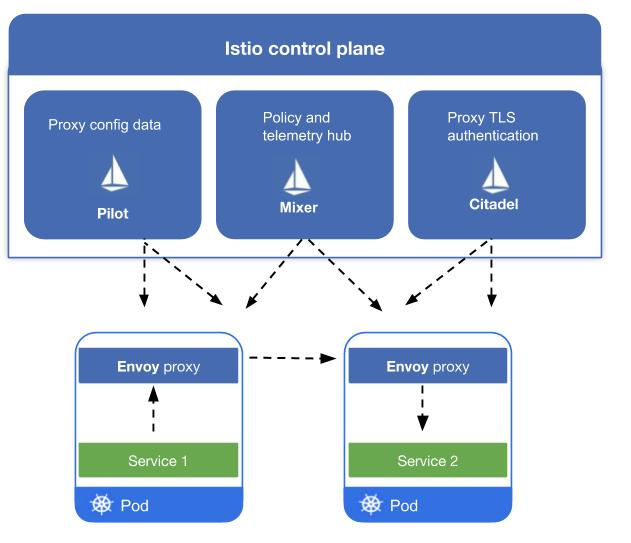

# 介绍

Kubernetes是Google基于Borg开源的容器编排调度引擎，作为`CNCF（Cloud Native Computing Foundation）`最重要的组件之一，它的目标不仅仅是一个编排系统，而是提供一个规范，可以让你来描述集群的架构，定义服务的最终状态，`Kubernetes` 可以帮你将系统自动地达到和维持在这个状态。`Kubernetes` 作为云原生应用的基石，相当于一个云操作系统，其重要性不言而喻。

`istio` 是由 Google、IBM、Lyft 等共同开源的 `Service Mesh`（服务网格）框架，于2017年初开始进入大众视野。`Kubernetes` 解决了云原生应用的部署问题，`istio` **解决的是应用的服务（流量）治理问题**。随着 2018年7月31日 istio 1.0 发布，istio 本身已经日趋稳定。

主题有以下内容：

* [服务网格((Service Mesh)概念解析](0Service_Mesh.md)
* istio 架构详解
* istio 实战

## Istio基础教学

1. [Istio 架构与技术](1isba_Frame_Tech.md)
  * Service Mesh
  * Istio 架构基础
  * Istio 基本概念
  * Istio & Kubernetes:架构结合
  * 运行第一个Istio集群

2. [Istio 服务发现和 Pilot的架构机制](2isba_Service_Find.md)
  * Istio架构回顾&Pilot介绍
  * Istio服务发现
  * Istio服务配置
  * Istio服务发现&规则管理与Kubernetes结合
3. [Gateway 设计与实现](3isba_Gateway.md) 
  * Gateway简介
  * Gateway vs Kubernetes Ingress 
  * Gateway原理及实现
  * Gateway demo演示

## bookinfo 实验与教学

1. [Docker for Mac安装istio](1Istio_install_docker.md)
   * 安装 docker 和 k8s
   * 安装 kubectl
   * 安装 kubernetes dashboard
   * 安装 Helm
   * 安装 istio
   * 安装示例 
2. [基于Bookinfo的流量管理配置1](2BookInfo_1.md)
   * 不同服务版本访问规则的基本使用
   * 基于权重的服务访问规则使用
   * 基于请求内容的服务访问规则使用
3. [基于Bookinfo的流量管理配置2](3BookInfo_2.md)
   * 延迟访问故障注入
   * 中断访问故障注入
   * 不同环境服务访问
   * 服务网格外的流量管理
   * `VirtualService` & `DestinationRule` 规则说明
   * 收个尾

