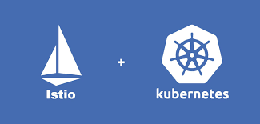

# 介绍

Kubernetes是Google基于Borg开源的容器编排调度引擎，作为`CNCF（Cloud Native Computing Foundation）`最重要的组件之一，它的目标不仅仅是一个编排系统，而是提供一个规范，可以让你来描述集群的架构，定义服务的最终状态，`Kubernetes` 可以帮你将系统自动地达到和维持在这个状态。`Kubernetes` 作为云原生应用的基石，相当于一个云操作系统，其重要性不言而喻。

`istio` 是由 Google、IBM、Lyft 等共同开源的 `Service Mesh`（服务网格）框架，于2017年初开始进入大众视野。`Kubernetes` 解决了云原生应用的部署问题，`istio` **解决的是应用的服务（流量）治理问题**。随着 2018年7月31日 istio 1.0 发布，istio 本身已经日趋稳定。

主题有以下内容：

* [服务网格((Service Mesh)概念解析](0Service_Mesh.md)
* istio 架构详解
* istio 实战

* `VirtualService` 在 Istio 服务网格中**定义路由规则**，**控制路由如何路由到服务上**。
* `DestinationRule` 是 `VirtualService` **路由生效后，配置应用与请求的策略集**。
* `ServiceEntry` 是通常用于在 Istio **服务网格之外启用对服务的请求**。
*  `Gateway` 为 `HTTP/TCP` **流量配置负载均衡器**，最常见的是在**网格的边缘的操作**，以**启用应用程序的入口流量。**

[Istio 常见的 10 个异常分析](24Istio_troubleshoot.md)

* Service 端口命名约束
*  流控规则下发顺序问题
*  请求中断分析
*  `Sidecar` 和 `User Container` 启动顺序
*  `Ingress Gateway` 和` Service` 端口联动
*   `VirtualService` 作用域
*  `VirtualService` 不支持 `Host Fragment`
*  全链路跟踪并非完全透明接入 
*  `mTLS` 导致连接中断
*  用户服务监听地址限制

## Istio 1.5

* [利用`IstioOperator`部署`Istio 1.5`](21Istio_1.5_upgrade.md)
* [Istio 1.5 新特性解读](22Istio_1.5_Intro.md)

### Jam Istio

* [JAM Service Mesh with Istio](23Istio_Jam.md)
	* Deploying service mesh(istio)
	* How to upgrade istio for jam
	* Troubleshooting on istio
	* Reliablity Validation with Istio Fault Injection

Istio 常见的 10 个异常分析

## Istio基础教学

1. [Istio 架构与技术](1isba_Frame_Tech.md)
  * Service Mesh
  * Istio 架构基础
  * Istio 基本概念
  * Istio & Kubernetes:架构结合
  * 运行第一个Istio集群

2. [Istio 服务发现和 Pilot的架构机制](2isba_Service_Find.md)
  * Istio架构回顾&Pilot介绍
  * Istio服务发现
  * Istio服务配置
  * Istio服务发现&规则管理与Kubernetes结合
3. [Gateway 设计与实现](3isba_Gateway.md) 
  * Gateway简介
  * Gateway vs Kubernetes Ingress 
  * Gateway原理及实现
  * Gateway demo演示
4. [Istio 灰度发布与技术实现](4isba_Gray_release.md)
  * 典型发布类型对比
  * Istio流量治理技术解析
  * 智能灰度发布介绍
  * 灰度发布功能展示Demo
5. [xDS协议解析](5isba_Xds.md)
  * xDS基本概念 
  * xDS协议分析 
  * ADS理解
  * xDS的未来
6. [Mixer基础与实现(Handler, Instance, Rule)](6isba_Mixer.md)
  * Istio架构回顾&Mixer介绍 
  * Mixer的功能和设计
  * Mixer的配置模型
  * Mixer的典型应用
  * Mixer实践1和2

## Istio 高级教学与实践

1. [服务网格的基本特征](1Service_Mesh_Intro.md)
2. [Istio 基本介绍](2Istio_Intro.md)
 * Istio的核心组件及其功能
 * 核心配置对象
3. [Istio, Service Mesh快速入门](3Istro_ServiceM_Prac.md) 
4. [用`Helm`部署`Istio`](4Istio_Helm.md) 
 * `Istlo Chart`概述 
 * `charts`全局变量介绍
 * `Istio` 安装清单的生成和部署
5. [Istio 常用功能 （自动/手动部署`Istio`应用）](5Istio_funcs.md) 
 * 在网格中部署应用
 * 修改`Istio`配置
6. [使用 `Istio Dashboard Grafana / Prometheus`](6Istio_func2_grafana_prometheus.md)
 *  使用`Istio Dashboard (Grafana)` 
 *  使用`Prometheus`
7. [使用 `Istio Dashboard Jager`](7Istio_fun3_Jager.md)
8. [使用`Istio Dashboard Kiali`](8Istio_func4_Kiali.md)
9. [`HTTPS`流量管理1](9Istio_http1.md)
 * 定义目标规则 
 * 定义默认路由
 * 流量的拆分和迁移
10. [`HTTPS`流量管理2](10Istio_http2.md)
 * 金丝雀部署
 * 根据来源服务进行路由
 * 对`URI`进行重定向
11. [HTTPS流量管理3](11Istio_http3.md)
 * 通信超时控制 
 * 故障重试控制
 * 入口流量管理
 * 出口流量管理
12. [HTTPS流量管理4](12Istio_http4.md)
 * 置服务熔断
 * 故障注入测试
 * 注入中断
 * 流量复制
13. [Mixer 适配器的应用](13Istio_Mixer1.md)
 * Mixer适配器简介
 * 基于`Denier`适配器的访问控制
 * 基于`Listchecker`适配器的访问控制
14. [Mixer 适配器的应用2](14Istio_Mixer2.md)
 * 使用`MemQuota`适配器进行服务限流
 * 使用`RedisQuota`适配器进行服务限流
15. [Mixer 适配器的应用3 - 为Prometheus定义监控指标](15Istio_Mixer3_prometheus.md)
 * 默认监控指标
 * 自定义监控指标 
16. [使用`stdio`输出自定义日志](16Istio_Mixer4_stdio.md)
 * 默认的访问日志 
 * 定义日志对象
 * 测试输出
17. [使用`Fluentd`输出日志](17Istio_Mixer5_fluentd.md)
 * 部署`Fluentd`
 * 测试输出
18. [Istio的安全加固1](18Istio_Sec1.md)
 * `Istio`安全加固概述 
 * 启用`mTLS` 
19. [Istio的安全加固2](19Istio_Sec2_RBAC.md)
 * 设置`RBAC`
 * `RBAC`的除错过程
20. [`Istio` 的试用建议](20Istio_Usage.md)
 * `Istio`自身的突出问题
 * 确定功能范围
 * 选择试用业务
 * 调用过程 

## bookinfo 实验与教学

1. [Docker for Mac安装istio](1Istio_install_docker.md)
   * 安装 docker 和 k8s
   * 安装 kubectl
   * 安装 kubernetes dashboard
   * 安装 Helm
   * 安装 istio
   * 安装示例 
2. [基于Bookinfo的流量管理配置1](2BookInfo_1.md)
   * 不同服务版本访问规则的基本使用
   * 基于权重的服务访问规则使用
   * 基于请求内容的服务访问规则使用
3. [基于Bookinfo的流量管理配置2](3BookInfo_2.md)
   * 延迟访问故障注入
   * 中断访问故障注入
   * 不同环境服务访问
   * 服务网格外的流量管理
   * `VirtualService` & `DestinationRule` 规则说明
   * 收个尾

## Kubernetes + JenkinsX + Istio渐进式交付

1. [Kubernetes 中的渐进式交付：蓝绿部署和金丝雀部署, shipper, Istio, Flagger](https://github.com/Chao-Xi/JacobTechBlog/blob/master/k8s_tutorial/k8s_adv54_release.md)
2. [使用 Jenkins X 渐进式交付](https://github.com/Chao-Xi/JacobTechBlog/blob/master/k8s_tutorial/k8s_adv56_jenkinsX.md)
3. [使用 Jenkins X 渐进式交付：自动化金丝雀部署](https://github.com/Chao-Xi/JacobTechBlog/blob/master/k8s_tutorial/k8s_adv57_Auto_Canary.md)