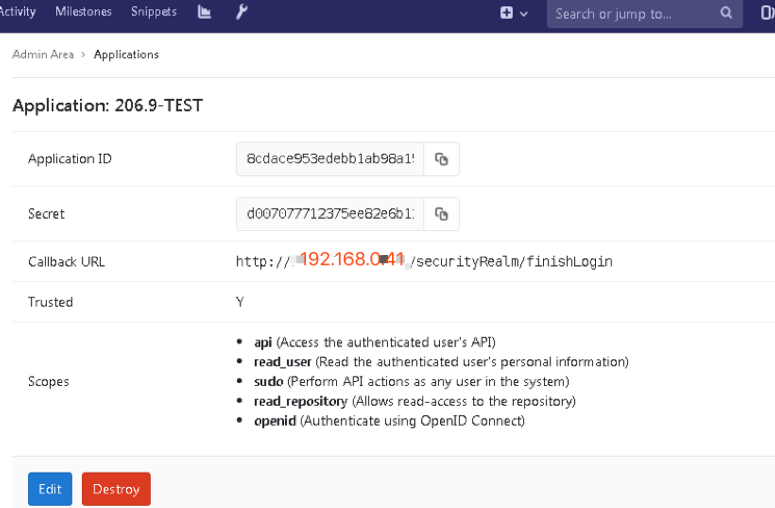
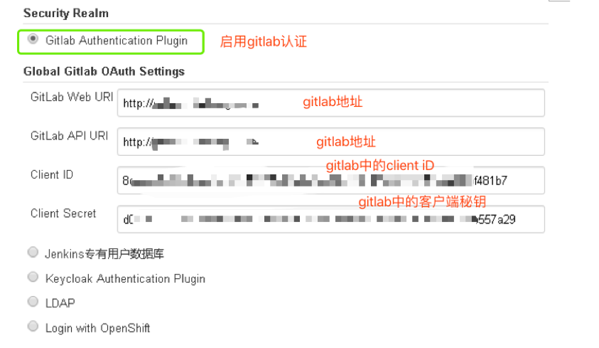
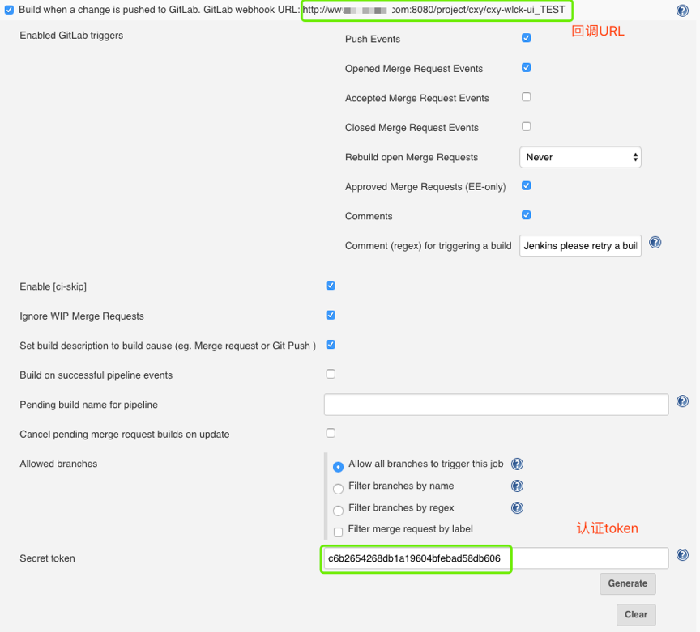
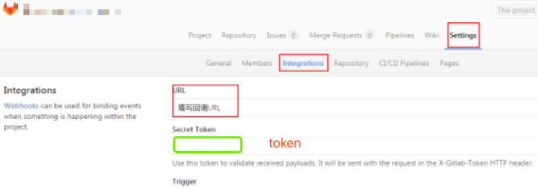

# Jenkins集成Gitlab

## 1. SSO集成

### 1.1 Gitlab配置

* 应用管理->创建应用->配置重定向url

 

### 1.2 Jenkins配置

* 配置前备份`config.xml`文件，
* 如果`jenkins`前面有代理需要改一下`upstream`名称，因为这个名称会自动填充为`redirect_url`地址。 

## 2. WebHook集成

### 2.1 Jenkins配置

* 安装`gitlab hook`插件

* 选择一个项目，在构建触发器模块选择通过`gitlab`触发。生成`token`

### 2.2 Gitlab配置

* 进入项目-> 项目设置-> 集成 

* 保存后测试连接 

* 返回成功信息，此时可以查看`jenkins`项目是否正在`building`。 

 

