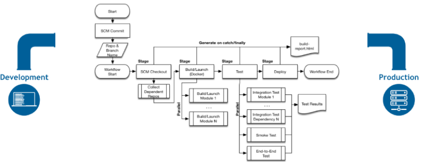
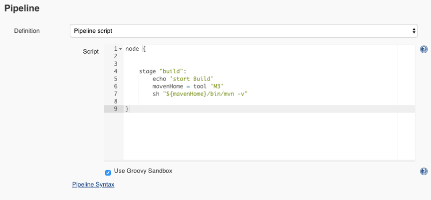
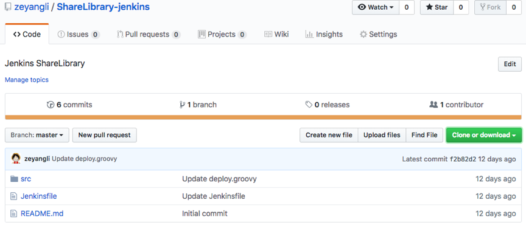
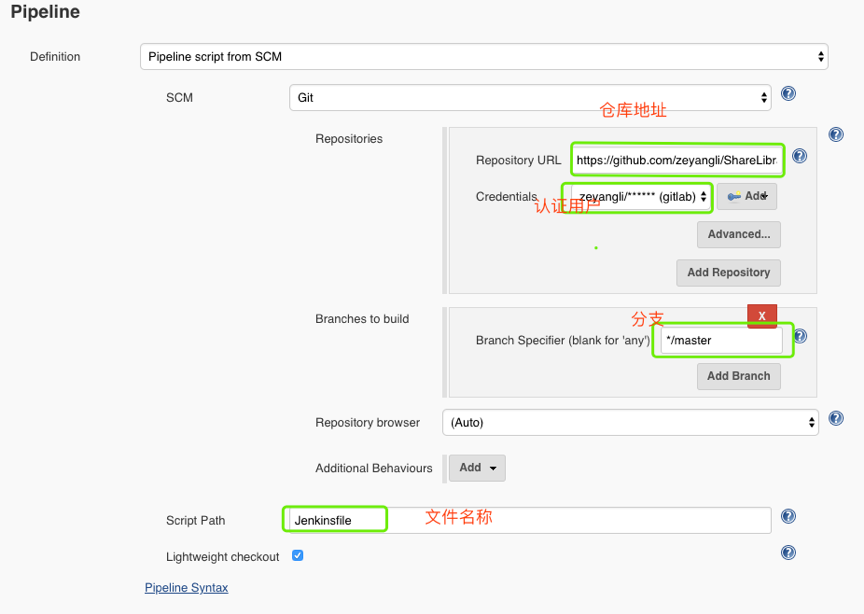

# 认识Pipleine

## 1.1 Pipeline是什么？

* `Pipeline`是`Jenkins`的核心功能，提供一组可扩展的工具。
* 通过`Pipeline` 的`DSL`语法可以完成从简单到复杂的交付流水线实现。
* `jenkins`的`Pipeline`是通过`Jenkinsfile`（文本文件）来实现的。
* 这个文件可以定义`Jenkins`的执行步骤，例如检出代码。

## 1.2 Jenkinsfile

* `Jenkinsfile`使用两种语法进行编写，分别是**声明式**和**脚本式**。
* 声明式和脚本式的流水线从根本上是不同的。
* **声明式是`jenkins`流水线更友好的特性。**
* **脚本式的流水线语法，提供更丰富的语法特性。**
* **声明式流水线使编写和读取流水线代码更容易设计。**

[Building Continuous Delivery pipelines with Jenkins 2](https://github.com/Chao-Xi/JacobTechBlog/blob/master/jenkins/8Jenkins_basic_pipelineascode.md)

## 1.3 为什么使用Pipeline？

本质上，jenkins是一个自动化引擎，它支持许多自动模式。流水线向Jenkins添加了一组强大的工具，支持用例、简单的持续集成到全面的持续交付流水线。 通过对一系列的发布任务建立标准的模板，用户可以利用更多流水线的特性，比如：

* 代码化: 流水线是在代码中实现的，通常会存放到源代码控制，使团队具有编辑、审查和更新他们项目的交付流水线的能力。
* 耐用性：流水线可以从`Jenkins`的`master`节点重启后继续运行。
* 可暂停的：流水线可以由人功输入或批准继续执行流水线。
* 解决复杂发布： 支持复杂的交付流程。例如循环、并行执行。
* 可扩展性： 支持扩展`DSL`和其他插件集成。

构建一个可扩展是`Jenkins`的核心价值，流水线可以通过`ShareLibrary`的方式来扩展。 下面是一个CD的场景实例 

 

## 2. Pipeline概念

参考文档：[https://jenkins.io/zh/doc/book/pipeline/](https://jenkins.io/zh/doc/book/pipeline/)

### 2.1 node/agent(节点)

**节点是一个机器，可以是`Jenkins`的`master`节点也可以是`slave`节点。通过`node`指定当前`job`运行的机器（这个是脚本式语法)。**

* **声明式`Pipeline`: 使用`agent`指定运行的`slave`节点可以是`label`**。

```
pipeline{
    agent any
    stages{
       //    
    }

}
```

* **脚本式`Pipleine`： 使用`node`指定运行`slave`可以是`label`。**

```
node("slave"){
    stage("GetCode"){
        //
    }
}
```

### 2.2 stage(阶段)

**`stage`定义了在整个流水线的执行任务的概念性的不同的阶段。**例如： `GetCode`、`Build`、`Test`、`Deploy`、`CodeScan`每个阶段。

* 声明式pipeline： 定义`stages->stage`。

```
pipeline{
    agent any
    stages{
        stage("GetCode"){
            //steps  
        }
        
        stage("build"){
           //step
        }
    
    }

}
```

* 脚本式`Pipeline`: 直接使用`stage`。

```
node("slave"){
    stage("GetCode"){
        //
    }
    
    stage("build"){
        //
    }
}
```

### 2.3 step(步骤)

**`step`是每个阶段中要执行的每个步骤。**

例如： 在执行`GetCode`的时候需要判断用户提供的参数`srcType`的值是`Git`还是`svn`。

* 声明式`Pipeline`: **stage->steps**。

```
pipeline{
    agent any
    stages{
        stage("GetCode"){
            steps{ 
                sh "ls "    //step
            }
        
        }    
    }

}
```

* 脚本式`Pipeline`： **不需要`step`关键字**。

```
node("slave"){
    stage("GetCode"){
        //step
        if("${srcType}" == "Git"){
            //用git方式代码检出
        } else if ("${srcType}" == "SVN"){
            //用svn方式代码检出
        } else {
            error "srcType is not in [Git|SVN]"
        }
    }
}
```

## 3. Jenkinsfile生成与管理

### 3.1 BlueOcean（生成）

如果你是新手，`Blue Ocean`可以帮助你设置流水线，通过图形化流水线编辑器自动创建和编写`Jenkinsfile`。（需要安装`blueocean` 插件）

### 3.2 WEBUI（管理）

**项目->配置**

 

### 3.3 SCM（管理）

`Jenkinsfile`编写完成后上传到`gitlab`进行版本控制。 

 

使用时，通过项目的配置`gitlab`仓库地址和分支信息以及文件名称信息。

 