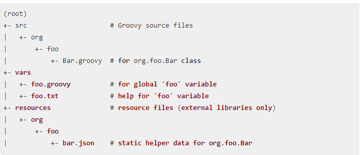
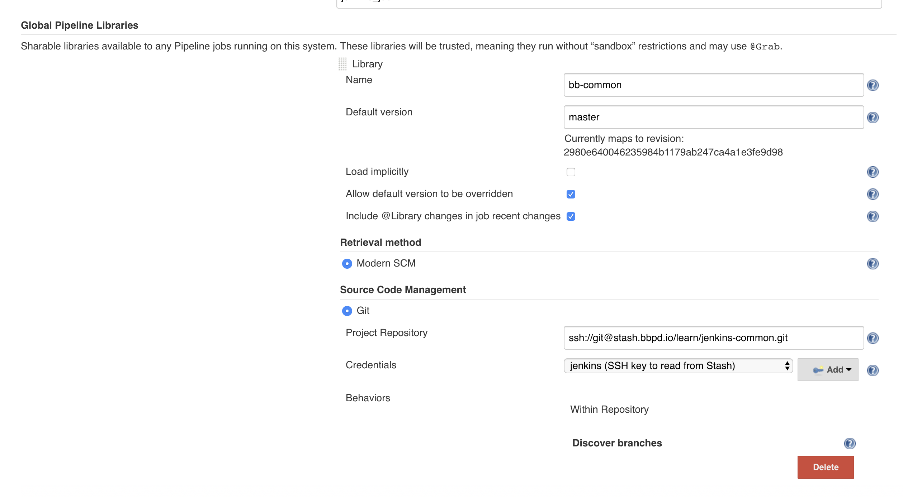

# Defining Shared Libraries(目录结构, 加载库, 实战)

## 前言

随着pipeline交付流水线在团队中的推广，使用pipeline脚本的job也迅速增加。虽然我们已经基于公司的技术栈特点做了一个尽可能通用的pipeline脚本样例，让搭建者只需要修改几个赋值参数就可以在自己的项目中应用，初衷是希望所有人能理解pipeline中的过程，但也发现一些比较麻烦的问题，比如有些人不熟悉具体的脚本拿来随意删改导致各种错误，还有就是我们在pipeline脚本中增加一些新功能时又需要通知所有的pipeline维护人员去修改，过程非常纠结。
这时候就意味着我们需要用到`pipline`的共享库功能（`Shared Libraries`）了，在各种项目之间共享`pipeline`核心实现，以减少冗余并保证所有job在构建的时候会调用最新的共享库代码 。
这篇我们就介绍下pipeline的这个黑科技：`Shared Libraries`

## 目录结构

`Shared Library`通过**库名称**、**代码检索方法（如SCM）**、**代码版本**三个要素进行定义，库名称尽量简洁，因为它会在脚本中被调用，在编写 `Shared Library`的时候，我们需要遵循固定的代码目录结构。
Shared Library代码目录结构如下：



```
(root)
+- src                     # Groovy source files
|   +- org
|       +- foo
|           +- Bar.groovy  # for org.foo.Bar class
+- vars
|   +- foo.groovy          # for global 'foo' variable
|   +- foo.txt             # help for 'foo' variable
+- resources               # resource files (external libraries only)
|   +- org
|       +- foo
|           +- bar.json    # static helper data for org.foo.Bar
```


* `src`目录就是标准的`Java`源目录结构。执行`Pipeline`时，**该目录将添加到类路径中**。

```
src
│   ├── bbopsCommon
│   │   └── JobSCMSuspend.groovy
│   └── bbopsEnv
│       ├── AWSAccounts.groovy
│       ├── AccountRegionEnvConfigMap.groovy

```

* `vars`目录托管定义可从`Pipeline`访问的**全局脚本**(一般我们可以在这里编写标准化脚本)。

```
vars
│   ├── bbops_build_debug_client_id.groovy
│   ├── bbops_captain_notifier.groovy
│   ├── bbops_job_scan_helper.groovy
```

* 每个`.groovy`文件的基本名称应使用驼峰（`camelCased`）模式，`.txt`（如果存在）可以包含格式化处理的文档。
* `resources`目录允许`libraryResource`从外部库中使用步骤来加载相关联的非`Groovy`文件。目前内部库不支持此功能。

```
resources
│   └── bbops-jenkins
│       ├── kubernetes
│       └── pipeline-configuration
```

## 定义全局库

这里只介绍全局 `Shared Library`的方式,通过`Manage Jenkins` » `Configure System` » `Global Pipeline Libraries` 的方式可以添加一个或多个共享库。

这些库将全局可用，系统中的任何`Pipeline`都可以利用这些库中实现的功能。并且通过配置SCM的方式，可以保证在每次构建时获取到指定`Shared Library`的最新代码。



```
@Library('my-shared-library') _
/* Using a version specifier, such as branch, tag, etc */
@Library('my-shared-library@1.0') _
/* Accessing multiple libraries with one statement */
@Library(['my-shared-library', 'otherlib@abc1234']) _
```

```
@Library('somelib')
import com.mycorp.pipeline.somelib.UsefulClass
```

## 动态加载库
从2.7版本起，`Pipeline: Shared Groovy Libraries plugin`插件提供了一个新的参数“library”，用于在脚本中加载（non-implicit）库
如果只需要加载全局变量/函数感兴趣（从vars/目录中），语法非常简单：
此后脚本中可以访问该库中的任何全局变量。

```
library 'my-shared-library'
```

采用此方式从`src/`目录中引用类也是可以的,不过只能动态地使用库类（无类型检查），从`library`步骤的返回值通过指定名称访问它们。比如`static`可以使用类似`Java`的语法来调用方法：

```
library('my-shared-library').com.mycorp.pipeline.Utils.someStaticMethod()
```

使用该`library`步骤时，您还可以指定一个版本,该指定版本将会覆盖默认版本。

```
library 'my-shared-library@master'
```


## Shared Libraries实战

我们在https://testerhome.com/topics/10010已经介绍了一个项目样例，可以看到过程已经非常复杂，让普通业务测试人员管理确实起来确实有点困难。
通过参数化处理后，除了一些各项目的业务变量，整个过程在所有项目都是通用的，完全适合采用共享库的方式进行改造，屏蔽脚本的复杂度。
在改造之前我们勾画了两种思路：**`pipeline模块库`和`模版库`**

### 1.模块库方式

模块库的方式，其实就是考虑把各个`stage`的实现通过函数化的方式抽象出来，比如获取代码的`stage`实现我们就抽象出`codeFetch()`，单元测试的 `stage`我们就抽象出`unitTest（）`.


* 特点：业务测试人员负责维护pipeline的初始赋值和整体结构，灵活度高，可自主裁剪`stage`场景
* 不足：整体结构还是比较复杂，需要维护的共享脚本比较多，无法对交付流水线过程进行统一管理，`Declarative Pipeline`只支持`script`部分脚本的共享库。

pipeline代码样例：

```
#!groovy
library 'bb-common'
pipeline {
    agent any
    parameters {
    //repoBranch参数
    string(name:'repoBranch', defaultValue: 'master', description: 'git分支名称')
    //服务器选择
    choice(name: 'server',choices:'192.168.1.107,9090\n192.168.1.60,9090', description: '测试服务器列表选择(IP,JettyPort,Name,Passwd)')
    string(name:'dubboPort', defaultValue: '31100', description: '测试服务器的dubbo服务端口')
    //单元测试代码覆盖率要求，各项目视要求调整参数
    string(name:'lineCoverage', defaultValue: '20', description: '单元测试代码覆盖率要求(%)，小于此值pipeline将会失败！')
    //若勾选在pipelie完成后会邮件通知测试人员进行验收
    booleanParam(name: 'isCommitQA',description: '是否在pipeline完成后，邮件通知测试人员进行人工验收',defaultValue: false )
    }
    //环境变量，初始确定后一般不需更改
    tools {
        maven 'maven3'
        jdk   'jdk8'
    }
    .......
    //pipeline的各个阶段场景
    stages {
        stage('代码获取') {
            steps {
              codeFetch()
            }
        }
        stage('单元测试') {
            steps {
              unitTest（）
            }
        }
    }
}
```

**共享库代码：**

```
// vars/codeFetch.groovy 
def call() { echo "starting fetch code......" }
```

### 2.模版库方式


Declarative 1.2（released in late September, 2017），开始支持整条`Declarative Pipeline`作为共享库，使用条件如下：

```
Only entire pipeline`s can be defined in shared libraries as of this time. This can only be done in `vars/*.groovy, and only in a callmethod. Only one Declarative Pipeline can be executed in a single build, and if you attempt to execute a second one, your build will fail as a result.
```

* 特点：可以将整条`declarative pipeline`作为共享库让各个项目调用，业务测试人员只需要维护初始化赋值参数即可。
* 不足：公司技术栈不统一的话，`pipeline`模版库的适配能力需要比较强（比如可能会出现虚拟机/docker共存，gradle/maven共存等多种情况），可能需要定义多个模版库，不过这些问题通过groovy代码逻辑上应该都可以控制。

**pipeline代码样例(敏感信息隐藏)：**


```
#!groovy
library 'weiyi-pipeline-library'
    def map = [:]
    /*参数化变量,运行时可选择*/
    //git分支名称
    map.put('repoBranch','master')
    //测试服务器列表选择(IP,JettyPort,Name,Passwd)
    map.put('server','192.168.1.107,9090\n192.168.1.60,9090')
    //测试服务器的dubbo服务端口
    map.put('dubboPort','31100')
    //单元测试代码覆盖率要求，各项目视要求调整参数
    map.put('lineCoverage','20')

    /*环境变量，初始确定后一般不需更改*/
    map.put('maven','maven3')
    map.put('jdk','jdk8')

    /*常量参数，初始确定后一般不需更改*/
    map.put("isDocker",false)
    //项目gitlab代码地址 
    map.put('REPO_URL','****')
    //git服务全系统只读账号，无需修改
    map.put('CRED_ID','****')
    //pom.xml的相对路径
    map.put('POM_PATH','pom.xml')
    //生成war包的相对路径
    map.put('WAR_PATH','rpc/war/target/*.war')
    //测试人员邮箱地址 
    map.put('QA_EMAIL','***')
    //接口测试job名称
    map.put('ITEST_JOBNAME','Guahao_InterfaceTest_ExpertPatient')

pipelineCall("maven",map)
```

**共享库代码：**

```
#!groovy
def call(String type,Map map) {
    if (type == "maven") {
    pipeline {
        agent any
        //参数化变量,目前只支持[booleanParam, choice, credentials, file, text, password, run, string]这几种参数类型，其他高级参数化类型还需等待社区支持
        parameters {
        //固定设置三类pipeline场景
        choice(name:'scene',choices:"scene1:完整流水线\nscene2:代码检查\nscene3:测试部署", description: '场景选择，默认运行完整流水线，如果只做开发自测可选择代码检查，如果只做环境部署可选择测试部署')
        //repoBranch参数后续替换成git parameter不再依赖手工输入,JENKINS-46451
        string(name:'repoBranch', defaultValue: "${map.repoBranch}", description: 'git分支名称')
        //服务器相关参数采用了组合方式，避免多次选择
        choice(name: 'server',choices:"${map.server}", description: '测试服务器列表选择')
        string(name:'dubboPort', defaultValue: "${map.dubboPort}", description: '测试服务器的dubbo服务端口')
        //单元测试代码覆盖率要求，各项目视要求调整参数
        string(name:'lineCoverage', defaultValue: "${map.lineCoverage}", description: '单元测试代码覆盖率要求(%)，小于此值pipeline将会失败！')
        //若勾选在pipelie完成后会邮件通知测试人员进行验收
        booleanParam(name: 'isCommitQA', defaultValue: false, description: '是否在pipeline完成后，邮件通知测试人员进行人工验收')
        }
        //环境变量，初始确定后一般不需更改
        tools {
            maven "${map.maven}"
            jdk   "${map.jdk}"
        }
        //常量参数，初始确定后一般不需更改
        environment{
            REPO_URL="${map.REPO_URL}"
            //git服务全系统只读账号，无需修改
            CRED_ID="${map.CRED_ID}"
            //pom.xml的相对路径
            POM_PATH="${map.POM_PATH}"
            //生成war包的相对路径
            WAR_PATH="${map.WAR_PATH}"
            //测试人员邮箱地址
            QA_EMAIL="${map.QA_EMAIL}"
            //接口测试job名称
            ITEST_JOBNAME="${map.ITEST_JOBNAME}"
        }

        options {
            disableConcurrentBuilds()
            timeout(time: 1, unit: 'HOURS')
            //保持构建的最大个数
            buildDiscarder(logRotator(numToKeepStr: '10'))
        }
        //pipeline的各个阶段场景
        stages {
            stage('代码获取') {
                steps {
                //一些初始化操作
                    script {
                    //根据param.server分割获取参数
                    def split=params.server.split(",")
                    serverIP=split[0]
                    jettyPort=split[1]
                    serverName=split[2]
                    serverPasswd=split[3]
                    //场景选择
                    println params.scene
                    //单元测试运行场景
                    isUT=params.scene.contains('scene1:完整流水线') || params.scene.contains('scene2:代码检查')
                    println "isUT="+isUT
                    //静态代码检查运行场景
                    isCA=params.scene.contains('scene1:完整流水线') || params.scene.contains('scene2:代码检查')
                    println "isCA="+isCA
                    //部署测试环境运行场景
                    isDP=params.scene.contains('scene1:完整流水线') || params.scene.contains('scene3:测试部署')
                    println "isDP="+isDP
                    //第三方库安全性检查
                    isDC=params.scene.contains('scene1:完整流水线')
                    println "isDC="+isDC
                    //接口测试运行场景
                    isIT=params.scene.contains('scene1:完整流水线')
                    println "isIT="+isIT
                    try{
                        wrap([$class: 'BuildUser']){
                        userEmail="${BUILD_USER_EMAIL},${QA_EMAIL}"
                        user="${BUILD_USER_ID}"
                        }
                   }catch(exc){
                        userEmail="${QA_EMAIL}"
                        user="system"
                    }
                  echo "starting fetchCode from ${REPO_URL}......"
                  // Get some code from a GitHub repository
                  git credentialsId:CRED_ID, url:REPO_URL, branch:params.repoBranch
                 }
                }
            }
            stage('单元测试') {
                when {
                     expression
                        {return isUT }
                }

            }
................................................................................................以下省略几百行
 else if (type == "gradle"){
   pipeline {
        agent any
................................................................................................继续省略几百行
}
```
通过这种方式，整个pipeline脚本的实现和复杂度就被封装到`Shared Library`中。而且如果我需要在原来的流水线基础上增加一个新的`stage`，比如新增安全测试场景，也只需要库开发人员修改共享库的功能，需要此场景的项目在map赋值时增加相应的赋值参数即可。


## 后记

`Shared Libraries`的方式抽象了各种项目之间共享的代码（甚至整条完整的`pipeline`），有效降低了业务测试人员使用pipeline脚本的复杂度。

同时通过外部源代码控制`（SCM）`的方式，可以保证最新提供的库代码功能可被所有`pipeline`项目即时使用，在大团队推广和协作过程中可起到非常重要的作用。


