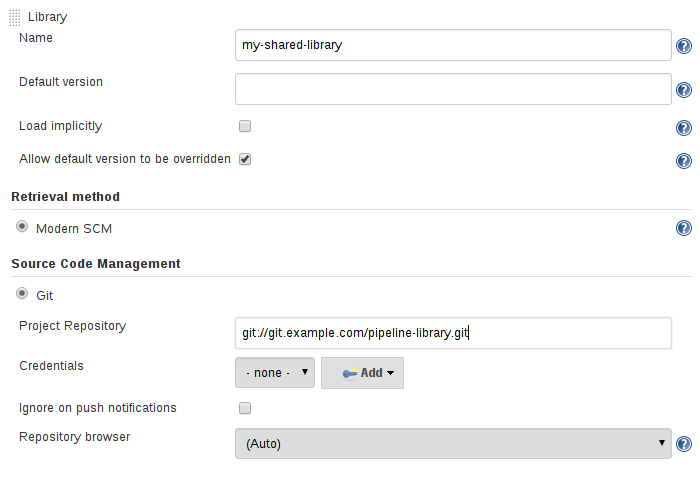
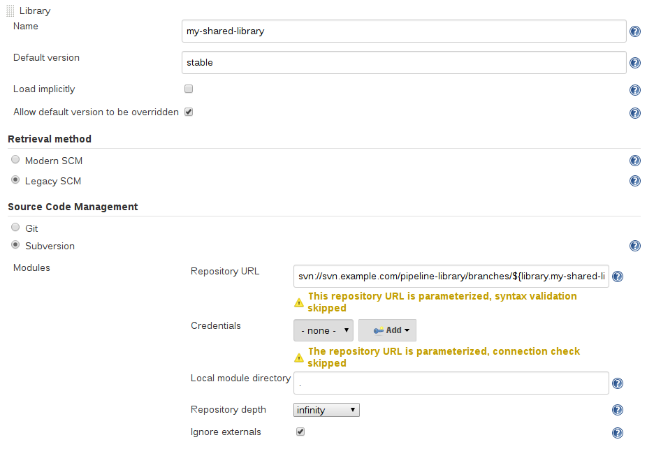

# Shared Library global configuration

## Library versions

The "Default version" for a configured Shared Library is used when "Load implicitly" is checked, or if a Pipeline references the library only by name, for example `@Library('my-shared-library') _`. 

If a "Default version" is not defined, the Pipeline must specify a version, for example `@Library('my-shared-library@master') _`.


**If "Allow default version to be overridden" is enabled in the Shared Library’s configuration**, a `@Library` annotation may also override a default version defined for the library. This also allows a library with "Load implicitly" to be loaded from a different version if necessary.

When using the `library` step you may also specify a version:

```
library 'my-shared-library@master'
```

Since this is a regular step, that version could be computed rather than a constant as with the annotation; for example:

```
library "my-shared-library@$BRANCH_NAME"
```

would load a library using the same SCM branch as the multibranch `Jenkinsfile`. As another example, you could pick a library by parameter:

```
properties([parameters([string(name: 'LIB_VERSION', defaultValue: 'master')])])
library "my-shared-library@${params.LIB_VERSION}"
```

Note that the library step may not be used to override the version of an implicitly loaded library. 

**It is already loaded by the time the script starts, and a library of a given name may not be loaded twice.**


## Retrieval Method

The best way to specify the SCM is using an SCM plugin which has been specifically updated to support a new API for checking out an arbitrary named version (**Modern SCM** option). As of this writing, the latest versions of the Git and Subversion plugins support this mode.





## Legacy SCM

SCM plugins which have not yet been updated to support the newer features required by Shared Libraries, may still be used via the Legacy SCM option. In this case, include `${library.yourlibrarynamehere.version}` wherever a `branch/tag/ref` may be configured for that particular SCM plugin. 

**This ensures that during checkout of the library’s source code, the SCM plugin will expand this variable to checkout the appropriate version of the library.**




## Dynamic retrieval

If you only specify a library name (optionally with version after `@`) in the `library` step, Jenkins will look for a preconfigured library of that name. (Or in the case of a `github.com/owner/repo` automatic library it will load that.)

**But you may also specify the retrieval method dynamically, in which case there is no need for the library to have been predefined in Jenkins.** Here is an example:

```
library identifier: 'custom-lib@master', retriever: modernSCM(
  [$class: 'GitSCMSource',
   remote: 'git@git.mycorp.com:my-jenkins-utils.git',
   credentialsId: 'my-private-key'])
```
**It is best to refer to `Pipeline Syntax` for the precise syntax for your SCM.**

Note that the library version must be specified in these cases.

