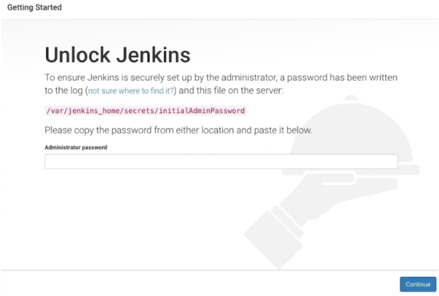
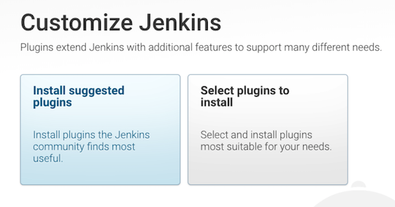
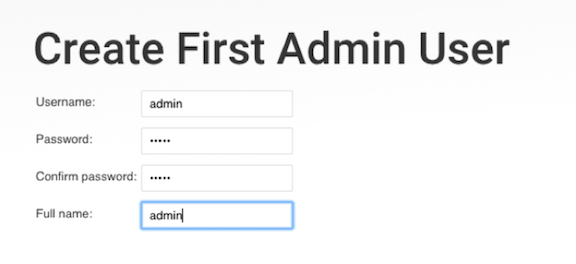
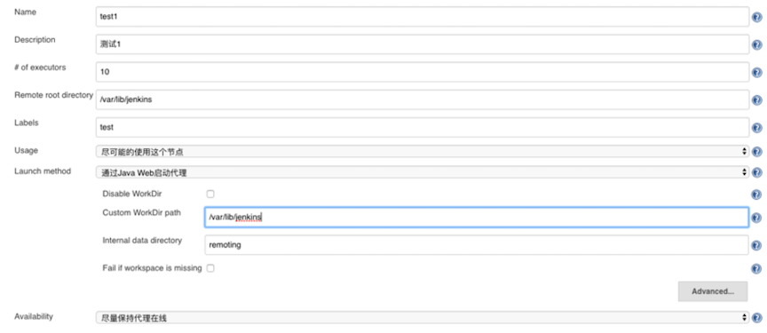
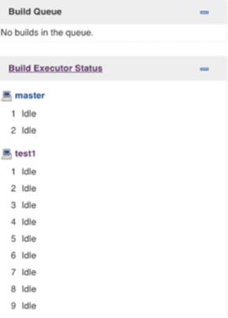
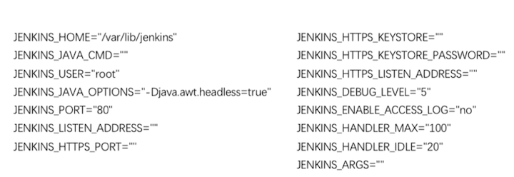

# 第二章 安装Jenkins

## 1. 先决条件

### 1.1 软件要求

Java8 无论是Java运行时环境（JRE）还是Java开发工具包（JDK）都可以。 安装JDK：`yum -y install java`

### 1.2 硬件要求

* **最低配置**： `256MB`可用内存，`1GB`可用磁盘空间（Docker推荐10GB）。
* **小团队配置**： `1GB+`可用内存， `50GB+`可用磁盘空间。
* **注意**： 如果将`Jenkins`以`docker`方式运行的话，这些都不是必须的。

## 2. 安装部署

### 2.1 基于WAR包部署

Jenkins的web应用程序`archive（war）`包是可以在任何支持Java的操作系统上运行。 Jenkins最新 [war包](https://mirrors.tuna.tsinghua.edu.cn/jenkins/war-stable/2.107.2/)

* 将下载的`war`包放到`jenkins`的目录中（可以自定义)。
* 运行命令 `java -jar jenkins.war`启动。
* 此时可以看到`Jenkins`的启动日志，查看是否有异常。
* 通过浏览器访问`http://localhost:8080`。

注意：可以通过 `--httpPort`方式指定端口， `java -jar jenkins.war -httpPort=9090`。

### 2.2 基于MAC系统部署

* 下载[软件包](http://mirrors.jenkins.io/osx/latest)手动安装
* `brew install jenkins` #安装jenkins最新版本
* `brew install jenkins-lts` #安装jenkinsLTS版本

### 2.3 基于Windows系统安装

* 下载[软件包](http://mirrors.jenkins.io/windows/latest)通过向导安装即可。


### 2.4 基于Linux系统部署（推荐）

* 下载[软件包](https://mirrors.tuna.tsinghua.edu.cn/jenkins/redhat-stable/)
* `rpm –ivh jenkins-2.150.3-1.1.noarch.rpm` #安装
* `service jenkins start` #启动服务
* `chkconfig jenkins on` #开机自启


## 3. 安装后配置

### 3.1 解锁Jenkins

* 当您第一次访问`Jenkins`的时候，系统会要求您使用自动生成的密码对其进行解锁。
* 解锁秘钥可以通过`$JENKINS_HOME/secrets/initialAdminPassword`文件获取。还可以通过在启动日志中获取。

 

### 3.2 自定义Jenkins插件

* 解锁`Jenkins`之后再自定义`Jenkins`页面，您可以安装任何数量的插件作为初始化的一部分。
* 分别是安装建议的插件和选择要安装的插件（如果不确定要安装那些的时候可以选择此选项，灵活的自定义安装）。
* 插件安装多了也没关系，可以后面再jenkins插件管理页面删除哦

 


### 3.3 创建用户

* 在这里创建一个管理员账号，到此jenkins的初始化配置已完成。

 

### 3.4 配置更新站点

* 由于使用官方的站点速度相对很慢，这里采用清华大学的jenkins更新站点。
* 站点地址: [https://mirrors.tuna.tsinghua.edu.cn/jenkins/updates/update-center.json](https://mirrors.tuna.tsinghua.edu.cn/jenkins/updates/update-center.json)


 

### 3.5 安装slave节点

* **系统管理->节点管理**

 

* 创建完成后会出现slave节点启动的命令，下载`agent.jar`，然后启动服务。

 

* 启动命令

```
wget http://192.168.0.41/jnlpJars/agent.jar
java -jar agent.jar -jnlpUrl http://192.168.0.41/computer/test1/slave-agent.jnlp -secret 807b0135fb5b071d99930166ac4fc5dd0cf355e670a66da73120dfa2e8cebc5f -workDir "/var/lib/jenkins"
```

* 启动成功

 


### 3.6 Jenkins配置文件

以`rpm`方式部署的配置文件在`/etc/sysconfig/jenkins`，**可以定义Jenkins启动参数和端口**。

```
$ grep -v ^$/etc/sysconfig/jenkins | grep -v ^#
```
 

