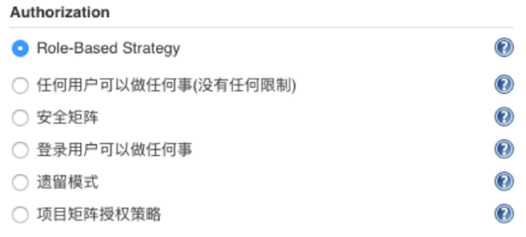

# 第三章 管理Jenkins（用户、凭据、权限）

## 1. 用户管理

* 配置用户接入入口: **系统管理->全局安全配置**。
* 默认使用的是`Jenkins`数据库存储。
* 可以选择集成`LDAP`服务或者是`Gitlab`服务（需要安装插件后才会有）。 

 

### 1.1 查看用户

以使用Jenkins专有数据库为例，用户管理入口: `系统管理-> 管理用户`

### 1.2 创建用户

 

### 1.3 删除用户

 

### 1.4 更新用户

 

## 2. 凭据管理

* 凭据可以用来存储需要密文保护的数据库密码、Gitlab密码信息。
* 凭据类型：

 

### 2.1 查看凭据

**`凭据-> 系统-> 全局凭据`**

 

### 2.2 新建凭据

 

### 2.3 删除凭据

 

### 2.4 更新凭据

 

### 2.5 移动凭据

* 凭据支持多个域，支持将凭据移动到其他域中。 

 

## 3. 权限管理

权限默认使用 `Role-Based Strategy`,其他方式如图所示。

 

### 3.1 管理权限

* 系统设置->`Manage and Assign Roles`->`Manage Roles`
* `Global roles`：**添加用户和用户组，分配某个用户属于哪个用户组。**
* `Project roles`：**添加某个工程或某一组工程的用户或用户组**
* `Slave roles`：**添加某个节点或某一组节点的用户或用户组**

 

### 3.2 全局权限

**凭据参数、字符参数、密码参数、布尔值参数、文件参数、文本参数、运行时参数、选项参数** 

 

### 3.3 项目权限

 

### 3.4 权限授权

**系统设置->Manage and Assign Roles->Assign Roles** 

 