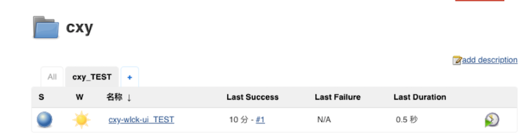

# 第三章 管理Jenkins（项目、视图、插件）

## 1. 项目管理

### 1.1 命名规范

**业务名称-应用名称-应用类型_环境类型**： `cxy-wlck-ui_TEST`, **只有命名规范才方便管理项目**。

### 1.2 新建项目

 

**设置构建历史**

 

**选择参数化构建**

 

**设置构建触发器**

 

**设置Jenkinsfile**

 

**构建项目**

 

**查看构建日志**

 

**调试Pipeline**

 

### 1.3 删除/禁用项目

 

### 1.4 项目分类

* 以业务简称为名，创建工程文件夹。将同一个业务的工程全部放到同一个文件夹中。 

 

* 移动项目 

 

* 外部

 

* 内部

 

## 2. 视图管理

**默认会创建一个all视图里面存放所有的项目。**

### 2.1 创建视图

**凭据-> 系统-> 全局凭据**

 

 

 

### 2.2 删除视图

 

### 2.3 更新视图

 

## 3. 插件管理

**系统设置->插件管理**

 

### 3.1 安装插件

**勾选要安装的插件，选择安装后不重启。（有些插件需要安装后重启）**

 

**安装**

 

### 3.2 卸载插件

 

### 3.3 上传插件

 

### 3.4 切换插件更新站点

 

