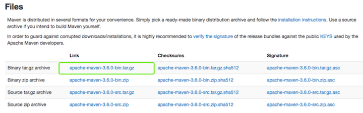
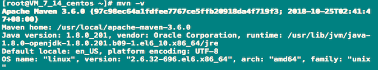
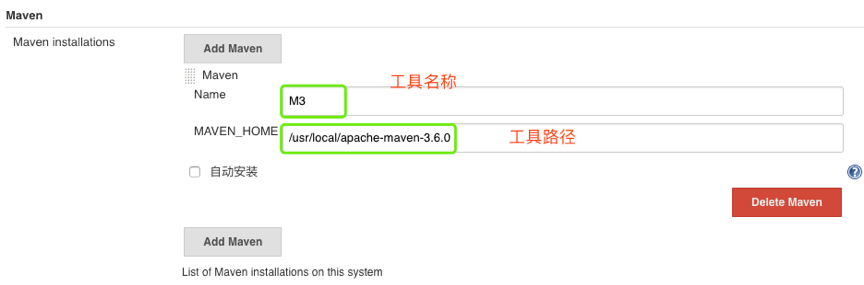
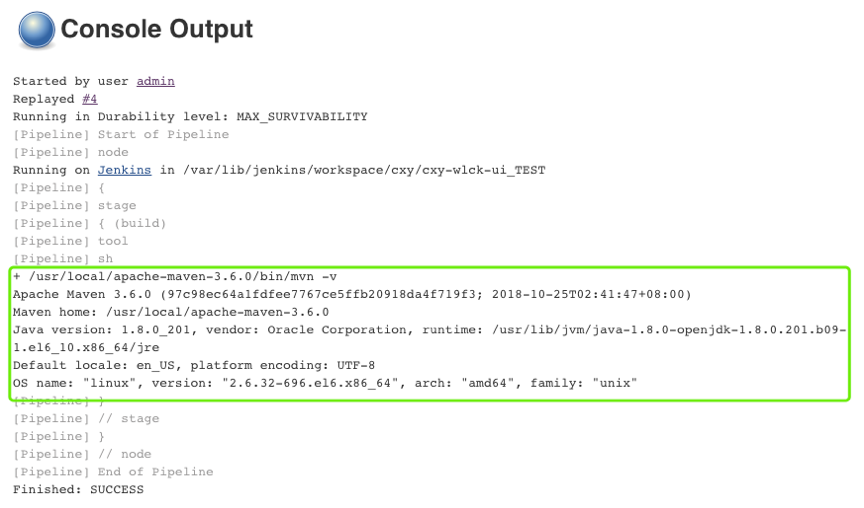

# Jenkins集成maven

## 1.1 先决条件

* JDK：在maven3.3 以上的版本需要JDK版本1.7+。内存：没有最低限制。
* 磁盘：1G+可用磁盘空间。 操作系统：没有限制。
* 下载maven [Download](http://maven.apache.org/download.cgi)



## 1.2 安装maven

```
tar zxf apache-maven-3.6.0-bin.tar.gz -C /usr/local/
#设置全局变量（/etc/profile）
export MAVEN_HOME=/usr/local/apache-maven-3.6.0
export PATH=$PATH:$MAVEN_HOME/bin
source /etc/profile
```

**测试**



## 1.3 Jenkins配置maven

**系统设置->全局工具配置**



**编写Jenkinsfile**

```
node {
    stage ("build"){
        mavenHome = tool 'M3'
        sh "${mavenHome}/bin/mvn -v"
    }
}
```

**构建测试**



**到此`jenkins`集成`maven`就完成了。**

## 1.4 maven常用命令

```
clean install -DskipTests
clean package 
```


