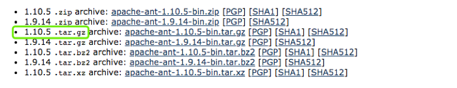
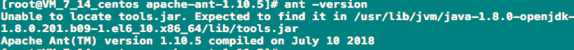
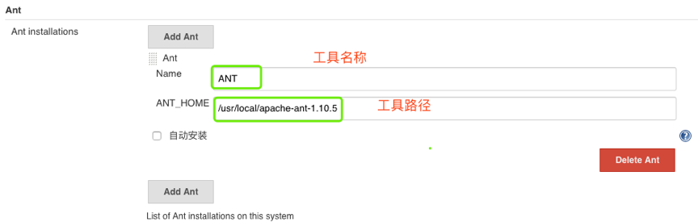
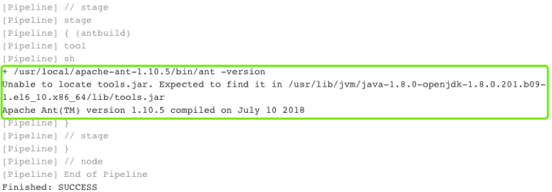

# Jenkins集成Ant

## 1. 先决条件

下载. [Download](https://ant.apache.org/bindownload.cgi)



## 2.安装ant

```
tar zxf apache-ant-1.10.5-bin.tar.gz -C /usr/local/
#添加全局变量（/etc/profile）
export ANT_HOME=/usr/local/apache-ant-1.10.5
export PATH=$PATH:$MAVEN_HOME/bin:$ANT_HOME/bin
source /etc/profile
```

**测试**



```
ant -version
```

## 3 Jenkins配置ant




**编写Jenkinsfile**

```
node {
    stage ("build"){
        antHome = tool 'ANT'
        sh "${antHome}/bin/ant -version"
    }
}
```

**构建测试**



到此ant的集成就完成了

## 4.Ant常用命令

```
ant -buildfile -f build.xml
```

