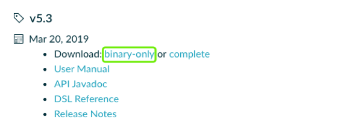
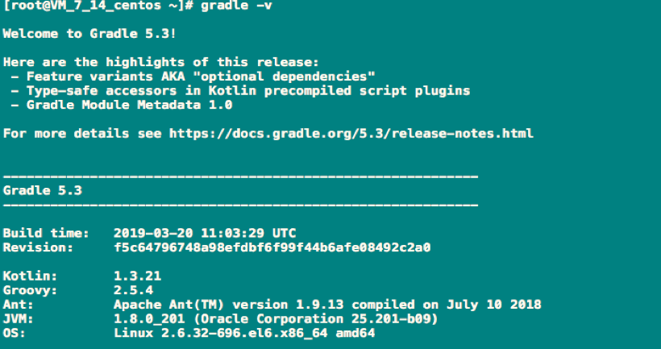
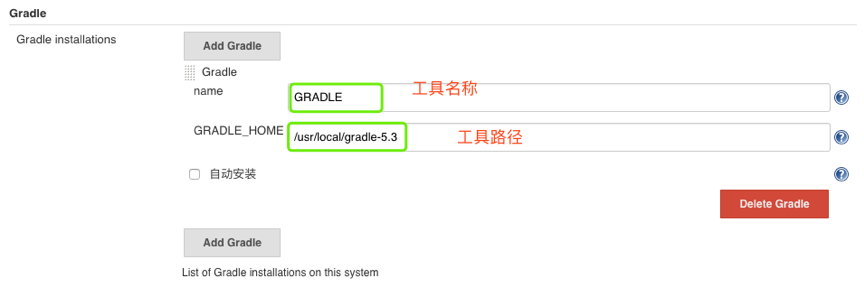
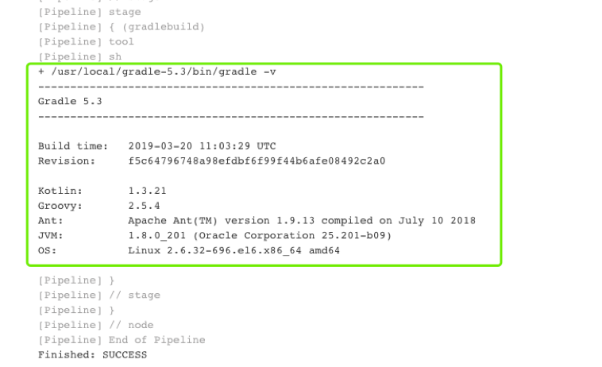

# Jenkins集成Gradle

## 1. 先决条件

[下载](https://downloads.gradle.org/distributions/gradle-5.3-bin.zip)



## 2 安装Gradle

```
unzip gradle-5.3-bin.zip -d /usr/local/
#添加全局变量（/etc/profile）
export GRADLE_HOME=/usr/local/gradle-5.3
export PATH=$PATH: $GRADLE_HOME/bin
source /etc/profile
```

**测试**



```
$ gradle -v
```

## 3 Jenkins配置gradle

**系统设置->全局工具配置**



**编写Jenkinsfile**

```
node {
    stage ("gradlebuild"){
        gradleHome = tool 'GRADLE'
        sh "${gradleHome}/bin/gradle -v"
    }
}
```



**构建测试到此jenkins配置gradle完成**


## 4 Gradle常用命令

* `./gradlew -v` 版本号，首次运行，没有gradle的要下载的哦。
* `./gradlew clean` 删除`HelloWord/app`目录下的`build`文件夹
* `./gradlew build` 检查依赖并编译打包
* `./gradlew assembleDebug` 编译并打Debug包
* `./gradlew assembleRelease` 编译并打Release的包
* `./gradlew installRelease` Release模式打包并安装
* `./gradlew uninstallRelease` 卸载Release模式包