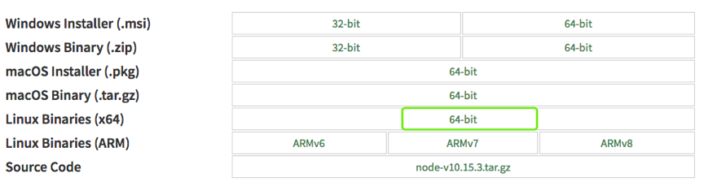
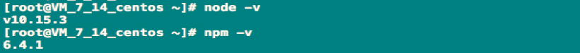
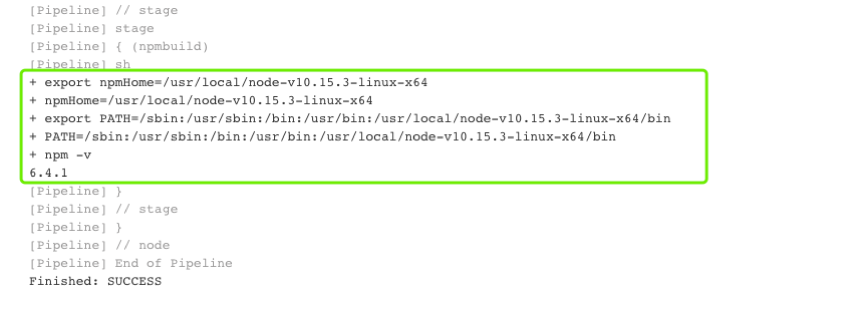

# Jenkins集成NPM

## 1 先决条件

下载[Download](https://nodejs.org/en/download/)



## 2 安装Node

```
tar xf node-v10.15.3-linux-x64.tar.xz -C /usr/local/
#添加全局变量（/etc/profile）
export NODE_HOME=/usr/local/node-v10.15.3-linux-x64
export PATH=$PATH: $NODE_HOME/bin
source /etc/profile
```

**测试**



```
node -v
npm -v
```

## 3 Jenkins配置Npm

* 在Jenkins全局工具配置中并没有node，可以直接通过Jenkinsfile定义使用。
* Jenkinsfile

```
node {
    stage ("npmbuild"){
        sh """
           export npmHome=/usr/local/node-v10.15.3-linux-x64
           export PATH=\$PATH:\$npmHome/bin
           npm -v
           """
    }    
}
```

**构建测试**



