# Jenkins系统集成LADP

## 1. 安装LDAP

参考文档：[https://www.cnblogs.com/mascot1/p/10498392.html](https://www.cnblogs.com/mascot1/p/10498392.html)


### 1.1 先决条件

```
#关闭SELINUX
vim /etc/sysconfig/selinux   # SELINUX=disabled
setenforce 0 

#关闭防火墙
systemctl stop firewalld	
systemctl disable firewalld
```

### 1.2 安装ldap

```
#安装ldap工具
yum install -y openldap-servers openldap-clients migrationtools  
slappasswd   #据提示输入密码会返回加密的密码字符串，保存好这个字符串

#配置数据库缓存
cp /usr/share/openldap-servers/DB_CONFIG.example /var/lib/ldap/DB_CONFIG 
chown -R ldap:ldap /var/lib/ldap/

#测试配置文件
slaptest -u  #出现configfile testing successed 说明成功了

#启动ldap
systemctl start slapd.service 
systemctl enable slapd.service

#导入模板
ls /etc/openldap/schema/*.ldif | xargs -I {} sudo ldapadd -Y EXTERNAL -H ldapi:/// -f {}
```

## 2. 安装LDAP控制台

### 2.1 先决条件

```
#安装apache
yum -y install httpd 

#修改配置文件
vim /etc/httpd/conf/httpd.conf #AllowOverride all

#启动服务测试
systemctl start httpd
systemctl enable httpd
    curl 127.0.0.1
```

### 2.2 安装phpldapadmin

```
#安装phpldapadmin
cat /etc/yum.repos.d/epel.repo 
[epel]
name=Extra Packages for Enterprise Linux 7 - $basearch
baseurl=https://mirrors.tuna.tsinghua.edu.cn/epel/7Server/x86_64/
enabled=1
gpgcheck=0


yum install phpldapadmin
```

### 2.3 更改配置文件

```
#修改配置文件
vim /etc/phpldapadmin/config.php
$servers->setValue('server','host','127.0.0.1');
$servers->setValue('server','port',389);
$servers->setValue('server','base',array('dc=my-domain,dc=com'));
$servers->setValue('login','auth_type','session');
$servers->setValue('login','attr','dn');

$servers->setValue('login','attr','dn'); #注释掉

#修改httpd配置文件
vim /etc/httpd/conf.d/phpldapadmin.conf 
Alias /phpldapadmin /usr/share/phpldapadmin/htdocs
Alias /ldapadmin /usr/share/phpldapadmin/htdocs

<Directory /usr/share/phpldapadmin/htdocs>
  <IfModule mod_authz_core.c>
    # Apache 2.4
    Require local
    Require ip 192.168.0
  </IfModule>
  <IfModule !mod_authz_core.c>
    # Apache 2.2
    Order Deny,Allow
    Deny from all
    Allow from 127.0.0.1
    Allow from ::1
  </IfModule>
</Directory>

#创建基础目录
vim /etc/openldap/base.ldif
dn: dc=my-domain,dc=com
o: ldap
objectclass: dcObject
objectclass: organization
    dc: my-domain

```

### 2.4 访问测试

```
#重启httpd服务
service restart httpd
#访问测试
http://192.168.0.41/phpldapadmin
```

## 3. LDAP创建组织

* 参考文档：[https://www.cnblogs.com/mascot1/p/10498460.html](https://www.cnblogs.com/mascot1/p/10498460.html)

### 3.1 创建OU

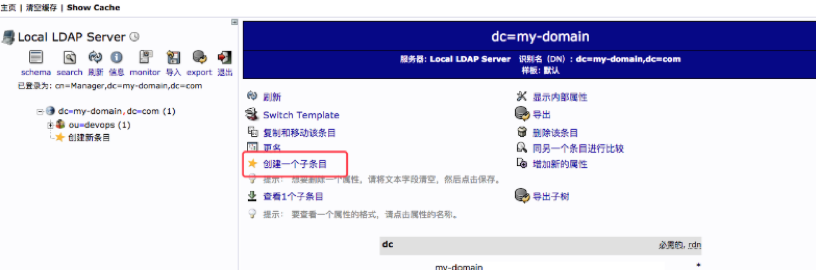

* **选择`Organisational unit` 组织单元**

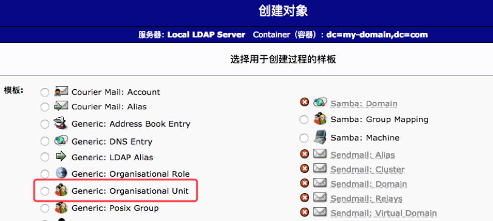

* **输入OU名称**

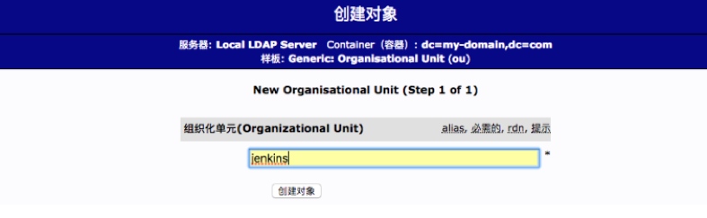

* **提交信息** 

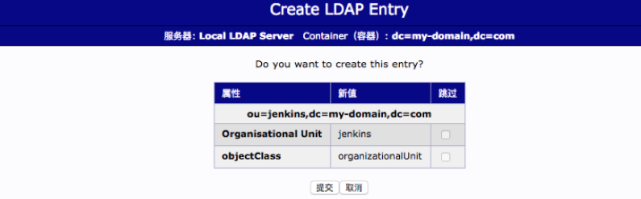

* **查看结果**

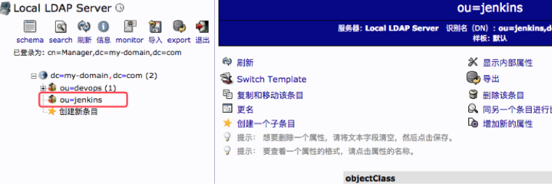

### 3.2 创建人员

**选择OU->选择新建子条目**

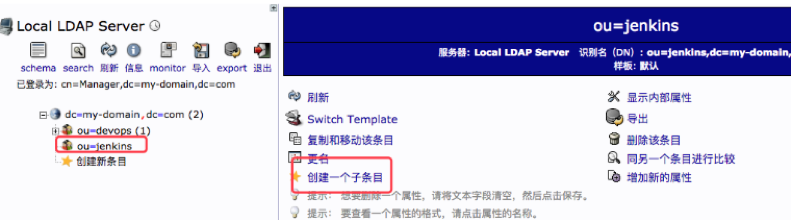

**选择默认模板**

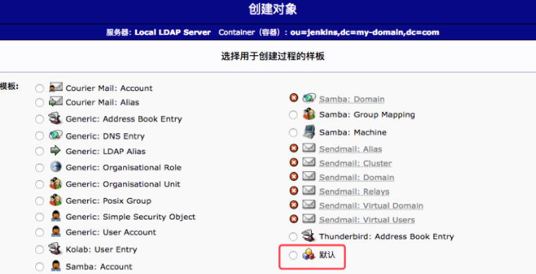

**选择inetorgperson**

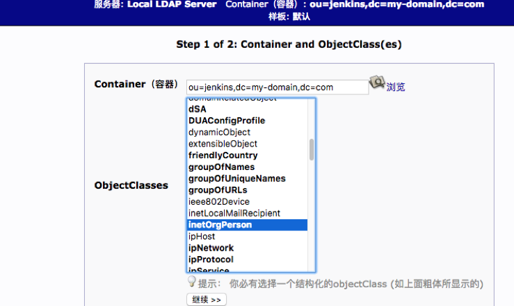

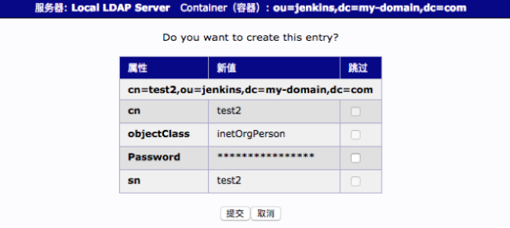

* 填写并提交信息
* 用户创建完成 

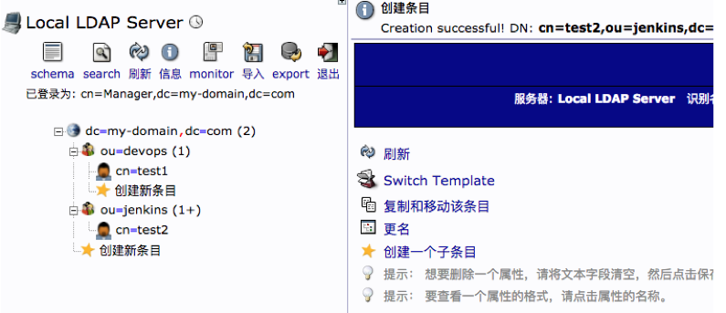

## 4.Jenkins集成LDAP

参考文档：[https://www.cnblogs.com/mascot1/p/10498513.html](https://www.cnblogs.com/mascot1/p/10498513.html)

### 4.1 先决条件

1. 准备一个`adminDN`账号用于查询用户。 `cn=Manager,dc=my-domain,dc=com`
2. 将访问`Jenkins`的用户放到一个OU中。 `ou=jenkins,dc=my-domain,dc=com`
3. 提供`ldap`服务器地址。 `ldap://192.168.0.41:389`

### 4.2 Jenkins配置

* 安装ldap插件 

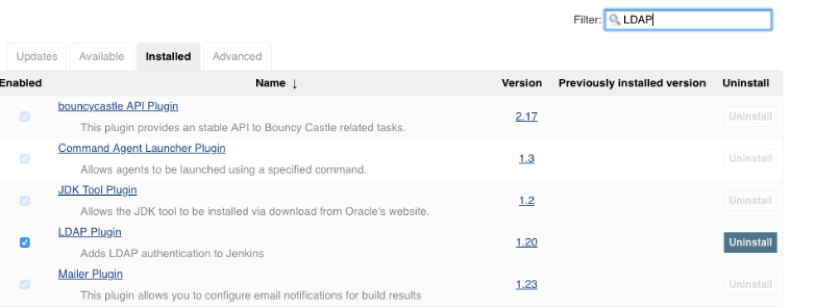

* 全局安全配置 

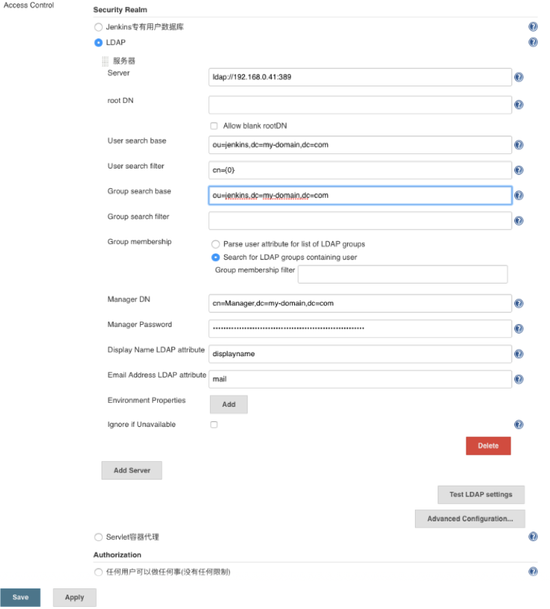

* 选择账号测试，出现一下信息集成完毕

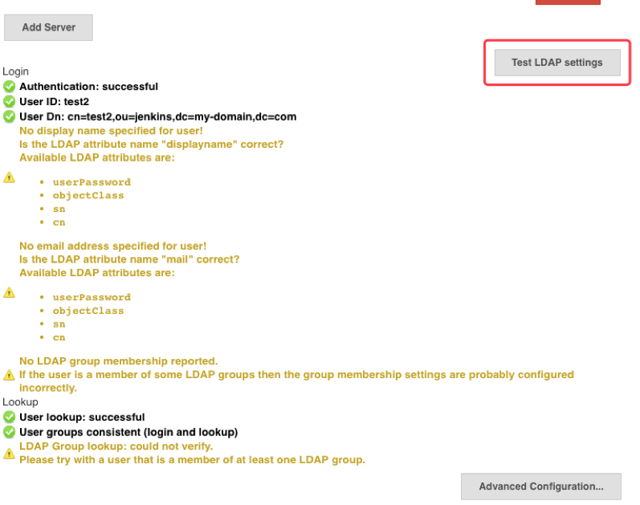


