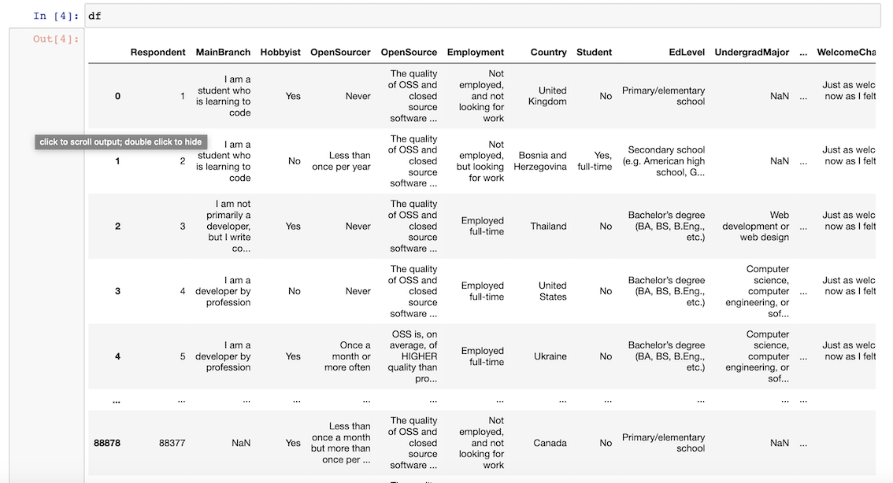
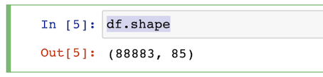
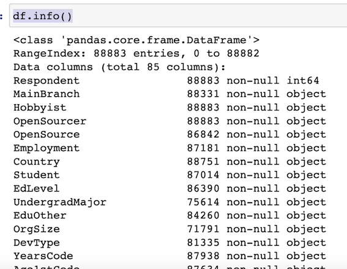
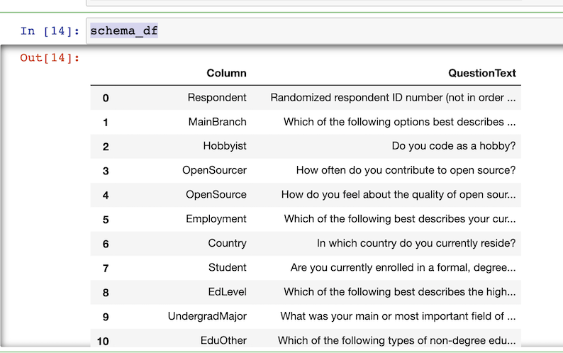
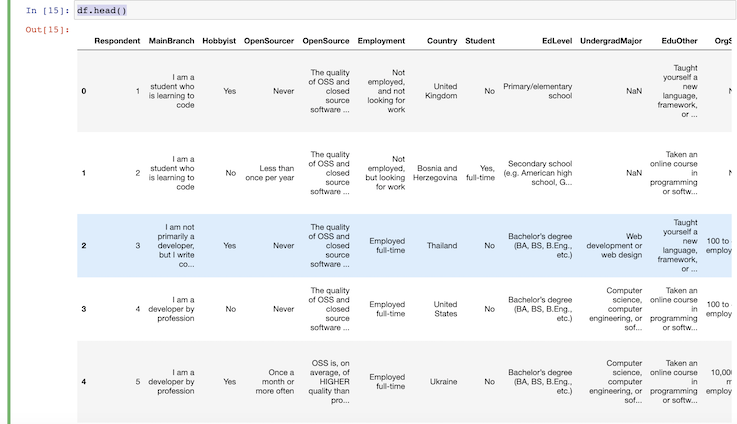
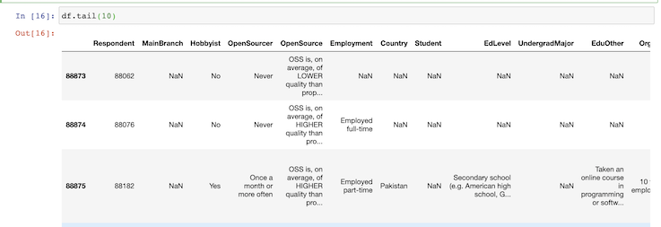

# Pandas Installation and Loading Data 

### Data Resource 

**StackOverflow Survey Download Page**

[http://bit.ly/SO-Survey-Download](http://bit.ly/SO-Survey-Download)

### Installation

```
pip3 install pandas
pip3 install jupyterlab
```

### Start Notebook

```
$ jupyter notebook
[I 19:06:21.380 NotebookApp] JupyterLab extension loaded from /usr/local/lib/python3.7/site-packages/jupyterlab
[I 19:06:21.380 NotebookApp] JupyterLab application directory is /usr/local/share/jupyter/lab
[I 19:06:21.383 NotebookApp] Serving notebooks from local directory: /Users/i515190/Devops_sap/python_tutorial/pandas
[I 19:06:21.383 NotebookApp] The Jupyter Notebook is running at:
[I 19:06:21.383 NotebookApp] http://localhost:8888/?token=f4f09264891e9a4e7e7ec927e7ac796711df2979bc551088
[I 19:06:21.383 NotebookApp]  or http://127.0.0.1:8888/?token=f4f09264891e9a4e7e7ec927e7ac796711df2979bc551088
[I 19:06:21.383 NotebookApp] Use Control-C to stop this server and shut down all kernels (twice to skip confirmation).
```

**`Ctrl+Enter` Run the cell**

### Load the data

```
import pandas as pd
df = pd.read_csv('data/survey_results_public.csv')
df
```
> The default output is 20 cols and rows

 

### Check the dataframe shape and info

```
df.shape
```
 

```
df.info()
```

 

### Set display cols and rows to 85

```
pd.set_option('display.max_columns',85)
pd.set_option('display.max_rows',85)
```

```
schema_df = pd.read_csv('data/survey_results_schema.csv')
schema_df
```

 

### Output df head and tail

> Default output is 5

```
df.head()
```

 

> Add parameter

```
df.tail(10)
```

 
