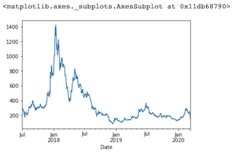

# Python Pandas Tutorial (Part 10): Working with Dates and Time Series Data


```
import pandas as pd
df = pd.read_csv('ETH_1h.csv')
df.head()
```

```
Date	Symbol	Open	High	Low	Close	Volume
0	2020-03-13 08-PM	ETHUSD	129.94	131.82	126.87	128.71	1940673.93
1	2020-03-13 07-PM	ETHUSD	119.51	132.02	117.10	129.94	7579741.09
2	2020-03-13 06-PM	ETHUSD	124.47	124.85	115.50	119.51	4898735.81
3	2020-03-13 05-PM	ETHUSD	124.08	127.42	121.63	124.47	2753450.92
4	2020-03-13 04-PM	ETHUSD	124.85	129.51	120.17	124.08	4461424.71
```

```
df.loc[0, 'Date']

'2020-03-13 08-PM'
```

### 'str' object has no attribute 'day_name'

```
df.loc[0, 'Date'].day_name()

---------------------------------------------------------------------------
AttributeError                            Traceback (most recent call last)
<ipython-input-5-55e7fa569c9a> in <module>
----> 1 df.loc[0, 'Date'].day_name()

AttributeError: 'str' object has no attribute 'day_name'
```

### Switch 'Date' Col to datetime `to_datetime`

```
df['Date'] = pd.to_datetime(df['Date'])
```
```
...
ParserError: Unknown string format: 2020-03-13 08-PM
```

#### Switch 'Date' Col to datetime `to_datetime()` with format

http://bit.ly/pandas-dt-fmt

```
df['Date'] = pd.to_datetime(df['Date'], format='%Y-%m-%d %I-%p')
df['Date']
```

```
0       2020-03-13 20:00:00
1       2020-03-13 19:00:00
2       2020-03-13 18:00:00
3       2020-03-13 17:00:00
4       2020-03-13 16:00:00
                ...        
23669   2017-07-01 15:00:00
23670   2017-07-01 14:00:00
23671   2017-07-01 13:00:00
23672   2017-07-01 12:00:00
23673   2017-07-01 11:00:00
Name: Date, Length: 23674, dtype: datetime64[ns]
```

### `day_name()` function

```
df.loc[0, 'Date'].day_name()
'Friday'
```

### String to time with lambda function for whole DataFrame

**`pd.datetime.strptime(x, '%Y-%m-%d %I-%p')`**

```
d_parser = lambda x: pd.datetime.strptime(x, '%Y-%m-%d %I-%p')
df = pd.read_csv('ETH_1h.csv', parse_dates=['Date'], date_parser=d_parser)
```

### dt class and datetime method 

Change whole date col to weekday 

```
df['Date'].dt.day_name()
```
```
0          Friday
1          Friday
2          Friday
3          Friday
4          Friday
           ...   
23669    Saturday
23670    Saturday
23671    Saturday
23672    Saturday
23673    Saturday
Name: Date, Length: 23674, dtype: object
```

### Timedelta

```
df['Date'].min()
Timestamp('2017-07-01 11:00:00')

df['Date'].max()
Timestamp('2020-03-13 20:00:00')

df['Date'].max() - df['Date'].min()
Timedelta('986 days 09:00:00')
```


##  Date filter

```
filt = (df['Date'] >= '2020' )
df.loc[filt]

	Date	Symbol	Open	High	Low	Close	Volume	DayOFweek
0	2020-03-13 20:00:00	ETHUSD	129.94	131.82	126.87	128.71	1940673.93	Friday
1	2020-03-13 19:00:00	ETHUSD	119.51	132.02	117.10	129.94	7579741.09	Friday
2	2020-03-13 18:00:00	ETHUSD	124.47	124.85	115.50	119.51	4898735.81	Friday
3	2020-03-13 17:00:00	ETHUSD	124.08	127.42	121.63	124.47	2753450.92	Friday
4	2020-03-13 16:00:00	ETHUSD	124.85	129.51	120.17	124.08	4461424.71	Friday
...	...	...	...	...	...	...	...	...
1744	2020-01-01 04:00:00	ETHUSD	129.57	130.00	129.50	129.56	702786.82	Wednesday
1745	2020-01-01 03:00:00	ETHUSD	130.37	130.44	129.38	129.57	496704.23	Wednesday
1746	2020-01-01 02:00:00	ETHUSD	130.14	130.50	129.91	130.37	396315.72	Wednesday
1747	2020-01-01 01:00:00	ETHUSD	128.34	130.14	128.32	130.14	635419.40	Wednesday
1748	2020-01-01 00:00:00	ETHUSD	128.54	128.54	128.12	128.34	245119.91	Wednesday
1749 rows × 8 columns
```

### Year between 2019 and 2020

```
filt = (df['Date'] >= '2019' ) & (df['Date'] < '2020' )
df.loc[filt]


Date	Symbol	Open	High	Low	Close	Volume	DayOFweek
1749	2019-12-31 23:00:00	ETHUSD	128.33	128.69	128.14	128.54	440678.91	Tuesday
1750	2019-12-31 22:00:00	ETHUSD	128.38	128.69	127.95	128.33	554646.02	Tuesday
1751	2019-12-31 21:00:00	ETHUSD	127.86	128.43	127.72	128.38	350155.69	Tuesday
1752	2019-12-31 20:00:00	ETHUSD	127.84	128.34	127.71	127.86	428183.38	Tuesday
1753	2019-12-31 19:00:00	ETHUSD	128.69	128.69	127.60	127.84	1169847.84	Tuesday
...	...	...	...	...	...	...	...	...
10504	2019-01-01 04:00:00	ETHUSD	130.75	133.96	130.74	131.96	2791135.37	Tuesday
10505	2019-01-01 03:00:00	ETHUSD	130.06	130.79	130.06	130.75	503732.63	Tuesday
10506	2019-01-01 02:00:00	ETHUSD	130.79	130.88	129.55	130.06	838183.43	Tuesday
10507	2019-01-01 01:00:00	ETHUSD	131.62	131.62	130.77	130.79	434917.99	Tuesday
10508	2019-01-01 00:00:00	ETHUSD	130.53	131.91	130.48	131.62	1067136.21	Tuesday
8760 rows × 8 columns
```

### Date between `2019-01-01` and `2020-01-01`

```
filt = (df['Date'] >= pd.to_datetime('2019-01-01')) & (df['Date'] < pd.to_datetime('2020-01-01'))
df.loc[filt]

	Date	Symbol	Open	High	Low	Close	Volume	DayOFweek
1749	2019-12-31 23:00:00	ETHUSD	128.33	128.69	128.14	128.54	440678.91	Tuesday
1750	2019-12-31 22:00:00	ETHUSD	128.38	128.69	127.95	128.33	554646.02	Tuesday
1751	2019-12-31 21:00:00	ETHUSD	127.86	128.43	127.72	128.38	350155.69	Tuesday
1752	2019-12-31 20:00:00	ETHUSD	127.84	128.34	127.71	127.86	428183.38	Tuesday
1753	2019-12-31 19:00:00	ETHUSD	128.69	128.69	127.60	127.84	1169847.84	Tuesday
...	...	...	...	...	...	...	...	...
10504	2019-01-01 04:00:00	ETHUSD	130.75	133.96	130.74	131.96	2791135.37	Tuesday
10505	2019-01-01 03:00:00	ETHUSD	130.06	130.79	130.06	130.75	503732.63	Tuesday
10506	2019-01-01 02:00:00	ETHUSD	130.79	130.88	129.55	130.06	838183.43	Tuesday
10507	2019-01-01 01:00:00	ETHUSD	131.62	131.62	130.77	130.79	434917.99	Tuesday
10508	2019-01-01 00:00:00	ETHUSD	130.53	131.91	130.48	131.62	1067136.21	Tuesday
8760 rows × 8 columns
```

## Set Date as Index

```
df.set_index('Date', inplace=True)
df['2019']
```

```
					Symbol	Open	High	Low	Close	Volume	DayOFweek
Date							
2019-12-31 23:00:00	ETHUSD	128.33	128.69	128.14	128.54	440678.91	Tuesday
2019-12-31 22:00:00	ETHUSD	128.38	128.69	127.95	128.33	554646.02	Tuesday
2019-12-31 21:00:00	ETHUSD	127.86	128.43	127.72	128.38	350155.69	Tuesday
2019-12-31 20:00:00	ETHUSD	127.84	128.34	127.71	127.86	428183.38	Tuesday
2019-12-31 19:00:00	ETHUSD	128.69	128.69	127.60	127.84	1169847.84	Tuesday
...	...	...	...	...	...	...	...
2019-01-01 04:00:00	ETHUSD	130.75	133.96	130.74	131.96	2791135.37	Tuesday
2019-01-01 03:00:00	ETHUSD	130.06	130.79	130.06	130.75	503732.63	Tuesday
2019-01-01 02:00:00	ETHUSD	130.79	130.88	129.55	130.06	838183.43	Tuesday
2019-01-01 01:00:00	ETHUSD	131.62	131.62	130.77	130.79	434917.99	Tuesday
2019-01-01 00:00:00	ETHUSD	130.53	131.91	130.48	131.62	1067136.21	Tuesday
8760 rows × 7 columns
```

```
df['2020-01':'2020-02']
```

```

					Symbol	Open	High	Low	Close	Volume	DayOFweek
Date							
2019-12-31 23:00:00	ETHUSD	128.33	128.69	128.14	128.54	440678.91	Tuesday
2019-12-31 22:00:00	ETHUSD	128.38	128.69	127.95	128.33	554646.02	Tuesday
2019-12-31 21:00:00	ETHUSD	127.86	128.43	127.72	128.38	350155.69	Tuesday
2019-12-31 20:00:00	ETHUSD	127.84	128.34	127.71	127.86	428183.38	Tuesday
2019-12-31 19:00:00	ETHUSD	128.69	128.69	127.60	127.84	1169847.84	Tuesday
...	...	...	...	...	...	...	...
2019-01-01 04:00:00	ETHUSD	130.75	133.96	130.74	131.96	2791135.37	Tuesday
2019-01-01 03:00:00	ETHUSD	130.06	130.79	130.06	130.75	503732.63	Tuesday
2019-01-01 02:00:00	ETHUSD	130.79	130.88	129.55	130.06	838183.43	Tuesday
2019-01-01 01:00:00	ETHUSD	131.62	131.62	130.77	130.79	434917.99	Tuesday
2019-01-01 00:00:00	ETHUSD	130.53	131.91	130.48	131.62	1067136.21	Tuesday
8760 rows × 7 columns
```

```
df['2020-01':'2020-02']['Close']
```

```
Date
2020-02-29 23:00:00    217.31
2020-02-29 22:00:00    223.35
2020-02-29 21:00:00    223.48
2020-02-29 20:00:00    224.63
2020-02-29 19:00:00    225.31
                        ...  
2020-01-01 04:00:00    129.56
2020-01-01 03:00:00    129.57
2020-01-01 02:00:00    130.37
2020-01-01 01:00:00    130.14
2020-01-01 00:00:00    128.34
Name: Close, Length: 1440, dtype: float64
```

```
df['2020-01':'2020-02']['Close'].mean()

195.1655902777778
```
```
df['2020-01-01']['High'].max()

132.68
```

## resample

### `D` is Day

```
highs= df['High'].resample('D').max()
highs['2020-01-01']

132.68
```

### Import matplotlib module `%matplotlib inline` 

```
%matplotlib inline
highs.plot()

```

```
df.resample('W').mean()
```

```
			Open	High	Low	Close	Volume
Date					
2017-07-02	268.066486	271.124595	264.819730	268.202162	2.185035e+06
2017-07-09	261.337024	262.872917	259.186190	261.062083	1.337349e+06
2017-07-16	196.193214	199.204405	192.722321	195.698393	2.986756e+06
2017-07-23	212.351429	215.779286	209.126310	212.783750	4.298593e+06
2017-07-30	203.496190	205.110357	201.714048	203.309524	1.581729e+06
...	...	...	...	...	...
2020-02-16	255.021667	257.255238	252.679762	255.198452	2.329087e+06
2020-02-23	265.220833	267.263690	262.948512	265.321905	1.826094e+06
2020-03-01	236.720536	238.697500	234.208750	236.373988	2.198762e+06
2020-03-08	229.923571	231.284583	228.373810	229.817619	1.628910e+06
2020-03-15	176.937521	179.979487	172.936239	176.332821	4.259828e+06
142 rows × 5 columns
```



### Resample with agg function

```
df.resample('W').agg({'Close':'mean','High':'max', 'Low':'min', 'Volume':'sum'})


			Close	High	Low	Volume
Date				
2017-07-02	268.202162	293.73	253.23	8.084631e+07
2017-07-09	261.062083	285.00	231.25	2.246746e+08
2017-07-16	195.698393	240.33	130.26	5.017750e+08
2017-07-23	212.783750	249.40	153.25	7.221637e+08
2017-07-30	203.309524	229.99	178.03	2.657305e+08
...	...	...	...	...
2020-02-16	255.198452	290.00	216.31	3.912867e+08
2020-02-23	265.321905	287.13	242.36	3.067838e+08
2020-03-01	236.373988	278.13	209.26	3.693920e+08
2020-03-08	229.817619	253.01	196.00	2.736569e+08
2020-03-15	176.332821	208.65	90.00	4.983998e+08
142 rows × 4 columns
```

