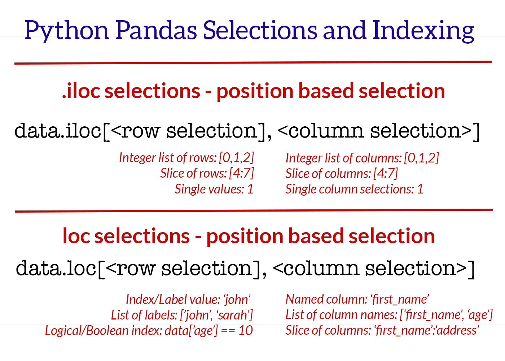
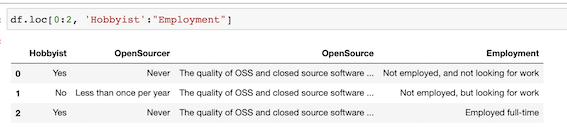

# DataFrame and Series Basics - Selecting Rows and Columns

### Import data 

```
person = {
    "first" : "Jacob",
    "last" : "Xi",
    "email" : "jacobxi@outlook.com"
}

people = {
    "first" : ["Jacob"],
    "last" : ["Xi"],
    "email" : ["jacobxi@outlook.com"]
}

people = {
    "first" : ["Jacob","Jane","John"],
    "last" : ["Xi","Doe","Wick"],
    "email" : ["jacobxi@outlook.com","JaneDone@outlook.com", "JohnWick@outlook.com"]
}
```

### Output like tradintional dictionary

```
people['email']
```
```
['jacobxi@outlook.com', 'JaneDone@outlook.com', 'JohnWick@outlook.com']
```

## Pandas Series, Rows and Columns

```
import pandas as pd
df = pd.DataFrame(people)
df
```

 

### Output one series

```
df['email']
```

 

```
type(df['email'])
```
```
pandas.core.series.Series
```

> What is series? 
> 
> series is one-dimensional array and is rows of single columns

**Data Frames basically is a container for multiple series objects**

### `df['email'] => df.email`

```
df.email
```
 

### df filter(multiple series)

```
df[['last','email']]
```

 

### Check all df columns

```
df.columns
```
```
Index(['first', 'last', 'email'], dtype='object')
```

## iloc and loc


 

### iloc (Integer Location) `Index => Integer Based value`

**Only with Row Selection**

```
df.iloc[0]
```

 

```
df.iloc[[0,1]]
```

 

**Add column selection**

```
df.iloc[[0,1], 2]
```

 

### loc (Location) `Index => Label Based value`

```
df.loc[0]
```
 

```
df.loc[[0,1]]
```
 

```
df.loc[[0,1],'email']
```
 

```
df.loc[[0,1],['email','last']]
```
 


## Pandas Rows and Columns on Real data

```
df.columns
```
```
Index(['Respondent', 'MainBranch', 'Hobbyist', 'OpenSourcer', 'OpenSource',
       'Employment', 'Country', 'Student', 'EdLevel', 'UndergradMajor',
       'EduOther', 'OrgSize', 'DevType', 'YearsCode', 'Age1stCode',
       'YearsCodePro', 'CareerSat', 'JobSat', 'MgrIdiot', 'MgrMoney',
       'MgrWant', 'JobSeek', 'LastHireDate', 'LastInt', 'FizzBuzz',
       'JobFactors', 'ResumeUpdate', 'CurrencySymbol', 'CurrencyDesc',
       'CompTotal', 'CompFreq', 'ConvertedComp', 'WorkWeekHrs', 'WorkPlan',
       'WorkChallenge', 'WorkRemote', 'WorkLoc', 'ImpSyn', 'CodeRev',
       'CodeRevHrs', 'UnitTests', 'PurchaseHow', 'PurchaseWhat',
       'LanguageWorkedWith', 'LanguageDesireNextYear', 'DatabaseWorkedWith',
       'DatabaseDesireNextYear', 'PlatformWorkedWith',
       'PlatformDesireNextYear', 'WebFrameWorkedWith',
       'WebFrameDesireNextYear', 'MiscTechWorkedWith',
       'MiscTechDesireNextYear', 'DevEnviron', 'OpSys', 'Containers',
       'BlockchainOrg', 'BlockchainIs', 'BetterLife', 'ITperson', 'OffOn',
       'SocialMedia', 'Extraversion', 'ScreenName', 'SOVisit1st',
       'SOVisitFreq', 'SOVisitTo', 'SOFindAnswer', 'SOTimeSaved',
       'SOHowMuchTime', 'SOAccount', 'SOPartFreq', 'SOJobs', 'EntTeams',
       'SOComm', 'WelcomeChange', 'SONewContent', 'Age', 'Gender', 'Trans',
       'Sexuality', 'Ethnicity', 'Dependents', 'SurveyLength', 'SurveyEase'],
      dtype='object')
```

```
df['Hobbyist']
```

 

### Get `value_count` for  series

```
df['Hobbyist'].value_counts()
```

 

### Output only one person info

```
df.loc[0]
```

```
Respondent                                                                1
MainBranch                           I am a student who is learning to code
Hobbyist                                                                Yes
OpenSourcer                                                           Never
OpenSource                The quality of OSS and closed source software ...
Employment                           Not employed, and not looking for work
Country                                                      United Kingdom
Student                                                                  No
EdLevel                                           Primary/elementary school
UndergradMajor                                                          NaN
EduOther                  Taught yourself a new language, framework, or ...
OrgSize                                                                 NaN
DevType                                                                 NaN
...
SONewContent              Tech articles written by other developers;Indu...
Age                                                                      14
Gender                                                                  Man
Trans                                                                    No
Sexuality                                           Straight / Heterosexual
Ethnicity                                                               NaN
Dependents                                                               No
SurveyLength                                          Appropriate in length
SurveyEase                                       Neither easy nor difficult
Name: 0, dtype: object
```

```
df.loc[0, 'Hobbyist']
```

 


### `df.loc[0:2] =  df.loc[0,1,2]`

```
df.loc[[0,1,2], 'Hobbyist']
```

 


```
df.loc[0:2, 'Hobbyist']
```

 

### Multiple cols selection

```
df.loc[0:2, 'Hobbyist':"Employment"]
```

 