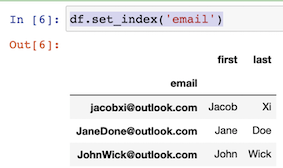
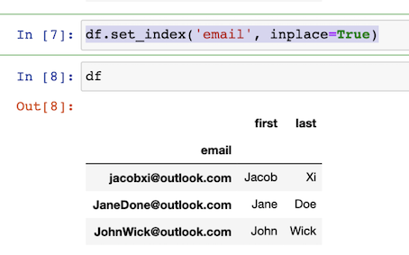
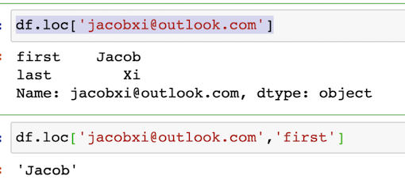
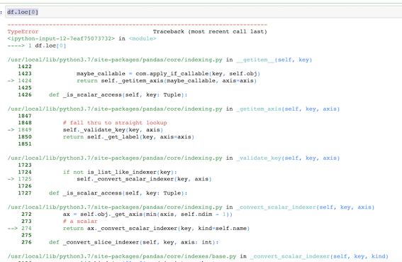
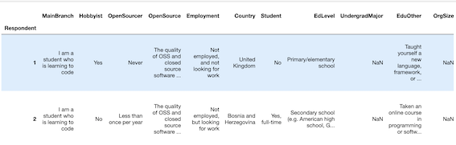
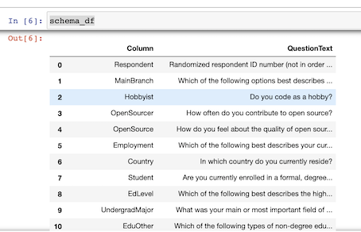
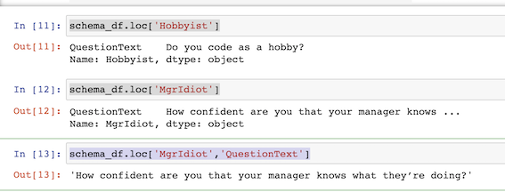
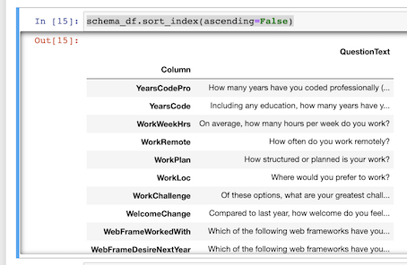
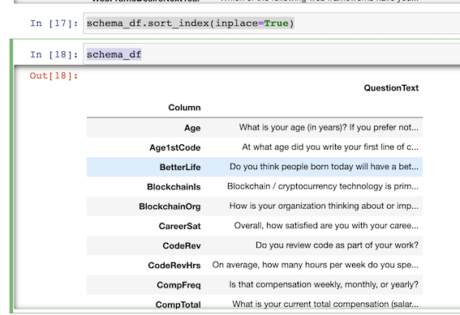

# Pandas Indexes - How to Set, Reset, and Use Indexes

## `set_index`

```
people = {
    "first" : ["Jacob","Jane","John"],
    "last" : ["Xi","Doe","Wick"],
    "email" : ["jacobxi@outlook.com","JaneDone@outlook.com", "JohnWick@outlook.com"]
}

import pandas as pd
df = pd.DataFrame(people)
```

```
df.set_index('email')
```

 

### set_index(inplace=True)

```
df.set_index('email', inplace=True)
```

 

### df.index

```
df.index
```

```
Index(['jacobxi@outlook.com', 'JaneDone@outlook.com', 'JohnWick@outlook.com'], dtype='object', name='email')
```

```
df.loc['jacobxi@outlook.com']

df.loc['jacobxi@outlook.com','first']
```

 


### Currently default integer is no longer the index

```
df.loc[0]
```

## `set_index` in real world example

 

### Set `index_col`

```
import pandas as pd

df = pd.read_csv('data/survey_results_public.csv', index_col='Respondent')
schema_df = pd.read_csv('data/survey_results_schema.csv', index_col='Column')

pd.set_option('display.max_columns',85)
pd.set_option('display.max_rows',85)
```

 

```
df.loc[1]  # 1 is Respondent number
```

```
MainBranch                           I am a student who is learning to code
Hobbyist                                                                Yes
OpenSourcer                                                           Never
OpenSource                The quality of OSS and closed source software ...
Employment                           Not employed, and not looking for work
Country                                                      United Kingdom
Student                                                                  No
EdLevel                                           Primary/elementary school
UndergradMajor                                                          NaN
EduOther                  Taught yourself a new language, framework, or ...
OrgSize                                                                 NaN
DevType                                                                 NaN
YearsCode                                                                 4
Age1stCode                                                               10
YearsCodePro                                                            NaN
CareerSat                                                               NaN
JobSat                                                                  NaN
...
```

```
schema_df
```

 

```
schema_df.loc['Hobbyist']

schema_df.loc['MgrIdiot']

schema_df.loc['MgrIdiot','QuestionText']
```

 

### Sort_index

```
schema_df.sort_index(ascending=False)
```

 

### `schema_df.sort_index(inplace=True)`

```
schema_df.sort_index(inplace=True)
schema_df
```
 
