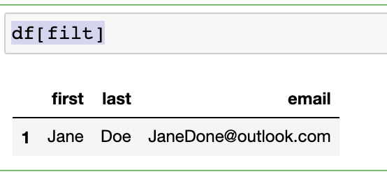

# Filtering - Using Conditionals to Filter Rows and Columns

```
people = {
    "first" : ["Jacob","Jane","John"],
    "last" : ["Xi","Doe","Wick"],
    "email" : ["jacobxi@outlook.com","JaneDone@outlook.com", "JohnWick@outlook.com"]
}

import pandas as pd

df = pd.DataFrame(people)
```


### Create filter

```
df['last'] == 'Doe'

0    False
1     True
2    False
Name: last, dtype: bool
```

### `filt = (df['last'] == 'Doe')`

```
filt = (df['last'] == 'Doe')
```

```
df[filt]

Or

df[df['last'] == 'Doe']
```
 

### `df.loc[filt]` is more common userful

```
df.loc[filt]
```

```
df.loc[filt, 'email']
```

 

### filer with operation `&` and `|`

```
filt = (df['last'] == 'Doe') & (df['first'] == 'Jane')
df.loc[filt, 'email']

1    JaneDone@outlook.com
Name: email, dtype: object
```

```
filt = (df['last'] == 'Doe') | (df['first'] == 'John')
df.loc[filt, 'email']

1    JaneDone@outlook.com
2    JohnWick@outlook.com
Name: email, dtype: object
```

**Reverse**: `~`

```
df.loc[~filt, 'email']

0    jacobxi@outlook.com
Name: email, dtype: object
```

## Real world data with filter

```
df = pd.read_csv('data/survey_results_public.csv', index_col='Respondent')
schema_df = pd.read_csv('data/survey_results_schema.csv')

pd.set_option('display.max_columns',85)
pd.set_option('display.max_rows',85)
```

### High salary filer

```
high_salary = (df['ConvertedComp'] > 70000)

df.loc[high_salary]
```

 

### `isin` filter 

```
countries = ['United States', 'India', 'United Kingdom', 'Germany', 'Canada']
filt = df['Country'].isin(countries)

df.loc[filt,'Country']


Respondent
1        United Kingdom
4         United States
6                Canada
8                 India
10                India
              ...      
85642     United States
85961    United Kingdom
86012             India
88282     United States
88377            Canada
Name: Country, Length: 45008, dtype: object
```

### `str.contains` filter

**Filter all with python in `LanguageWorkedWith`**

```
filt = df['LanguageWorkedWith'].str.contains('Python', na=False)
df.loc[filt, 'LanguageWorkedWith']

Respondent
1                          HTML/CSS;Java;JavaScript;Python
2                                      C++;HTML/CSS;Python
4                                      C;C++;C#;Python;SQL
5              C++;HTML/CSS;Java;JavaScript;Python;SQL;VBA
8        Bash/Shell/PowerShell;C;C++;HTML/CSS;Java;Java...
                               ...                        
84539    Bash/Shell/PowerShell;C;C++;HTML/CSS;Java;Java...
85738      Bash/Shell/PowerShell;C++;Python;Ruby;Other(s):
86566      Bash/Shell/PowerShell;HTML/CSS;Python;Other(s):
87739             C;C++;HTML/CSS;JavaScript;PHP;Python;SQL
88212                           HTML/CSS;JavaScript;Python
Name: LanguageWorkedWith, Length: 36443, dtype: object
```

```
filt

Respondent
1         True
2         True
3        False
4         True
5         True
         ...  
88377    False
88601    False
88802    False
88816    False
88863    False
Name: LanguageWorkedWith, Length: 88883, dtype: bool
```

**Since 3 is false, no 3 in output**

```
df.loc[filt]
```

 


