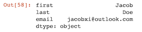
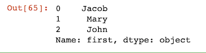

# Updating Rows and Columns - Modifying Data Within DataFrames

```
people = {
    "first" : ["Jacob","Jane","John"],
    "last" : ["Xi","Doe","Wick"],
    "email" : ["jacobxi@outlook.com","JaneDone@outlook.com", "JohnWick@outlook.com"]
}

import pandas as pd

df = pd.DataFrame(people)

df
```


## Update Columns names

### How to update Columns names

```
df.columns = ['first_name','last_name','email']
df
```


### How to update Columns names to Uppercase

```
df.columns = [x.upper() for x in df.columns]
df
```


### How to update Columns names witch replace

```
df.columns = df.columns.str.replace('_',' ')
df
```

### How to update Columns names to lowercase

```
df.columns = [x.lower() for x in df.columns]
```

### How to update part of Columns names with `rename`

```
df.rename(columns={'first_name':'first', 'last_name':'last'},inplace=True)
df
```


## Change one row series(row) value

```
df.loc[2] = ['John','Smith','JohnSmith@email.com']
df
```


### change values of one row using `loc`, `at` and `filter with loc`

### `loc`

```
df.loc[2,['last','email']] = ['Wick','JohnWick@email.com']
df
```

```
df.loc[2,'last']='Smith'
df
```


### `at` more frequently than `loc` 

```
df.at[2,'last']='Wick'
df
```


### filter cannot used to assign value directly

```
filt = (df['email'] == 'JohnWick@email.com')
df[filt]['last'] = 'Smith'
```

```
/usr/local/lib/python3.7/site-packages/ipykernel_launcher.py:2: SettingWithCopyWarning: 
A value is trying to be set on a copy of a slice from a DataFrame.
Try using .loc[row_indexer,col_indexer] = value instead

See the caveats in the documentation: http://pandas.pydata.org/pandas-docs/stable/user_guide/indexing.html#returning-a-view-versus-a-copy
```

### `filter with loc`

```
filt = (df['email'] == 'JohnWick@email.com')
df.loc[filt,'last'] = 'Smith'

df
```


## Change multiple one row series(rows) value

### Change values with `str.lower()` by cols

```
df['email'] = df['email'].str.lower()
df
```


### change multiple rows at once advanced (apply, map, applymap, replace)

* **`apply(function)`** apply to and return one series

```
df['email'].apply(len)
```


* Custom function with apply

```
def update_email(email):
    return email.upper()
    
df['email'] = df['email'].apply(update_email)
df
```


* lambda function with apply

```
df['email'] = df['email'].apply(lambda x: x.lower())
df
```


* apply to one value

```
df.apply(pd.Series.min)
```



```
df.apply(lambda x:x.min())
```


* **`applymap(function)`** apply to and return map

```
df.applymap(len)
```


* **`replace`**

```
df['first']=df['first'].replace({'Jane':'Mary'})
df['first']
```


* **`map`** the others will become `NAN`

```
df['Hobbyist']

0        Yes
1         No
2        Yes
3         No
4        Yes
        ... 
88878    Yes
88879     No
88880     No
88881     No
88882    Yes
Name: Hobbyist, Length: 88883, dtype: object
```

```
df['Hobbyist'] = df['Hobbyist'].map({"Yes":True, "No":False})
df['Hobbyist']
```
```
0         True
1        False
2         True
3        False
4         True
         ...  
88878     True
88879    False
88880    False
88881    False
88882     True
Name: Hobbyist, Length: 88883, dtype: bool
```

