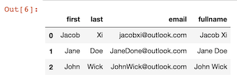
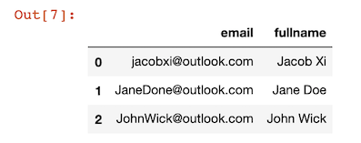
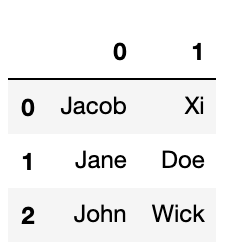
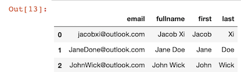
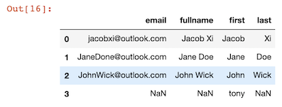
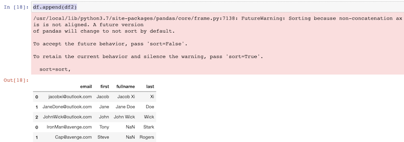
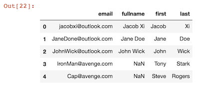
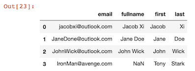

# Add/Remove Rows and Columns From DataFrames

## Add Columns

```
people = {
    "first" : ["Jacob","Jane","John"],
    "last" : ["Xi","Doe","Wick"],
    "email" : ["jacobxi@outlook.com","JaneDone@outlook.com", "JohnWick@outlook.com"]
}

import pandas as pd

df = pd.DataFrame(people)
```

```
df['first']+ ' '+ df['last']

0     Jacob Xi
1     Jane Doe
2    John Wick
dtype: object
```

### Add one column

```
df['fullname']=df['first']+ ' '+ df['last']
df
```



### Drop columns

```
df.drop(columns=['first','last'],inplace=True)
df
```



### Add dopped columns back

```
df['fullname'].str.split(' ', expand=True)
```



```
df[['first','last']] = df['fullname'].str.split(' ', expand=True)
df
```




## Add row values

### Add one row value

```
df.append({'first':'tony'}, ignore_index=True)
```




### Add multiple row value

```
avengers = {
    "first" : ["Tony","Steve"],
    "last" : ["Stark","Rogers"],
    "email" : ["IronMan@avenge.com","Cap@avenge.com"]
}

df2 = pd.DataFrame(avengers)

df.append(df2)

/usr/local/lib/python3.7/site-packages/pandas/core/frame.py:7138: FutureWarning: Sorting because non-concatenation axis is not aligned. A future version
of pandas will change to not sort by default.

To accept the future behavior, pass 'sort=False'.

To retain the current behavior and silence the warning, pass 'sort=True'.

  sort=sort,
```



* **`sort=False`**

```
df=df.append(df2, ignore_index=True, sort=False)
df
```



### Drop special one row value

```
df.drop(index=4)
```



### Drop multiple rows value with `filter`

```
filt = df['last'] == 'Doe'
df.drop(index=df[filt].index)
```

