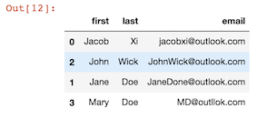
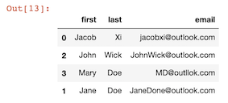
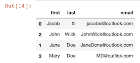
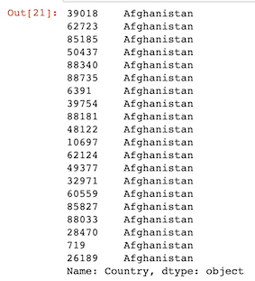
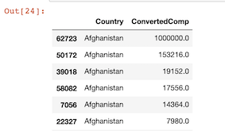

# Sorting Data

```
people = {
    "first" : ["Jacob","Jane","John","Mary"],
    "last" : ["Xi","Doe","Wick","Doe"],
    "email" : ["jacobxi@outlook.com","JaneDone@outlook.com", "JohnWick@outlook.com","MD@outllok.com"]
}

import pandas as pd
df = pd.DataFrame(people)
```

### Sort value by one series

```
df.sort_values(by='last')
```


```
df.sort_values(by='last', ascending=False)
```



### Sort value by multiple series

```
df.sort_values(by=['last','first'], ascending=False)
```



### Sort value by multiple series with different ascending

```
df.sort_values(by=['last','first'], ascending=[False,True])
```




### Sort by index

```
df.sort_index()
```


```
df['last'].sort_index()
```

```
0      Xi
1     Doe
2    Wick
3     Doe
Name: last, dtype: object
```

## Sorting Data with realdata

```
import pandas as pd
df = pd.read_csv('data/survey_results_public.csv')
```

```
df.sort_values('Country',inplace=True)
df['Country'].head(20)
```



```
df.sort_values(by=['Country','ConvertedComp'],ascending=[True, False], inplace=True)

df[['Country','ConvertedComp']].head(20)
```




## Sort from largets and smallest


```
df.nlargest(10, 'ConvertedComp')

25833    2000000.0
87353    2000000.0
21895    2000000.0
28080    2000000.0
72274    2000000.0
77665    2000000.0
79701    2000000.0
51798    2000000.0
75088    2000000.0
32056    2000000.0
Name: ConvertedComp, dtype: float64
```


```
df.nsmallest(10, 'ConvertedComp')
```

