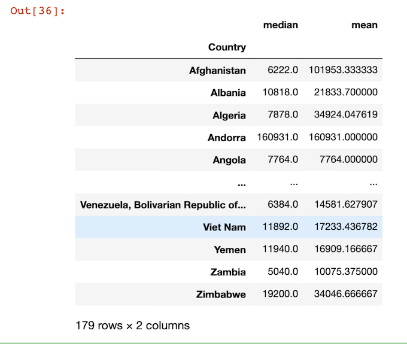

# Grouping and Aggregating - Analyzing and Exploring Your Data

```
import pandas as pd

df = pd.read_csv('data/survey_results_public.csv', index_col='Respondent')
schema_df = pd.read_csv('data/survey_results_schema.csv', index_col='Column')

pd.set_option('display.max_columns',85)
pd.set_option('display.max_rows',85)
```

## Aggregation

### median salary

```
df['ConvertedComp'].median()
57287.0
```

### All median

```
df.median()

CompTotal        62000.0
ConvertedComp    57287.0
WorkWeekHrs         40.0
CodeRevHrs           4.0
Age                 29.0
dtype: float64
```

### Describe dataframe with Aggregation function

```
df.describe()
```


```
df['ConvertedComp'].count()
55823
```

## `value_counts()` count value in DF

```
df['Hobbyist'].value_counts()

Yes    71257
No     17626
Name: Hobbyist, dtype: int64
```

### Describe `SocialMedia`

```
schema_df.loc['SocialMedia']

QuestionText    What social media site do you use the most?
Name: SocialMedia, dtype: object
```

```
df['SocialMedia'].value_counts()

Reddit                      14374
YouTube                     13830
WhatsApp                    13347
Facebook                    13178
Twitter                     11398
Instagram                    6261
I don't use social media     5554
LinkedIn                     4501
WeChat 微信                     667
Snapchat                      628
VK ВКонта́кте                 603
Weibo 新浪微博                     56
Youku Tudou 优酷                 21
Hello                          19
Name: SocialMedia, dtype: int64
```

### `value_counts()` with percentage

```
df['SocialMedia'].value_counts(normalize=True)

Reddit                      0.170233
YouTube                     0.163791
WhatsApp                    0.158071
Facebook                    0.156069
Twitter                     0.134988
Instagram                   0.074150
I don't use social media    0.065777
LinkedIn                    0.053306
WeChat 微信                   0.007899
Snapchat                    0.007437
VK ВКонта́кте               0.007141
Weibo 新浪微博                  0.000663
Youku Tudou 优酷              0.000249
Hello                       0.000225
Name: SocialMedia, dtype: float64
```

### Count value of `country` col

```
df['Country'].value_counts()

United States            20949
India                     9061
Germany                   5866
United Kingdom            5737
Canada                    3395
                         ...  
Timor-Leste                  1
Niger                        1
Tonga                        1
Sao Tome and Principe        1
Dominica                     1
Name: Country, Length: 179, dtype: int64
```

## DF `groupby` Col

```
country_grp = df.groupby(['Country'])
```

### `get_group()`

```
country_grp.get_group('United States')
```


### We can use filter by `country` to count `socialmedia` values

* filt by `United States`

```
filt = df['Country'] == 'United States'
df.loc[filt]['SocialMedia'].value_counts()
```
```
Reddit                      5700
Twitter                     3468
Facebook                    2844
YouTube                     2463
I don't use social media    1851
Instagram                   1652
LinkedIn                    1020
WhatsApp                     609
Snapchat                     326
WeChat 微信                     93
VK ВКонта́кте                  9
Weibo 新浪微博                     8
Hello                          2
Youku Tudou 优酷                 1
Name: SocialMedia, dtype: int64
```

* filt by `China`

```
WeChat 微信                   403
YouTube                      53
Weibo 新浪微博                   42
I don't use social media     27
Twitter                      27
Reddit                       12
LinkedIn                     11
Facebook                      8
Youku Tudou 优酷                7
Instagram                     7
WhatsApp                      3
VK ВКонта́кте                 1
Name: SocialMedia, dtype: int64
```

### Rather than filter, can also use `groupby()`

```
country_grp['SocialMedia'].value_counts()
```

```
Country      SocialMedia             
Afghanistan  Facebook                    15
             YouTube                      9
             I don't use social media     6
             WhatsApp                     4
             Instagram                    1
                                         ..
Zimbabwe     Facebook                     3
             YouTube                      3
             Instagram                    2
             LinkedIn                     2
             Reddit                       1
Name: SocialMedia, Length: 1220, dtype: int64
```

```
country_grp['SocialMedia'].value_counts().loc['India']
```
```
SocialMedia
WhatsApp                    2990
YouTube                     1820
LinkedIn                     955
Facebook                     841
Instagram                    822
Twitter                      542
Reddit                       473
I don't use social media     250
Snapchat                      23
Hello                          5
WeChat 微信                      5
VK ВКонта́кте                  4
Youku Tudou 优酷                 2
Weibo 新浪微博                     1
Name: SocialMedia, dtype: int64
```

### Get median() of salary by country

```
country_grp['ConvertedComp'].median().loc['Germany']
63016.0
```

### Get multiple aggregate value

```
country_grp['ConvertedComp'].agg(['median','mean'])
```


### get by country

```
country_grp['ConvertedComp'].agg(['median','mean']).loc['Germany']
```

```
median     63016.000000
mean      109256.884066
Name: Germany, dtype: float64
```

## Count `LanguageWorkedWith` which contains `python`

### Use filter

* filt: `country='United States'`
* `str.contains('Python')`

```
filt = df['Country'] == 'United States'
df.loc[filt]['LanguageWorkedWith'].str.contains('Python').sum()
10083
```

### Use `groupby()` to get string contains `Python`

```
country_grp['LanguageWorkedWith'].apply(lambda x: x.str.contains('Python').sum())

Country
Afghanistan                              8
Albania                                 23
Algeria                                 40
Andorra                                  0
Angola                                   2
                                        ..
Venezuela, Bolivarian Republic of...    28
Viet Nam                                78
Yemen                                    3
Zambia                                   4
Zimbabwe                                14
Name: LanguageWorkedWith, Length: 179, dtype: int64
```

### Get respondenets by country 

```
country_respondents = df['Country'].value_counts()
country_respondents

United States            20949
India                     9061
Germany                   5866
United Kingdom            5737
Canada                    3395
                         ...  
Timor-Leste                  1
Niger                        1
Tonga                        1
Sao Tome and Principe        1
Dominica                     1
Name: Country, Length: 179, dtype: int6
```

### Get respondenets who knows `Python` by country 

```
country_use_python = country_grp['LanguageWorkedWith'].apply(lambda x: x.str.contains('Python').sum())
country_use_python

Country
Afghanistan                              8
Albania                                 23
Algeria                                 40
Andorra                                  0
Angola                                   2
                                        ..
Venezuela, Bolivarian Republic of...    28
Viet Nam                                78
Yemen                                    3
Zambia                                   4
Zimbabwe                                14
Name: LanguageWorkedWith, Length: 179, dtype: int64
```

### Comine these two cols into one table with `pd.concat`

```
python_df = pd.concat([country_respondents, country_use_python], axis='columns', sort=False)
python_df
```


```
python_df =python_df.rename(columns={'Country':'Numrespondents', 'LanguageWorkedWith':'NumknowPython'})
python_df
```


### Calculate the percenateg 

```
python_df['PctKnowPython'] = (python_df['NumknowPython'] / python_df['Numrespondents'])*100
python_df['PctKnowPython']
```

```
United States             48.131176
India                     34.267741
Germany                   41.783157
United Kingdom            41.554820
Canada                    45.891016
                            ...    
Timor-Leste              100.000000
Niger                    100.000000
Tonga                      0.000000
Sao Tome and Principe    100.000000
Dominica                 100.000000
Name: PctKnowPython, Length: 179, dtype: float64
```

### Add new col to the table

* `ascending=True`
* `inplace=True`

```
python_df.sort_values(by='PctKnowPython', ascending=True, inplace=True)
python_df
```


```
python_df.loc['China']

Numrespondents    664.000000
NumknowPython     297.000000
PctKnowPython      44.728916
Name: China, dtype: float64
```

