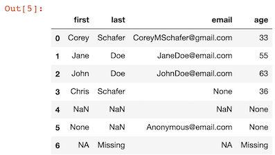
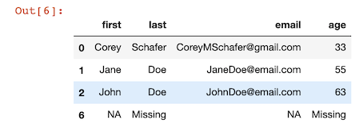
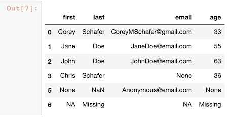
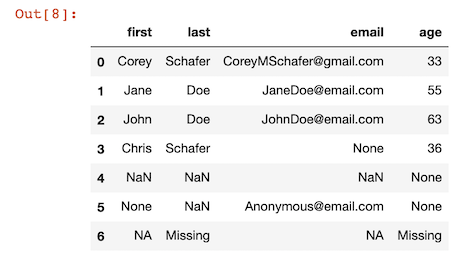
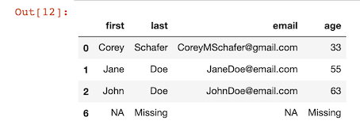
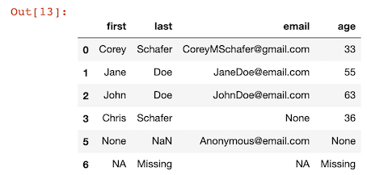
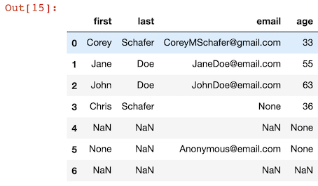
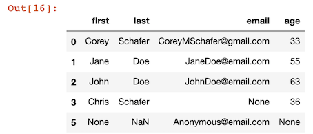
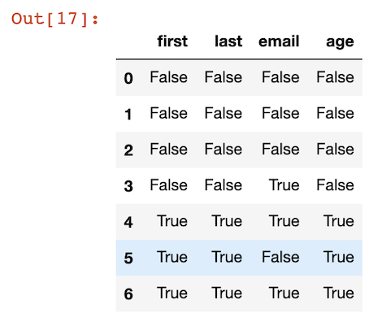
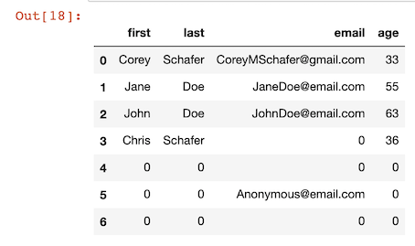

# Cleaning Data - Casting Datatypes and Handling Missing Values

## Snippets

```
import pandas as pd
import numpy as np

people = {
    'first': ['Corey', 'Jane', 'John', 'Chris', np.nan, None, 'NA'], 
    'last': ['Schafer', 'Doe', 'Doe', 'Schafer', np.nan, np.nan, 'Missing'], 
    'email': ['CoreyMSchafer@gmail.com', 'JaneDoe@email.com', 'JohnDoe@email.com', None, np.nan, 'Anonymous@email.com', 'NA'],
    'age': ['33', '55', '63', '36', None, None, 'Missing']
}

df = pd.DataFrame(people)

df
```

* Deault missing value: NaN
* Customal missing value: NA, Missing




### Drop NAN value

```
df.dropna()
```




* `how{‘any’, ‘all’}`, default ‘any’

Determine if row or column is removed from DataFrame, when we have at least one NA or all NA.

* `‘any`’ : If any NA values are present, drop that row or column.
* `‘all’` : If all values are NA, drop that row or column.

* `axis='index'`

```
df.dropna(axis='index', how='all')
```



* `axis='columns'`

```
df.dropna(axis='columns', how='all')
```




* `how='any'`

```
df.dropna(axis='columns', how='any')
```

```
0
1
2
3
4
5
6
```

### subset: array-like, optional

Labels along other axis to consider, e.g. if you are dropping rows these would be a list of columns to include.

```
df.dropna(axis='index', how='any',subset=['last', 'email'])
```




```
df.dropna(axis='index', how='all',subset=['last', 'email'])
```




### inplace: bool, default False

If True, do operation inplace and return None.

* Inplace custom `NA`,`Missing` with `NAN`

```
df.replace('NA', np.nan, inplace=True)
df.replace('Missing', np.nan, inplace=True)

df
```



```
df.dropna(axis='index', how='all',subset=['last', 'email'])
```



```
df.isna()
```


```
df.fillna(0)
```



### astype

**Cast a pandas object to a specified dtype dtype.**

```
df.dtypes


first    object
last     object
email    object
age      object
dtype: object
```

```
df['age'].mean()
...
TypeError: can only concatenate str (not "int") to str
```

* Nan can only be float

```
df['age'] = df['age'].astype(float)
```

```
df.dtypes

first     object
last      object
email     object
age      float64
dtype: object
```

```
df['age'].mean()
46.75
```

## Stackoverflow Demo

### Define custom NAN Value

```
na_vals = ['NA', 'Missing']
df = pd.read_csv('data/survey_results_public.csv', index_col='Respondent', na_values=na_vals)
schema_df = pd.read_csv('data/survey_results_schema.csv', index_col='Column')

pd.set_option('display.max_columns', 85)
pd.set_option('display.max_rows', 85)

df['YearsCode'].head(10)

Respondent
1       4
2     NaN
3       3
4       3
5      16
6      13
7       6
8       8
9      12
10     12
Name: YearsCode, dtype: object

```

### There is other sting values other than missing value

```
df['YearsCode'] = df['YearsCode'].astype(float)

ValueError: could not convert string to float: 'Less than 1 year'
```

```
df['YearsCode'].unique()

array(['4', nan, '3', '16', '13', '6', '8', '12', '2', '5', '17', '10',
       '14', '35', '7', 'Less than 1 year', '30', '9', '26', '40', '19',
       '15', '20', '28', '25', '1', '22', '11', '33', '50', '41', '18',
       '34', '24', '23', '42', '27', '21', '36', '32', '39', '38', '31',
       '37', 'More than 50 years', '29', '44', '45', '48', '46', '43',
       '47', '49'], dtype=object)
```

### Define these string values

```
df['YearsCode'].replace('Less than 1 year', 0, inplace=True)

df['YearsCode'].replace('More than 50 years', 51, inplace=True)

df['YearsCode'] = df['YearsCode'].astype(float)

df['YearsCode'].mean()
11.662114216834588


df['YearsCode'].median()
9.0
```

