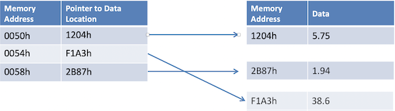
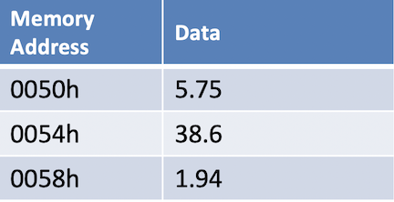

# NumPy

## Advantages: NumPy Array over List

### Save Coding Time

**No for loops**: many vector and matrix operations save coding time

### Faster Execution 

* Single type for each field to avoid type checking
* Uses contiguous blocks of memory

### Uses less memory

* **Python List**: an array of pointers to Python objects, with 4B+ per pointer plus 16B+ for a numerical object
* **NumPy Array**: No pointers; type and itemsize is same for same for columns
* Compact data types like uint8 and float16


#### Using Python List

```
for i in range(len(my_list)):
	my_list[i] *= 3
```



#### Using NumPy Array

```
my_array *= 3
```



## NumPy Array Pointers

* **Data type** – all elements have same numpy data type 
* **Item size** – memory size of each item in bytes 
* **Shape** – dimensions of the array
* **Data** – the easiest way to access the data is through indexing, not this pointer

## NumPy Data Types

**Numerical types:**

* integers (int) 
* unsigned integers (uint) 
* floating point (float) 
* complex 

**Other data types:**

* booleans (bool)
* string
* datetime
* Python object


## Check if NumPy is Installed

**Try importing numpy:**

```
import numpy as np
```
**See what modules you have installed:**

```
help('modules')
```

### Install NumPy

**Install Numpy using pip:**

```
pip install numpy
```

## Numpy Code

```
import numpy as np

a = np.array([2,3,4])
print(a)

>>> [2 3 4]


b = np.arange(1, 12, 2) # from 1 to 12, with step 2 (start, stop, step)
print(b)

>>> [ 1  3  5  7  9 11]


c = np.linspace(1, 12, 6) # from 1.0 to 12.0, with 6 elements (start, stop, number of items)
print(c)

>>> [ 1.   3.2  5.4  7.6  9.8 12. ]

new_c=c.reshape(3,2)
print(new_c)

>>> [[ 1.   3.2]
     [ 5.4  7.6]
     [ 9.8 12. ]]


print(new_c.size)   # Get size of array
>>> 6

print(new_c.shape)  # Get shape of array
>>> (3, 2)

print(new_c.dtype) # Get default data type of array
>>> float64

print(new_c.itemsize)  # Get item size of array, how much memory in byte
>>> 8
```

### multi-dimensional array

```
d = np.array([(1.5,2,3), (4,5,6)])
print(d)

>>> [[1.5 2.  3. ]
     [4.  5.  6. ]]


# Which element inside array is less than 4
print( new_c < 4 )
>>> [[ True  True]
     [False False]
     [False False]]


# Multiply each element in array by 3
print( new_c*3 )
>>> [[ 3.   9.6]
     [16.2 22.8]
     [29.4 36. ]]
     

e = np.zeros((3,4))
print(e)
>>> [[0. 0. 0. 0.]
     [0. 0. 0. 0.]
     [0. 0. 0. 0.]]

new_e = np.ones((2,3))
print(new_e)

>>> [[1. 1. 1.]
     [1. 1. 1.]]

ten_one = np.ones(10)
print(ten_one)
>>> [1. 1. 1. 1. 1. 1. 1. 1. 1. 1.]

f = np.array([2,3,4], dtype=np.int16)
print(f)
print(f.dtype)
print(f.itemsize)
>>> [2 3 4]
>>> int16
>>> 2
```

### Numpy Random

```
rand = np.random.random((2,3))
print(rand)

>>> [[0.61313716 0.44869725 0.62486818]
     [0.45282435 0.52070716 0.13313049]]

# set 2 decimal in precision
np.set_printoptions(precision=2, suppress=True) 
print(rand)

>>> [[0.61 0.45 0.62]
     [0.45 0.52 0.13]]

# From 0 to 10 exclusive, and 5 element
rand_int = np.random.randint(0, 10, 5) 
print(rand_int)

>>> [5 0 1 8 6]


print(rand_int.sum())
print(rand_int.min())
print(rand_int.max())
print(rand_int.mean())
print(rand_int.var())
print(rand_int.std())

>>> 20
>>> 0
>>> 8
>>> 4.0
>>> 9.2
>>> 3.03315017762062
```

### Numpy Randint into array

```
new_rand_int = np.random.randint(0, 10, 6)
print(new_rand_int)
>>> [5 9 5 7 3 3]

new_rand = new_rand_int.reshape(3, 2)
print(new_rand)
>>> [[5 9]
     [5 7]
     [3 3]]

# sum of each row
print(new_rand.sum(axis=1)) 
>>> [14 12  6]

# sum of each column
print(new_rand.sum(axis=0))
>>> [13 19]
```

### Reading and Writing to Files

**`37datat.txt`**

```
a,b,c,d,e,f,g,h,i,j
9,3,8,7,6,1,0,4,2,5
1,7,4,9,2,6,8,3,5,0
4,8,3,9,5,7,2,6,0,1
1,7,4,2,5,9,6,8,0,3
0,7,5,2,8,6,3,4,1,9
5,9,1,4,7,0,3,6,8,2
```

```
data = np.loadtxt("37data.txt", dtype=np.uint8, delimiter=",", skiprows=1)
print(data)

[[9 3 8 7 6 1 0 4 2 5]
 [1 7 4 9 2 6 8 3 5 0]
 [4 8 3 9 5 7 2 6 0 1]
 [1 7 4 2 5 9 6 8 0 3]
 [0 7 5 2 8 6 3 4 1 9]
 [5 9 1 4 7 0 3 6 8 2]]
```

### Numpy Random Functions

```
ar = np.arange(10)
print(ar)
>>> [0 1 2 3 4 5 6 7 8 9]

np.random.shuffle(ar)
print(ar)
>>> [6 5 0 2 3 7 9 1 8 4]

ar_choice = np.random.choice(ar)
print(ar_choice)
>>> 9
```

## Python Numpy Intro


### Creating a Numpy Array

```
a = np.array([1,3,5,7,9,11])
print(a)

a = np.arange(1, 12, 2)    # (start, stop, step)
print(a)

a = np.linspace(5, 8, 13)  # (start, stop, number of items)
print(a)

a = np.zeros((4, 2))
print(a)

a = np.ones((2, 3), dtype=np.int16)
print(a)

a = np.full((6,), 88)
print(a)

a = np.fromstring('25 30 35 40', dtype=np.int, sep=' ')
print(a)

a = np.array([[1,3,5],[7,9,11]])
print(a)

b = np.zeros_like(a)    # _like gives you a new array in the same shape as the argument.
print(b)


[ 1  3  5  7  9 11]
[ 1  3  5  7  9 11]
[5.   5.25 5.5  5.75 6.   6.25 6.5  6.75 7.   7.25 7.5  7.75 8.  ]
[[0. 0.]
 [0. 0.]
 [0. 0.]
 [0. 0.]]
[[1 1 1]
 [1 1 1]]
[88 88 88 88 88 88]
[25 30 35 40]
[[ 1  3  5]
 [ 7  9 11]]
[[0 0 0]
 [0 0 0]]
```

### Numpy Array Attributes

Get size (number of items), shape (dimensions), itemsize(bytes of memory for each item), and dtype (numpy data type).

```
print(a.size)
print(a.shape)
print(a.ndim)
print(a.itemsize)
print(a.dtype)
print(a.nbytes)  # same as a.size * a.itemsize


6
(2, 3)
2
4
int32
24
```

### Indexing and Slicing

Use square brackets to get any item of an array by index. Multi-dimensional arrays can use multiple square brackets.

There are three arguments for slicing arrays, all are optional: `[start:stop:step]`.
If start is left blank it defaults to 0. If stop is left blank it defaults to the end of the array. Step defaults to 1.

```
print(a)
print(a[1])
print(a[0][2])
print(b[2:4])

print(a[:1])
print(a[1:3:2])
print(a[:, 1:2])  # all elements on dimension 0, only element 1 on dimension 1


[[ 1  3  5]
 [ 7  9 11]]
[ 7  9 11]
5
[]
[[1 3 5]]
[[ 7  9 11]]
[[3]
 [9]]
```

### Reshape, Swap Axes, Flatten

```
c = np.arange(-9, -3,).reshape(2,3)
print(c)

c = c.swapaxes(0,1)
print(c)

c = c.flatten()
print(c)


[[-9 -8 -7]
 [-6 -5 -4]]
[[-9 -6]
 [-8 -5]
 [-7 -4]]
[-9 -6 -8 -5 -7 -4]
```

### Use dtype to Save Space

Default data types (int32 and float64) are memory hogs. If you don't need the higher precision you can save a lot of memory space and improve speed of operations by using smaller data types. For large data sets this makes a big difference.

```
d = np.arange(0,100)
print(d.dtype, type(d[1]))
print(d.nbytes)

d = np.arange(0,100, dtype='int8')
print(d.dtype, type(d[1]))
print(d.nbytes)

int32 <class 'numpy.int32'>
400
int8 <class 'numpy.int8'>
100
```

### UpCasting, Rounding, Print Formatting

Data type of all Items is upcast to the most precise element.

```
e = np.array([(1.566666,2,3), (4,5,6)])
print(e.dtype)

e = e.round(4)
print(e)

np.set_printoptions(precision=2, suppress=True)    # show 2 decimal places, suppress scientific notation
print(e)


float64
[[1.57 2.   3.  ]
 [4.   5.   6.  ]]
[[1.57 2.   3.  ]
 [4.   5.   6.  ]]
```

### Numpy Data Types Available

uint is unsigned int, for positive numbers.

```
import pprint as pp
pp.pprint(np.sctypes)


{'complex': [<class 'numpy.complex64'>, <class 'numpy.complex128'>],
 'float': [<class 'numpy.float16'>,
           <class 'numpy.float32'>,
           <class 'numpy.float64'>],
 'int': [<class 'numpy.int8'>,
         <class 'numpy.int16'>,
         <class 'numpy.int32'>,
         <class 'numpy.int32'>,
         <class 'numpy.int64'>],
 'others': [<class 'bool'>,
            <class 'object'>,
            <class 'bytes'>,
            <class 'str'>,
            <class 'numpy.void'>],
 'uint': [<class 'numpy.uint8'>,
          <class 'numpy.uint16'>,
          <class 'numpy.uint32'>,
          <class 'numpy.uint32'>,
          <class 'numpy.uint64'>]}
```

### Reading and Writing to Files

```
f = np.loadtxt('data.txt', skiprows=1, delimiter=',', dtype=np.int32)
print(f)
print(f.dtype)

np.savetxt('data2.txt', f, delimiter=';', fmt='%d', header='a;b;c;d;e;f;g;h;i;j', comments='')


[[9 3 8 7 6 1 0 4 2 5]
 [1 7 4 9 2 6 8 3 5 0]
 [4 8 3 9 5 7 2 6 0 1]
 [1 7 4 2 5 9 6 8 0 3]
 [0 7 5 2 8 6 3 4 1 9]
 [5 9 1 4 7 0 3 6 8 2]]
int32
```

```
g = np.genfromtxt('data.txt', skip_header=1, delimiter=',', dtype=np.int32)
print(g)

[[9 3 8 7 6 1 0 4 2 5]
 [1 7 4 9 2 6 8 3 5 0]
 [4 8 3 9 5 7 2 6 0 1]
 [1 7 4 2 5 9 6 8 0 3]
 [0 7 5 2 8 6 3 4 1 9]
 [5 9 1 4 7 0 3 6 8 2]]
```

### Mathematical Functions

The best part is that you don't have to iterate. You can apply an operation to the entire array or a slice of an array at once.

```
print(g > 4)
print(g ** 2 - 1)

[[ True False  True  True  True False False False False  True]
 [False  True False  True False  True  True False  True False]
 [False  True False  True  True  True False  True False False]
 [False  True False False  True  True  True  True False False]
 [False  True  True False  True  True False False False  True]
 [ True  True False False  True False False  True  True False]]
[[80  8 63 48 35  0 -1 15  3 24]
 [ 0 48 15 80  3 35 63  8 24 -1]
 [15 63  8 80 24 48  3 35 -1  0]
 [ 0 48 15  3 24 80 35 63 -1  8]
 [-1 48 24  3 63 35  8 15  0 80]
 [24 80  0 15 48 -1  8 35 63  3]]
```

```
print(g.min())
print(g.max())
print(g.sum())
print(g.mean())
print(g.var())         # variance
print(g.std())         # standard deviation

print(g.sum(axis=1))
print(g.min(axis=0))

print(g.argmin())      # index of min element
print(g.argmax())      # index of max element
print(g.argsort())     # returns array of indices that would put the array in sorted order

0
9
270
4.5
8.25
2.8722813232690143
[45 45 45 45 45 45]
[0 3 1 2 2 0 0 3 0 0]
6
0
[[6 5 8 1 7 9 4 3 2 0]
 [9 0 4 7 2 8 5 1 6 3]
 [8 9 6 2 0 4 7 5 1 3]
 [8 0 3 9 2 4 6 1 7 5]
 [0 8 3 6 7 2 5 1 4 9]
 [5 2 9 6 3 0 7 4 8 1]]
```

### Column Operations

Apply functions only to specific columns by slicing, or create a new array from the columns you want, then work on them.
But Beware that creating a new pointer to the same data can screw up your data if you're not careful.

```
print(g[:, 2:3])
print(g[:, 2:3].max())

col3 = g[:, 3:4]      # not a copy, just a pointer to a slice of g
print(col3.std())

col3 *= 100           # Beware: this is applied to g data
print(g)


[[8]
 [4]
 [3]
 [4]
 [5]
 [1]]
8
298.607881119482
[[    9     3     8 70000     6     1     0     4     2     5]
 [    1     7     4 90000     2     6     8     3     5     0]
 [    4     8     3 90000     5     7     2     6     0     1]
 [    1     7     4 20000     5     9     6     8     0     3]
 [    0     7     5 20000     8     6     3     4     1     9]
 [    5     9     1 40000     7     0     3     6     8     2]]
```

### Numpy Random Functions

```

np.set_printoptions(precision=5, suppress=True)    # show 5 decimal places, suppress scientific notation
h = np.random.random(6)
print(h)

h = np.random.randint(10, 99, 8)    # (low, high inclusive, size)
print(h)

np.random.shuffle(h)        # in-place shuffle
print(h)

print(np.random.choice(h))

h.sort()                    # in-place sort
print(h)
```