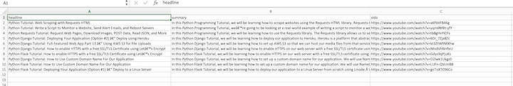

# Web Scraping with Requests-HTML

Requests-HTML is an excellent tool for parsing HTML code and grabbing exactly the information you need. So whether you're pulling down headlines from news sites, scores from sports websites, or prices from an online store... Requests-HTML and Python will help you get this done quickly and easily

```
$ pip3 install requests-html
```

#### Example html page `sample.html`

```
<!doctype html>
<html class="no-js" lang="">
    <head>
        <title>Test - A Sample Website</title>
        <meta charset="utf-8">
        <link rel="stylesheet" href="css/normalize.css">
        <link rel="stylesheet" href="css/main.css">
    </head>
    <body>
        <h1 id='site_title'>Test Website</h1>
        <hr></hr>
        <div class="article">
            <h2><a href="article_1.html">Article 1 Headline</a></h2>
            <p>This is a summary of article 1</p>
        </div>
        <hr></hr>
        <div class="article">
            <h2><a href="article_2.html">Article 2 Headline</a></h2>
            <p>This is a summary of article 2</p>
        </div>
        <hr></hr>
        <div id='footer'>
            <p>Footer Information</p>
        </div>
        <script>
        var para = document.createElement("p");
        var node = document.createTextNode("This is text generated by JavaScript.");
        para.appendChild(node);
        var element = document.getElementById("footer");
        element.appendChild(para);
        </script>
    </body>
</html>
```

### Get whole html page resource

```
with open('sample.html') as html_file:
	source = html_file.read()
	html = HTML(html=source)

# Get whole html page resource
print(html.html)

# Get whole html page text
print(html.text)

> Test - A Sample Website
> Test Website
> Article 1 Headline
> This is a summary of article 1
> Article 2 Headline
> This is a summary of article 2
> Footer Information
> var para = document.createElement("p"); var node = document.createTextNode("This is text generated by JavaScript."); para.appendChild(node); var element = document.getElementById("footer"); element.appendChild(para);
```

### Find special element

```
match = html.find('title')
print(match)
print(match[0])
print(match[0].html)
print(match[0].text)

> [<Element 'title' >]
> <Element 'title' >
> <title>Test - A Sample Website</title>
> Test - A Sample Website
```

#### find 1st element `first=True` with attribute

```
match = html.find('title', first=True)
print(match.text)

> Test - A Sample Website
```

#### find element based on `id`

```
match = html.find('#footer', first=True)
print(match.text)

> Footer Information
```

#### find element based on `class`

```
article = html.find('div.article', first=True)
print(article.text)

> Article 1 Headline
> This is a summary of article 1

headline = article.find('h2', first=True).text
summary = article.find('p', first=True).text
print(headline)
print(summary)

> Article 1 Headline
> This is a summary of article 1
```

#### find multiple content based on div class name

```
articles = html.find('div.article')

for article in articles:
	headline = article.find('h2', first=True).text
	summary = article.find('p', first=True).text
	print(headline)
	print(summary)
	print()

> Article 1 Headline
> This is a summary of article 1

> Article 2 Headline
> This is a summary of article 2
```

## HTMLSession, get info from real site

```
from requests_html import HTML, HTMLSession

session = HTMLSession()
r = session.get('http://coreyms.com/')

print(r.html)
> <HTML url='https://coreyms.com/'>
```

### Find element based it's part and class

```
session = HTMLSession()
r = session.get('http://coreyms.com/')

article = r.html.find('article', first=True)

headline = article.find('.entry-title-link', first=True).text
print(headline)
> Python Tutorial: Web Scraping with Requests-HTML


summary = article.find('.entry-content p', first=True).text
print(summary)
> In this Python Programming Tutorial, we will be learning how to scrape websites using the Requests-HTML library. Requests-HTML is an excellent tool for parsing HTML code and grabbing exactly the information you need. So whether you’re pulling down headlines from news sites, scores from sports websites, or prices from an online store… Requests-HTML and Python will help you get this done quickly and easily. Let’s get started…

vid_src = article.find('iframe', first=True)
print(vid_src.html)
> <iframe allowfullscreen="true" class="youtube-player" height="360" src="https://www.youtube.com/embed/a6fIbtFB46g?version=3&amp;rel=1&amp;fs=1&amp;autohide=2&amp;showsearch=0&amp;showinfo=1&amp;iv_load_policy=1&amp;wmode=transparent" style="border:0;" type="text/html" width="640"/>

vid_src_url = article.find('iframe', first=True).attrs['src']
print(vid_src_url)
> https://www.youtube.com/embed/a6fIbtFB46g?version=3&rel=1&fs=1&autohide=2&showsearch=0&showinfo=1&iv_load_policy=1&wmode=transparent

vid_id = vid_src_url.split('/')[4]
print(vid_id)
> a6fIbtFB46g?version=3&rel=1&fs=1&autohide=2&showsearch=0&showinfo=1&iv_load_policy=1&wmode=transparent

youtube_id = vid_id.split('?')[0]
print(youtube_id)
> a6fIbtFB46g

yt_link = f'https://www.youtube.com/watch?v={youtube_id}'
print(yt_link)
> https://www.youtube.com/watch?v=a6fIbtFB46g
```

### Print all youtube links

```
articles = r.html.find('article')

for article in articles:
	vid_src_url = article.find('iframe', first=True).attrs['src']
	vid_id = vid_src_url.split('/')[4]
	youtube_id = vid_id.split('?')[0]
	yt_link = f'https://www.youtube.com/watch?v={youtube_id}'
	print(yt_link)

> https://www.youtube.com/watch?v=yqm6MBt-yfY
> https://www.youtube.com/watch?v=tb8gHvYlCFs
> https://www.youtube.com/watch?v=6DI_7Zja8Zc
> https://www.youtube.com/watch?v=kt3ZtW9MXhw
> https://www.youtube.com/watch?v=NhidVhNHfeU
> https://www.youtube.com/watch?v=Gdys9qPjuKs
> https://www.youtube.com/watch?v=D2lwk1Ukgz0
> https://www.youtube.com/watch?v=LUFn-QVcmB8
> https://www.youtube.com/watch?v=goToXTC96Co
```

### Output content to csv

```
import csv

csv_file = open('38cms_scrape.csv', 'w')
csv_writer = csv.writer(csv_file)
csv_writer.writerow(['headline','summary','vido'])

session = HTMLSession()
r = session.get('http://coreyms.com/')

articles = r.html.find('article')

for article in articles:
	
	headline = article.find('.entry-title-link', first=True).text
	summary = article.find('.entry-content p', first=True).text
	vid_src_url = article.find('iframe', first=True).attrs['src']
	vid_id = vid_src_url.split('/')[4]
	youtube_id = vid_id.split('?')[0]
	yt_link = f'https://www.youtube.com/watch?v={youtube_id}'
	
	csv_writer.writerow([headline,summary,yt_link])

csv_file.close()
```


### Output all links inside page

```
for link in r.html.absolute_links:
	print(link)

> http://www.billburr.com/podcast
> https://www.instagram.com/coreymschafer/
> https://coreyms.com/tag/monitor
> http://coreyms.com
> https://coreyms.com/development/python/python-django-tutorial-how-to-use-custom-domain-name-for-our-application#respond
> http://www.se-radio.net/
> https://coreyms.com/tag/linux
> http://shoptalkshow.com/
> ...
```

### Output javascript part inside html page

```
with open('sample.html') as html_file:
	source = html_file.read()
	html = HTML(html=source)
	html.render()

match = html.find('#footer', first=True)
print(match.html)

> <div id="footer">
> <p>Footer Information</p>
> <p>This is text generated by JavaScript.</p></div>
```
## Sync 

```
import time
from requests_html import HTMLSession

session = HTMLSession()

t1 = time.perf_counter()

r = session.get('https://httpbin.org/delay/1')
repsonse = r.html.url
print(repsonse)

r = session.get('https://httpbin.org/delay/2')
repsonse = r.html.url
print(repsonse)

r = session.get('https://httpbin.org/delay/3')
repsonse = r.html.url
print(repsonse)

t2 = time.perf_counter()

print(f'Synchronous: {t2-t1} seconds')

> https://httpbin.org/delay/1
> https://httpbin.org/delay/2
> https://httpbin.org/delay/3
> Synchronous: 7.777761901999999 seconds
```

## Async (much faster)

```
import time
from requests_html import AsyncHTMLSession

asession =  AsyncHTMLSession()

async def get_delay1():
	r = await asession.get('https://httpbin.org/delay/1')
	return r

async def get_delay2():
	r = await asession.get('https://httpbin.org/delay/2')
	return r

async def get_delay3():
	r = await asession.get('https://httpbin.org/delay/3')
	return r

t1 = time.perf_counter()

results = asession.run(get_delay1, get_delay2, get_delay3)

for result in results:
	response = result.html.url
	print(response)

t2 = time.perf_counter()

print(f'Asynchronous: {t2-t1} seconds') 

> https://httpbin.org/delay/1
> https://httpbin.org/delay/2
> https://httpbin.org/delay/3
> Asynchronous: 4.022557716 seconds
```

