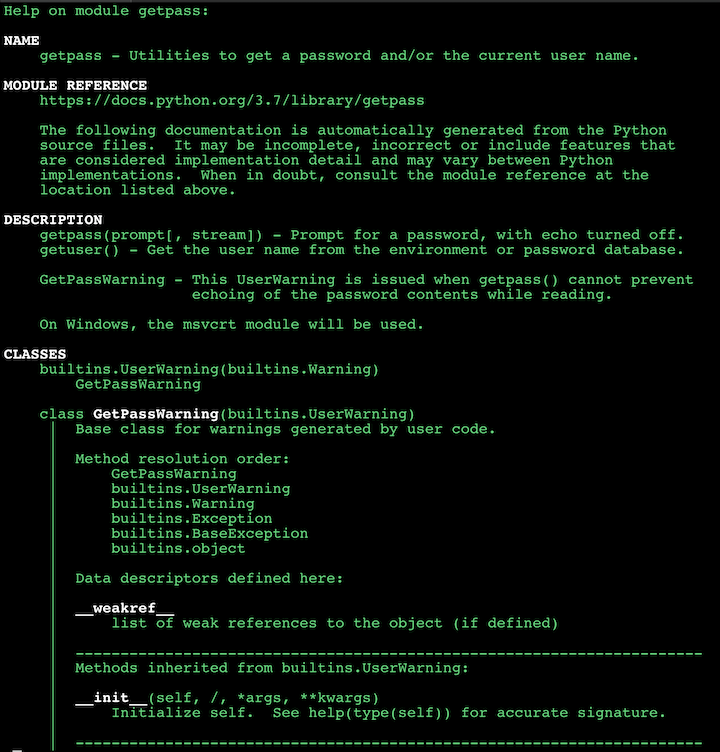

# 10 Python Tips and Tricks For Writing Better Code

## 1.Ternary Conditionals 

### Traditional way

```
# condition = True
condition = False

if condition:
	x = 1
else:
	x =0
	
print(x) 

> 0
```

### Ternary Conditionals

```
new_condition = True
x = 1 if new_condition else 0
print(x)

> 1
```


## 2.Underscore Placeholders => big number easy to read

```
num1 = 10_000_000_000
num2 = 100_000_000

total = num1+ num2
print(total)

> 10100000000
```
### output with commas

```
print(f'{total:,}')
> 10,100,000,000
```


## 3.Content manager

[Context Managers - Efficiently Managing Resources](python_adv17.md)

```
with open('20_sample.txt','r') as f:
	file_contents = f.read()
	
print(file_contents)
> Lorem ipsum dolor sit amet, consectetur adipiscing elit.

words = file_contents.split(' ')
words_count = len(words)
print(words_count)

> 8 
```

## 4. Enumerate

A lot of times when dealing with iterators, we also get a need to keep a count of iterations. Python eases the programmers’ task by providing a built-in function enumerate() for this task.


Enumerate() method adds a counter to an iterable and returns it in a form of enumerate object. This enumerate object can then be used directly in for loops or be converted into a list of tuples using list() method.

```
enumerate(iterable, start=0)

Parameters:
Iterable: any object that supports iteration
Start: the index value from which the counter is 
              to be started, by default it is 0 

```

### Traditional way

```
names = ['odyssey', 'Origin', 'Syndicate','Unit','Rogue','Black Flag']

index = 0

for name in names:
		print(index, name)
		index += 1
		
> 0 odyssey
> 1 Origin
> 2 Syndicate
> 3 Unit
> 4 Rogue
> 5 Black Flag
```

### Enumerate way

```
# for index, name in enumerate(name, start)
for index, name in enumerate(names, start=1):  # start with 1
	print(index, name)

> 1 odyssey
> 2 Origin
> 3 Syndicate
> 4 Unit
> 5 Rogue
> 6 Black Flag
```

## 5.Zip function

The purpose of zip() is to map the similar index of multiple containers so that they can be used just using as single entity.

```
Syntax : 
zip(*iterators)
Parameters : 
Python iterables or containers ( list, string etc )
Return Value : 
Returns a single iterator object, having mapped values from all the
containers.
```

### Traditional way to loop double or treble list

```
names = ['peter', 'clark', 'wade', 'bruce']
heroes = ['spiderman', 'superman', 'deadpool', 'batman']
universes = ['Marvel', 'DC', 'Marvel', 'DC']

for index, name in enumerate(names):
	hero  = heroes[index]
	print(f'{name} is actually {hero}')

> peter is actually spiderman
> clark is actually superman
> wade is actually deadpool
> bruce is actually batman
```

### Zip way

**Two list**

```
for name, hero in zip(names, heroes):
	print(f'{name} is actually {hero}')
> peter is actually spiderman
> clark is actually superman
> wade is actually deadpool
> bruce is actually batman
```

**Three list**

```
for name, hero,universe in zip(names, heroes, universes):
	print(f'{name} is actually {hero} from {universe}')

> peter is actually spiderman from Marvel
> clark is actually superman from DC
> wade is actually deadpool from Marvel
> bruce is actually batman from DC
```

**Output tuple of value**

```
for value in zip(names, heroes, universes):
	print(value)

> ('peter', 'spiderman', 'Marvel')
> ('clark', 'superman', 'DC')
> ('wade', 'deadpool', 'Marvel')
> ('bruce', 'batman', 'DC')
```

## 6.Unpacking tuple

### Normal life

```
items = (1,2)
print(items)

> (1, 2)
```

```
a,b = (1,2)
print(a)
print(b)

> 1
> 2
```

### only output `a` without any error or warning use `_` ti replace `b`

```
a,_ = (1,2)
print(a)

> 1
```

### assign list to one variable in a tuple

```
a,b,*c = (1,2,3,4,5)
print(a)
print(b)
print(c)

> 1
> 2
> [3, 4, 5]
```

```
a,b,*c, d = (1,2,3,4,5,6,7)
print(a)
print(b)
print(c)
print(d)

> 1
> 2
> [3, 4, 5, 6]
> 7
```

### output part of tuple after assignment

```
a,b,*_ = (1,2,3,4,5)
print(a)
print(b)

> 1
> 2
```

## 7.setattr()/getattr()

```
class Person():
	pass

person = Person()

first_key = 'first'
first_val = 'Jacob'

setattr(person, first_key, first_val)
first = getattr(person, first_key)
print(first)

> Jacob
```

```
person_info = {'first':'Jacob', 'last':'Moon'}
for key,value in person_info.items():
	setattr(person, key, value)

for key in person_info.keys():
	print(getattr(person, key))

> Jacob
> Moon
```

## 8.GetPass get input password safely

getpass() and getuser() in Python (Password without echo)

getpass() prompts the user for a password without echoing. The getpass module provides a secure way to handle the password prompts where programs interact with the users via the terminal.

```
from getpass import getpass

username  = input('Username: ')
password = getpass('Password: ')

print('Logging In...')
```


## 9 `python3 -m` in terminal

```
python3 -m 39Bettercode
# without .py at the end of file
```

**`-m` running a module**

python -m lets you run modules as scripts. If your module is just one .py file it'll be executed (which usually means code under `if __name__ == '__main__'`). If your module is a directory, Python will look for `__main__.py` (next to `__init__.py`) and will run it.


## 10. get help of python modules

### Get whole help

```
$ python3
Python 3.7.2 (default, Feb 12 2019, 08:15:36)
[Clang 10.0.0 (clang-1000.11.45.5)] on darwin
Type "help", "copyright", "credits" or "license" for more information.
>>> import getpass
>>> help(getpass)
```


### Only get functions of one moudle

```
>>> from datetime import datetime
>>> dir(datetime

['__add__', '__class__', '__delattr__', '__dir__', '__doc__', '__eq__', '__format__', '__ge__', '__getattribute__', 
'__gt__', '__hash__', '__init__', '__init_subclass__', '__le__', '__lt__', '__ne__', '__new__', '__radd__', '__reduce__',
'__reduce_ex__', '__repr__', '__rsub__', '__setattr__', '__sizeof__', '__str__', '__sub__', '__subclasshook__', 'astimezone',
'combine', 'ctime', 'date', 'day', 'dst', 'fold', 'fromisoformat', 'fromordinal', 'fromtimestamp', 'hour', 'isocalendar', 
'isoformat', 'isoweekday', 'max', 'microsecond', 'min', 'minute', 'month', 'now', 'replace', 'resolution', 'second', 'strftime',
'strptime', 'time', 'timestamp', 'timetuple', 'timetz', 'today', 'toordinal', 'tzinfo', 'tzname', 'utcfromtimestamp', 'utcnow', 
'utcoffset', 'utctimetuple', 'weekday', 'year']
```