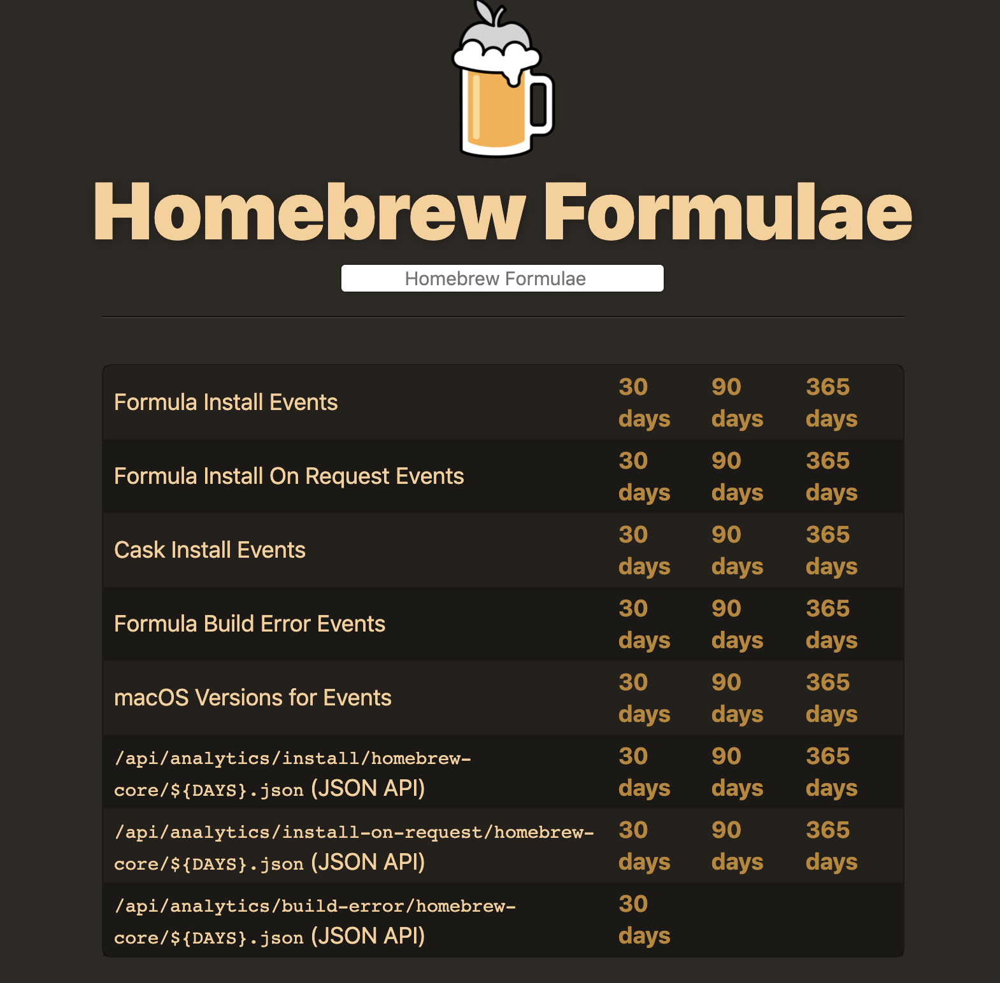

# How to Write Python Scripts to Analyze JSON APIs and Sort Results

In this Python Programming Tutorial, we will be learning how to grab data from a JSON API, parse out the information we want, and then sort the data using a custom key. 

The API we will be using is a JSON API for **Homebrew Packages** and we will be sorting the packages by their popularity.

We cover a lot of topics in this tutorial. We will be using the **Requests Library**, **converting to/from JSON**, **reading and writing to files**,**writing our own sorting function**, and more. Let's get started...

* **Homebrew Packages** - [https://formulae.brew.sh/formula/](https://formulae.brew.sh/formula/)
* **Homebrew Analytics** - [https://formulae.brew.sh/analytics/](https://formulae.brew.sh/analytics/)
* **Json Api for package**: [https://formulae.brew.sh/api/formula.json](https://formulae.brew.sh/api/formula.json)



## Print one package info by JSON APIs

### Get package info of 1st package to string

* **json.dump** writes to a file or file-like object, 
* whereas **json.dumps** returns a string


```
import json
import requests

r = requests.get('https://formulae.brew.sh/api/formula.json')
packages_json = r.json()

package_name = packages_json[0]['name']
package_desc = packages_json[0]['desc']

# https://formulae.brew.sh/api/formula/a2ps.json
package_url = f'https://formulae.brew.sh/api/formula/{package_name}.json'

r = requests.get(package_url)
package_json = r.json()

# json to string
package_str = json.dumps(package_json, indent=2)
print(package_str)
```

```
{
  "name": "a2ps",
  "full_name": "a2ps",
  "oldname": null,
  "aliases": [],
  "versioned_formulae": [],
  "desc": "Any-to-PostScript filter",
  "homepage": "https://www.gnu.org/software/a2ps/",
  "versions": {
    "stable": "4.14",
    "devel": null,
    "head": null,
    "bottle": true
  },
  "revision": 0,
  "version_scheme": 0,
  "bottle": {
    "stable": {
      "rebuild": 3,
      "cellar": "/usr/local/Cellar",
      "prefix": "/usr/local",
      "root_url": "https://homebrew.bintray.com/bottles",
      "files": {
        "mojave": {
          "url": "https://homebrew.bintray.com/bottles/a2ps-4.14.mojave.bottle.3.tar.gz",
          "sha256": "b3d7d7bd0bfcada7fc2bc2340ab67362e5087e53b4d611d84aafedf713bde6c3"
        },
        .....
  "analytics": {
    "install": {
      "30d": {
        "a2ps": 79
      },
      "90d": {
        "a2ps": 287
      },
      "365d": {
        "a2ps": 1358
      }
    },
    "install_on_request": {
      "30d": {
        "a2ps": 79
      },
      "90d": {
        "a2ps": 287
      },
      "365d": {
        "a2ps": 1356
      }
    },
    "build_error": {
      "30d": {
        "a2ps": 0
      }
    }
  }
}
```

### Get analytic package info of 1st package

```
import json
import requests

r = requests.get('https://formulae.brew.sh/api/formula.json')
packages_json = r.json()

package_name = packages_json[0]['name']
package_desc = packages_json[0]['desc']

# https://formulae.brew.sh/api/formula/a2ps.json
package_url = f'https://formulae.brew.sh/api/formula/{package_name}.json'

r = requests.get(package_url)
package_json = r.json()

# json to string
package_str = json.dumps(package_json, indent=2)
# print(package_str)

installs_30 = package_json['analytics']['install_on_request']['30d'][package_name]
installs_90 = package_json['analytics']['install_on_request']['90d'][package_name]
installs_365 = package_json['analytics']['install_on_request']['365d'][package_name]

print(package_name, package_desc, installs_30, installs_90, installs_365)
```

```
a2ps Any-to-PostScript filter 79 287 1356
```

## Get all packages info and converting to/from JSON

* **Get all packages info**
* **Get all execution time: `t2-t1`**
* **Dump all json info to file**
* **Every step inside loop `sleep response time`, `r.elapsed.total_seconds()`**

```
import json
import requests
import time

r = requests.get('https://formulae.brew.sh/api/formula.json')
packages_json = r.json()

results = []

t1 = time.perf_counter()

for package in packages_json:

	try:
		package_name = package['name']
		package_desc = package['desc']
		package_url = f'https://formulae.brew.sh/api/formula/{package_name}.json'

		r = requests.get(package_url)
		package_json = r.json()
		installs_30 = package_json['analytics']['install_on_request']['30d'][package_name]
		installs_90 = package_json['analytics']['install_on_request']['90d'][package_name]
		installs_365 = package_json['analytics']['install_on_request']['365d'][package_name]

		data = {
			'name': package_name,
			'desc': package_desc,
			'analytics': {
				'30d': installs_30,
				'90d': installs_90,
				'365d': installs_365
			}
		}

		results.append(data)

		time.sleep(r.elapsed.total_seconds())
		# https://docs.python.org/2.7/library/datetime.html#datetime.timedelta.total_seconds
		print(f'Got {package_name} in {r.elapsed.total_seconds()} seconds')	
	except:
		pass

t2 = time.perf_counter()
print(f'Finished in {t2-t1} seconds')

with open('40package_info.json', 'w') as f:
	json.dump(results, f, indent=2)
```

### Output

```
Got a2ps in 0.223287 seconds
Got a52dec in 0.221144 seconds
Got aacgain in 0.218812 seconds
...
Got zyre in 0.441347 seconds
Got zzuf in 0.43636 seconds
Got zzz in 0.447153 seconds
Finished in 4625.614548173 seconds
```

**40package_info.json**

```
[
  {
    "name": "a2ps",
    "desc": "Any-to-PostScript filter",
    "analytics": {
      "30d": 79,
      "90d": 287,
      "365d": 1356
    }
  },
  {
    "name": "a52dec",
    "desc": "Library for decoding ATSC A/52 streams (AKA 'AC-3')",
    "analytics": {
      "30d": 27,
      "90d": 95,
      "365d": 279
    }
  },
 ...
```

## writing our own sorting function and sort result

**`popular.py`**

### load json data and write sort function

```
import json

def install_sort(package):               # Refer to how to write sort function
	return package['analytics']['30d']
	return package['analytics']['365d']

with open('40package_info.json', 'r') as f:
	data = json.load(f)
```

[How to write sort function](https://github.com/Chao-Xi/JacobTechBlog/blob/master/Python/python_adv5.md#self-def-sort-function-and-self-def-sortkey)


### Sort all by 30d download

```
...
data.sort(key=install_sort, reverse=True)
data_str = json.dumps(data, indent=2)
print(data_str)
```

#### output

```
[
  {
    "name": "node",
    "desc": "Platform built on V8 to build network applications",
    "analytics": {
      "30d": 280275,
      "90d": 815543,
      "365d": 2941082
    }
  },
  {
    "name": "python",
    "desc": "Interpreted, interactive, object-oriented programming language",
    "analytics": {
      "30d": 276480,
      "90d": 754248,
      "365d": 2358512
    }
  },
...
```

### Sort video related package in description by 30d download 

```
...

data = [item for item in data if 'video' in item['desc']]

data.sort(key=install_sort, reverse=True)

data_str = json.dump(data, indent=2)

print(data_str)
```

#### output

```
[
  {
    "name": "ffmpeg",
    "desc": "Play, record, convert, and stream audio and video",
    "analytics": {
      "30d": 75879,
      "90d": 220496,
      "365d": 585958
    }
  },
  {
    "name": "youtube-dl",
    "desc": "Download YouTube videos from the command-line",
    "analytics": {
      "30d": 50696,
      "90d": 184922,
      "365d": 678831
    }
  },
 ...
```


### Sort all by 30d download and only output 5 items

```
... 
data.sort(key=install_sort, reverse=True)

data_str = json.dumps(data[:5], indent=2)

print(data_str)
```

#### output

```
[
  {
    "name": "node",
    "desc": "Platform built on V8 to build network applications",
    "analytics": {
      "30d": 280275,
      "90d": 815543,
      "365d": 2941082
    }
  },
  {
    "name": "python",
    "desc": "Interpreted, interactive, object-oriented programming language",
    "analytics": {
      "30d": 276480,
      "90d": 754248,
      "365d": 2358512
    }
  },
  {
    "name": "wget",
    "desc": "Internet file retriever",
    "analytics": {
      "30d": 162343,
      "90d": 409757,
      "365d": 1322617
    }
  },
  {
    "name": "yarn",
    "desc": "JavaScript package manager",
    "analytics": {
      "30d": 125383,
      "90d": 338859,
      "365d": 1167710
    }
  },
  {
    "name": "openssl",
    "desc": "SSL/TLS cryptography library",
    "analytics": {
      "30d": 121580,
      "90d": 227221,
      "365d": 888176
    }
  }
]
```

