# Jupyter Notebook Tutorial: Introduction, Setup, and Walkthrough

Jupyter Notebooks have become very popular in the last few years, and for good reason. They allow you to create and share documents that contain live code, equations, visualizations and markdown text. This can all be run from directly in the browser. It is an essential tool to learn if you are getting started in Data Science, but will also have tons of benefits outside of that field. 

## Setup

`https://jupyter.org/install`

### Installing Jupyter with pip

```
$ pip3 -V
pip 19.0.2 from /usr/local/lib/python3.7/site-packages/pip (python 3.7)

$ python3 -m pip install jupyter

$ jupyter notebook
[I 11:41:39.228 NotebookApp] Writing notebook server cookie secret to /Users/jxi/Library/Jupyter/runtime/notebook_cookie_secret
[I 11:41:41.579 NotebookApp] Serving notebooks from local directory: /Users/jxi/python/jupyter
[I 11:41:41.579 NotebookApp] The Jupyter Notebook is running at:
[I 11:41:41.579 NotebookApp] http://localhost:8888/?token=3a5f7816e1ea4d55106dc9cecc360288afdd71a24b840455
[I 11:41:41.579 NotebookApp] Use Control-C to stop this server and shut down all kernels (twice to skip confirmation).
[C 11:41:41.588 NotebookApp]

    To access the notebook, open this file in a browser:
        file:///Users/jxi/Library/Jupyter/runtime/nbserver-29291-open.html
    Or copy and paste one of these URLs:
        http://localhost:8888/?token=3a5f7816e1ea4d55106dc9cecc360288afdd71a24b840455
```
`http://localhost:8888/?token=3a5f7816e1ea4d55106dc9cecc360288afdd71a24b840455`

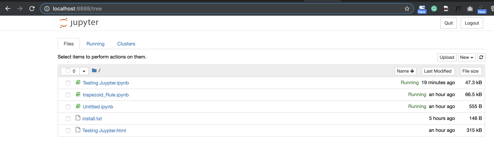


#### `edit mode` => `with pencil`


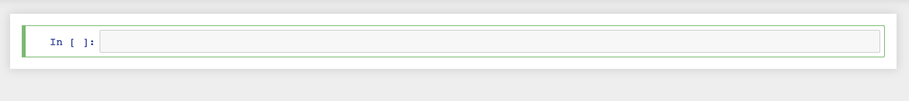

#### `command mode`


## Walkthrough with python3 kernel 

### 1. Run Cell with 3 ways

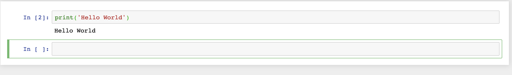

```
print('Hello World')
```

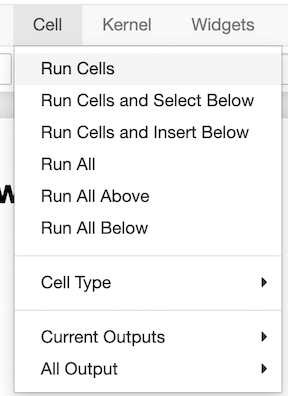

* **Run cells  `Ctrl+Enter`**
* **Run cells and select below `Shift+Enter`**
* **Run cells and insert below `option+Enter`**

### 2. variable

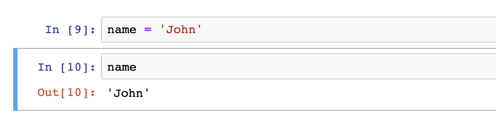

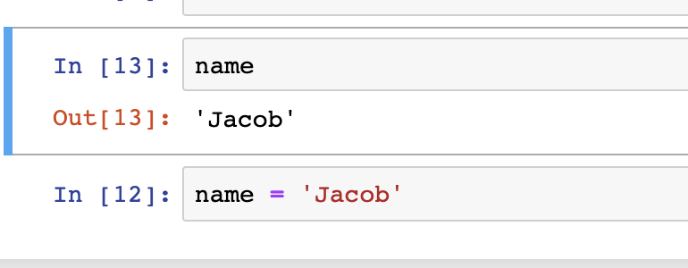

### 3. markdown

**markdown is text that gets translated to HTML**

**Insert cell above => cell type => Markdown**

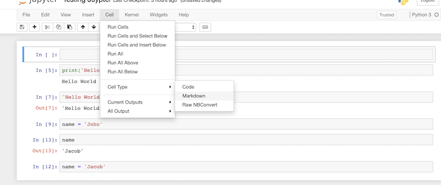

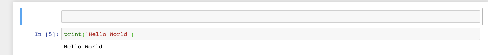

**Add some basic markdown text**

```
# MacDown


Hello there! I’m **MacDown**, the open source Markdown editor for OS X.

Let me introduce myself.
```

**run cell**


### 4.pip list

```
!pip3 list
```
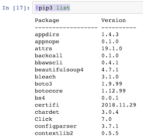

### 5.jupyter magic function

```
%lsmagic

Available line magics:
%alias  %alias_magic  %autoawait  %autocall  %automagic  %autosave  %bookmark  %cat  %cd  %clear  %colors  %conda  %config  %connect_info  %cp  %debug  %dhist  %dirs  %doctest_mode  %ed  %edit  %env  %gui  %hist  %history  %killbgscripts  %ldir  %less  %lf  %lk  %ll  %load  %load_ext  %loadpy  %logoff  %logon  %logstart  %logstate  %logstop  %ls  %lsmagic  %lx  %macro  %magic  %man  %matplotlib  %mkdir  %more  %mv  %notebook  %page  %pastebin  %pdb  %pdef  %pdoc  %pfile  %pinfo  %pinfo2  %pip  %popd  %pprint  %precision  %prun  %psearch  %psource  %pushd  %pwd  %pycat  %pylab  %qtconsole  %quickref  %recall  %rehashx  %reload_ext  %rep  %rerun  %reset  %reset_selective  %rm  %rmdir  %run  %save  %sc  %set_env  %store  %sx  %system  %tb  %time  %timeit  %unalias  %unload_ext  %who  %who_ls  %whos  %xdel  %xmode

Available cell magics:
%%!  %%HTML  %%SVG  %%bash  %%capture  %%debug  %%file  %%html  %%javascript  %%js  %%latex  %%markdown  %%perl  %%prun  %%pypy  %%python  %%python2  %%python3  %%ruby  %%script  %%sh  %%svg  %%sx  %%system  %%time  %%timeit  %%writefile

Automagic is ON, % prefix IS NOT needed for line magics.
```

* line magic will apply one line
* cell magic will apply whole cell

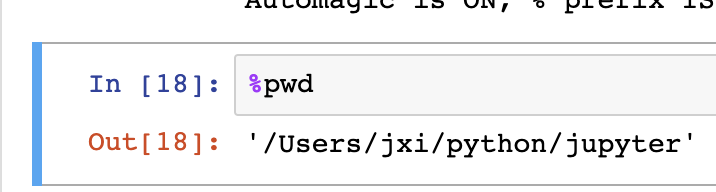

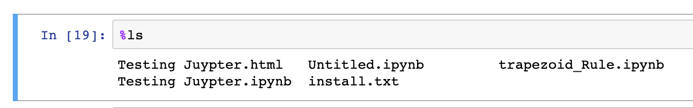

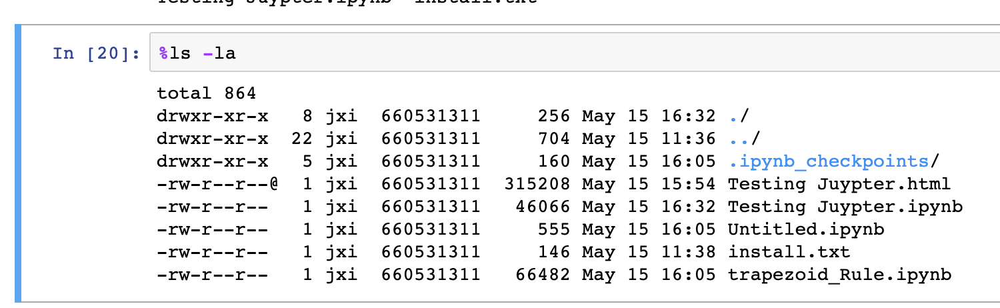

#### `%%HTML`

```
%%HTML
<iframe src="https://www.youtube.com/embed/HW29067qVWk" witdh="100 0" height="315" frameborder="0" allowfullscreen></iframe>
```


#### `%%timeit`

```
%%timeit
square_events = [n*n for n in range(1000)]
```
```
69.5 µs ± 1.22 µs per loop (mean ± std. dev. of 7 runs, 10000 loops each)
```

### package application

#### matplotlib

```
pip3 install matplotlib
```

```
%matplotlib inline
```
```
"""
Simple demo of a scatter plot.
"""
import numpy as np
import matplotlib.pyplot as plt


N = 50
x = np.random.rand(N)
y = np.random.rand(N)
colors = np.random.rand(N)
area = np.pi * (15 * np.random.rand(N))**2  # 0 to 15 point radii

plt.scatter(x, y, s=area, c=colors, alpha=0.5)
plt.show()
```

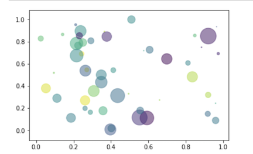


#### pandas

```
import pandas as pd
import numpy as np

df = pd.DataFrame(np.random.randn(10,5))
df
```
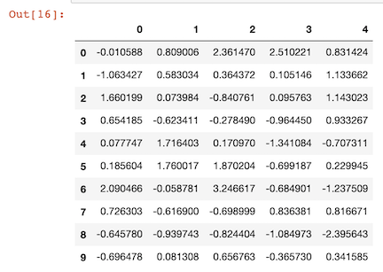


### file management

1. **You can save it as html file and easy to transfer**

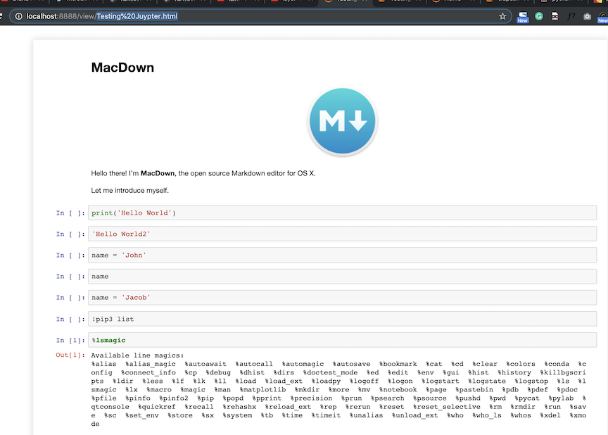


2. You can also download exist `ipynb` file 

[https://raw.githubusercontent.com/ipython/ipython/6.x/examples/IPython%20Kernel/Trapezoid%20Rule.ipynb](https://raw.githubusercontent.com/ipython/ipython/6.x/examples/IPython%20Kernel/Trapezoid%20Rule.ipynb)

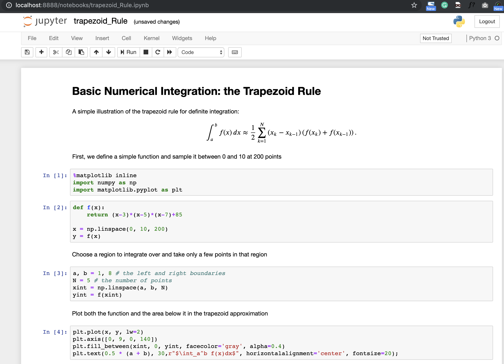