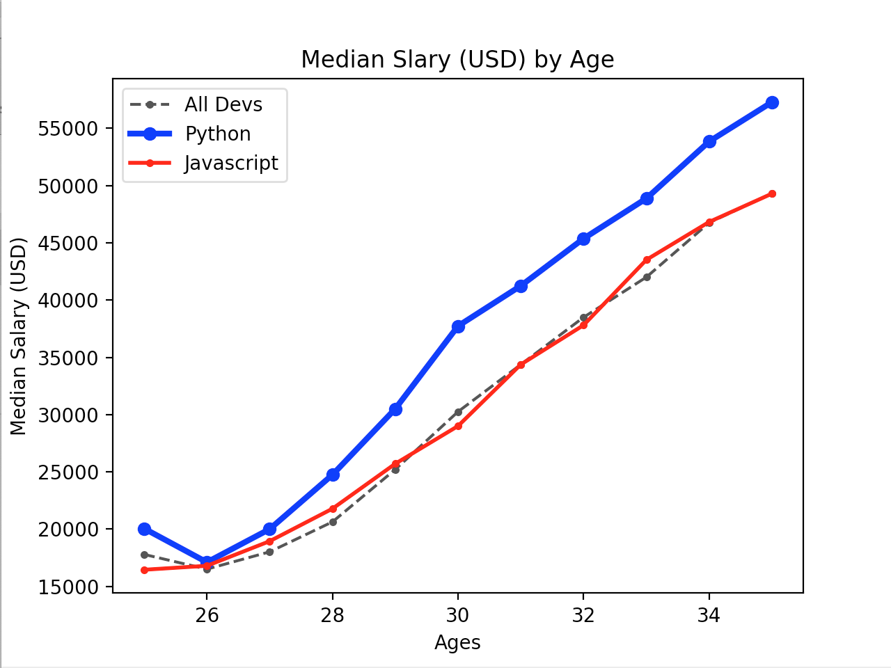
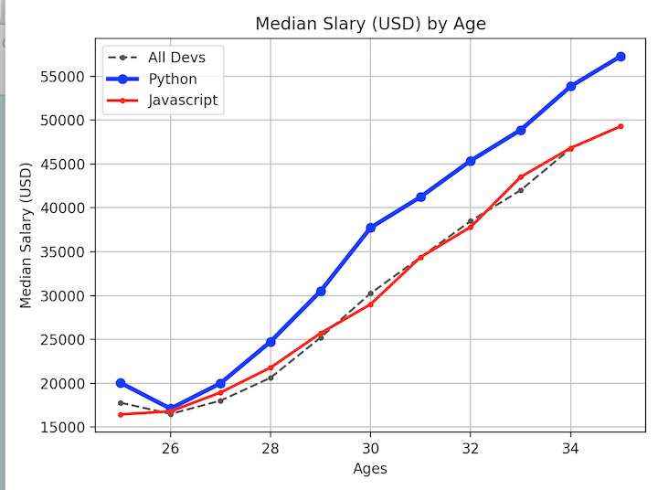
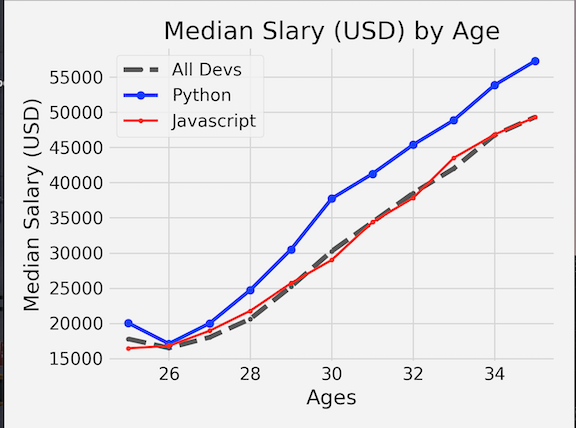
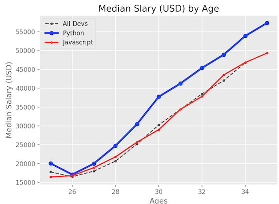
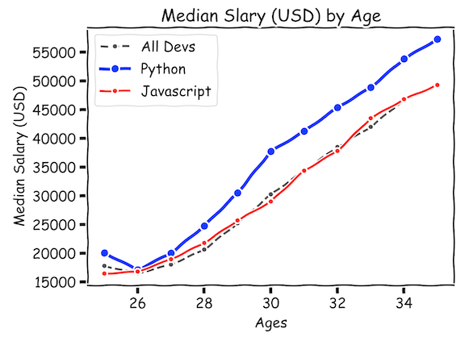
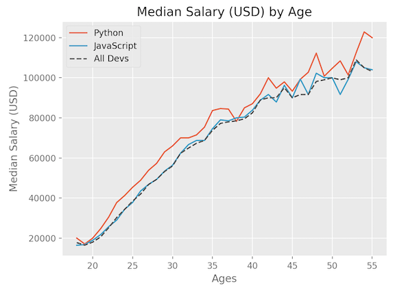

# Matplotlib Tutorial: Creating and Customizing Our First Plots

#### `matplotlib.pyplot.plot`

`https://matplotlib.org/api/_as_gen/matplotlib.pyplot.plot.html`


### Start the Matplotlib

```
from matplotlib import pyplot as plt
ages_x = [25, 26, 27, 28, 29, 30, 31, 32, 33, 34, 35]
dev_y = [17784, 16500, 18012, 20628, 25206, 30252, 34368, 38496, 42000, 46752, 49320]

# plt.plot(ages_x, dev_y, 'k--', label='All Devs')
plt.plot(ages_x, dev_y, color='#444444', linestyle='--', marker='.', label='All Devs')

py_dev_y = [20046, 17100, 20000, 24744, 30500, 37732, 41247, 45372, 48876, 53850, 57287]

plt.plot(ages_x, py_dev_y, color='b', marker='o', linewidth=3, label='Python')

js_dev_y = [16446, 16791, 18942, 21780, 25704, 29000, 34372, 37810, 43515, 46823, 49293]

plt.plot(ages_x, js_dev_y, color='red', marker='.', linewidth=2, label='Javascript')

plt.xlabel('Ages')
plt.ylabel('Median Salary (USD)')
plt.title('Median Slary (USD) by Age')

plt.legend()
# plt.legend(['All Devs','python'])

plt.show()
```



1. **Draw the plot** `plt.plot(ages_x, dev_y)`
2. **line style**: `'k--'`
3. **marker style**: `marker='.'`, `marker='o'`
4. **Add label to one plot**: `label='All Devs'` 
5. **linewidth**: `linewidth=3`
6. **Add xlabel and ylabel**: `plt.xlabel('Ages')` and  `plt.ylabel('Median Salary (USD)')`
7. **Add tilte for plot**: `plt.title('Median Slary (USD) by Age')`
8. **Show plot label aside**: `plt.legend()` or `plt.legend(['All Devs','python'])`
9. **Show final image**: `plt.show()`

### Other options

#### 1. `tight_layout`

`tight_layout` automatically adjusts subplot params so that the subplot(s) fits in to the figure area

```
plt.tight_layout()
plt.show()
```
#### 2. add grid `grid`

```
plt.grid(True)
```



#### 2. Save plot

```
plt.savefig('./plot.png')
```

### Different Styles

#### 1.show available styles

```
from matplotlib import pyplot as plt
print(plt.style.available)
```

```
['seaborn-dark', 'seaborn-darkgrid', 'seaborn-ticks', 'fivethirtyeight', 'seaborn-whitegrid', 'classic', '_classic_test', 'fast', 'seaborn-talk', 'seaborn-dark-palette', 'seaborn-bright', 'seaborn-pastel', 'grayscale', 'Solarize_Light2', 'seaborn-notebook', 'ggplot', 'seaborn-colorblind', 'seaborn-muted', 'seaborn', 'seaborn-paper', 'bmh', 'tableau-colorblind10', 'seaborn-white', 'dark_background', 'seaborn-poster', 'seaborn-deep']
```

#### exp: `fivethirtyeight`

```
from matplotlib import pyplot as plt
# print(plt.style.available)
plt.style.use('fivethirtyeight')
```



#### exp: `ggplot`

```
from matplotlib import pyplot as plt
# print(plt.style.available)
plt.style.use('ggplot')
```


#### exp: `xkcd()`

```
from matplotlib import pyplot as plt
# print(plt.style.available)
plt.xkcd()
```


## Final code

```

from matplotlib import pyplot as plt

plt.style.use('ggplot')

ages_x = [18, 19, 20, 21, 22, 23, 24, 25, 26, 27, 28, 29, 30, 31, 32, 33, 34, 35,
          36, 37, 38, 39, 40, 41, 42, 43, 44, 45, 46, 47, 48, 49, 50, 51, 52, 53, 54, 55]

py_dev_y = [20046, 17100, 20000, 24744, 30500, 37732, 41247, 45372, 48876, 53850, 57287, 63016, 65998, 70003, 70000, 71496, 75370, 83640, 84666,
            84392, 78254, 85000, 87038, 91991, 100000, 94796, 97962, 93302, 99240, 102736, 112285, 100771, 104708, 108423, 101407, 112542, 122870, 120000]
plt.plot(ages_x, py_dev_y, label='Python')

js_dev_y = [16446, 16791, 18942, 21780, 25704, 29000, 34372, 37810, 43515, 46823, 49293, 53437, 56373, 62375, 66674, 68745, 68746, 74583, 79000,
            78508, 79996, 80403, 83820, 88833, 91660, 87892, 96243, 90000, 99313, 91660, 102264, 100000, 100000, 91660, 99240, 108000, 105000, 104000]
plt.plot(ages_x, js_dev_y, label='JavaScript')

dev_y = [17784, 16500, 18012, 20628, 25206, 30252, 34368, 38496, 42000, 46752, 49320, 53200, 56000, 62316, 64928, 67317, 68748, 73752, 77232,
         78000, 78508, 79536, 82488, 88935, 90000, 90056, 95000, 90000, 91633, 91660, 98150, 98964, 100000, 98988, 100000, 108923, 105000, 103117]
plt.plot(ages_x, dev_y, color='#444444', linestyle='--', label='All Devs')

plt.xlabel('Ages')
plt.ylabel('Median Salary (USD)')
plt.title('Median Salary (USD) by Age')

plt.legend()

plt.tight_layout()

plt.show()
```




