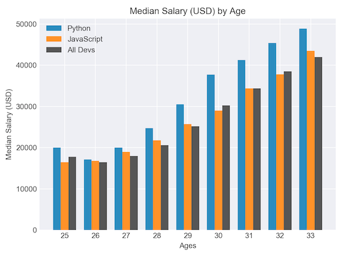
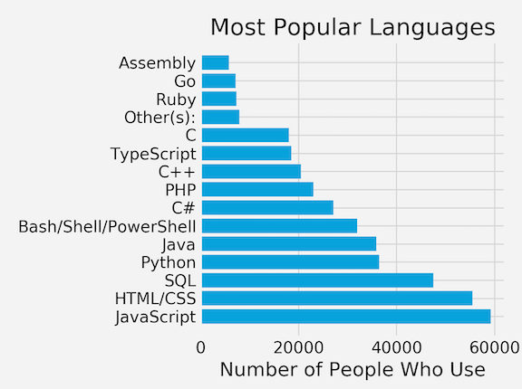
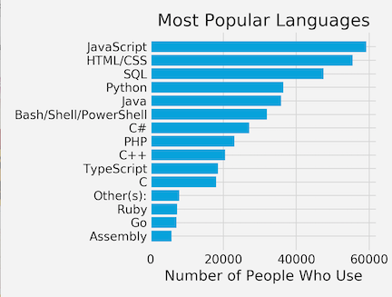

# Matplotlib Tutorial: Bar Charts and Analyzing Data from CSVs

## Staring a qucik Bar Charts

```
import numpy as np
from matplotlib import pyplot as plt
plt.style.use('seaborn-darkgrid')

ages_x = [25, 26, 27, 28, 29, 30, 31, 32, 33]

x_indexes = np.arange(len(ages_x))
width = 0.25

py_dev_y = [20046, 17100, 20000, 24744, 30500, 37732, 41247, 45372, 48876]
plt.bar(x_indexes - width, py_dev_y, width = width, label='Python')

js_dev_y = [16446, 16791, 18942, 21780, 25704, 29000, 34372, 37810, 43515]
plt.bar(x_indexes, js_dev_y, width = width, label='JavaScript')

dev_y = [17784, 16500, 18012, 20628, 25206, 30252, 34368, 38496, 42000]
plt.bar(x_indexes + width, dev_y, color='#444444', linestyle='--', width = width, label='All Devs')

plt.xlabel('Ages')
plt.ylabel('Median Salary (USD)')
plt.title('Median Salary (USD) by Age')

plt.legend()
plt.xticks(ticks=x_indexes, labels=ages_x) 

plt.tight_layout()

plt.show()
```

* **Need count the numbers for indexs** `x_indexes = np.arange(len(ages_x))`
* **Draw the bar charts** `plt.bar()`
* **Need give the width for bar charts** `x_indexes - width`, `width = width,`
* **Special the name for index in bar charts** `plt.xticks(ticks=x_indexes, labels=ages_x)`




## Read CSV and draw bar chart

```
import csv
import numpy as np
# import pandas as pd
from collections import Counter
from matplotlib import pyplot as plt

plt.style.use("fivethirtyeight")

# data = pd.read_csv('data.csv')

with open('Code_in_SAP/data.csv') as csv_file:
    csv_reader = csv.DictReader(csv_file)

    language_counter = Counter() # from collections

    for row in csv_reader:
        language_counter.update(row['LanguagesWorkedWith'].split(';'))

# update the number in by counter function

# print(language_counter.most_common(15))

languages = []
popularity = []

for item in language_counter.most_common(15):
    languages.append(item[0])
    popularity.append(item[1])

# Reverse the list 
# languages.reverse()
# popularity.reverse()

plt.barh(languages, popularity)
# barh => horizontal bar

plt.title("Most Popular Languages")
# plt.ylabel("Programming Languages")
plt.xlabel("Number of People Who Use")

plt.tight_layout()

plt.show()
```

* `plt.barh()` draws the horizontal bar chart

 


## Pandas read CSV and draw bar chart

```
import csv
import numpy as np
import pandas as pd
from collections import Counter
from matplotlib import pyplot as plt

plt.style.use("fivethirtyeight")

data = pd.read_csv('Code_in_SAP/data.csv')
ids = data['Responder_id']
lang_responses = data['LanguagesWorkedWith']

language_counter = Counter()

for response in lang_responses:
    language_counter.update(response.split(';'))

languages = []
popularity = []

for item in language_counter.most_common(15):
    languages.append(item[0])
    popularity.append(item[1])

languages.reverse()
popularity.reverse()

plt.barh(languages, popularity)

plt.title("Most Popular Languages")
# plt.ylabel("Programming Languages")
plt.xlabel("Number of People Who Use")

plt.tight_layout()

plt.show()
```

 


