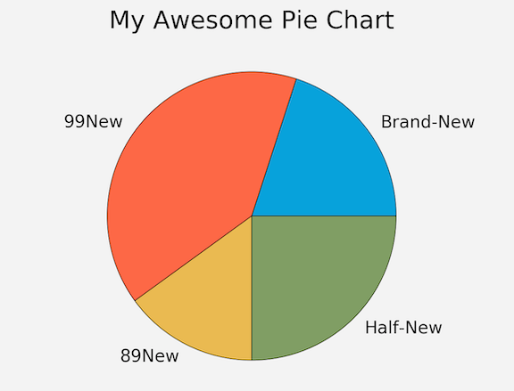
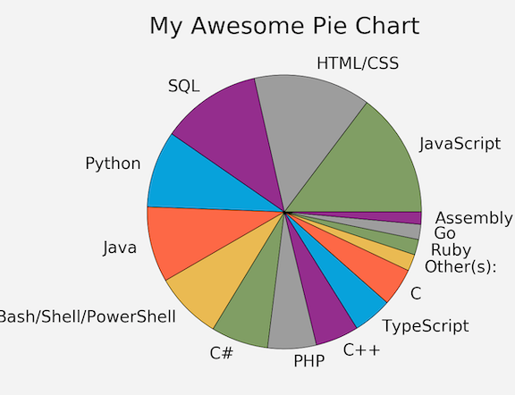
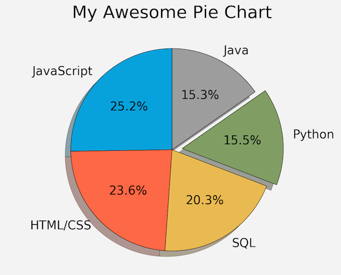

# Matplotlib Tutorial: Pie Charts

## Quick start pie chart

```
from matplotlib import pyplot as plt

plt.style.use("fivethirtyeight")

slices = [20,40,15,25]
labels = ['Brand-New','99New','89New','Half-New']
colors = ['#008fd5', '#fc4f30', '#e5ae37', '#6d904f']

# plt.pie(slices)
plt.pie(slices, labels=labels, colors=colors, wedgeprops={'edgecolor':'black'})

plt.title("My Awesome Pie Chart")
plt.tight_layout()
plt.show()

# Colors:
# Blue = #008fd5
# Red = #fc4f30
# Yellow = #e5ae37
# Green = #6d904f
```

* **Draw the pie chart**: `plt.pie()`
* **Add colors as arguments for different part**: `colors=colors` 
* **Add edge color for pie chart** `wedgeprops={'edgecolor':'black'}`



## Use pie chart to show language popularity

```
from matplotlib import pyplot as plt

plt.style.use("fivethirtyeight")

slices = [59219, 55466, 47544, 36443, 35917, 31991, 27097, 23030, 20524, 18523, 18017, 7920, 7331, 7201, 5833]
labels = ['JavaScript', 'HTML/CSS', 'SQL', 'Python', 'Java', 'Bash/Shell/PowerShell', 'C#', 'PHP', 'C++', 'TypeScript', 'C', 'Other(s):', 'Ruby', 'Go', 'Assembly']
# Language Popularity

plt.pie(slices)
plt.pie(slices, labels=labels, wedgeprops={'edgecolor':'black'})

plt.title("My Awesome Pie Chart")
plt.tight_layout()
plt.show()
```


## Different Arguments

```
from matplotlib import pyplot as plt

plt.style.use("fivethirtyeight")

slices = [59219, 55466, 47544, 36443, 35917]
labels = ['JavaScript', 'HTML/CSS', 'SQL', 'Python', 'Java']
explode = [0, 0, 0, 0.1, 0]

plt.pie(slices, labels=labels, explode=explode, shadow=True,
        startangle=90, autopct='%1.1f%%',
        wedgeprops={'edgecolor': 'black'})

plt.title("My Awesome Pie Chart")
plt.tight_layout()
plt.show()

# Arguaments:
# explode python: emphasize python 
# Add shadow for pie chart, popout little bit
# Rotate angle like 90 degree
# Auto percent on pie chart 
```

* `explode=explode`: **emphasize one part and pop it out**
* `shadow`: **add shadow to pie chart**
* `startangle`: **rotate pie chart**
* `autopct='%1.1f%%'`: **Add exact per-cent number on pie chart**




