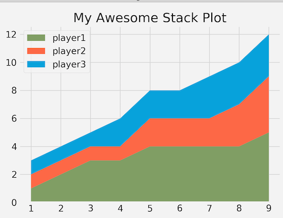
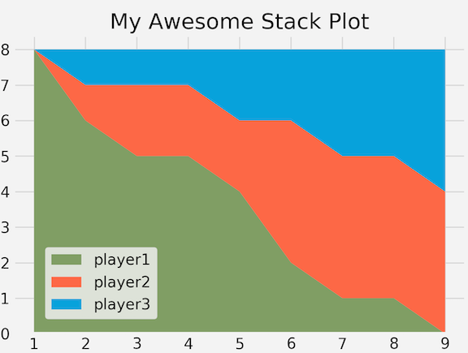

# Matplotlib Tutorial: Stack Plots

## Quick start a Stack Plot

```
from matplotlib import pyplot as plt
plt.style.use("fivethirtyeight")

minutes = [1, 2, 3, 4, 5, 6, 7, 8, 9]

player1 = [1, 2, 3, 3, 4, 4, 4, 4, 5]
player2 = [1, 1, 1, 1, 2, 2, 2, 3, 4]
player3 = [1, 1, 1, 2, 2, 2, 3, 3, 3]

labels = ['player1', 'player2', 'player3']
colors = ['#6d904f', '#fc4f30', '#008fd5']
plt.stackplot(minutes, player1, player2, player3, labels=labels, colors=colors)

plt.legend(loc='upper left')
plt.title("My Awesome Stack Plot")
plt.tight_layout()
plt.show()

# Colors:
# Blue = #008fd5
# Red = #fc4f30
# Yellow = #e5ae37
# Green = #6d904f
```

* **Draw the stackplot**: `plt.stackplot()` 
* **Add labels and colors**: `labels=labels, colors=colors`
* **Change label location** : `plt.legend(loc='upper left')` or `plt.legend(loc='lower left')`



## Upside down Stack Plot

```
from matplotlib import pyplot as plt
plt.style.use("fivethirtyeight")

minutes = [1, 2, 3, 4, 5, 6, 7, 8, 9]


player1 = [8, 6, 5, 5, 4, 2, 1, 1, 0]
player2 = [0, 1, 2, 2, 2, 4, 4, 4, 4]
player3 = [0, 1, 1, 1, 2, 2, 3, 3, 4]

labels = ['player1', 'player2', 'player3']
colors = ['#6d904f', '#fc4f30', '#008fd5']
plt.stackplot(minutes, player1, player2, player3, labels=labels, colors=colors)

plt.legend(loc=(0.07, 0.05))
plt.title("My Awesome Stack Plot")
plt.tight_layout()
plt.show()

# Colors:
# Blue = #008fd5
# Red = #fc4f30
# Yellow = #e5ae37
# Green = #6d904f
```

* **Special label location** : `plt.legend(loc=(0.07, 0.05))`

