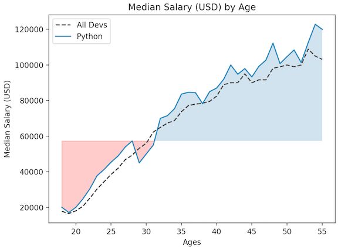
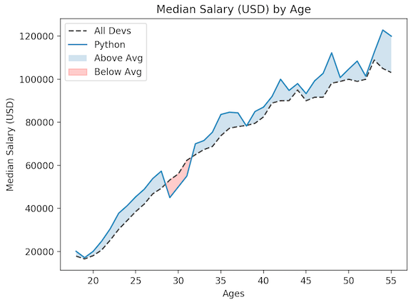

# Matplotlib Tutorial: Filling Area on Line Plots

How to fill between our line plots in Matplotlib. Not only can this make our graphs look more professional, but we can also add useful information by filling areas based on specific thresholds

## Qucik start Fill betweens

```
import pandas as pd
from matplotlib import pyplot as plt

data = pd.read_csv('Code_in_SAP/data2.csv')
ages = data['Age']
dev_salaries = data['All_Devs']
py_salaries = data['Python']
js_salaries = data['JavaScript']

plt.plot(ages, dev_salaries, color='#444444',
         linestyle='--', label='All Devs')

plt.plot(ages, py_salaries, label='Python')


overall_median = 57287

plt.fill_between(ages, py_salaries, overall_median, where=(py_salaries > overall_median),
 interpolate=True, alpha=0.25)

plt.fill_between(ages, py_salaries, overall_median, where=(py_salaries <= overall_median),
 interpolate=True, color='red', alpha=0.25)

plt.legend()

plt.title('Median Salary (USD) by Age')
plt.xlabel('Ages')
plt.ylabel('Median Salary (USD)')

plt.tight_layout()

plt.show()
```

* **Fill beween plot** `plt.fill_between()`
* **Add medium val and conditions arguments** `overall_median, where=(py_salaries <= overall_median),
 interpolate=True,`
* **Add color percent** `alpha=0.25`



## Final version: get cross part

```
import pandas as pd
from matplotlib import pyplot as plt

data = pd.read_csv('Code_in_SAP/data2.csv')
ages = data['Age']
dev_salaries = data['All_Devs']
py_salaries = data['Python']
js_salaries = data['JavaScript']

plt.plot(ages, dev_salaries, color='#444444',
         linestyle='--', label='All Devs')

plt.plot(ages, py_salaries, label='Python')

overall_median = 57287

plt.fill_between(ages, py_salaries, dev_salaries,
                 where=(py_salaries > dev_salaries),
                 interpolate=True, alpha=0.25, label='Above Avg')

plt.fill_between(ages, py_salaries, dev_salaries,
                 where=(py_salaries <= dev_salaries),
                 interpolate=True, color='red', alpha=0.25, label='Below Avg')

plt.legend()

plt.title('Median Salary (USD) by Age')
plt.xlabel('Ages')
plt.ylabel('Median Salary (USD)')

plt.tight_layout()

plt.show()
```

* **We can also add label for `fill_between`**



