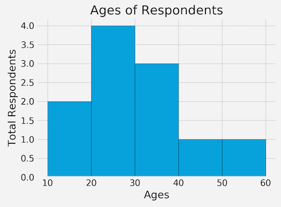
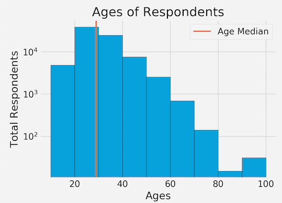

# Matplotlib Tutorial: Histograms


## Quick start a Histograms

```
import pandas as pd
from matplotlib import pyplot as plt

plt.style.use('fivethirtyeight')

ages = [18, 19, 21, 25, 26, 26, 30, 32, 38, 45, 55]
bins = [10,20,30,40,50,60]

plt.hist(ages,bins=bins,edgecolor='black')

plt.title('Ages of Respondents')
plt.xlabel('Ages')
plt.ylabel('Total Respondents')

plt.tight_layout()

plt.show()
```

* `plt.hist()`  **Draw the histogram**
* Arguments `bins=bins` **Set index inside the histogram**
* Add edge color `edgecolor='black'`



## Draw with real data

```
import pandas as pd
from matplotlib import pyplot as plt

plt.style.use('fivethirtyeight')

data = pd.read_csv('Code_in_SAP/data3.csv')
ids = data['Responder_id']
ages = data['Age']

bins = [10, 20, 30, 40, 50, 60, 70, 80, 90, 100]

plt.hist(ages, bins=bins, edgecolor='black', log=True)
# As log style 


median_age = 29
color = '#fc4f30'

plt.axvline(median_age, color=color, label='Age Median', linewidth=2)
# Put an axis-vertical line in our exisiting histogram

plt.legend()

plt.title('Ages of Respondents')
plt.xlabel('Ages')
plt.ylabel('Total Respondents')

plt.tight_layout()

plt.show()

```

* Draw the histogram with `log style`
* **Put an axis-vertical line in our exisiting histogram** 

```
plt.axvline(median_age, color=color, label='Age Median', linewidth=2)
``` 

* `plt.axvline()`



